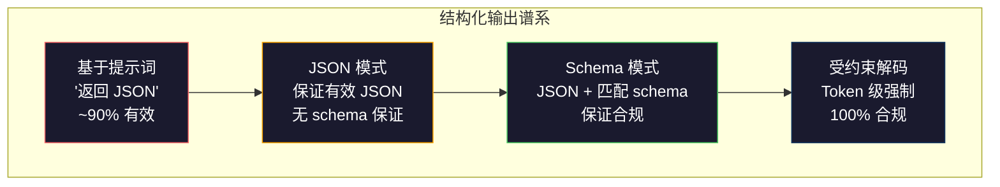
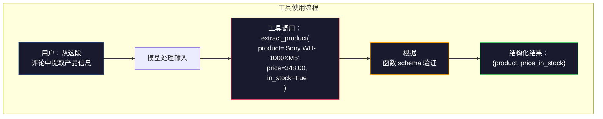

# 结构化输出：JSON、Schema 验证、受约束解码

> 你的 LLM 返回一个字符串。你的应用程序需要 JSON。这个差距比任何模型幻觉导致了更多的生产系统崩溃。结构化输出是自然语言和类型化数据之间的桥梁。做对了，你的 LLM 就变成了一个可靠的 API。做错了，你就在凌晨 3 点用正则表达式解析自由文本。

**类型：** Build
**语言：** Python
**前置要求：** 阶段 10，课程 01-05（LLMs from Scratch）
**预计时间：** ~90 分钟
**关联：** 阶段 5 · 20（结构化输出与受约束解码）涵盖了解码器级别的理论（FSM/CFG logit 处理器、Outlines、XGrammar）。本课程侧重于生产 SDK 层面（OpenAI `response_format`、Anthropic tool use、Instructor）——如果你想了解 API 之下的工作原理，请先阅读阶段 5 · 20。

## 学习目标

- 使用 OpenAI 和 Anthropic API 参数实现 JSON 模式和 schema 约束输出
- 构建一个 Pydantic 验证层，拒绝格式错误的 LLM 输出并使用错误反馈重试
- 解释受约束解码如何在 token 级别强制生成有效 JSON，无需后处理
- 设计稳健的提取提示词，可靠地将非结构化文本转换为类型化数据结构

## 问题

你问一个 LLM："从这段文本中提取产品名称、价格和库存状态。"它回答：

```
产品是 Sony WH-1000XM5 耳机，价格为 348.00 美元，目前有库存。
```

这是一个完全正确的答案。但它对你的应用程序也完全没有用处。你的库存系统需要 `{"product": "Sony WH-1000XM5", "price": 348.00, "in_stock": true}`。你需要一个具有特定键、特定类型和特定值约束的 JSON 对象。你不需要一个句子。

朴素的解决方案：在你的提示词中添加"用 JSON 回复"。这在 90% 的情况下有效。另外 10% 的情况下，模型将 JSON 包裹在 markdown 代码围栏中，或添加诸如"这是 JSON："之类的前言，或产生语法无效的 JSON，因为它提前关闭了一个括号。你的 JSON 解析器崩溃。你的管道中断。你添加 try/except 和重试循环。重试有时会产生不同的数据。现在你除了解析问题之外还面临一致性问题。

这不是一个提示词工程问题。这是一个解码问题。模型从左到右生成 token。在每个位置，它从 100K+ 选项的词汇表中选择最可能的下一个 token。其中大多数选项在任何给定位置都会产生无效的 JSON。如果模型刚刚发出了 `{"price":`，下一个 token 必须是数字、引号（用于字符串）、`null`、`true`、`false` 或负号。其他任何东西都会产生无效的 JSON。没有约束，模型可能会选择一个完全合理的英语单词，但在语法上却是灾难性的错误。

## 概念

### 结构化输出谱系

结构化输出控制有四个级别，每个级别比上一个更可靠。



**基于提示词**（"用有效的 JSON 回复"）：无强制。模型通常遵守但有时不遵守。可靠性：~90%。失败模式：markdown 围栏、前导文本、截断输出、错误结构。

**JSON 模式**：API 保证输出是有效的 JSON。OpenAI 的 `response_format: { type: "json_object" }` 启用此功能。输出可以解析而不会出错。但它可能不符合你期望的 schema——多余的键、错误的类型、缺失的字段。

**Schema 模式**：API 接受一个 JSON Schema 并保证输出与之匹配。到 2026 年，每个主要提供商都原生支持此功能：OpenAI 的 `response_format: { type: "json_schema", json_schema: {...} }`（也可作为 `tool_choice="required"`），Anthropic 的 tool use 与 `input_schema`，以及 Google 的 `response_schema` + `response_mime_type: "application/json"`。输出具有你指定的确切键、类型和约束。

**受约束解码**：在生成过程中的每个 token 位置，解码器屏蔽掉所有会产生无效输出的 token。如果 schema 需要一个数字而模型即将发出一个字母，该 token 的概率被设为零。模型只能产生能通向有效输出的 token。这就是 OpenAI 的结构化输出模式和 Outlines、Guidance 等库在底层实现的方式。

### JSON Schema：契约语言

JSON Schema 是你告诉模型（或验证层）输出必须具有什么形状的方式。每个主要的结构化输出系统都使用它。

```json
{
  "type": "object",
  "properties": {
    "product": { "type": "string" },
    "price": { "type": "number", "minimum": 0 },
    "in_stock": { "type": "boolean" },
    "categories": {
      "type": "array",
      "items": { "type": "string" }
    }
  },
  "required": ["product", "price", "in_stock"]
}
```

这个 schema 说：输出必须是一个包含字符串 `product`、非负数 `price`、布尔值 `in_stock` 和可选的字符串数组 `categories` 的对象。任何不匹配的输出都会被拒绝。

Schema 处理困难的情况：嵌套对象、带类型条目的数组、枚举（将字符串约束到特定值）、模式匹配（字符串上的正则表达式）和组合器（用于多态输出的 oneOf、anyOf、allOf）。

### Pydantic 模式

在 Python 中，你不手动编写 JSON Schema。你定义一个 Pydantic 模型，它会自动为你生成 schema。

```python
from pydantic import BaseModel

class Product(BaseModel):
    product: str
    price: float
    in_stock: bool
    categories: list[str] = []
```

这产生与上面相同的 JSON Schema。Instructor 库（和 OpenAI 的 SDK）直接接受 Pydantic 模型：传入模型类，取回验证过的实例。如果 LLM 输出不匹配，Instructor 会自动重试。

### 函数调用 / 工具使用

同一问题的另一种接口。你不直接要求模型生成 JSON，而是定义带有类型化参数的"工具"（函数）。模型输出一个带有结构化参数的函数调用。OpenAI 称之为"函数调用"。Anthropic 称之为"工具使用"。结果是一样的：结构化数据。



当模型需要选择调用哪个函数而不仅仅是填写参数时，工具使用是首选。如果你有 10 个不同的提取 schema，且模型必须根据输入选择正确的一个，工具使用同时提供了 schema 选择和结构化输出。

### 常见失败模式

即使有 schema 强制，结构化输出也可能以微妙的方式失败。

**幻觉值**：输出匹配 schema 但包含编造的数据。模型在文本显示 348 美元时产生 `{"price": 299.99}`。Schema 验证无法捕捉到这个——类型正确，值错误。

**枚举混淆**：你将字段约束为 `["in_stock", "out_of_stock", "preorder"]`。模型输出 `"available"`——语义上正确，但不在允许集合中。好的受约束解码可以防止这种情况。基于提示词的方法则不能。

**嵌套对象深度**：深度嵌套的 schema（4 层以上）产生更多错误。每一层嵌套都是模型可能失去结构追踪的另一个地方。

**数组长度**：模型可能在数组中产生太多或太少条目。Schema 支持 `minItems` 和 `maxItems`，但并非所有提供商都在解码层面强制执行它们。

**可选字段遗漏**：模型遗漏技术上可选但对你的用例语义重要的字段。即使在 schema 中将它们设为必需，即使数据有时缺失——强制模型显式生成 `null`。

## 构建它

### 步骤 1：JSON Schema 验证器

从头构建一个验证器，检查 Python 对象是否匹配 JSON Schema。这是在输出端运行以验证合规性的工具。

```python
import json

def validate_schema(data, schema):
    errors = []
    _validate(data, schema, "", errors)
    return errors

def _validate(data, schema, path, errors):
    schema_type = schema.get("type")

    if schema_type == "object":
        if not isinstance(data, dict):
            errors.append(f"{path}：期望对象，实际为 {type(data).__name__}")
            return
        for key in schema.get("required", []):
            if key not in data:
                errors.append(f"{path}.{key}：缺少必需字段")
        properties = schema.get("properties", {})
        for key, value in data.items():
            if key in properties:
                _validate(value, properties[key], f"{path}.{key}", errors)

    elif schema_type == "array":
        if not isinstance(data, list):
            errors.append(f"{path}：期望数组，实际为 {type(data).__name__}")
            return
        min_items = schema.get("minItems", 0)
        max_items = schema.get("maxItems", float("inf"))
        if len(data) < min_items:
            errors.append(f"{path}：数组有 {len(data)} 个条目，最小为 {min_items}")
        if len(data) > max_items:
            errors.append(f"{path}：数组有 {len(data)} 个条目，最大为 {max_items}")
        items_schema = schema.get("items", {})
        for i, item in enumerate(data):
            _validate(item, items_schema, f"{path}[{i}]", errors)

    elif schema_type == "string":
        if not isinstance(data, str):
            errors.append(f"{path}：期望字符串，实际为 {type(data).__name__}")
            return
        enum_values = schema.get("enum")
        if enum_values and data not in enum_values:
            errors.append(f"{path}：'{data}' 不在允许值 {enum_values} 中")

    elif schema_type == "number":
        if not isinstance(data, (int, float)):
            errors.append(f"{path}：期望数字，实际为 {type(data).__name__}")
            return
        minimum = schema.get("minimum")
        maximum = schema.get("maximum")
        if minimum is not None and data < minimum:
            errors.append(f"{path}：{data} 小于最小值 {minimum}")
        if maximum is not None and data > maximum:
            errors.append(f"{path}：{data} 大于最大值 {maximum}")

    elif schema_type == "boolean":
        if not isinstance(data, bool):
            errors.append(f"{path}：期望布尔值，实际为 {type(data).__name__}")

    elif schema_type == "integer":
        if not isinstance(data, int) or isinstance(data, bool):
            errors.append(f"{path}：期望整数，实际为 {type(data).__name__}")
```

### 步骤 2：Pydantic 风格的模型到 Schema 转换

构建一个最小化的类到 schema 转换器。定义一个 Python 类并自动生成其 JSON Schema。

```python
class SchemaField:
    def __init__(self, field_type, required=True, default=None, enum=None, minimum=None, maximum=None):
        self.field_type = field_type
        self.required = required
        self.default = default
        self.enum = enum
        self.minimum = minimum
        self.maximum = maximum

def python_type_to_schema(field):
    type_map = {
        str: "string",
        int: "integer",
        float: "number",
        bool: "boolean",
    }

    schema = {}

    if field.field_type in type_map:
        schema["type"] = type_map[field.field_type]
    elif field.field_type == list:
        schema["type"] = "array"
        schema["items"] = {"type": "string"}
    elif isinstance(field.field_type, dict):
        schema = field.field_type

    if field.enum:
        schema["enum"] = field.enum
    if field.minimum is not None:
        schema["minimum"] = field.minimum
    if field.maximum is not None:
        schema["maximum"] = field.maximum

    return schema

def model_to_schema(name, fields):
    properties = {}
    required = []

    for field_name, field in fields.items():
        properties[field_name] = python_type_to_schema(field)
        if field.required:
            required.append(field_name)

    return {
        "type": "object",
        "properties": properties,
        "required": required,
    }
```

### 步骤 3：受约束 Token 过滤器

模拟受约束解码。给定部分 JSON 字符串和 schema，确定当前位置哪些 token 类别是有效的。

```python
def next_valid_tokens(partial_json, schema):
    stripped = partial_json.strip()

    if not stripped:
        return ["{"]

    try:
        json.loads(stripped)
        return ["<EOS>"]
    except json.JSONDecodeError:
        pass

    last_char = stripped[-1] if stripped else ""

    if last_char == "{":
        return ['"', "}"]
    elif last_char == '"':
        if stripped.endswith('":'):
            return ['"', "0-9", "true", "false", "null", "[", "{"]
        return ["a-z", '"']
    elif last_char == ":":
        return [" ", '"', "0-9", "true", "false", "null", "[", "{"]
    elif last_char == ",":
        return [" ", '"', "{", "["]
    elif last_char in "0123456789":
        return ["0-9", ".", ",", "}", "]"]
    elif last_char == "}":
        return [",", "}", "]", "<EOS>"]
    elif last_char == "]":
        return [",", "}", "<EOS>"]
    elif last_char == "[":
        return ['"', "0-9", "true", "false", "null", "{", "[", "]"]
    else:
        return ["any"]

def demonstrate_constrained_decoding():
    partial_states = [
        '',
        '{',
        '{"product"',
        '{"product":',
        '{"product": "Sony"',
        '{"product": "Sony",',
        '{"product": "Sony", "price":',
        '{"product": "Sony", "price": 348',
        '{"product": "Sony", "price": 348}',
    ]

    print(f"{'部分 JSON':<45} {'有效下一个 Token'}")
    print("-" * 80)
    for state in partial_states:
        valid = next_valid_tokens(state, {})
        display = state if state else "(空)"
        print(f"{display:<45} {valid}")
```

### 步骤 4：提取管道

将所有内容组合成一个提取管道：定义 schema、模拟 LLM 产生结构化输出、验证输出并处理重试。

```python
def simulate_llm_extraction(text, schema, attempt=0):
    if "headphones" in text.lower() or "sony" in text.lower():
        if attempt == 0:
            return '{"product": "Sony WH-1000XM5", "price": 348.00, "in_stock": true, "categories": ["audio", "headphones"]}'
        return '{"product": "Sony WH-1000XM5", "price": 348.00, "in_stock": true}'

    if "laptop" in text.lower():
        return '{"product": "MacBook Pro 16", "price": 2499.00, "in_stock": false, "categories": ["computers"]}'

    return '{"product": "Unknown", "price": 0, "in_stock": false}'

def extract_with_retry(text, schema, max_retries=3):
    for attempt in range(max_retries):
        raw = simulate_llm_extraction(text, schema, attempt)

        try:
            data = json.loads(raw)
        except json.JSONDecodeError as e:
            print(f"  第 {attempt + 1} 次尝试：JSON 解析错误 -- {e}")
            continue

        errors = validate_schema(data, schema)
        if not errors:
            return data

        print(f"  第 {attempt + 1} 次尝试：Schema 验证错误 -- {errors}")

    return None

product_schema = {
    "type": "object",
    "properties": {
        "product": {"type": "string"},
        "price": {"type": "number", "minimum": 0},
        "in_stock": {"type": "boolean"},
        "categories": {"type": "array", "items": {"type": "string"}},
    },
    "required": ["product", "price", "in_stock"],
}
```

### 步骤 5：运行完整管道

```python
def run_demo():
    print("=" * 60)
    print("  结构化输出管道演示")
    print("=" * 60)

    print("\n--- Schema 定义 ---")
    product_fields = {
        "product": SchemaField(str),
        "price": SchemaField(float, minimum=0),
        "in_stock": SchemaField(bool),
        "categories": SchemaField(list, required=False),
    }
    generated_schema = model_to_schema("Product", product_fields)
    print(json.dumps(generated_schema, indent=2))

    print("\n--- Schema 验证 ---")
    test_cases = [
        ({"product": "Test", "price": 10.0, "in_stock": True}, "有效对象"),
        ({"product": "Test", "price": -5.0, "in_stock": True}, "负数价格"),
        ({"product": "Test", "in_stock": True}, "缺少价格"),
        ({"product": "Test", "price": "ten", "in_stock": True}, "字符串作为价格"),
        ("not an object", "字符串而非对象"),
    ]

    for data, label in test_cases:
        errors = validate_schema(data, product_schema)
        status = "通过" if not errors else f"失败：{errors}"
        print(f"  {label}：{status}")

    print("\n--- 受约束解码模拟 ---")
    demonstrate_constrained_decoding()

    print("\n--- 提取管道 ---")
    texts = [
        "Sony WH-1000XM5 耳机定价 348 美元，目前有货。",
        "新款 MacBook Pro 16 英寸笔记本电脑售价 2499 美元，但已售罄。",
        "这是一句没有产品信息的随机句子。",
    ]

    for text in texts:
        print(f"\n  输入：{text[:60]}...")
        result = extract_with_retry(text, product_schema)
        if result:
            print(f"  输出：{json.dumps(result)}")
        else:
            print(f"  输出：重试后失败")
```

## 使用它

### OpenAI 结构化输出

```python
# from openai import OpenAI
# from pydantic import BaseModel
#
# client = OpenAI()
#
# class Product(BaseModel):
#     product: str
#     price: float
#     in_stock: bool
#
# response = client.beta.chat.completions.parse(
#     model="gpt-5-mini",
#     messages=[
#         {"role": "system", "content": "提取产品信息。"},
#         {"role": "user", "content": "Sony WH-1000XM5，348 美元，有库存"},
#     ],
#     response_format=Product,
# )
#
# product = response.choices[0].message.parsed
# print(product.product, product.price, product.in_stock)
```

OpenAI 的结构化输出模式在内部使用受约束解码。模型生成的每个 token 都保证产生匹配 Pydantic schema 的输出。无需重试。无需验证。约束已嵌入解码过程。

### Anthropic 工具使用

```python
# import anthropic
#
# client = anthropic.Anthropic()
#
# response = client.messages.create(
#     model="claude-opus-4-7",
#     max_tokens=1024,
#     tools=[{
#         "name": "extract_product",
#         "description": "从文本中提取产品信息",
#         "input_schema": {
#             "type": "object",
#             "properties": {
#                 "product": {"type": "string"},
#                 "price": {"type": "number"},
#                 "in_stock": {"type": "boolean"},
#             },
#             "required": ["product", "price", "in_stock"],
#         },
#     }],
#     messages=[{"role": "user", "content": "提取：Sony WH-1000XM5，348 美元，有库存"}],
# )
```

Anthropic 通过工具使用实现结构化输出。模型发出一个工具调用，其结构化参数匹配 input_schema。相同的结果，不同的 API 表面。

### Instructor 库

```python
# pip install instructor
# import instructor
# from openai import OpenAI
# from pydantic import BaseModel
#
# client = instructor.from_openai(OpenAI())
#
# class Product(BaseModel):
#     product: str
#     price: float
#     in_stock: bool
#
# product = client.chat.completions.create(
#     model="gpt-5-mini",
#     response_model=Product,
#     messages=[{"role": "user", "content": "Sony WH-1000XM5，348 美元，有库存"}],
# )
```

Instructor 包装任何 LLM 客户端并添加带验证的自动重试。如果第一次尝试验证失败，它将错误作为上下文发回给模型，并要求其修复输出。这适用于任何提供商，不仅仅是 OpenAI。

## 交付物

本课程产出 `outputs/prompt-structured-extractor.md` —— 一个可重用的提示词模板，给定 schema 定义即可从任何文本中提取结构化数据。输入 JSON Schema 和非结构化文本，它返回验证过的 JSON。

它还产出 `outputs/skill-structured-outputs.md` —— 一个决策框架，根据你的提供商、可靠性要求和 schema 复杂性选择合适的结构化输出策略。

## 练习

1. 扩展 schema 验证器以支持 `oneOf`（数据必须精确匹配多个 schema 中的一个）。这处理多态输出——例如，一个字段可以是形状不同的 `Product` 或 `Service` 对象。

2. 构建一个"schema diff"工具，比较两个 schema 并识别破坏性变更（删除必需字段、更改类型）与非破坏性变更（添加可选字段、放宽约束）。这对在生产中对提取 schema 进行版本管理至关重要。

3. 实现一个更真实的受约束解码模拟器。给定一个 JSON Schema 和一个包含 100 个 token（字母、数字、标点、关键词）的词汇表，逐步遍历生成过程，在每个位置屏蔽无效 token。衡量每个步骤中词汇表的有效百分比。

4. 构建一个提取评估套件。创建 50 个产品描述，附带手动标记的 JSON 输出。在所有 50 个样本上运行你的提取管道，衡量精确匹配、字段级别准确率和类型合规性。确定哪些字段最难正确提取。

5. 为你的提取管道添加"置信度分数"。对每个提取的字段，估计模型的置信度（基于 token 概率，或通过运行提取 3 次并衡量一致性）。标记低置信度字段以供人工审查。

## 关键术语

| 术语 | 人们说的 | 实际含义 |
|------|----------------|----------------------|
| JSON 模式 | "返回 JSON" | API 标志，保证语法有效的 JSON 输出，但不强制任何特定 schema |
| 结构化输出 | "类型化 JSON" | 匹配特定 JSON Schema 的输出，具有正确的键、类型和约束 |
| 受约束解码 | "引导生成" | 在每个 token 位置，屏蔽会产生无效输出的 token——保证 100% schema 合规 |
| JSON Schema | "JSON 模板" | 一种声明性语言，用于描述 JSON 数据的结构、类型和约束（OpenAPI、JSON Forms 等使用） |
| Pydantic | "Python 数据类+" | Python 库，定义带有类型验证的数据模型，被 FastAPI 和 Instructor 用于生成 JSON Schema |
| 函数调用 | "工具使用" | LLM 输出结构化函数调用（名称 + 类型化参数）而非自由文本——OpenAI 和 Anthropic 都支持 |
| Instructor | "面向 LLM 的 Pydantic" | Python 库，包装 LLM 客户端以返回验证过的 Pydantic 实例，并在验证失败时自动重试 |
| Token 屏蔽 | "过滤词汇表" | 在生成过程中将特定 token 的概率设为零，使模型无法生成它们 |
| Schema 合规 | "匹配形状" | 输出具有每个必需字段、正确的类型、值在约束范围内，且没有多余的不允许字段 |
| 重试循环 | "重试直到成功" | 将验证错误发回给模型并要求其修复输出——Instructor 自动执行此操作，最多可配置重试次数 |

## 延伸阅读

- [OpenAI 结构化输出指南](https://platform.openai.com/docs/guides/structured-outputs) —— OpenAI API 中基于 JSON Schema 的受约束解码的官方文档
- [Willard & Louf，2023 —— "大型语言模型的高效引导生成"](https://arxiv.org/abs/2307.09702) —— Outlines 论文，描述了如何将 JSON Schema 编译为有限状态机以实现 token 级约束
- [Instructor 文档](https://python.useinstructor.com/) —— 从任何 LLM 获取带有 Pydantic 验证和重试的结构化输出的标准库
- [Anthropic 工具使用指南](https://docs.anthropic.com/en/docs/tool-use) —— Claude 如何通过使用 JSON Schema input_schema 的工具使用实现结构化输出
- [JSON Schema 规范](https://json-schema.org/) —— 每个主要结构化输出系统使用的 schema 语言的完整规范
- [Outlines 库](https://github.com/outlines-dev/outlines) —— 开源受约束生成，使用编译为有限状态机的正则表达式和 JSON Schema
- [Dong 等，"XGrammar：大型语言模型的灵活高效结构化生成引擎"（MLSys 2025）](https://arxiv.org/abs/2411.15100) —— 当前最先进的语法引擎；下推自动机编译，以约 100 ns/token 的速度屏蔽 token。
- [Beurer-Kellner 等，"提示即编程：大型语言模型的查询语言"（LMQL）](https://arxiv.org/abs/2212.06094) —— LMQL 论文，将受约束解码构建为带有类型和值约束的查询语言。
- [Microsoft Guidance（框架文档）](https://github.com/guidance-ai/guidance) —— 模板驱动的受约束生成；与供应商无关的 Outlines 和 XGrammar 补充方案。
