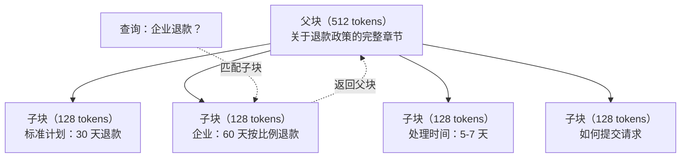

# 高级 RAG（分块、重排序、混合搜索）

> 基础 RAG 检索最相似的前 k 个块。这对简单问题有效。但对于多跳推理、模糊查询和大规模语料库，它就行不通了。高级 RAG 是能在 10 个文档上运行的演示与能在 1000 万个文档上运行的系统之间的区别。

**类型：** Build
**语言：** Python
**前置要求：** 阶段 11，课程 06（RAG）
**预计时间：** ~90 分钟
**关联：** 阶段 5 · 23（分块策略）涵盖所有六种分块算法——递归分块、语义分块、句子分块、父子分块、延迟分块、上下文检索——并附有 Vectara/Anthropic 基准测试。本课程在此基础上构建：混合搜索、重排序、查询转换。

## 学习目标

- 实现保留文档结构和上下文的高级分块策略（语义分块、递归分块、父子分块）
- 构建结合 BM25 关键词匹配、语义向量搜索和交叉编码器重排序的混合搜索管道
- 应用查询转换技术（HyDE、多查询、回溯）来改善模糊或复杂问题的检索效果
- 诊断和修复常见的 RAG 失败：检索到错误的块、答案不在上下文中、多跳推理断裂

## 问题

你在课程 06 中构建了一个基础 RAG 管道。它适用于小语料库上的直接问题。现在试试这些：

**模糊查询**：“上季度收入是多少？”语义搜索返回关于收入策略、收入预测和 CFO 对收入增长看法的块。所有这些都与“收入”一词在语义上相似。没有一个包含实际数字。正确的块说“2025 年第三季度 4720 万美元”但使用了“收益”而不是“收入”。嵌入模型认为“收入策略”比“第三季度收益为 4720 万美元”与查询更接近。

**多跳问题**：“哪个团队的客户满意度得分提升最高？”这需要查找每个团队的满意度得分，进行比较，并确定最大值。没有单个块包含答案。信息分布在各团队报告中。

**大规模语料库问题**：你有 200 万个块。正确答案在第 1,847,293 号块中。你的 top-5 检索拉取了第 14、第 89,201、第 1,200,000、第 44 和第 901,333 号块。在嵌入空间中很接近，但没有一个包含答案。在这种规模下，近似最近邻搜索引入了足够的误差，使相关结果被挤出 top-k。

基础 RAG 失败是因为向量相似度不等于相关性。一个块可能在语义上与查询相似，但对回答问题却没有用处。高级 RAG 通过四种技术来解决这个问题：混合搜索（添加关键词匹配）、重排序（更仔细地评分候选）、查询转换（在搜索前修复查询）和更好的分块（以适当的粒度检索）。

## 概念

### 混合搜索：语义 + 关键词

语义搜索（向量相似度）擅长理解含义。“如何取消订阅？”匹配“终止你的计划的步骤”尽管两者没有共享任何词。但它会错过精确匹配。“错误代码 E-4021”可能无法匹配包含“E-4021”的块，如果嵌入模型将其视为噪声。

关键词搜索（BM25）则相反。它擅长精确匹配。“E-4021”完美匹配。但“取消订阅”如果文档写的是“终止你的计划”则返回零结果。

混合搜索同时运行两者，然后合并结果。

**BM25**（最佳匹配 25）是标准的关键词搜索算法。自 1990 年代以来一直是搜索引擎的支柱。公式：

```
　　　　IDF(t) * (tf(t,d) * (k1 + 1)) / (tf(t,d) + k1 * (1 - b + b * |d| / avgdl))
    IDF(t) * (tf(t,d) * (k1 + 1)) / (tf(t,d) + k1 * (1 - b + b * |d| / avgdl))
```

其中 tf(t,d) 是 t 在文档 d 中的词频，IDF(t) 是逆文档频率，|d| 是文档长度，avgdl 是平均文档长度，k1 控制词频饱和度（默认 1.2），b 控制长度归一化（默认 0.75）。

简而言之：BM25 在文档包含查询词（尤其是稀有词）时给予更高分数，但对重复词有递减的回报。一个包含“收入”50 次的文档并不比只出现一次的相关 50 倍。

### 互恶排名融合（RRF）

你有两个排名列表：一个来自向量搜索，一个来自 BM25。如何合并它们？互恶排名融合是标准方法。

```
　　　　1 / (k + rank_R(d))
    1 / (k + rank_R(d))
```

其中 k 是一个常数（通常为 60），防止排名第一的结果主导。

在向量搜索中排名第 1 且在 BM25 中排名第 5 的文档得到：1/(60+1) + 1/(60+5) = 0.0164 + 0.0154 = 0.0318

在向量搜索中排名第 3 且在 BM25 中排名第 2 的文档得到：1/(60+3) + 1/(60+2) = 0.0159 + 0.0161 = 0.0320

RRF 自然地平衡了两种信号。在两个列表中排名都高的文档获得最佳分数。在一个列表中排名第 1 但在另一个列表中缺席的文档获得中等分数。这很稳健，因为它使用排名而非原始分数，因此两个系统之间分数分布的差异无关紧要。

### 重排序

检索（无论是向量、关键词还是混合）速度快但不精确。它使用双编码器：查询和每个文档独立嵌入，然后进行比较。嵌入被计算一次并缓存。这可以扩展到数百万个文档。

重排序使用交叉编码器：查询和候选文档被一起输入到一个输出相关性分数的模型中。模型同时看到两个文本，可以捕获它们之间的细致交互。交叉编码器可以理解“第三季度收益是多少？”与包含“第三季度 4720 万美元”的块高度相关，即使双编码器错过了这种联系。

权衡：交叉编码器比双编码器慢 100-1000 倍，因为它们共同处理查询-文档对。你无法预先计算数百万个文档的交叉编码器分数。解决方案：检索较大的候选集（来自混合搜索的 top-50），然后用交叉编码器重排序以获得最终的 top-5。

```mermaid
    Q["查询"] --> H["混合搜索"]
    H --> C50["Top 50 候选"]
    C50 --> RR["交叉编码器重排序器"]
    RR --> C5["Top 5 最终结果"]
    C5 --> P["构建提示词"]
    P --> LLM["生成答案"]
    P --> LLM["Generate answer"]
```

Common reranking models (2026 lineup):
- Cohere Rerank 3.5：托管 API，多语言，混合语料库上召回增益最佳
- Voyage rerank-2.5：托管 API，托管选项中延迟最低
- Jina-Reranker-v2 Multilingual：开源权重，100+ 语言
- bge-reranker-v2-m3：开源权重，强基线
- cross-encoder/ms-marco-MiniLM-L-6-v2：开源权重，可在 CPU 上运行用于原型设计
- ColBERTv2 / Jina-ColBERT-v2：延迟交互多向量重排序器——评分时为 O(tokens) 而非 O(docs)

### 查询转换

有时候问题不在于检索，而在于查询本身。“那个关于新政策变化的东西是什么？”是一个非常糟糕的搜索查询。它不包含任何特定术语。嵌入是模糊的。没有检索系统能从这个查询中找到正确的文档。

**查询重写**：将用户的查询重新表述为更好的搜索查询。LLM 可以做到这一点：

```
重写：“最近的政策变化和更新”
Rewritten: "Recent policy changes and updates"
```

**HyDE（假设文档嵌入）**：不使用查询进行搜索，而是生成一个假设答案，嵌入它，然后搜索相似的真实文档。

```
Query: "What is the refund policy for enterprise?"
假设答案：“企业客户有资格在购买后 60 天内获得全额退款。退款根据剩余订阅期按比例计算，并在 5-7 个工作日内处理。”
within 60 days of purchase. Refunds are pro-rated based on the remaining
subscription period and processed within 5-7 business days."
```

嵌入假设答案并搜索与之相似的真实文档。直觉：假设答案在嵌入空间中比原始问题更接近真实答案。问题和答案有不同的语言结构。通过生成假设答案，你在嵌入中弥合了“问题空间”和“答案空间”之间的差距。

HyDE 在检索前增加了一次 LLM 调用。这增加了 500-2000ms 的延迟。当原始查询的检索质量较差时，值得这样做。

### 父子分块

标准分块迫使你在两者之间做出权衡：小块用于精确检索，大块用于足够的上下文。父子分块消除了这种权衡。

索引小块（128 tokens）用于检索。当一个小块被检索到时，返回其父块（512 tokens）用于提示词。小块精确匹配查询。父块为 LLM 生成良好答案提供足够的上下文。


查询“企业退款？”精确匹配子块 C2。但提示词接收完整的父块 P，其中包含关于处理时间和提交流程的上下文。
查询“企业退款？”精确匹配子块 C2。但提示词接收完整的父块 P，其中包含关于处理时间和提交流程的上下文。

### 元数据过滤

在运行向量搜索之前，按元数据过滤语料库：日期、来源、类别、作者、语言。这减少了搜索空间并防止不相关的结果。

“上个月安全政策有什么变化？”应该只搜索安全类别中最近 30 天的文档。没有元数据过滤，你会搜索整个语料库，可能会检索到一份 2 年前的安全文档，只是恰巧在语义上相似。

生产 RAG 系统在每个块旁边存储元数据：源文档、创建日期、类别、作者、版本。向量数据库支持在相似度搜索之前按元数据进行预过滤，这对于大规模性能至关重要。

### 评估

你构建了一个 RAG 系统。如何知道它是否有效？三个指标：
**检索相关性（Recall@k）**：对于一组具有已知相关文档的测试问题，相关文档出现在 top-k 结果中的百分比是多少？如果问题的答案在第 47 号块中，第 47 号块是否出现在 top-5 中？
**检索相关性（Recall@k）**：对于一组具有已知相关文档的测试问题，相关文档出现在 top-k 结果中的百分比是多少？如果问题的答案在第 47 号块中，第 47 号块是否出现在 top-5 中？
**忠实度**：生成的答案是否基于检索到的文档？如果检索到的块说“60 天退款窗口”而模型说“90 天退款窗口”，那就是忠实度失败。尽管有正确的上下文，模型还是产生了幻觉。
**忠实度**：生成的答案是否基于检索到的文档？如果检索到的块说“60 天退款窗口”而模型说“90 天退款窗口”，那就是忠实度失败。尽管有正确的上下文，模型还是产生了幻觉。
**答案正确性**：生成的答案是否与预期答案匹配？这是端到端指标。它结合了检索质量和生成质量。
**答案正确性**：生成的答案是否与预期答案匹配？这是端到端指标。它结合了检索质量和生成质量。
一个简单的忠实度检查：提取生成答案中的每个主张，并验证它（在实质上）出现在检索到的块中。如果答案包含任何检索到的块中没有的事实，它很可能是幻觉。
一个简单的忠实度检查：提取生成答案中的每个主张，并验证它（在实质上）出现在检索到的块中。如果答案包含任何检索到的块中没有的事实，它很可能是幻觉。

```mermaid
    subgraph "评估框架"
        Q["测试问题<br/>+ 预期答案<br/>+ 相关文档 ID"]
        Q --> Ret["检索评估<br/>Recall@k：是否正确<br/>检索到文档？"]
        Q --> Faith["忠实度评估<br/>答案是否基于<br/>检索到的文档？"]
        Q --> Correct["正确性评估<br/>答案是否匹配<br/>预期答案？"]
        Q --> Correct["Correctness evaluation<br/>Does answer match<br/>expected answer?"]
    end
```

## 构建它

### 步骤 1：BM25 实现

```python
import math
from collections import Counter

class BM25:
    def __init__(self, k1=1.2, b=0.75):
        self.k1 = k1
        self.b = b
        self.docs = []
        self.doc_lengths = []
        self.avg_dl = 0
        self.doc_freqs = {}
        self.n_docs = 0

    def index(self, documents):
        self.docs = documents
        self.n_docs = len(documents)
        self.doc_lengths = []
        self.doc_freqs = {}

        for doc in documents:
            words = doc.lower().split()
            self.doc_lengths.append(len(words))
            unique_words = set(words)
            for word in unique_words:
                self.doc_freqs[word] = self.doc_freqs.get(word, 0) + 1

        self.avg_dl = sum(self.doc_lengths) / self.n_docs if self.n_docs else 1

    def score(self, query, doc_idx):
        query_words = query.lower().split()
        doc_words = self.docs[doc_idx].lower().split()
        doc_len = self.doc_lengths[doc_idx]
        word_counts = Counter(doc_words)
        score = 0.0

        for term in query_words:
            if term not in word_counts:
                continue
            tf = word_counts[term]
            df = self.doc_freqs.get(term, 0)
            idf = math.log((self.n_docs - df + 0.5) / (df + 0.5) + 1)
            numerator = tf * (self.k1 + 1)
            denominator = tf + self.k1 * (1 - self.b + self.b * doc_len / self.avg_dl)
            score += idf * numerator / denominator

        return score

    def search(self, query, top_k=10):
        scores = [(i, self.score(query, i)) for i in range(self.n_docs)]
        scores.sort(key=lambda x: x[1], reverse=True)
        return scores[:top_k]
```

### 步骤 2：互恶排名融合

```python
def reciprocal_rank_fusion(ranked_lists, k=60):
    scores = {}
    for ranked_list in ranked_lists:
        for rank, (doc_id, _) in enumerate(ranked_list):
            if doc_id not in scores:
                scores[doc_id] = 0.0
            scores[doc_id] += 1.0 / (k + rank + 1)
    fused = sorted(scores.items(), key=lambda x: x[1], reverse=True)
    return fused
```

### 步骤 3：混合搜索管道

```python
def hybrid_search(query, chunks, vector_embeddings, vocab, idf, bm25_index, top_k=5, fusion_k=60):
    query_emb = tfidf_embed(query, vocab, idf)
    vector_results = search(query_emb, vector_embeddings, top_k=top_k * 3)
    bm25_results = bm25_index.search(query, top_k=top_k * 3)
    fused = reciprocal_rank_fusion([vector_results, bm25_results], k=fusion_k)
    return fused[:top_k]
```

### 步骤 4：简单重排序器

在生产中，你会使用交叉编码器模型。这里我们构建一个重排序器，使用词重叠、词重要性和短语匹配来评分查询-文档相关性。

```python
def rerank(query, candidates, chunks):
    query_words = set(query.lower().split())
    stop_words = {"the", "a", "an", "is", "are", "was", "were", "what", "how",
                  "why", "when", "where", "do", "does", "for", "of", "in", "to",
                  "and", "or", "on", "at", "by", "it", "its", "this", "that",
                  "with", "from", "be", "has", "have", "had", "not", "but"}
    query_terms = query_words - stop_words

    scored = []
    for doc_id, initial_score in candidates:
        chunk = chunks[doc_id].lower()
        chunk_words = set(chunk.split())

        term_overlap = len(query_terms & chunk_words)

        query_bigrams = set()
        q_list = [w for w in query.lower().split() if w not in stop_words]
        for i in range(len(q_list) - 1):
            query_bigrams.add(q_list[i] + " " + q_list[i + 1])
        bigram_matches = sum(1 for bg in query_bigrams if bg in chunk)

        position_boost = 0
        for term in query_terms:
            pos = chunk.find(term)
            if pos != -1 and pos < len(chunk) // 3:
                position_boost += 0.5

        rerank_score = (
            term_overlap * 1.0
            + bigram_matches * 2.0
            + position_boost
            + initial_score * 5.0
        )
        scored.append((doc_id, rerank_score))

    scored.sort(key=lambda x: x[1], reverse=True)
    return scored
```

### 步骤 5：HyDE（假设文档嵌入）

```python
def hyde_generate_hypothesis(query):
    templates = {
        "what": "The answer to '{query}' is as follows: Based on our documentation, {topic} involves specific policies and procedures that define how the process works.",
        "how": "To address '{query}': The process involves several steps. First, you need to initiate the request. Then, the system processes it according to the defined rules.",
        "default": "Regarding '{query}': Our records indicate specific details and policies related to this topic that provide a comprehensive answer."
    }
    query_lower = query.lower()
    if query_lower.startswith("what"):
        template = templates["what"]
    elif query_lower.startswith("how"):
        template = templates["how"]
    else:
        template = templates["default"]

    topic_words = [w for w in query.lower().split()
                   if w not in {"what", "is", "the", "how", "do", "does", "a", "an",
                                "for", "of", "to", "in", "on", "at", "by", "and", "or"}]
    topic = " ".join(topic_words) if topic_words else "this topic"

    return template.format(query=query, topic=topic)


def hyde_search(query, chunks, vector_embeddings, vocab, idf, top_k=5):
    hypothesis = hyde_generate_hypothesis(query)
    hypothesis_emb = tfidf_embed(hypothesis, vocab, idf)
    results = search(hypothesis_emb, vector_embeddings, top_k)
    return results, hypothesis
```

### 步骤 6：父子分块

```python
def create_parent_child_chunks(text, parent_size=200, child_size=50):
    words = text.split()
    parents = []
    children = []
    child_to_parent = {}

    parent_idx = 0
    start = 0
    while start < len(words):
        parent_end = min(start + parent_size, len(words))
        parent_text = " ".join(words[start:parent_end])
        parents.append(parent_text)

        child_start = start
        while child_start < parent_end:
            child_end = min(child_start + child_size, parent_end)
            child_text = " ".join(words[child_start:child_end])
            child_idx = len(children)
            children.append(child_text)
            child_to_parent[child_idx] = parent_idx
            child_start += child_size

        parent_idx += 1
        start += parent_size

    return parents, children, child_to_parent
```

### 步骤 7：忠实度评估

```python
def evaluate_faithfulness(answer, retrieved_chunks):
    answer_sentences = [s.strip() for s in answer.split(".") if len(s.strip()) > 10]
    if not answer_sentences:
        return 1.0, []

    grounded = 0
    ungrounded = []
    context = " ".join(retrieved_chunks).lower()

    for sentence in answer_sentences:
        words = set(sentence.lower().split())
        stop_words = {"the", "a", "an", "is", "are", "was", "were", "and", "or",
                      "to", "of", "in", "for", "on", "at", "by", "it", "this", "that"}
        content_words = words - stop_words
        if not content_words:
            grounded += 1
            continue

        matched = sum(1 for w in content_words if w in context)
        ratio = matched / len(content_words) if content_words else 0

        if ratio >= 0.5:
            grounded += 1
        else:
            ungrounded.append(sentence)

    score = grounded / len(answer_sentences) if answer_sentences else 1.0
    return score, ungrounded


def evaluate_retrieval_recall(queries_with_relevant, retrieval_fn, k=5):
    total_recall = 0.0
    results = []

    for query, relevant_indices in queries_with_relevant:
        retrieved = retrieval_fn(query, k)
        retrieved_indices = set(idx for idx, _ in retrieved)
        relevant_set = set(relevant_indices)
        hits = len(retrieved_indices & relevant_set)
        recall = hits / len(relevant_set) if relevant_set else 1.0
        total_recall += recall
        results.append({
            "query": query,
            "recall": recall,
            "hits": hits,
            "total_relevant": len(relevant_set)
        })

    avg_recall = total_recall / len(queries_with_relevant) if queries_with_relevant else 0
    return avg_recall, results
```

## 使用它
使用真实的交叉编码器进行重排序：
With a real cross-encoder for reranking:

```python
reranker = CrossEncoder("cross-encoder/ms-marco-MiniLM-L-6-v2")

reranker = CrossEncoder("cross-encoder/ms-marco-MiniLM-L-6-v2")

def rerank_with_cross_encoder(query, candidates, chunks, top_k=5):
    pairs = [(query, chunks[doc_id]) for doc_id, _ in candidates]
    scores = reranker.predict(pairs)
    scored = list(zip([doc_id for doc_id, _ in candidates], scores))
    scored.sort(key=lambda x: x[1], reverse=True)
    return scored[:top_k]
```
使用 Cohere 的托管重排序器：
With Cohere's managed reranker:

```python
import cohere

co = cohere.Client()

def rerank_with_cohere(query, candidates, chunks, top_k=5):
    docs = [chunks[doc_id] for doc_id, _ in candidates]
    response = co.rerank(
        model="rerank-english-v3.0",
        query=query,
        documents=docs,
        top_n=top_k
    )
    return [(candidates[r.index][0], r.relevance_score) for r in response.results]
```
使用真实 LLM 的 HyDE：
For HyDE with a real LLM:

```python
import anthropic

client = anthropic.Anthropic()

def hyde_with_llm(query):
    response = client.messages.create(
        model="claude-sonnet-4-20250514",
        max_tokens=256,
        messages=[{
            "role": "user",
            "content": f"Write a short paragraph that would be a good answer to this question. Do not say you don't know. Just write what the answer would look like.\n\nQuestion: {query}"
        }]
    )
    return response.content[0].text
```
使用 Weaviate 的生产级混合搜索：
For production hybrid search with Weaviate:

```python
import weaviate

client = weaviate.connect_to_local()

collection = client.collections.get("Documents")
response = collection.query.hybrid(
    query="enterprise refund policy",
    alpha=0.5,
    limit=10
)
```
alpha 参数控制平衡：0.0 = 纯关键词（BM25），1.0 = 纯向量，0.5 = 等权重。大多数生产系统使用 0.3 到 0.7 之间的 alpha。
alpha 参数控制平衡：0.0 = 纯关键词（BM25），1.0 = 纯向量，0.5 = 等权重。大多数生产系统使用 0.3 到 0.7 之间的 alpha。

## 交付物

- `outputs/prompt-advanced-rag-debugger.md` —— 用于诊断和修复 RAG 质量问题的提示词
- `outputs/skill-advanced-rag.md` —— 用于构建带有混合搜索和重排序的生产级 RAG 的技能
- `outputs/skill-advanced-rag.md` —— 用于构建带有混合搜索和重排序的生产级 RAG 的技能

## 练习
1. 在样本文档上比较 BM25 vs 向量搜索 vs 混合搜索。对于 5 个测试查询，记录每个方法在位置 #1 返回最相关块的次数。混合搜索应该在至少 3/5 中获胜。
1. 在样本文档上比较 BM25 vs 向量搜索 vs 混合搜索。对于 5 个测试查询，记录每个方法在位置 #1 返回最相关块的次数。混合搜索应该在至少 3/5 中获胜。
2. 实现一个元数据过滤器。为每个文档添加“类别”字段（安全、计费、API、产品）。在运行向量搜索前，将块过滤到相关类别。用“使用了什么加密？”测试，验证它只搜索安全类别的块。
2. 实现一个元数据过滤器。为每个文档添加“类别”字段（安全、计费、API、产品）。在运行向量搜索前，将块过滤到相关类别。用“使用了什么加密？”测试，验证它只搜索安全类别的块。
3. 使用课程 06 中的简单生成函数构建一个完整的 HyDE 管道。在所有 5 个测试查询上比较直接查询搜索和 HyDE 搜索的检索质量（top-3 相关性）。HyDE 应该能改善模糊查询的结果。
3. 使用课程 06 中的简单生成函数构建一个完整的 HyDE 管道。在所有 5 个测试查询上比较直接查询搜索和 HyDE 搜索的检索质量（top-3 相关性）。HyDE 应该能改善模糊查询的结果。
4. 在样本文档上实现父子分块策略。使用 child_size=30 和 parent_size=100。用子块搜索，但在提示词中返回父块。比较生成的答案与使用 chunk_size=50 的标准分块。
4. 在样本文档上实现父子分块策略。使用 child_size=30 和 parent_size=100。用子块搜索，但在提示词中返回父块。比较生成的答案与使用 chunk_size=50 的标准分块。
5. 创建一个评估数据集：10 个问题及已知的答案块。衡量（a）仅向量搜索、（b）仅 BM25、（c）混合搜索、（d）混合 + 重排序的 Recall@3、Recall@5 和 Recall@10。绘制结果并确定重排序在哪个环节帮助最大。
5. 创建一个评估数据集：10 个问题及已知的答案块。衡量（a）仅向量搜索、（b）仅 BM25、（c）混合搜索、（d）混合 + 重排序的 Recall@3、Recall@5 和 Recall@10。绘制结果并确定重排序在哪个环节帮助最大。

## 关键术语
| 术语 | 人们说的 | 实际含义 |
| Term | What people say | What it actually means |
| BM25 | “关键词搜索” | 一种概率排序算法，根据词频、逆文档频率和文档长度归一化对文档评分 |
| 混合搜索 | “两全其美” | 并行运行语义（向量）和关键词（BM25）搜索，然后使用排名融合合并结果 |
| 互恶排名融合 | “合并排名列表” | 通过对每个文档在所有列表中求和 1/(k + rank) 来合并多个排名列表 |
| 重排序 | “第二轮评分” | 使用更昂贵的交叉编码器模型对初始检索的候选集重新评分 |
| 交叉编码器 | “联合查询-文档模型” | 将查询和文档作为单个输入，产生相关性分数的模型；比双编码器更精确，但对全语料库搜索太慢 |
| 双编码器 | “独立嵌入模型” | 独立嵌入查询和文档的模型；因嵌入可预先计算而快速，但不如交叉编码器精确 |
| HyDE | “用假答案搜索” | 生成查询的假设答案，嵌入它，然后搜索与之相似的真实文档 |
| 父子分块 | “小搜索，大上下文” | 索引小块用于精确检索，但返回较大的父块以提供足够的上下文 |
| 元数据过滤 | “搜索前缩小范围” | 在运行向量搜索前按属性（日期、来源、类别）过滤文档以减少搜索空间 |
| 忠实度 | “是否基于事实” | 生成的答案是否由检索到的文档支持，而非从模型的训练数据中产生幻觉 |
| 忠实度 | “是否基于事实” | 生成的答案是否由检索到的文档支持，而非从模型的训练数据中产生幻觉 |

## 延伸阅读

- Robertson & Zaragoza, “The Probabilistic Relevance Framework: BM25 and Beyond” (2009) —— BM25 的权威参考，解释了公式背后的概率基础
- Cormack et al., “Reciprocal Rank Fusion Outperforms Condorcet and Individual Rank Learning Methods” (2009) —— 原始 RRF 论文，展示了它胜过更复杂的融合方法
- Gao et al., “Precise Zero-Shot Dense Retrieval without Relevance Labels” (2022) —— HyDE 论文，展示了假设文档嵌入无需任何训练数据即可改善检索
- Nogueira & Cho, “Passage Re-ranking with BERT” (2019) —— 展示了在 BM25 之上进行交叉编码器重排序显著提升了检索质量
- [Khattab et al., “DSPy: Compiling Declarative Language Model Calls into Self-Improving Pipelines” (2023)](https://arxiv.org/abs/2310.03714) —— 将提示词构建和权重选择视为检索管道上的优化问题；阅读此文以了解“编程 LLM”而非“提示 LLM”。
- [Edge et al., “From Local to Global: A Graph RAG Approach to Query-Focused Summarization” (Microsoft Research 2024)](https://arxiv.org/abs/2404.16130) —— GraphRAG 论文：实体关系提取 + Leiden 社区检测用于查询聚焦摘要；全局与局部检索的区别。
- [Asai et al., “Self-RAG: Learning to Retrieve, Generate, and Critique through Self-Reflection” (ICLR 2024)](https://arxiv.org/abs/2310.11511) —— 带有反思 token 的自我评估 RAG；超越静态检索-生成的代理前沿。
- [LangChain 查询构建博客](https://blog.langchain.dev/query-construction/) —— 如何将自然语言查询转换为结构化数据库查询（Text-to-SQL、Cypher）作为检索前步骤。
