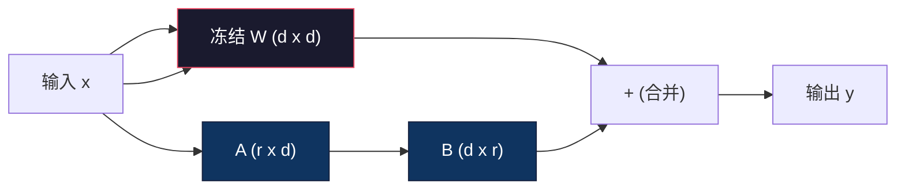
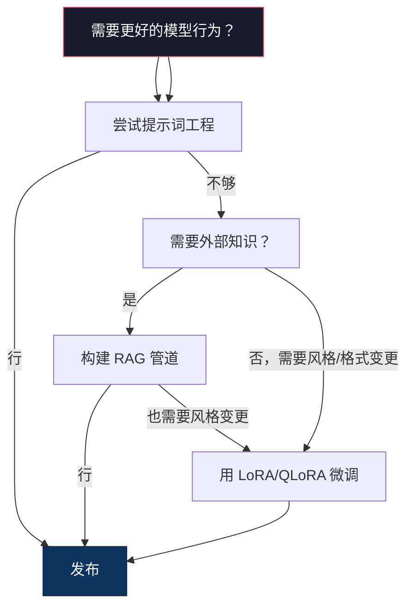

# 微调与 LoRA/QLoRA

> 全微调一个 7B 模型需要 56GB VRAM。你没有这个条件。大多数公司也没有。LoRA 让你在 6GB 内存中微调同一个模型，只训练不到 1% 的参数。这不是妥协——在大多数任务上，它与全微调质量相当。整个开源微调生态都建立在这个技巧之上。

**类型：** Build
**语言：** Python
**前置要求：** 阶段 10，课程 06（指令微调 / SFT）
**预计时间：** ~75 分钟
**关联：** 阶段 10 从头覆盖了 SFT/DPO 循环。本课程将它们插入 2026 年的 PEFT 工具包（PEFT、TRL、Unsloth、Axolotl、LLaMA-Factory）。

## 学习目标

- 实现 LoRA，将低秩适配器矩阵（A 和 B）注入预训练模型的注意力层
- 计算 LoRA 与全微调的参数节省：秩 r 与 d_model 维度训练 2×r×d 个参数而不是 d²
- 使用 QLoRA（4-bit 量化基础模型 + LoRA 适配器）微调模型，使其适配消费级 GPU 内存
- 将 LoRA 权重合并回基础模型进行部署，比较有无适配器时的推理速度

## 问题

你有一个基础模型。Llama 3 8B。你希望它用你公司的语气回答客户支持工单。SFT 是答案。但 SFT 有一个成本问题。

全微调更新模型中的每个参数。Llama 3 8B 有 80 亿个参数。在 fp16 中，每个参数占用 2 字节。仅加载权重就需要 16GB。在训练期间，你还需要梯度（16GB）、Adam 的优化器状态（动量+方差 32GB）和激活值。总计：单个 8B 模型大约需要 56GB VRAM。

一块 A100 80GB 勉强能容纳。两块 A100 在云上每小时花费 3-4 美元。在 50,000 个样本上训练 3 个 epoch 需要 6-10 小时。每次实验 30-40 美元。运行 10 次实验来调优超参数，在部署任何东西之前你就已经花了 400 美元。

将其扩展到 Llama 3 70B，数字就大得离谱了。仅权重就需要 140GB。你需要一个集群。每次实验 100 美元以上。

还有一个更深层的问题。全微调修改模型中的每一个权重。如果你在客户支持数据上微调，你可能会降低模型的一般能力。这叫做灾难性遗忘。模型在你的任务上变得更好，但在其他方面变得更差。

你需要一种训练更少参数、使用更少内存、且不破坏模型现有知识的方法。

## 概念

### LoRA：低秩适配

2021 年 6 月，微软的 Edward Hu 及其同事发表了 LoRA 论文。论文的洞见是：微调期间的权重更新具有低内在秩。你不需要更新 4096x4096 权重矩阵中全部 1680 万个参数。更新中的有用信息可以用秩为 16 或 32 的矩阵捕获。

标准的线性层计算：

y = Wx
```

其中 W 是 d_out x d_in 矩阵。对于 4096x4096 的注意力投影，这是 16,777,216 个参数。

LoRA 冻结 W 并添加低秩分解：

y = Wx + BAx
```

其中 B 是 (d_out x r) 而 A 是 (r x d_in)。秩 r 远小于 d——通常为 8、 16 或 32。

对于 4096x4096 层上的 r=16：

- 原始参数：4096 x 4096 = 16,777,216
- LoRA 参数：(4096 x 16) + (16 x 4096) = 65,536 + 65,536 = 131,072
- 缩减：131,072 / 16,777,216 = 0.78%

你训练 0.78% 的参数，获得 95-100% 的质量。
You're training 0.78% of the parameters and getting 95-100% of the quality.




A 用随机高斯分布初始化。B 初始化为零。这意味着 LoRA 的贡献从零开始——模型从其原始行为开始训练，逐步学习适配。

### 缩放因子：Alpha

LoRA 引入了一个缩放因子 alpha，控制低秩更新对输出的影响程度：

y = Wx + (alpha / r) * BAx
```

当 alpha = r 时，缩放倍数为 1x。当 alpha = 2r（常见默认值）时，缩放倍数为 2x。这个超参数独立于基础学习率控制 LoRA 路径的学习率。

实用指南：
• alpha = 2 × rank 是常见的社区惯例（原始论文在大多数实验中使用 alpha = rank）
• alpha = rank 给出 1x 缩放，保守但稳定
• 更高的 alpha 意味着每步更大的更新，可能加速收敛或导致不稳定

### 在哪里应用 LoRA

Transformer 有许多线性层。你不需要向所有层添加 LoRA。原始论文测试了不同的组合：

| Target Layers | Trainable Params (7B) | Quality |
| 目标层 | 可训练参数（7B）| 质量 |
|--------------|----------------------|---------|
| 仅 q_proj | 4.7M | 良好 |
| q_proj + v_proj | 9.4M | 更好 |
| q_proj + k_proj + v_proj + o_proj | 18.9M | 最适合注意力 |
| 所有线性层（注意力 + MLP）| 37.7M | 收益微小，参数翻倍 |

大多数任务的最佳选择：q_proj + v_proj。这针对自注意力中的查询和值投影，控制模型关注什么以及提取什么信息。添加 MLP 层有助于复杂任务（如代码生成），但会使参数翻倍而在简单任务上收益递减。

### 秩的选择

秩 r 控制适配的表达能力：
| Rank | Trainable Params (per layer) | Best For |
| 秩 | 可训练参数（每层）| 最适合 |
|------|---------------------------|----------|
| 4 | 32,768 | 简单分类、情感分析 |
| 8 | 65,536 | 单领域问答、摘要 |
| 16 | 131,072 | 多领域任务、指令跟随 |
| 32 | 262,144 | 复杂推理、代码生成 |
| 64 | 524,288 | 大多数任务收益递减 |
| 128 | 1,048,576 | 很少有必要 |

Hu 等人表明，r=4 已经能捕获大多数简单任务的适配。r=8 和 r=16 是实践中最常见的选择。超过 r=64 很少改善质量，并开始丧失 LoRA 的内存优势。

### QLoRA：4-Bit 量化 + LoRA

2023 年 5 月，华盛顿大学的 Tim Dettmers 及其同事发表了 QLoRA 论文。其思想是：将冻结的基础模型量化到 4-bit 精度，然后在之上以 fp16 附加 LoRA 适配器。

这极大地改变了内存等式：
| Method | Weight Memory (7B) | Training Memory (7B) | GPU Required |
| 方法 | 权重内存（7B）| 训练内存（7B）| 所需 GPU |
|--------|-------------------|---------------------|-------------|
| 全微调（fp16）| 14GB | ~56GB | 1x A100 80GB |
| LoRA（fp16 基础）| 14GB | ~18GB | 1x A100 40GB |
| QLoRA（4-bit 基础）| 3.5GB | ~6GB | 1x RTX 3090 24GB |

QLoRA 做了三项技术贡献：

**NF4（Normal Float 4-bit）**：一种专门为神经网络权重设计的新数据类型。神经网络权重大致服从正态分布。NF4 将其 16 个量化等级放置在标准正态分布的分位数上。这对于正态分布数据在信息论上是最优的。它比均匀 4-bit 量化（INT4）或标准 Float4 损失更少信息。

**双重量化**：量化常数本身也占用内存。每 64 个权重的块需要一个 fp32 缩放因子（4 字节）。对于 7B 模型，这额外增加 0.4GB。双重量化将这些常数量化为 fp8，将开销降低到 0.1GB。虽小但积少成多。

**分页优化器**：在训练期间，优化器状态（Adam 的动量和方差）在长序列上可能超出 GPU 内存。分页优化器使用 NVIDIA 的统一内存在 GPU 内存耗尽时自动将优化器状态分页到 CPU RAM，并在需要时换回。这防止了 OOM 崩溃，代价是一些吞吐量。

### 质量问题

减少参数或量化基础模型会影响质量吗？来自多篇论文的结果：
| Method | MMLU (5-shot) | MT-Bench | HumanEval |
| 方法 | MMLU (5-shot) | MT-Bench | HumanEval |
|--------|--------------|----------|-----------|
| 全微调（Llama 2 7B）| 48.3 | 6.72 | 14.6 |
| LoRA r=16 | 47.9 | 6.68 | 14.0 |
| QLoRA r=16 (NF4) | 47.5 | 6.61 | 13.4 |
| QLoRA r=64 (NF4) | 48.1 | 6.70 | 14.2 |

LoRA 在 r=16 时在大多数基准测试上在全微调的 1% 以内。QLoRA 在 r=16 时再损失零点几个百分点。QLoRA 在 r=64 时基本上匹配全微调质量，同时使用少 90% 的内存。

### 真实世界成本

在 50,000 个样本（3 个 epoch）上微调 Llama 3 8B：

| 方法 | GPU | 时间 | 成本 |
|--------|-----|------|------|
| 全微调 | 2x A100 80GB | 8 小时 | ~$32 |
| LoRA r=16 | 1x A100 40GB | 4 小时 | ~$8 |
| QLoRA r=16 | 1x RTX 4090 24GB | 6 小时 | ~$5 |
| QLoRA r=16 (Unsloth) | 1x RTX 4090 24GB | 2.5 小时 | ~$2 |
| QLoRA r=16 | 1x T4 16GB | 12 小时 | ~$4 |

在单块消费级 GPU 上的 QLoRA 成本低于一顿午餐。这就是为什么开源权重微调社区在 2023 年爆发，以及为什么下面的每个训练框架在 2026 年默认都提供 QLoRA。

### 2026 年的 PEFT 工具栈
| Framework | What it is | Pick when |
| 框架 | 用途 | 何时选择 |
|-----------|-----------|-----------|
| **Hugging Face PEFT** | 标准 LoRA/QLoRA/DoRA/IA3 库 | 你需要原始控制，且训练循环已基于 `transformers.Trainer` |
| **TRL** | HF 的基于反馈的训练器（SFT、DPO、GRPO、PPO、ORPO）| 你在 SFT 之后需要 DPO/GRPO；构建在 PEFT 之上 |
| **Unsloth** | 前向/后向传播的 Triton 内核重写 | 你想要 2-5x 加速 + 一半 VRAM，无精度损失；Llama/Mistral/Qwen 系列 |
| **Axolotl** | 基于 PEFT + TRL + DeepSpeed + Unsloth 的 YAML 配置封装 | 你想要可重现、版本控制的训练运行 |
| **LLaMA-Factory** | 基于 PEFT + TRL 的 GUI/CLI/API | 你想要零代码微调；支持 100+ 模型系列 |
| **torchtune** | 原生 PyTorch 配方，无 `transformers` 依赖 | 你想要最小依赖，且团队已标准化使用 PyTorch |

经验法则：研究用途或一次性实验 → PEFT。可重复的生产管道 → 启用 Unsloth 内核的 Axolotl。快速原型 → LLaMA-Factory。

### 合并适配器

训练后，你有两种部署选项：

1. **保持分离**：加载基础模型，在之上加载适配器。为不同任务交换适配器。这就是你从一个基础模型服务多个微调变体的方式。

2. **永久合并**：计算 W＇ = W + (alpha/r) × BA 并将结果保存为新的完整模型。合并后的模型与原始模型大小相同。无推理开销。无需管理适配器。

对于服务多个任务（客户支持适配器、代码适配器、翻译适配器），保持分离。对于部署单一专用模型，合并。

组合多个适配器的高级合并技术：

• **TIES-Merging**（Yadav 等人 2023）：修剪小幅度参数，解决符号冲突，然后合并。减少适配器间的干扰。
• **DARE**（Yu 等人 2023）：在合并前随机丢弃适配器参数并重新缩放剩余部分。在组合能力方面出奇有效。
• **任务算术**：简单地加或减适配器权重。添加“代码”适配器和“数学”适配器通常产生一个擅长两者的模型。

### 何时不要微调

微调是第三个选项，而不是第一个。

**第一：提示词工程。**写更好的系统提示词。添加 few-shot 示例。使用思维链。这零成本且只需几分钟。如果提示词让你走完 80% 的路，你可能不需要微调。

**第二：RAG。**如果模型需要了解你的特定数据（文档、知识库、产品目录），检索比将其烘炖到权重中更便宜、更可维护。参见课程 06。

**第三：微调。**当你需要模型采用无法通过提示词实现的特定风格、格式或推理模式时使用。当你需要一致的结构化输出时。当你需要将较大模型蒸馏到较小模型时。当延迟很重要且你无法承受 few-shot 提示词的额外 token 时。



```figure
lora-params
```

## 构建它

我们用纯 PyTorch 从头实现 LoRA。无库。无魔术。你将构建 LoRA 层，将其注入模型，训练它，然后将权重合并回来。

### 步骤 1：LoRA 层
```python
import torch
import torch.nn as nn
import math

class LoRALayer(nn.Module):
    def __init__(self, in_features, out_features, rank=8, alpha=16):
        super().__init__()
        self.rank = rank
        self.alpha = alpha
        self.scaling = alpha / rank

        self.A = nn.Parameter(torch.randn(in_features, rank) * (1 / math.sqrt(rank)))
        self.B = nn.Parameter(torch.zeros(rank, out_features))

    def forward(self, x):
        return (x @ self.A @ self.B) * self.scaling
```


A 用缩放的随机值初始化。B 初始化为零。乘积 BA 从零开始，所以模型从其原始行为开始训练。

### 步骤 2：LoRA 包装的线性层
```python
class LinearWithLoRA(nn.Module):
    def __init__(self, linear, rank=8, alpha=16):
        super().__init__()
        self.linear = linear
        self.lora = LoRALayer(
            linear.in_features, linear.out_features, rank, alpha
        )

        for param in self.linear.parameters():
            param.requires_grad = False

    def forward(self, x):
        return self.linear(x) + self.lora(x)
```


原始线性层被冻结。只有 LoRA 参数（A 和 B）是可训练的。

### 步骤 3：将 LoRA 注入模型
```python
def inject_lora(model, target_modules, rank=8, alpha=16):
    for param in model.parameters():
        param.requires_grad = False

    lora_layers = {}
    for name, module in model.named_modules():
        if isinstance(module, nn.Linear):
            if any(t in name for t in target_modules):
                parent_name = ".".join(name.split(".")[:-1])
                child_name = name.split(".")[-1]
                parent = dict(model.named_modules())[parent_name]
                lora_linear = LinearWithLoRA(module, rank, alpha)
                setattr(parent, child_name, lora_linear)
                lora_layers[name] = lora_linear
    return lora_layers
```


首先，冻结模型中的每一个参数。然后遍历模型树，找到匹配你目标名称的线性层，并用 LoRA 包装的版本替换它们。LoRA A 和 B 矩阵是整个模型中唯一的可训练参数。

### 步骤 4：计数参数
```python
def count_parameters(model):
    total = sum(p.numel() for p in model.parameters())
    trainable = sum(p.numel() for p in model.parameters() if p.requires_grad)
    frozen = total - trainable
    return {
        "total": total,
        "trainable": trainable,
        "frozen": frozen,
        "trainable_pct": 100 * trainable / total if total > 0 else 0
    }
```


### 步骤 5：合并权重
```python
def merge_lora_weights(model):
    for name, module in model.named_modules():
        if isinstance(module, LinearWithLoRA):
            with torch.no_grad():
                merged = (
                    module.lora.A @ module.lora.B
                ) * module.lora.scaling
                module.linear.weight.data += merged.T
            parent_name = ".".join(name.split(".")[:-1])
            child_name = name.split(".")[-1]
            if parent_name:
                parent = dict(model.named_modules())[parent_name]
            else:
                parent = model
            setattr(parent, child_name, module.linear)
```


合并后，LoRA 层消失了。模型与原始模型大小相同，适配已烘炖到权重中。无推理开销。
### Step 6: Simulated QLoRA Quantization

### 步骤 6：模拟 QLoRA 量化
def quantize_to_nf4(tensor, block_size=64):
    blocks = tensor.reshape(-1, block_size)
    scales = blocks.abs().max(dim=1, keepdim=True).values / 7.0
    scales = torch.clamp(scales, min=1e-8)
    quantized = torch.round(blocks / scales).clamp(-8, 7).to(torch.int8)
    return quantized, scales

def dequantize_from_nf4(quantized, scales, original_shape):
    dequantized = quantized.float() * scales
    return dequantized.reshape(original_shape)
```


这通过将权重映射到 64 个块内的 16 个离散等级来模拟 4-bit 量化。生产 QLoRA 使用 bitsandbytes 库在 GPU 上实现真正的 NF4。

### 步骤 7：训练循环
```python
def train_lora(model, data, epochs=5, lr=1e-3, batch_size=4):
    optimizer = torch.optim.AdamW(
        [p for p in model.parameters() if p.requires_grad], lr=lr
    )
    criterion = nn.MSELoss()

    losses = []
    for epoch in range(epochs):
        epoch_loss = 0.0
        n_batches = 0
        indices = torch.randperm(len(data["inputs"]))

        for i in range(0, len(indices), batch_size):
            batch_idx = indices[i:i + batch_size]
            x = data["inputs"][batch_idx]
            y = data["targets"][batch_idx]

            output = model(x)
            loss = criterion(output, y)

            optimizer.zero_grad()
            loss.backward()
            optimizer.step()

            epoch_loss += loss.item()
            n_batches += 1

        avg_loss = epoch_loss / n_batches
        losses.append(avg_loss)

    return losses
```


### 步骤 8：完整演示
```python
def demo():
    torch.manual_seed(42)
    d_model = 256
    n_classes = 10

    model = nn.Sequential(
        nn.Linear(d_model, 512),
        nn.ReLU(),
        nn.Linear(512, 512),
        nn.ReLU(),
        nn.Linear(512, n_classes),
    )

    n_samples = 500
    x = torch.randn(n_samples, d_model)
    y = torch.randint(0, n_classes, (n_samples,))
    y_onehot = torch.zeros(n_samples, n_classes).scatter_(1, y.unsqueeze(1), 1.0)

    data = {"inputs": x, "targets": y_onehot}

    params_before = count_parameters(model)

    lora_layers = inject_lora(
        model, target_modules=["0", "2"], rank=8, alpha=16
    )

    params_after = count_parameters(model)

    losses = train_lora(model, data, epochs=20, lr=1e-3)

    merge_lora_weights(model)
    params_merged = count_parameters(model)

    return {
        "params_before": params_before,
        "params_after": params_after,
        "params_merged": params_merged,
        "losses": losses,
    }
```


演示创建一个小模型，将 LoRA 注入两个层，训练它，并将权重合并回来。参数数量从全部可训练下降到 LoRA 训练期间的约 1% 可训练，然后在合并后回复到原始架构。

## 使用它

使用 Hugging Face 生态，在真实模型上的 LoRA 大约需要 20 行代码：
```python
from transformers import AutoModelForCausalLM, AutoTokenizer
from peft import LoraConfig, get_peft_model, TaskType

model = AutoModelForCausalLM.from_pretrained("meta-llama/Llama-3.1-8B")
tokenizer = AutoTokenizer.from_pretrained("meta-llama/Llama-3.1-8B")

lora_config = LoraConfig(
    task_type=TaskType.CAUSAL_LM,
    r=16,
    lora_alpha=32,
    lora_dropout=0.05,
    target_modules=["q_proj", "v_proj"],
)

model = get_peft_model(model, lora_config)
model.print_trainable_parameters()
```

对于 QLoRA，添加 bitsandbytes 量化：

```python
from transformers import BitsAndBytesConfig

bnb_config = BitsAndBytesConfig(
    load_in_4bit=True,
    bnb_4bit_quant_type="nf4",
    bnb_4bit_compute_dtype=torch.bfloat16,
    bnb_4bit_use_double_quant=True,
)

model = AutoModelForCausalLM.from_pretrained(
    "meta-llama/Llama-3.1-8B",
    quantization_config=bnb_config,
    device_map="auto",
)

model = get_peft_model(model, lora_config)
```


就这样。相同的训练循环。相同的数据管道。基础模型现在以 4-bit 存在，LoRA 适配器以 fp16 训练，整个东西适合 6GB。

使用 Hugging Face Trainer 进行训练：
```python
from transformers import TrainingArguments, Trainer
from datasets import load_dataset

dataset = load_dataset("tatsu-lab/alpaca", split="train[:5000]")

training_args = TrainingArguments(
    output_dir="./lora-llama",
    num_train_epochs=3,
    per_device_train_batch_size=4,
    gradient_accumulation_steps=4,
    learning_rate=2e-4,
    fp16=True,
    logging_steps=10,
    save_strategy="epoch",
    optim="paged_adamw_8bit",
)

trainer = Trainer(
    model=model,
    args=training_args,
    train_dataset=dataset,
)

trainer.train()

model.save_pretrained("./lora-adapter")
```


保存的适配器为 10-100MB。基础模型保持不变。你可以在 Hugging Face Hub 上分享适配器，无需重新分发完整模型。

## 交付物

本课程产出：
- `outputs/prompt-lora-advisor.md` —— 帮助你为特定任务决定 LoRA 秩、目标模块和超参数的提示词
- `outputs/skill-fine-tuning-guide.md` —— 教导代理何时以及如何微调的决策树技能

## 练习

1. **秩消融研究。** 用秩 2、 4、 8、 16、 32 和 64 运行演示。绘制最终损失与秩的关系。找到收益递减点，即秩翻倍不再使损失减半的位置。对于 256 维特征上的简单分类任务，这应该在大约 r=8-16。

2. **目标模块比较。** 修改 inject_lora 以仅定位层“0”、仅层“2”、仅层“4”以及全部三个。每个变体训练 20 个 epoch。比较收敛速度和最终损失。这反映了实际决策中定位 q_proj 与 v_proj 与所有线性层的选择。

3. **量化误差分析。** 在 quantize_to_nf4 / dequantize_from_nf4 前后取训练模型的权重矩阵。计算均方误差、最大绝对误差以及原始和重建权重之间的相关性。实验 block_size 值为 32、 64、 128 和 256。

4. **多适配器服务。** 在数据的不同子集上训练两个 LoRA 适配器（偶数索引 vs 奇数索引）。保存两个适配器。加载基础模型一次，然后交换适配器并验证每个适配器在相同输入上产生不同输出。这就是生产系统从一个基础模型服务多个微调模型的方式。

5. **合并 vs 未合并推理。** 在相同的 100 个输入上比较 LoRA 模型在 merge_lora_weights 之前和之后的输出。验证输出在浮点容差 1e-5 内相同。然后对两者进行推理速度基准测试——合并后应该略快一些，因为是单次矩阵乘法而非两次。

## 关键术语

| 术语 | 人们说的 | 实际含义 |
|------|----------------|----------------------|
| LoRA | “高效微调” | 低秩适配：冻结基础权重，训练两个小矩阵 A 和 B，其乘积近似完整的权重更新 |
| QLoRA | “在笔记本上微调” | 量化 LoRA：以 4-bit NF4 加载基础模型，在之上以 fp16 训练 LoRA 适配器，使得 7B 微调在 6GB VRAM 中成为可能 |
| 秩 (r) | “模型能学多少” | A 和 B 矩阵的内部维度；控制表达能力与参数数量之间的权衡 |
| Alpha | “LoRA 学习率” | 应用于 LoRA 输出的缩放因子；alpha/r 缩放适配对最终输出的贡献 |
| NF4 | “4-bit 量化” | Normal Float 4：一种 4-bit 数据类型，量化等级位于正态分布分位数，对神经网络权重最优 |
| 适配器 | “小的训练部分” | 保存为单独文件（10-100MB）的 LoRA A 和 B 矩阵，可在任何基础模型的副本之上加载 |
| 目标模块 | “要对哪些层做 LoRA” | 注入 LoRA 适配器的特定线性层（q_proj、v_proj 等）|
| 合并 | “烘炖进去” | 计算 W + (alpha/r) × BA 并替换原始权重，消除推理时的适配器开销 |
| 分页优化器 | “训练中不 OOM” | 在 GPU 内存耗尽时将优化器状态（Adam 动量、方差）卸载到 CPU |
| 灾难性遗忘 | “微调破坏了其他一切” | 当更新所有权重导致模型丧失之前学到的能力时 |

## 延伸阅读

- Hu et al., “LoRA: Low-Rank Adaptation of Large Language Models” (2021) —— 引入低秩分解方法的原始论文，在 GPT-3 175B 上测试秩低至 4
- Dettmers et al., “QLoRA: Efficient Finetuning of Quantized Language Models” (2023) —— 引入了 NF4、双重量化和分页优化器，使得在单块 48GB GPU 上微调 65B 模型成为可能
- PEFT 库文档 (huggingface.co/docs/peft) —— Hugging Face 生态中 LoRA、QLoRA 和其他参数高效方法的标准库
- Yadav et al., “TIES-Merging: Resolving Interference When Merging Models” (2023) —— 组合多个 LoRA 适配器而不降低质量的技术
- [Rafailov et al., “Direct Preference Optimization: Your Language Model is Secretly a Reward Model” (NeurIPS 2023)](https://arxiv.org/abs/2305.18290) —— DPO 推导；SFT 之后的偏好微调阶段，无需奖励模型。
- [TRL 文档](https://huggingface.co/docs/trl/) —— `SFTTrainer`、`DPOTrainer`、`KTOTrainer` 以及与 PEFT/bitsandbytes/Unsloth 集成面的官方参考。
- [Unsloth 文档](https://docs.unsloth.ai/) —— 使微调吞吐量翻倍、内存减半的融合内核；TRL 下的性能层。
- [Axolotl 文档](https://axolotl-ai-cloud.github.io/axolotl/) —— YAML 配置的多 GPU SFT/DPO/QLoRA 训练器；作为手写脚本替代的配置即代码方案。