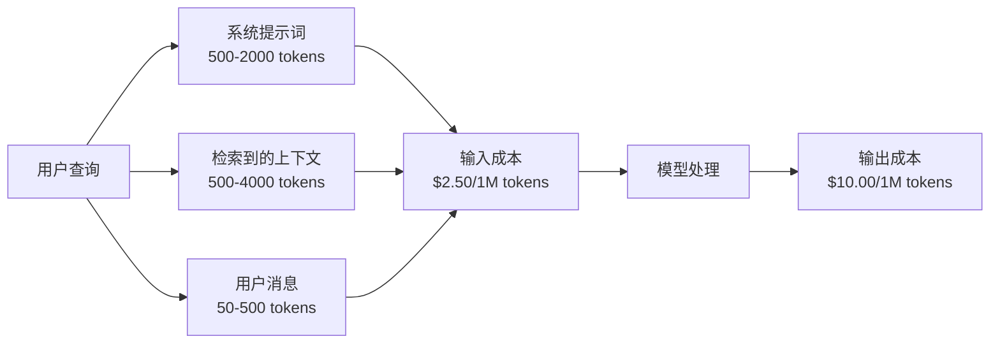
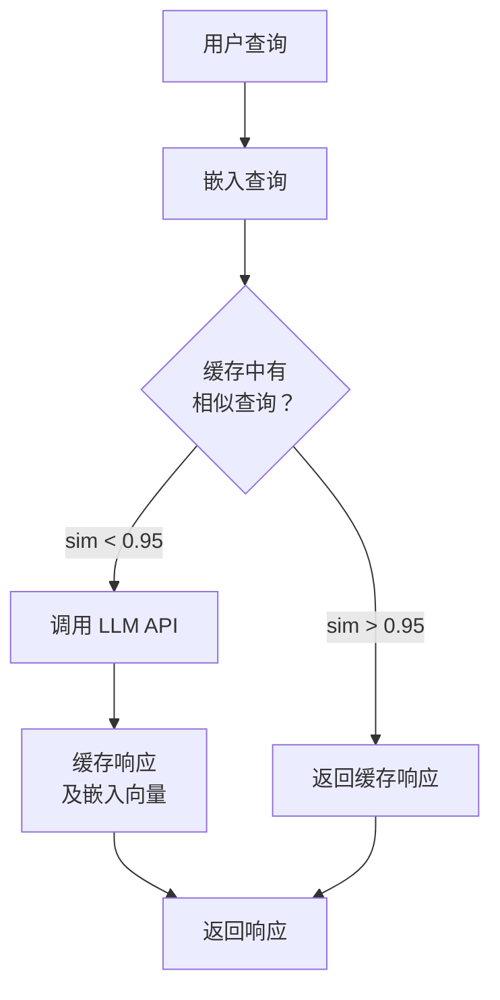
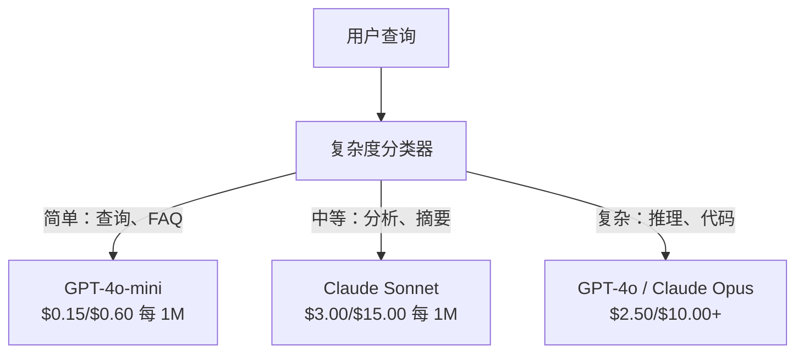

# 缓存、限流与成本优化

> 大多数 AI 初创公司不是死于糟糕的模型。它们死于糟糕的单位经济。一次 GPT-4o 调用只需几分之一美分。一万个用户每天调用十次，仅输入 token 就需要 $250/天——在你收取一分钱之前。生存下来的公司是那些把每次 API 调用当作金融交易、而不是函数调用来看待的公司。

**类型:** Build
**语言:** Python
**前置知识:** Phase 11 第 09 课（函数调用）
**时间:** ~45 分钟
**相关课程:** Phase 11 · 15（提示词缓存）——本课涵盖应用层缓存（语义缓存、精确哈希缓存、模型路由）。第 15 课涵盖提供商层提示词缓存（Anthropic cache_control、OpenAI 自动缓存、Gemini CachedContent）。两者结合可实现 50-95% 的成本降低。

## 学习目标

- 实现语义缓存，为重复或相似查询提供缓存服务，无需发起新的 API 调用
- 跨提供商计算每次请求的成本，实现 token 感知的限流和预算警报
- 构建成本优化层，包含提示词压缩、模型路由（昂贵 vs 便宜）和响应缓存
- 针对不同查询类型，设计分层的缓存策略：精确匹配、语义相似度和前缀缓存

## 问题

你构建了一个 RAG 聊天机器人。它运行完美。用户喜欢它。

然后账单到了。

GPT-5 每百万输入 token 收费 $5，每百万输出 token 收费 $15。Claude Opus 4.7 收费 $15 输入 / $75 输出。Gemini 3 Pro 收费 $1.25 输入 / $5 输出。GPT-5-mini 是 $0.25/$2。以下价格为示意价格；请始终查看提供商当前定价页面。

以下是扼杀初创公司的数学：

- 10,000 日活用户
- 每用户每天 10 次查询
- 每次查询 1,000 个输入 token（系统提示词 + 上下文 + 用户消息）
- 每个响应 500 个输出 token

**每日输入成本：** 10,000 × 10 × 1,000 / 1,000,000 × $2.50 = **$250/天**
**每日输出成本：** 10,000 × 10 × 500 / 1,000,000 × $10.00 = **$500/天**
**月总计：** **$22,500/月**

这仅仅是 LLM 的费用。再加上嵌入、向量数据库托管、基础设施。你一个聊天机器人就要花费 $30,000/月。

残酷的事实是：其中 40-60% 的查询是近乎重复的。用户用略有不同的词语问同样的问题。你的系统提示词——每次请求都一模一样——每次都按全价收费。RAG 检索到的上下文文档在不同用户询问相同主题时会重复出现。

你正在为冗余计算支付全价。

## 核心概念

### LLM 调用的成本分析

每次 API 调用有五个成本组成部分。



系统提示词是无声的杀手。一个 1,500 token 的系统提示词随每次请求发送，仅这一前缀就花费 $3.75/百万次请求。在每天 10 万次请求下，那就是 $375/天——$11,250/月——用于从不变化的文本。

### 提供商缓存：内置折扣

2026 年，三大主要提供商都提供服务端提示词缓存，但机制各不相同。详见 Phase 11 · 15。

| 提供商 | 机制 | 折扣 | 最低要求 | 缓存时长 |
|----------|-----------|----------|---------|----------------|
| Anthropic | 显式 cache_control 标记 | 缓存命中 90% 折扣（写入时多付 25%） | 1,024 tokens（Sonnet/Opus），2,048（Haiku） | 默认 5 分钟；可延长至 1 小时（2 倍写入溢价） |
| OpenAI | 自动前缀匹配 | 缓存命中 50% 折扣 | 1,024 tokens | 尽力而为，最长 1 小时 |
| Google Gemini | 显式 CachedContent API | 约 75% 折扣（含存储费） | 4,096（Flash）/ 32,768（Pro） | 用户可配置 TTL |

**Anthropic 的方式**是显式的。你使用 `cache_control: {"type": "ephemeral"}` 标记提示词中的某些部分。第一次请求支付 25% 的写入溢价。后续使用相同前缀的请求获得 90% 折扣。一个 2,000 token 的系统提示词，正常成本 $0.005，缓存命中时只需 $0.000625。在 10 万次请求中，每天可节省 $437.50。

**OpenAI 的方式**是自动的。任何与之前请求匹配的提示词前缀都可享受 50% 折扣。无需标记。权衡：折扣更少，控制更少，但零实现工作。

### 语义缓存：你的自定义层

提供商缓存仅适用于相同的前缀。语义缓存处理更困难的情况：含义相同但表述不同的查询。

"退货政策是什么？"和"我怎么退货？"是不同的字符串，但意图相同。语义缓存将两个查询都进行嵌入，计算余弦相似度，如果相似度超过阈值（通常为 0.92-0.95），则返回缓存的响应。



嵌入成本可以忽略不计。OpenAI 的 text-embedding-3-small 成本为 $0.02/百万 token。与一次完整的 LLM 调用相比，检查缓存几乎不花什么钱。

### 精确缓存：哈希匹配

对于确定性调用（temperature=0，相同模型，相同提示词），精确缓存更简单、更快。对整个提示词进行哈希，检查缓存，如果找到就返回。

这完美适用于：
- 系统提示词 + 固定上下文 + 相同的用户查询
- 带有相同工具定义的函数调用
- 同一文档被多次处理的批处理场景

### 限流：保护你的预算

限流不仅仅关乎公平。它关乎生存。

**Token 桶算法：** 每个用户有一个容量为 N 个 token 的桶，以每秒 R 个 token 的速率补充。请求从桶中消耗 token。如果桶为空，请求被拒绝。这允许突发流量（一次性使用整个桶），同时强制执行平均速率。

**每用户配额：** 根据不同用户层级设置每日/每月 token 上限。

| 层级 | 每日 Token 上限 | 每分钟最大请求数 | 可访问模型 |
|------|------------------|------------------|-------------|
| 免费 | 50,000 | 10 | 仅限 GPT-4o-mini |
| Pro | 500,000 | 60 | GPT-4o, Claude Sonnet |
| 企业 | 5,000,000 | 300 | 所有模型 |

### 模型路由：对的模型做对的事

不是每个查询都需要 GPT-4o。

"商店几点关门？"不需要 $10/M 输出的模型。GPT-4o-mini 只需 $0.60/M 输出就能完美处理。Claude Haiku 只需 $1.25/M 输出也能处理。一个简单的分类器将廉价查询路由到廉价模型，将复杂查询路由到昂贵模型。



一个调优良好的路由器仅模型成本就能节省 40-70%。

### 成本追踪：知道钱花在哪里

你无法优化你无法衡量的东西。记录每次 API 调用：

- 时间戳
- 模型名称
- 输入 token 数
- 输出 token 数
- 延迟（毫秒）
- 计算成本（$）
- 用户 ID
- 缓存命中/未命中
- 请求类别

这些数据能揭示哪些功能是昂贵的，哪些用户是重度消费者，以及缓存在哪里效果最好。

### 批处理：批量折扣

OpenAI 的 Batch API 以 50% 的折扣异步处理请求。您可以提交最多 50,000 个请求的批次，结果在 24 小时内返回。

批处理适用于：
- 夜间文档处理
- 批量分类
- 评估运行
- 数据增强流水线

不适用于：实时的面向用户查询（延迟很重要）。

### 预算警报与断路器

断路器在达到限额时停止支出。没有它，一个错误或滥用可能在数小时内烧掉你一个月的预算。

设置三个阈值：
1. **警告**（预算的 70%）：发送警报
2. **节流**（预算的 85%）：仅切换到更便宜的模型
3. **停止**（预算的 95%）：拒绝新请求，仅返回缓存响应

### 优化栈

按顺序应用这些技术。每一层都在前一层的基础上叠加。

| 层 | 技术 | 典型节省 | 实现工作量 |
|-------|-----------|----------------|----------------------|
| 1 | 提供商提示词缓存 | 30-50% | 低（添加缓存标记） |
| 2 | 精确缓存 | 10-20% | 低（哈希 + 字典） |
| 3 | 语义缓存 | 15-30% | 中（嵌入 + 相似度） |
| 4 | 模型路由 | 40-70% | 中（分类器） |
| 5 | 限流 | 预算保护 | 低（token 桶） |
| 6 | 提示词压缩 | 10-30% | 中（重写提示词） |
| 7 | 批处理 | 符合条件的部分 50% | 低（Batch API） |

一个应用了第 1-5 层的 RAG 应用，通常可以将成本从 $22,500/月降低到 $4,000-6,000/月。这就是烧钱和建立可持续业务之间的区别。

### 实际节省：优化前后对比

以下是一个服务于 10,000 DAU 的 RAG 聊天机器人真实的数据分解。

| 指标 | 优化前 | 优化后 | 节省 |
|--------|--------------------|--------------------|---------|
| 月度 LLM 成本 | $22,500 | $5,200 | 77% |
| 单次查询平均成本 | $0.0075 | $0.0017 | 77% |
| 缓存命中率 | 0% | 52% | -- |
| 路由到 mini 模型的查询 | 0% | 65% | -- |
| P95 延迟 | 2,800ms | 900ms（缓存命中：50ms） | 68% |
| 月度嵌入成本 | $0 | $180 | （新增成本） |
| 月度总成本 | $22,500 | $5,380 | 76% |

语义缓存的嵌入成本（$180/月）在缓存命中的第一个小时内就回本了。

## 构建它

### 第 1 步：成本计算器

构建一个了解主要模型当前定价的 token 成本计算器。

```python
import hashlib
import time
import json
import math
from dataclasses import dataclass, field


MODEL_PRICING = {
    "gpt-4o": {"input": 2.50, "output": 10.00, "cached_input": 1.25},
    "gpt-4o-mini": {"input": 0.15, "output": 0.60, "cached_input": 0.075},
    "gpt-4.1": {"input": 2.00, "output": 8.00, "cached_input": 0.50},
    "gpt-4.1-mini": {"input": 0.40, "output": 1.60, "cached_input": 0.10},
    "gpt-4.1-nano": {"input": 0.10, "output": 0.40, "cached_input": 0.025},
    "o3": {"input": 2.00, "output": 8.00, "cached_input": 0.50},
    "o3-mini": {"input": 1.10, "output": 4.40, "cached_input": 0.55},
    "o4-mini": {"input": 1.10, "output": 4.40, "cached_input": 0.275},
    "claude-opus-4": {"input": 15.00, "output": 75.00, "cached_input": 1.50},
    "claude-sonnet-4": {"input": 3.00, "output": 15.00, "cached_input": 0.30},
    "claude-haiku-3.5": {"input": 0.80, "output": 4.00, "cached_input": 0.08},
    "gemini-2.5-pro": {"input": 1.25, "output": 10.00, "cached_input": 0.3125},
    "gemini-2.5-flash": {"input": 0.15, "output": 0.60, "cached_input": 0.0375},
}


def calculate_cost(model, input_tokens, output_tokens, cached_input_tokens=0):
    if model not in MODEL_PRICING:
        return {"error": f"未知模型：{model}"}
    pricing = MODEL_PRICING[model]
    non_cached = input_tokens - cached_input_tokens
    input_cost = (non_cached / 1_000_000) * pricing["input"]
    cached_cost = (cached_input_tokens / 1_000_000) * pricing["cached_input"]
    output_cost = (output_tokens / 1_000_000) * pricing["output"]
    total = input_cost + cached_cost + output_cost
    return {
        "model": model,
        "input_tokens": input_tokens,
        "output_tokens": output_tokens,
        "cached_input_tokens": cached_input_tokens,
        "input_cost": round(input_cost, 6),
        "cached_input_cost": round(cached_cost, 6),
        "output_cost": round(output_cost, 6),
        "total_cost": round(total, 6),
    }
```

### 第 2 步：精确缓存

对完整提示词进行哈希，为相同的请求返回缓存的响应。

```python
class ExactCache:
    def __init__(self, max_size=1000, ttl_seconds=3600):
        self.cache = {}
        self.max_size = max_size
        self.ttl = ttl_seconds
        self.hits = 0
        self.misses = 0

    def _hash(self, model, messages, temperature):
        key_data = json.dumps({"model": model, "messages": messages, "temperature": temperature}, sort_keys=True)
        return hashlib.sha256(key_data.encode()).hexdigest()

    def get(self, model, messages, temperature=0.0):
        if temperature > 0:
            self.misses += 1
            return None
        key = self._hash(model, messages, temperature)
        if key in self.cache:
            entry = self.cache[key]
            if time.time() - entry["timestamp"] < self.ttl:
                self.hits += 1
                entry["access_count"] += 1
                return entry["response"]
            del self.cache[key]
        self.misses += 1
        return None

    def put(self, model, messages, temperature, response):
        if temperature > 0:
            return
        if len(self.cache) >= self.max_size:
            oldest_key = min(self.cache, key=lambda k: self.cache[k]["timestamp"])
            del self.cache[oldest_key]
        key = self._hash(model, messages, temperature)
        self.cache[key] = {
            "response": response,
            "timestamp": time.time(),
            "access_count": 1,
        }

    def stats(self):
        total = self.hits + self.misses
        return {
            "hits": self.hits,
            "misses": self.misses,
            "hit_rate": round(self.hits / total, 4) if total > 0 else 0,
            "cache_size": len(self.cache),
        }
```

### 第 3 步：语义缓存

对查询进行嵌入，当相似度超过阈值时返回缓存的响应。

```python
def simple_embed(text):
    words = text.lower().split()
    vocab = {}
    for w in words:
        vocab[w] = vocab.get(w, 0) + 1
    norm = math.sqrt(sum(v * v for v in vocab.values()))
    if norm == 0:
        return {}
    return {k: v / norm for k, v in vocab.items()}


def cosine_similarity(a, b):
    if not a or not b:
        return 0.0
    all_keys = set(a) | set(b)
    dot = sum(a.get(k, 0) * b.get(k, 0) for k in all_keys)
    return dot


class SemanticCache:
    def __init__(self, similarity_threshold=0.85, max_size=500, ttl_seconds=3600):
        self.entries = []
        self.threshold = similarity_threshold
        self.max_size = max_size
        self.ttl = ttl_seconds
        self.hits = 0
        self.misses = 0

    def get(self, query):
        query_embedding = simple_embed(query)
        now = time.time()
        best_match = None
        best_sim = 0.0
        for entry in self.entries:
            if now - entry["timestamp"] > self.ttl:
                continue
            sim = cosine_similarity(query_embedding, entry["embedding"])
            if sim > best_sim:
                best_sim = sim
                best_match = entry
        if best_match and best_sim >= self.threshold:
            self.hits += 1
            best_match["access_count"] += 1
            return {"response": best_match["response"], "similarity": round(best_sim, 4), "original_query": best_match["query"]}
        self.misses += 1
        return None

    def put(self, query, response):
        if len(self.entries) >= self.max_size:
            self.entries.sort(key=lambda e: e["timestamp"])
            self.entries.pop(0)
        self.entries.append({
            "query": query,
            "embedding": simple_embed(query),
            "response": response,
            "timestamp": time.time(),
            "access_count": 1,
        })

    def stats(self):
        total = self.hits + self.misses
        return {
            "hits": self.hits,
            "misses": self.misses,
            "hit_rate": round(self.hits / total, 4) if total > 0 else 0,
            "cache_size": len(self.entries),
        }
```

### 第 4 步：限流器

带有每用户配额的 Token 桶限流器。

```python
class TokenBucketRateLimiter:
    def __init__(self):
        self.buckets = {}
        self.tiers = {
            "free": {"capacity": 50_000, "refill_rate": 500, "max_requests_per_min": 10},
            "pro": {"capacity": 500_000, "refill_rate": 5_000, "max_requests_per_min": 60},
            "enterprise": {"capacity": 5_000_000, "refill_rate": 50_000, "max_requests_per_min": 300},
        }

    def _get_bucket(self, user_id, tier="free"):
        if user_id not in self.buckets:
            tier_config = self.tiers.get(tier, self.tiers["free"])
            self.buckets[user_id] = {
                "tokens": tier_config["capacity"],
                "capacity": tier_config["capacity"],
                "refill_rate": tier_config["refill_rate"],
                "last_refill": time.time(),
                "request_timestamps": [],
                "max_rpm": tier_config["max_requests_per_min"],
                "tier": tier,
                "total_tokens_used": 0,
            }
        return self.buckets[user_id]

    def _refill(self, bucket):
        now = time.time()
        elapsed = now - bucket["last_refill"]
        refill = int(elapsed * bucket["refill_rate"])
        if refill > 0:
            bucket["tokens"] = min(bucket["capacity"], bucket["tokens"] + refill)
            bucket["last_refill"] = now

    def check(self, user_id, tokens_needed, tier="free"):
        bucket = self._get_bucket(user_id, tier)
        self._refill(bucket)
        now = time.time()
        bucket["request_timestamps"] = [t for t in bucket["request_timestamps"] if now - t < 60]
        if len(bucket["request_timestamps"]) >= bucket["max_rpm"]:
            return {"allowed": False, "reason": "rate_limit", "retry_after_seconds": 60 - (now - bucket["request_timestamps"][0])}
        if bucket["tokens"] < tokens_needed:
            deficit = tokens_needed - bucket["tokens"]
            wait = deficit / bucket["refill_rate"]
            return {"allowed": False, "reason": "token_limit", "tokens_available": bucket["tokens"], "retry_after_seconds": round(wait, 1)}
        return {"allowed": True, "tokens_available": bucket["tokens"]}

    def consume(self, user_id, tokens_used, tier="free"):
        bucket = self._get_bucket(user_id, tier)
        bucket["tokens"] -= tokens_used
        bucket["request_timestamps"].append(time.time())
        bucket["total_tokens_used"] += tokens_used

    def get_usage(self, user_id):
        if user_id not in self.buckets:
            return {"error": "用户不存在"}
        b = self.buckets[user_id]
        return {
            "user_id": user_id,
            "tier": b["tier"],
            "tokens_remaining": b["tokens"],
            "capacity": b["capacity"],
            "total_tokens_used": b["total_tokens_used"],
            "utilization": round(b["total_tokens_used"] / b["capacity"], 4) if b["capacity"] else 0,
        }
```

### 第 5 步：成本追踪器

记录每次调用并计算累计总额。

```python
class CostTracker:
    def __init__(self, monthly_budget=1000.0):
        self.logs = []
        self.monthly_budget = monthly_budget
        self.alerts = []

    def log_call(self, model, input_tokens, output_tokens, cached_input_tokens=0, latency_ms=0, user_id="anonymous", cache_status="miss"):
        cost = calculate_cost(model, input_tokens, output_tokens, cached_input_tokens)
        entry = {
            "timestamp": time.time(),
            "model": model,
            "input_tokens": input_tokens,
            "output_tokens": output_tokens,
            "cached_input_tokens": cached_input_tokens,
            "latency_ms": latency_ms,
            "cost": cost["total_cost"],
            "user_id": user_id,
            "cache_status": cache_status,
        }
        self.logs.append(entry)
        self._check_budget()
        return entry

    def _check_budget(self):
        total = self.total_cost()
        pct = total / self.monthly_budget if self.monthly_budget > 0 else 0
        if pct >= 0.95 and not any(a["level"] == "stop" for a in self.alerts):
            self.alerts.append({"level": "stop", "message": f"预算已消耗 95%：${total:.2f}/${self.monthly_budget:.2f}", "timestamp": time.time()})
        elif pct >= 0.85 and not any(a["level"] == "throttle" for a in self.alerts):
            self.alerts.append({"level": "throttle", "message": f"预算已消耗 85%：${total:.2f}/${self.monthly_budget:.2f}", "timestamp": time.time()})
        elif pct >= 0.70 and not any(a["level"] == "warning" for a in self.alerts):
            self.alerts.append({"level": "warning", "message": f"预算已消耗 70%：${total:.2f}/${self.monthly_budget:.2f}", "timestamp": time.time()})

    def total_cost(self):
        return round(sum(e["cost"] for e in self.logs), 6)

    def cost_by_model(self):
        by_model = {}
        for e in self.logs:
            m = e["model"]
            if m not in by_model:
                by_model[m] = {"calls": 0, "cost": 0, "input_tokens": 0, "output_tokens": 0}
            by_model[m]["calls"] += 1
            by_model[m]["cost"] = round(by_model[m]["cost"] + e["cost"], 6)
            by_model[m]["input_tokens"] += e["input_tokens"]
            by_model[m]["output_tokens"] += e["output_tokens"]
        return by_model

    def cache_savings(self):
        cache_hits = [e for e in self.logs if e["cache_status"] == "hit"]
        if not cache_hits:
            return {"saved": 0, "cache_hits": 0}
        saved = 0
        for e in cache_hits:
            full_cost = calculate_cost(e["model"], e["input_tokens"], e["output_tokens"])
            saved += full_cost["total_cost"]
        return {"saved": round(saved, 4), "cache_hits": len(cache_hits)}

    def summary(self):
        if not self.logs:
            return {"total_calls": 0, "total_cost": 0}
        total_latency = sum(e["latency_ms"] for e in self.logs)
        cache_hits = sum(1 for e in self.logs if e["cache_status"] == "hit")
        return {
            "total_calls": len(self.logs),
            "total_cost": self.total_cost(),
            "avg_cost_per_call": round(self.total_cost() / len(self.logs), 6),
            "avg_latency_ms": round(total_latency / len(self.logs), 1),
            "cache_hit_rate": round(cache_hits / len(self.logs), 4),
            "cost_by_model": self.cost_by_model(),
            "cache_savings": self.cache_savings(),
            "budget_remaining": round(self.monthly_budget - self.total_cost(), 2),
            "budget_utilization": round(self.total_cost() / self.monthly_budget, 4) if self.monthly_budget > 0 else 0,
            "alerts": self.alerts,
        }
```

### 第 6 步：模型路由器

将查询路由到能处理它的最便宜的模型。

```python
SIMPLE_KEYWORDS = ["what time", "hours", "address", "phone", "price", "return policy", "hello", "hi", "thanks", "yes", "no"]
COMPLEX_KEYWORDS = ["analyze", "compare", "explain why", "write code", "debug", "architect", "design", "trade-off", "evaluate"]


def classify_complexity(query):
    q = query.lower()
    if len(q.split()) <= 5 or any(kw in q for kw in SIMPLE_KEYWORDS):
        return "simple"
    if any(kw in q for kw in COMPLEX_KEYWORDS):
        return "complex"
    return "medium"


def route_model(query, tier="pro"):
    complexity = classify_complexity(query)
    routing_table = {
        "simple": {"free": "gpt-4.1-nano", "pro": "gpt-4o-mini", "enterprise": "gpt-4o-mini"},
        "medium": {"free": "gpt-4o-mini", "pro": "claude-sonnet-4", "enterprise": "claude-sonnet-4"},
        "complex": {"free": "gpt-4o-mini", "pro": "gpt-4o", "enterprise": "claude-opus-4"},
    }
    model = routing_table[complexity].get(tier, "gpt-4o-mini")
    return {"query": query, "complexity": complexity, "model": model, "tier": tier}
```

### 第 7 步：运行演示

```python
def simulate_llm_call(model, query):
    input_tokens = len(query.split()) * 4 + 500
    output_tokens = 150 + (len(query.split()) * 2)
    latency = 200 + (output_tokens * 2)
    return {
        "model": model,
        "response": f"[模拟 {model} 对以下问题的响应：{query[:50]}...]",
        "input_tokens": input_tokens,
        "output_tokens": output_tokens,
        "latency_ms": latency,
    }


def run_demo():
    print("=" * 60)
    print("  缓存、限流与成本优化演示")
    print("=" * 60)

    print("\n--- 模型定价 ---")
    for model, pricing in list(MODEL_PRICING.items())[:6]:
        cost_1k = calculate_cost(model, 1000, 500)
        print(f"  {model}：${cost_1k['total_cost']:.6f} 每 1K 输入 + 500 输出")

    print("\n--- 成本对比：10 万次请求 ---")
    for model in ["gpt-4o", "gpt-4o-mini", "claude-sonnet-4", "claude-haiku-3.5"]:
        cost = calculate_cost(model, 1000 * 100_000, 500 * 100_000)
        print(f"  {model}：${cost['total_cost']:.2f}")

    print("\n--- Anthropic 缓存节省 ---")
    no_cache = calculate_cost("claude-sonnet-4", 2000, 500, 0)
    with_cache = calculate_cost("claude-sonnet-4", 2000, 500, 1500)
    saving = no_cache["total_cost"] - with_cache["total_cost"]
    print(f"  无缓存：${no_cache['total_cost']:.6f}")
    print(f"  1500 个缓存 token：${with_cache['total_cost']:.6f}")
    print(f"  每次调用节省：${saving:.6f} ({saving/no_cache['total_cost']*100:.1f}%)")

    exact_cache = ExactCache(max_size=100, ttl_seconds=300)
    semantic_cache = SemanticCache(similarity_threshold=0.75, max_size=100)
    rate_limiter = TokenBucketRateLimiter()
    tracker = CostTracker(monthly_budget=100.0)

    print("\n--- 精确缓存 ---")
    messages_1 = [{"role": "user", "content": "退货政策是什么？"}]
    result = exact_cache.get("gpt-4o-mini", messages_1, 0.0)
    print(f"  第一次查找：{'命中' if result else '未命中'}")
    exact_cache.put("gpt-4o-mini", messages_1, 0.0, "您可以在 30 天内退货。")
    result = exact_cache.get("gpt-4o-mini", messages_1, 0.0)
    print(f"  第二次查找：{'命中' if result else '未命中'} -> {result}")
    result = exact_cache.get("gpt-4o-mini", messages_1, 0.7)
    print(f"  温度=0.7：{'命中' if result else '未命中（非确定性，跳过缓存）'}")
    print(f"  统计：{exact_cache.stats()}")

    print("\n--- 语义缓存 ---")
    test_queries = [
        ("退货政策是什么？", "凭收据可在 30 天内退货。"),
        ("我该怎么退货？", None),
        ("你们营业时间是？", "我们周一至周六上午 9 点至晚上 9 点营业。"),
        ("商店几点开门？", None),
        ("给我讲讲量子计算", "量子计算机使用量子比特..."),
        ("解释一下量子力学", None),
    ]
    for query, response in test_queries:
        cached = semantic_cache.get(query)
        if cached:
            print(f"  '{query[:40]}' -> 缓存命中 (sim={cached['similarity']}, 原查询='{cached['original_query'][:40]}')")
        elif response:
            semantic_cache.put(query, response)
            print(f"  '{query[:40]}' -> 未命中（已存储）")
        else:
            print(f"  '{query[:40]}' -> 未命中（无匹配）")
    print(f"  统计：{semantic_cache.stats()}")

    print("\n--- 限流 ---")
    for i in range(12):
        check = rate_limiter.check("user_1", 1000, "free")
        if check["allowed"]:
            rate_limiter.consume("user_1", 1000, "free")
        status = "正常" if check["allowed"] else f"阻止（{check['reason']}）"
        if i < 5 or not check["allowed"]:
            print(f"  请求 {i+1}：{status}")
    print(f"  用量：{rate_limiter.get_usage('user_1')}")

    print("\n--- 模型路由 ---")
    routing_queries = [
        "你们几点关门？",
        "总结这份季度收益报告",
        "分析微服务和单体架构的权衡",
        "你好",
        "编写包含删除功能的二叉搜索树代码",
    ]
    for q in routing_queries:
        route = route_model(q, "pro")
        print(f"  '{q[:50]}' -> {route['model']} ({route['complexity']})")

    print("\n--- 完整流水线：优化前后对比 ---")
    queries = [
        "退货政策是什么？",
        "我怎么退货？",
        "你们营业时间是？",
        "几点开门？",
        "解释 TCP 和 UDP 的区别",
        "比较 TCP 和 UDP 协议",
        "你好",
        "你的电话号码是多少？",
        "写一个对列表排序的 Python 函数",
        "分析无服务器架构的优缺点",
    ]

    print("\n  [优化前：无缓存，单一模型 (gpt-4o)]")
    tracker_before = CostTracker(monthly_budget=1000.0)
    for q in queries:
        result = simulate_llm_call("gpt-4o", q)
        tracker_before.log_call("gpt-4o", result["input_tokens"], result["output_tokens"], latency_ms=result["latency_ms"], cache_status="miss")
    before = tracker_before.summary()
    print(f"  总成本：${before['total_cost']:.6f}")
    print(f"  每次调用平均成本：${before['avg_cost_per_call']:.6f}")
    print(f"  平均延迟：{before['avg_latency_ms']}ms")

    print("\n  [优化后：缓存 + 路由 + 限流]")
    exact_c = ExactCache()
    semantic_c = SemanticCache(similarity_threshold=0.75)
    tracker_after = CostTracker(monthly_budget=1000.0)

    for q in queries:
        messages = [{"role": "user", "content": q}]
        cached = exact_c.get("gpt-4o", messages, 0.0)
        if cached:
            tracker_after.log_call("gpt-4o-mini", 0, 0, latency_ms=5, cache_status="hit")
            continue
        sem_cached = semantic_c.get(q)
        if sem_cached:
            tracker_after.log_call("gpt-4o-mini", 0, 0, latency_ms=15, cache_status="hit")
            continue
        route = route_model(q)
        result = simulate_llm_call(route["model"], q)
        tracker_after.log_call(route["model"], result["input_tokens"], result["output_tokens"], latency_ms=result["latency_ms"], cache_status="miss")
        exact_c.put(route["model"], messages, 0.0, result["response"])
        semantic_c.put(q, result["response"])

    after = tracker_after.summary()
    print(f"  总成本：${after['total_cost']:.6f}")
    print(f"  每次调用平均成本：${after['avg_cost_per_call']:.6f}")
    print(f"  平均延迟：{after['avg_latency_ms']}ms")
    print(f"  缓存命中率：{after['cache_hit_rate']:.0%}")

    if before["total_cost"] > 0:
        savings_pct = (1 - after["total_cost"] / before["total_cost"]) * 100
        print(f"\n  节省：成本降低 {savings_pct:.1f}%")
        print(f"  延迟改善：{(1 - after['avg_latency_ms'] / before['avg_latency_ms']) * 100:.1f}% 更快")

    print("\n--- 预算警报演示 ---")
    alert_tracker = CostTracker(monthly_budget=0.01)
    for i in range(5):
        alert_tracker.log_call("gpt-4o", 5000, 2000, latency_ms=500)
    print(f"  已花费：${alert_tracker.total_cost():.6f} / ${alert_tracker.monthly_budget}")
    for alert in alert_tracker.alerts:
        print(f"  警报 [{alert['level'].upper()}]：{alert['message']}")

    print("\n--- 按模型成本细分 ---")
    multi_tracker = CostTracker(monthly_budget=500.0)
    for _ in range(50):
        multi_tracker.log_call("gpt-4o-mini", 800, 200, latency_ms=150)
    for _ in range(30):
        multi_tracker.log_call("claude-sonnet-4", 1500, 500, latency_ms=400)
    for _ in range(10):
        multi_tracker.log_call("gpt-4o", 2000, 800, latency_ms=600)
    for _ in range(10):
        multi_tracker.log_call("claude-opus-4", 3000, 1000, latency_ms=1200)
    breakdown = multi_tracker.cost_by_model()
    for model, data in sorted(breakdown.items(), key=lambda x: x[1]["cost"], reverse=True):
        print(f"  {model}：{data['calls']} 次调用，${data['cost']:.6f}，{data['input_tokens']:,} 输入 / {data['output_tokens']:,} 输出")
    print(f"  总计：${multi_tracker.total_cost():.6f}")

    print("\n" + "=" * 60)
    print("  演示完成。")
    print("=" * 60)


if __name__ == "__main__":
    run_demo()
```

## 使用它

### Anthropic 提示词缓存

```python
# import anthropic
#
# client = anthropic.Anthropic()
#
# response = client.messages.create(
#     model="claude-sonnet-4-20250514",
#     max_tokens=1024,
#     system=[
#         {
#             "type": "text",
#             "text": "你是 Acme Corp 的客服助手...",
#             "cache_control": {"type": "ephemeral"},
#         }
#     ],
#     messages=[{"role": "user", "content": "退货政策是什么？"}],
# )
#
# print(f"输入 token：{response.usage.input_tokens}")
# print(f"缓存创建 token：{response.usage.cache_creation_input_tokens}")
# print(f"缓存读取 token：{response.usage.cache_read_input_tokens}")
```

第一次调用写入缓存（25% 溢价）。之后每次使用相同系统提示词前缀的调用都从缓存读取（90% 折扣）。缓存持续 5 分钟，每次命中时重置计时器。

### OpenAI 自动缓存

```python
# from openai import OpenAI
#
# client = OpenAI()
#
# response = client.chat.completions.create(
#     model="gpt-4o",
#     messages=[
#         {"role": "system", "content": "你是一个有用的客服助手..."},
#         {"role": "user", "content": "退货政策是什么？"},
#     ],
# )
#
# print(f"提示词 token：{response.usage.prompt_tokens}")
# print(f"缓存 token：{response.usage.prompt_tokens_details.cached_tokens}")
# print(f"生成 token：{response.usage.completion_tokens}")
```

OpenAI 自动缓存。任何长度达到 1,024+ token 且与最近请求匹配的提示词前缀享受 50% 折扣。无需修改代码——只需在响应中检查 `prompt_tokens_details.cached_tokens` 确认其正常工作。

### OpenAI Batch API

```python
# import json
# from openai import OpenAI
#
# client = OpenAI()
#
# requests = []
# for i, query in enumerate(queries):
#     requests.append({
#         "custom_id": f"request-{i}",
#         "method": "POST",
#         "url": "/v1/chat/completions",
#         "body": {
#             "model": "gpt-4o-mini",
#             "messages": [{"role": "user", "content": query}],
#         },
#     })
#
# with open("batch_input.jsonl", "w") as f:
#     for r in requests:
#         f.write(json.dumps(r) + "\n")
#
# batch_file = client.files.create(file=open("batch_input.jsonl", "rb"), purpose="batch")
# batch = client.batches.create(input_file_id=batch_file.id, endpoint="/v1/chat/completions", completion_window="24h")
# print(f"批次 ID：{batch.id}，状态：{batch.status}")
```

Batch API 对所有 token 提供统一 50% 折扣。结果在 24 小时内到达。非常适合非实时工作负载：评估、数据标注、批量摘要。

### 基于 Redis 的生产级语义缓存

```python
# import redis
# import numpy as np
# from openai import OpenAI
#
# r = redis.Redis()
# client = OpenAI()
#
# def get_embedding(text):
#     response = client.embeddings.create(model="text-embedding-3-small", input=text)
#     return response.data[0].embedding
#
# def semantic_cache_lookup(query, threshold=0.95):
#     query_emb = np.array(get_embedding(query))
#     keys = r.keys("cache:emb:*")
#     best_sim, best_key = 0, None
#     for key in keys:
#         stored_emb = np.frombuffer(r.get(key), dtype=np.float32)
#         sim = np.dot(query_emb, stored_emb) / (np.linalg.norm(query_emb) * np.linalg.norm(stored_emb))
#         if sim > best_sim:
#             best_sim, best_key = sim, key
#     if best_sim >= threshold and best_key:
#         response_key = best_key.decode().replace("cache:emb:", "cache:resp:")
#         return r.get(response_key).decode()
#     return None
```

生产环境中，将线性扫描替换为向量索引（Redis Vector Search、Pinecone 或 pgvector）。线性扫描适用于 <1,000 条记录。超出此范围，使用 ANN（近似最近邻）实现 O(log n) 查找。

## 发布产物

本课生成了 `outputs/prompt-cost-optimizer.md`——一个可复用的提示词，分析你的 LLM 应用并推荐具体的成本优化方案及预计节省金额。

还生成了 `outputs/skill-cost-patterns.md`——一个决策框架，用于为你的用例选择合适的缓存策略、限流配置和模型路由规则。

## 练习

1. **为语义缓存实现 LRU 淘汰策略。** 将最早优先淘汰替换为最近最少使用。跟踪每条记录的最后访问时间，当缓存满时淘汰访问时间最早的记录。在 100 次查询中比较两种策略的命中率。

2. **构建成本预测工具。** 给定 API 调用的日志（CostTracker 日志），基于过去 7 天的平均值预测每月成本。考虑工作日/周末模式。如果预测的月度成本超过预算 20% 以上，触发警报。

3. **实现分层语义缓存。** 使用两个相似度阈值：0.98 用于高置信度命中（立即返回），0.90 用于中等置信度命中（附带免责声明："基于之前一个相似的问题..."）。跟踪每次命中来自哪个层级，并衡量用户满意度差异。

4. **构建模型路由分类器。** 将基于关键词的分类器替换为基于嵌入的分类器。对 50 个标记过的查询（简单/中等/复杂）进行嵌入，然后通过寻找最近的标记样本来对新查询进行分类。在 20 个查询的测试集上衡量分类准确率。

5. **实现具有退化等级的断路器。** 在 70% 预算时，记录警告。在 85% 时，自动将所有路由切换到最便宜的模型（gpt-4o-mini）。在 95% 时，仅提供缓存响应并拒绝新查询。通过模拟在 $1.00 预算下发送 1,000 个请求来测试，验证每个阈值正确触发。

## 关键术语

| 术语 | 通俗解释 | 实际含义 |
|------|----------------|----------------------|
| 提示词缓存 | "缓存系统提示词" | 提供商层级的缓存，重复的提示词前缀享受折扣（Anthropic 90%，OpenAI 50%）——OpenAI 无需改代码，Anthropic 需要显式标记 |
| 语义缓存 | "智能缓存" | 对查询进行嵌入，计算与过去查询的相似度，如果相似度超过阈值则返回缓存的响应——能捕获精确匹配遗漏的同义改写 |
| 精确缓存 | "哈希缓存" | 对完整提示词（模型 + 消息 + 温度）进行哈希，对相同输入返回缓存响应——仅适用于 temperature=0 的确定性调用 |
| Token 桶 | "限流器" | 一种算法，每个用户有一个容量为 N 个 token 的桶，以每秒 R 个的速率补充——允许高达 N 的突发流量，同时强制执行 R 的平均速率 |
| 模型路由 | "省钱路由" | 使用分类器将简单查询发送到廉价模型（GPT-4o-mini, Haiku），复杂查询发送到昂贵模型（GPT-4o, Opus）——节省 40-70% 的模型成本 |
| 成本追踪 | "计量收费" | 记录每次 API 调用的模型、token、延迟、成本和用户 ID，让你确切知道钱花在哪里以及哪些功能昂贵 |
| 断路器 | "急停开关" | 当支出接近预算限制时，自动降级服务（更便宜的模型、仅缓存）或完全停止请求 |
| Batch API | "批量折扣" | OpenAI 的异步处理享受 50% 折扣——最多提交 50,000 个请求，24 小时内获得结果 |
| 提示词压缩 | "token 节食" | 重写系统提示词和上下文以使用更少的 token，同时保留含义——更短的提示词成本更低，且通常表现更好 |
| 缓存命中率 | "缓存效率" | 从缓存而非调用 LLM 满足的请求百分比——生产级聊天机器人通常为 40-60%，按比例节省成本 |

## 延伸阅读

- [Anthropic Prompt Caching Guide](https://docs.anthropic.com/en/docs/build-with-claude/prompt-caching) —— Anthropic 显式 cache_control 标记的官方文档、定价和缓存生命周期行为
- [OpenAI Prompt Caching](https://platform.openai.com/docs/guides/prompt-caching) —— OpenAI 的自动缓存、如何通过用量字段验证缓存命中及最小前缀长度
- [OpenAI Batch API](https://platform.openai.com/docs/guides/batch) —— 异步处理 50% 折扣、JSONL 格式、24 小时完成窗口及 50K 请求限制
- [GPTCache](https://github.com/zilliztech/GPTCache) —— 开源语义缓存库，支持多种嵌入后端、向量存储和淘汰策略
- [Martian Model Router](https://docs.withmartian.com) —— 生产级模型路由，自动选择能处理每个查询的最便宜模型
- [Not Diamond](https://www.notdiamond.ai) —— 基于 ML 的模型路由器，从你的流量模式中学习，跨提供商优化成本/质量权衡
- [Helicone](https://www.helicone.ai) —— LLM 可观测性平台，通过代理层提供成本追踪、缓存、限流和预算警报
- [Dean & Barroso, "The Tail at Scale" (CACM 2013)](https://research.google/pubs/the-tail-at-scale/) —— 延迟、吞吐量、TTFT/TPOT 百分位数和对冲请求；"选满足 P95 的最便宜模型"背后的成本模型
- [Kwon et al., "Efficient Memory Management for Large Language Model Serving with PagedAttention" (SOSP 2023)](https://arxiv.org/abs/2309.06180) —— vLLM 论文；为什么分页 KV 缓存 + 连续批处理比朴素服务器吞吐量高 24 倍；"缓存和成本"下的基础设施层
- [Dao et al., "FlashAttention-2: Faster Attention with Better Parallelism and Work Partitioning" (ICLR 2024)](https://arxiv.org/abs/2307.08691) —— 与提示词缓存正交的内核级成本降低；应与推测解码和 GQA 一起阅读以获得完整的成本曲线图景
