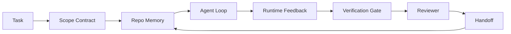

# Agent 工作台工程：为什么强大模型仍然失败

> 强大的模型还不够。可靠的 agent 需要一个工作台：指令、状态、范围、反馈、验证、审查和交接。去掉这些，即使是前沿模型产出的工作也不安全，无法交付。

**类型:** Learn + Build
**语言:** Python (stdlib)
**前置知识:** Phase 14 · 01 (Agent 循环), Phase 14 · 26 (故障模式)
**时间:** ~45 分钟

## 学习目标

- 区分模型能力与执行可靠性。
- 说出决定 agent 能否交付的七个工作台表面。
- 在小型仓库任务上比较纯提示词运行与工作台引导运行。
- 生成一份故障模式报告，将每个缺失的表面映射到它引发的症状。

## 问题

你把一个前沿模型丢进一个真实的代码仓库，让它添加输入验证。它打开了四个文件，写了看起来合理的代码，宣布成功，然后停止了。你运行测试。两个失败了。还有一个与验证无关的文件被修改了。没有记录 agent 假设了什么、它先尝试了什么、或者还有什么没做。

模型没有搞错 Python。它搞错了工作本身。它不知道什么算完成、它被允许在哪里写代码、哪些测试是权威的、或者下一个会话应该如何接续。

这不是模型 bug。这是工作台 bug。agent 周围缺少了那些将一次性生成转化为可靠、可恢复的工程工作的表面。

## 概念

工作台是任务期间包裹模型的运行环境。它有七个表面：

| 表面 | 承载内容 | 缺失时的故障 |
|---------|-----------------|----------------------|
| 指令 | 启动规则、禁止操作、完成定义 | Agent 猜测交付的含义 |
| 状态 | 当前任务、已触及文件、阻塞项、下一步操作 | 每个会话从零开始 |
| 范围 | 允许的文件、禁止的文件、验收标准 | 编辑泄漏到无关代码中 |
| 反馈 | 捕获到循环中的真实命令输出 | Agent 在 400 错误上宣布成功 |
| 验证 | 测试、lint、冒烟测试、范围检查 | "看起来没问题" 进入主分支 |
| 审查 | 以不同角色进行的第二遍检查 | 构建者给自己的作业打分 |
| 交接 | 什么变了、为什么、还剩下什么 | 下一个会话重新发现一切 |

工作台独立于模型。你可以更换模型并保留这些表面。你不能更换这些表面并保留可靠性。



循环在状态文件上闭合，而不是在聊天历史中。聊天是易失的。仓库才是记录系统。

### 工作台与提示词工程

提示词告诉模型这一轮你想要什么。工作台告诉模型如何跨轮次和跨会话进行工作。大多数 agent 失败故事都是穿着提示词工程外衣的工作台失败。

### 工作台与框架

框架给你一个运行时（LangGraph、AutoGen、Agents SDK）。工作台给 agent 一个在该运行时内工作的场所。两者都需要。这个迷你系列关注的是后者。

### 从原语推理，而非从供应商分类法出发

现在关于"工具链工程"的文章很多。Addy Osmani、OpenAI、Anthropic、LangChain、Martin Fowler、MongoDB、HumanLayer、Augment Code、Thoughtworks、walkinglabs 的 awesome 列表，以及 Medium 和 Hacker News 上持续不断的文章都在讨论它。他们对工具链的边界、范围以及使用什么词汇存在分歧。我们不需要选边站。七个表面是一个 UX 层；每个工作台下面都是同一组支撑任何可靠后端的分布式系统原语。

暂时去掉 agent 这个标签。一次 agent 运行是跨越时间、进程和机器的计算。要使其可靠，你需要任何生产系统都需要的相同原语。

| 原语 | 是什么 | 为 agent 承载什么 |
|-----------|------------|------------------------------|
| 函数 | 类型化处理器。尽可能纯。拥有自己的输入和输出。 | 工具调用、规则检查、验证步骤、模型调用 |
| 工作者 | 拥有一个或多个函数及生命周期管理的长进程 | 构建者、审查者、验证者、MCP 服务器 |
| 触发器 | 调用函数的事件源 | Agent 循环节拍、HTTP 请求、队列消息、cron、文件变更、钩子 |
| 运行时 | 决定什么在哪里运行、使用什么超时和资源的边界 | Claude Code 的进程、LangGraph 的运行时、工作者容器 |
| HTTP / RPC | 调用者和工作者之间的线路 | 工具调用协议、MCP 请求、模型 API |
| 队列 | 触发器和工作者之间的持久缓冲区；背压、重试、幂等性 | 任务板、反馈日志、审查收件箱 |
| 会话持久化 | 在崩溃、重启、模型更换后仍然存在的状态 | `agent_state.json`、检查点、KV 存储、仓库本身 |
| 授权策略 | 谁可以用什么范围调用什么函数 | 允许/禁止的文件、审批边界、MCP 能力列表 |

现在将七个工作台表面映射到这些原语上。

- **指令** — 策略 + 函数元数据。规则就是检查（函数）。路由器（`AGENTS.md`）是附加到运行时启动的策略。
- **状态** — 会话持久化。运行时每一步都读取的键值存储。文件、KV 或 DB；持久化语义重要，存储后端不重要。
- **范围** — 每个任务的授权策略。允许/禁止的 glob 模式是 ACL。需要审批是权限格。
- **反馈** — 写入队列的调用日志。每个 shell 调用都是一条记录，持久、可重放。
- **验证** — 一个函数。对输入是确定性的。在任务关闭时触发。失败时关闭。
- **审查** — 一个独立的工作者，对构建者工件具有只读授权，对审查报告具有只写授权。
- **交接** — 由会话结束触发器发出的持久记录。下一个会话的启动触发器读取它。

Agent 循环本身是一个工作者，它消费事件（用户消息、工具结果、定时器节拍），调用函数（模型，然后是模型选择的工具），写入记录（状态、反馈），并发出触发器（验证、审查、交接）。没什么神秘的；和任务处理器的形状一样。

### 流通中的模式，翻译成原语

每个流行的工具链模式都可以归结为八个原语。翻译表。

| 供应商或社区模式 | 实际是什么 |
|------------------------------|--------------------|
| Ralph 循环（Claude Code、Codex、agentic_harness 书）—— 当 agent 试图提前停止时，将原始意图重新注入新的上下文窗口 | 一个用干净上下文重新入队任务的触发器；会话持久化承载目标前进 |
| 计划 / 执行 / 验证（PEV） | 三个工作者，每个角色一个，通过状态和阶段间的队列通信 |
| 工具链-计算分离（OpenAI Agents SDK，2026 年 4 月）—— 将控制平面与执行平面分离 | 重申控制平面 / 数据平面。比 agent 标签早了几十年 |
| 开放 Agent 通行证（OAP，2026 年 3 月）—— 在执行前对每个工具调用进行签名和审计，对照声明性策略 | 由前置动作工作者执行的授权策略，带有签名审计队列 |
| 指南和传感器（Birgitta Böckeler / Thoughtworks）—— 前馈规则 + 反馈可观测性 | 授权策略 + 验证函数 + 可观测性追踪 |
| 渐进式压缩，5 阶段（Claude Code 逆向工程，2026 年 4 月） | 一个状态管理工作者，像 cron 一样在会话持久化上运行，以将其保持在预算内 |
| 钩子 / 中间件（LangChain、Claude Code）—— 拦截模型和工具调用 | 包裹在运行时调用路径周围的触发器 + 函数 |
| 作为 Markdown 的技能，渐进式披露（Anthropic、Flue） | 一个函数注册表，函数元数据在需要时加载到上下文中 |
| 沙箱 agent（Codex、Sandcastle、Vercel Sandbox） | 计算平面：具有隔离文件系统、网络和生命周期的运行时 |
| MCP 服务器 | 通过稳定 RPC 暴露函数的工作者，带有作为授权的能力列表 |

该表中的每一项都是 agent 社区到达一个在分布式系统中已有名称的原语，并给它起了一个新名字。对营销有用的标签；对工程词汇没有用。

### 数据实际上说了什么

工具链优于模型的主张现在有数据支持。值得了解，因为它们也是反对"等一个更聪明的模型"的唯一诚实论据。

- Terminal Bench 2.0 —— 相同的模型，工具链的改变将一个编码 agent 从 30 名之外提升到第 5 名（LangChain，《Agent 工具链解剖》）。
- Vercel —— 删除了 80% 的 agent 工具；成功率从 80% 跃升至 100%（MongoDB）。
- Harvey —— 仅通过工具链优化，法律 agent 的准确率翻了一倍以上（MongoDB）。
- 88% 的企业 AI agent 项目未能进入生产。失败集中在运行时，而非推理（preprints.org，《语言 Agent 的工具链工程》，2026 年 3 月）。
- 2025 年一项跨三个流行开源框架的基准研究报告了约 50% 的任务完成率；长上下文 WebAgent 从 40-50% 下降到 10% 以下，主要原因是无限循环和目标丢失（2026 年初的报道广泛覆盖）。

结论不是"工具链永远赢"。模型确实会随着时间的推移吸收工具链的技巧。结论是，今天，承载工程重量的部分在模型周围，而不是模型内部，而承载这些重量的原语正是每个生产系统一直需要的那些。

### 供应商文章止步的地方

这是你不需要客气对待的部分。

- LangChain 的《Agent 工具链解剖》列举了十一个组件 —— 提示词、工具、钩子、沙箱、编排、记忆、技能、子 agent 和运行时"哑循环"。它没有命名队列、作为部署单元的工作者、触发器语义、作为独立关注点的会话持久化或授权策略。它将工具链视为一个你配置的对象，而不是一个你部署的系统。
- Addy Osmani 的《Agent 工具链工程》确立了 `Agent = Model + Harness` 的框架和棘轮模式，但没有说明工具链是由什么构建的。它读起来像一种立场，而不是一份规范。
- Anthropic 和 OpenAI 在表面上走得最深，但停留在他们自己的运行时内。2026 年 4 月 Agents SDK 中的"工具链-计算分离"公告是第一个明确支持控制平面 / 数据平面分离的供应商文章。这是一个原语思想，不是一个新的。
- agentic_harness 书将工具链视为一个配置对象（Jaymin West 的《Agentic Engineering》第 6 章），其中最有力的一句话是"工具链是 agent 系统中的主要安全边界"。那只是授权策略，换了个说法。
- Hacker News 的讨论不断得出相同的结论。2026 年 4 月的帖子《agent 工具链属于沙箱之外》认为工具链应该"更像一个位于一切之外、根据上下文和用户授权访问的虚拟机监控器"。这又是作为独立平面的授权策略。

你不需要不同意这些文章中的任何一篇来注意到这个差距。他们在为一个已经存在的系统写 UX 描述。我们在写这个系统。当系统构建正确时，七个表面会从原语中自然产生。当构建错误时，再多的 `AGENTS.md` 打磨也修复不了缺失的队列。

所以当你在其他地方听到"工具链工程"时，翻译回原语。提示词和规则是策略和函数。脚手架是运行时。护栏是授权 + 验证。钩子是触发器。记忆是会话持久化。Ralph 循环是重新入队。子 agent 是工作者。沙箱是计算平面。词汇变了；工程没变。工作台是面向 agent 的 UX；工具链，在能经受住下一次供应商重构的意义上，是正确连接在一起的函数、工作者、触发器、运行时、队列、持久化和策略。

## 构建它

`code/main.py` 在一个小型仓库任务上运行两次。第一次只有提示词，第二次连接了七个表面。相同的模型，相同的任务。脚本统计失败运行中缺失了哪些表面，并打印一份故障模式报告。

仓库任务故意很小：给一个单文件的 FastAPI 风格处理器添加输入验证，并编写一个通过的测试。

运行它：

```
python3 code/main.py
```

输出：两次运行的并排日志，一个总结纯提示词运行的 `failure_modes.json`，以及工作台运行的一行结论。

agent 是一个基于规则的小型桩；重点是表面，而不是模型。在这个迷你系列的其余部分，你将把每个表面重建为真实的、可重用的工件。

## 使用它

工作台表面已经在现实世界中存在的三个地方，即使没有人这样称呼它们：

- **Claude Code、Codex、Cursor。** `AGENTS.md` 和 `CLAUDE.md` 是指令表面。斜杠命令是范围。钩子是验证。
- **LangGraph、OpenAI Agents SDK。** 检查点和会话存储是状态表面。交接是交接表面。
- **真实仓库上的 CI。** 测试、lint 和类型检查是验证。PR 模板是交接。CODEOWNERS 是审查。

工作台工程是使这些表面显式和可重用的学科，而不是让每个团队重新发现它们。

## 交付它

`outputs/skill-workbench-audit.md` 是一个可移植的技能，用于审计现有仓库的七个工作台表面，并报告哪些缺失、哪些部分存在、哪些健康。把它放在任何 agent 设置旁边；它会告诉你先修复什么。

## 练习

1. 选择一个你已经运行 agent 的仓库。给七个表面打分，从 0（缺失）到 2（健康）。你最弱的表面是什么？
2. 扩展 `main.py`，使纯提示词运行也产生一个虚假的"成功"声明。验证验证门本可以捕获它。
3. 为你自己的产品添加第八个表面。论证为什么它不能归入现有的七个之一。
4. 用一个幻觉额外文件写入的不同桩 agent 重新运行脚本。哪个表面首先捕获它？
5. 将 Phase 14 · 26 中五个行业反复出现的故障模式映射到七个表面上。每个表面设计用来吸收哪种模式？

## 关键术语

| 术语 | 人们说的 | 实际含义 |
|------|----------------|------------------------|
| Workbench | "设置" | 围绕模型的工程化表面，使工作可靠 |
| Surface | "一个文档"或"一个脚本" | 一个命名的、机器可读的输入，agent 每轮读取或写入 |
| System of record | "笔记" | 当聊天历史消失时，agent 视为真相的文件 |
| Definition of done | "验收" | 一个客观的、基于文件的检查清单，agent 无法伪造 |
| Workbench audit | "仓库就绪检查" | 对七个表面的检查，在工作开始前标记缺失的部分 |

## 延伸阅读

将这些视为数据点，而不是权威。每一个都是部分分类法。在决定是否采用之前，将每个概念翻译回原语（函数、工作者、触发器、运行时、HTTP/RPC、队列、持久化、策略）。

供应商框架：

- [Addy Osmani, Agent Harness Engineering](https://addyosmani.com/blog/agent-harness-engineering/) —— `Agent = Model + Harness` 和棘轮模式；基础设施方面较薄弱
- [LangChain, The Anatomy of an Agent Harness](https://blog.langchain.com/the-anatomy-of-an-agent-harness/) —— 十一个组件：提示词、工具、钩子、编排、沙箱、记忆、技能、子 agent、运行时；省略了队列、部署、授权
- [OpenAI, Harness engineering: leveraging Codex in an agent-first world](https://openai.com/index/harness-engineering/) —— Codex 团队对其运行时周围表面的看法
- [OpenAI, Unrolling the Codex agent loop](https://openai.com/index/unrolling-the-codex-agent-loop/) —— agent 循环简化为对函数调用的 `while`
- [Anthropic, Effective harnesses for long-running agents](https://www.anthropic.com/engineering/effective-harnesses-for-long-running-agents) —— 特定运行时内的长周期表面
- [Anthropic, Harness design for long-running application development](https://www.anthropic.com/engineering/harness-design-long-running-apps) —— 应用设计笔记
- [LangChain Deep Agents harness capabilities](https://docs.langchain.com/oss/python/deepagents/harness) —— 运行时配置表面

具有可用细节的实践者文章：

- [Martin Fowler / Birgitta Böckeler, Harness engineering for coding agent users](https://martinfowler.com/articles/harness-engineering.html) —— 指南（前馈）+ 传感器（反馈）；最清晰的控制理论框架
- [HumanLayer, Skill Issue: Harness Engineering for Coding Agents](https://www.humanlayer.dev/blog/skill-issue-harness-engineering-for-coding-agents) —— "不是模型问题，是配置问题"
- [MongoDB, The Agent Harness: Why the LLM Is the Smallest Part of Your Agent System](https://www.mongodb.com/company/blog/technical/agent-harness-why-llm-is-smallest-part-of-your-agent-system) —— 数据：Vercel 80% 到 100%，Harvey 2 倍准确率，Terminal Bench 前 30 到前 5
- [Augment Code, Harness Engineering for AI Coding Agents](https://www.augmentcode.com/guides/harness-engineering-ai-coding-agents) —— 约束优先的演练
- [Sequoia podcast, Harrison Chase on Context Engineering Long-Horizon Agents](https://sequoiacap.com/podcast/context-engineering-our-way-to-long-horizon-agents-langchains-harrison-chase/) —— 运行时关注点优先于模型关注点

书籍、论文和参考实现：

- [Jaymin West, Agentic Engineering — Chapter 6: Harnesses](https://www.jayminwest.com/agentic-engineering-book/6-harnesses) —— 书籍长度的论述，将工具链视为主要安全边界
- [preprints.org, Harness Engineering for Language Agents (March 2026)](https://www.preprints.org/manuscript/202603.1756) —— 作为控制 / 代理 / 运行的学术框架
- [walkinglabs/awesome-harness-engineering](https://github.com/walkinglabs/awesome-harness-engineering) —— 涵盖上下文、评估、可观测性、编排的精选阅读列表
- [ai-boost/awesome-harness-engineering](https://github.com/ai-boost/awesome-harness-engineering) —— 备选精选列表（工具、评估、记忆、MCP、权限）
- [andrewgarst/agentic_harness](https://github.com/andrewgarst/agentic_harness) —— 生产就绪的参考实现，带有 Redis 支持的记忆和评估套件
- [HKUDS/OpenHarness](https://github.com/HKUDS/OpenHarness) —— 开放 agent 工具链，内置个人 agent

值得阅读的 Hacker News 讨论（为了分歧，而非共识）：

- [HN: Effective harnesses for long-running agents](https://news.ycombinator.com/item?id=46081704)
- [HN: Improving 15 LLMs at Coding in One Afternoon. Only the Harness Changed](https://news.ycombinator.com/item?id=46988596)
- [HN: The agent harness belongs outside the sandbox](https://news.ycombinator.com/item?id=47990675) —— 主张授权作为独立平面

本课程内的交叉引用：

- Phase 14 · 23 —— OpenTelemetry GenAI 约定：传感器文献所指的可观测性层
- Phase 14 · 26 —— 七个表面设计用来吸收的故障模式目录
- Phase 14 · 27 —— 位于授权策略原语的提示注入防御
- Phase 14 · 29 —— 生产运行时（队列、事件、cron）：本课程中的原语在部署中的位置