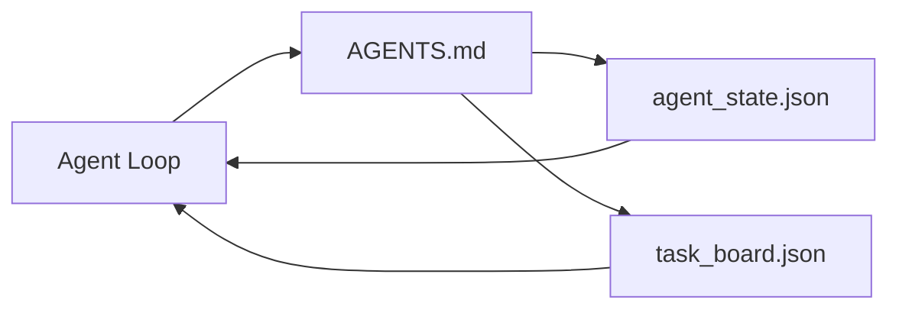

# 最小 Agent 工作台

> 最小可用的工作台是三个文件：一个根指令路由器、一个状态文件和一个任务板。其他一切都是在此基础上叠加的。如果一个仓库不能承载这三个文件，任何模型都救不了它。

**类型:** Build
**语言:** Python (stdlib)
**前置知识:** Phase 14 · 31 (为什么强大模型仍然失败)
**时间:** ~45 分钟

## 学习目标

- 定义构成最小可行工作台的三个文件。
- 解释为什么一个简短的根路由器胜过一份冗长的单体 `AGENTS.md`。
- 构建一个 agent 可以在每轮读取并在结束时写入的状态文件。
- 构建一个在没有聊天历史的情况下也能跨会话工作的任务板。

## 问题

大多数团队构建工作台的方式是写一份 3000 行的 `AGENTS.md` 然后宣布完成。模型加载它，忽略它无法总结的部分，然后仍然在它一直失败的那些表面上失败。

你需要相反的做法。一个很小的根文件，只在相关时将 agent 路由到更深层的文件。持久的状态，agent 在行动前读取、在行动后写入。一个任务板，说明什么在进行中、什么被阻塞、什么接下来要做。

三个文件。每个都有自己的工作。每个都足够机器可读，以后可以演变成真正的系统。

## 概念



### AGENTS.md 是路由器，不是手册

一份好的 `AGENTS.md` 很简短。它将 agent 指向：

- 状态文件（你在哪里）。
- 任务板（还剩下什么）。
- 更深层的规则（在 `docs/agent-rules.md` 下）。
- 验证命令（如何知道它工作正常）。

任何更长的内容都放在更深层的文档中，只在需要时加载。长手册被忽略。短路由器被遵循。

### agent_state.json 是记录系统

状态承载：活跃的任务 ID、已触及的文件、所做的假设、阻塞项和下一步操作。Agent 在每轮读取它。下一个会话读取它，而不是重放聊天。

状态存在于文件中，因为聊天历史不可靠。会话会消亡。对话会被截断。文件不会。

### task_board.json 是队列

任务板承载每个任务及其状态 `todo | in_progress | done | blocked`。它是当状态为空时 agent 从中拉取任务的队列，也是当你想知道 agent 是否在正轨上时你读取的队列。

板上的任务有一个 ID、一个目标、一个所有者（`builder`、`reviewer` 或 `human`）和验收标准。板故意很小：当它超过一屏时，你有一个规划问题，而不是板的问题。

### 三个文件是地板，不是天花板

后续的课程会添加范围合约、反馈运行器、验证门、审查者检查清单和交接包。这里的三个文件是它们都依赖的基础。

## 构建它

`code/main.py` 将最小工作台写入一个空仓库，并演示一个 agent 轮次：

1. 读取 `agent_state.json`。
2. 如果状态为空，从 `task_board.json` 拉取下一个任务。
3. 在范围内触及一个文件。
4. 写回更新后的状态。

运行它：

```
python3 code/main.py
```

脚本会在自身旁边创建 `workdir/`，放下三个文件，运行一轮，并打印差异。重新运行它，看看第二轮如何从第一轮结束的地方继续。

## 使用它

在生产 agent 产品中，同样的三个文件以不同的名称出现：

- **Claude Code：** `AGENTS.md` 或 `CLAUDE.md` 作为路由器，`.claude/state.json` 风格存储作为状态，钩子作为板。
- **Codex / Cursor：** 工作区规则作为路由器，会话记忆作为状态，聊天侧边栏中的排队任务作为板。
- **自定义 Python agent：** 你刚刚写的同样的文件。

名称变了。形状没变。

## 现实中的生产模式

当三个模式叠加在最小工作台上时，它能在真实的单体仓库中存活。它们是独立的；选择你的仓库实际需要的那些。

**嵌套的 `AGENTS.md` 与最近优先规则。** OpenAI 在其主仓库中发布了 88 个 `AGENTS.md` 文件，每个子组件一个。Codex、Cursor、Claude Code 和 Copilot 都从工作文件向仓库根目录遍历，并连接沿途找到的每个 `AGENTS.md`。子目录文件扩展根文件。Codex 添加了 `AGENTS.override.md` 来替换而不是扩展；覆盖机制是 Codex 特有的，跨工具工作时避免使用。Augment Code 的测量是关键数据：最好的 `AGENTS.md` 文件带来的质量提升相当于从 Haiku 升级到 Opus；最差的文件使输出比完全没有文件更差。

**即使看起来像覆盖也要拒绝的反模式。** 冲突的指令会静默地将 agent 从交互模式降级为贪婪模式（ICLR 2026 AMBIG-SWE：48.8% → 28% 解决率）；使用数字优先级而不是平铺堆叠。不可验证的风格规则（"遵循 Google Python 风格指南"）没有强制执行命令，让 agent 自行编造合规；每个风格规则都要配上确切的 lint 命令。以风格而不是命令开头会埋没验证路径；命令优先，风格最后。为人而不是为 agent 写作浪费上下文预算；简洁是一种特性。

**跨工具符号链接。** 一个单一的根文件配合符号链接（`ln -s AGENTS.md CLAUDE.md`、`ln -s AGENTS.md .github/copilot-instructions.md`、`ln -s AGENTS.md .cursorrules`）让每个编码 agent 保持在同一真相源上。Nx 的 `nx ai-setup` 从单一配置自动完成跨 Claude Code、Cursor、Copilot、Gemini、Codex 和 OpenCode 的此操作。

## 交付它

`outputs/skill-minimal-workbench.md` 为任何新仓库生成三个文件的工作台：一个针对项目调整的 `AGENTS.md` 路由器、一个带有正确键的 `agent_state.json`，以及一个用当前积压任务填充的 `task_board.json`。

## 练习

1. 向 `agent_state.json` 添加一个 `last_run` 时间戳。如果文件超过 24 小时，除非操作员确认，否则拒绝运行。
2. 向任务板添加一个 `priority` 字段，并修改拉取器，使其始终选择最高优先级的 `todo`。
3. 将 `task_board.json` 迁移为 JSON Lines 格式，使每个任务占一行，并且在版本控制中差异清晰。
4. 编写一个 `lint_workbench.py`，如果 `AGENTS.md` 超过 80 行或引用了不存在的文件，则失败。
5. 决定三个文件中哪一个丢失的代价最大。为你的选择辩护。

## 关键术语

| 术语 | 人们说的 | 实际含义 |
|------|----------------|------------------------|
| Router | `AGENTS.md` | 将 agent 指向更深层文档和文件的简短根文件 |
| State file | "笔记" | 机器可读的记录，记录 agent 在哪里，每轮写入 |
| Task board | "积压工作" | 带有状态、所有者、验收标准的 JSON 工作队列 |
| System of record | "真相源" | 当聊天消失时，工作台视为权威的文件 |

## 延伸阅读

- [agents.md — the open spec](https://agents.md/) —— 被 Cursor、Codex、Claude Code、Copilot、Gemini、OpenCode 采用
- [Augment Code, A good AGENTS.md is a model upgrade. A bad one is worse than no docs at all](https://www.augmentcode.com/blog/how-to-write-good-agents-dot-md-files) —— 测量的质量提升
- [Blake Crosley, AGENTS.md Patterns: What Actually Changes Agent Behavior](https://blakecrosley.com/blog/agents-md-patterns) —— 经验上有效和无效的做法
- [Datadog Frontend, Steering AI Agents in Monorepos with AGENTS.md](https://dev.to/datadog-frontend-dev/steering-ai-agents-in-monorepos-with-agentsmd-13g0) —— 嵌套优先级实践
- [Nx Blog, Teach Your AI Agent How to Work in a Monorepo](https://nx.dev/blog/nx-ai-agent-skills) —— 跨六个工具的单一源生成
- [The Prompt Shelf, AGENTS.md Best Practices: Structure, Scope, and Real Examples](https://thepromptshelf.dev/blog/agents-md-best-practices/) —— 能经受审查的章节排序
- [Anthropic, Claude Code subagents and session store](https://docs.anthropic.com/en/docs/agents-and-tools/claude-code/sub-agents)
- Phase 14 · 31 —— 这个最小工作台吸收的故障模式
- Phase 14 · 34 —— 本课预览的持久状态模式