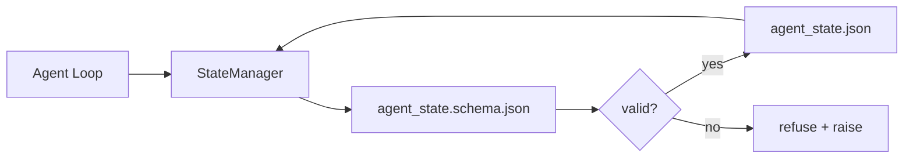

# 仓库记忆与持久状态（Repo Memory and Durable State）

> 聊天历史是易失的。仓库是持久的。工作台将智能体状态存储在版本化文件中，这样下一个会话、下一个智能体和下一个审查者都能从同一个事实来源读取数据。

**Type:** Build
**Languages:** Python (stdlib + `jsonschema` 可选)
**Prerequisites:** Phase 14 · 32 (Minimal Workbench)
**Time:** ~60 分钟

## 学习目标

- 定义什么属于仓库记忆，什么属于聊天历史。
- 为 `agent_state.json` 和 `task_board.json` 编写 JSON Schema。
- 构建一个状态管理器，能够原子性地加载、验证、变更和持久化状态。
- 使用 schema 在错误写入损坏工作台之前拒绝它们。

## 问题

智能体完成了一个会话。聊天关闭。下一个会话打开后询问从哪里开始。模型说"让我检查一下文件"，读取了过时的笔记，然后重新做了已经完成的工作。或者更糟的是，它重写了一个已经完成的文件，因为没有人告诉它这个文件已经完成了。

工作台的解决方案是仓库记忆：状态存储在仓库中的 JSON 文件里，在 schema 约束下写入，原子性地持久化，在代码审查中对 diff 友好。聊天是瞬时的数据流；仓库是记录系统。

## 概念



### 什么属于仓库记忆

| 属于 | 不属于 |
|---------|-----------------|
| 当前任务 ID | 原始聊天记录 |
| 本会话触及的文件 | 词元级别的推理轨迹 |
| 智能体所做的假设 | "用户似乎很沮丧" |
| 未解决的阻塞项 | 采样补全结果 |
| 下一步行动 | 供应商特定的模型 ID |

判断标准是持久性：三个月后在 CI 重跑中这个信息还有用吗？如果有用，放仓库。如果没有，放遥测。

### Schema 优先的状态管理

JSON Schema 就是契约。没有它，每个智能体都会发明新字段，每个审查者都要学习新的数据结构，每个 CI 脚本都要特殊处理过去的版本。有了它，错误的写入会被拒绝。

Schema 涵盖：

- 必需的键。
- 允许的 `status` 值。
- 禁止的值（例如数组不能为 `null`）。
- 模式约束（任务 ID 必须匹配 `T-\d{3,}`）。
- 用于迁移的版本字段。

### 原子写入

状态写入需要能够在部分失败时幸存：写入临时文件，fsync，重命名覆盖目标文件。状态文件是事实来源；一个只写了一半的文件比没有文件更糟糕。

### 迁移

当 schema 发生变化时，在 schema 版本升级的同时提供一个迁移脚本。状态文件携带一个 `schema_version` 字段；管理器拒绝加载来自它无法迁移的版本的文件。

## 构建它

`code/main.py` 实现：

- `agent_state.schema.json` 和 `task_board.schema.json`。
- 一个仅使用 stdlib 的验证器（JSON Schema 的子集：required、type、enum、pattern、items）。
- `StateManager.load`、`StateManager.update`、`StateManager.commit`，使用原子性的临时文件加重命名写入。
- 一个演示程序，变更状态、持久化、重新加载，并证明往返一致性。

运行：

```
python3 code/main.py
```

脚本会写入 `workdir/agent_state.json` 和 `workdir/task_board.json`，在两轮交互中变更它们，并在每一步打印验证后的状态。

## 生产环境中的模式

四种模式将本课的最小实现转化为多智能体单体仓库可以信赖的系统。

**原子性的临时文件加重命名不是可选项。** 2026 年 3 月的一个 Hive 项目 bug 报告清楚地记录了失败模式：`state.json` 通过 `write_text()` 写入，异常被捕获并静默处理。部分写入导致会话在损坏的状态上恢复，没有任何信号。修复方案始终是：在与目标相同的目录中使用 `tempfile.mkstemp`，写入，`fsync`，`os.replace`（在 POSIX 和 Windows 上的原子重命名）。本课的 `atomic_write` 正是这样做的。

**每个非幂等工具调用都需要幂等键。** 如果智能体在调用工具之后、检查点记录结果之前崩溃，恢复时会重试该工具调用。对于读取操作是安全的；对于邮件、数据库插入、文件上传则很危险。模式：在执行前将每个工具调用 ID 记录到 `pending_calls.jsonl` 中。重试时检查该 ID；如果存在，跳过调用并使用缓存的结果。Anthropic 和 LangChain 在 2026 年的指南中都指出了这一点；LangGraph 的检查点器也出于同样的原因持久化待处理的写入。

**将大型工件与状态分离。** 不要将 CSV、长记录或生成的文件存储在 `agent_state.json` 中。将工件保存为单独的文件（或上传到对象存储），在状态中只保留路径。检查点保持小巧和快速；工件独立增长。

**事件溯源用于审计，快照用于恢复。** 每次变更时追加到事件日志（`state.events.jsonl`）；定期快照到 `state.json`。恢复时读取快照，然后重放快照时间戳之后的任何事件。这会消耗更多磁盘空间，但可以逐字重放智能体的决策过程，这在调试长周期运行时至关重要。与 Postgres 内部用于 WAL 的模式相同。

**Schema 迁移，否则拒绝加载。** `schema_version` 整数就是契约。当管理器加载一个未知版本的文件时，它拒绝读取。在 schema 版本升级的同时提供一个迁移脚本；`tools/migrate_state.py` 在每次启动时幂等地运行。

## 使用它

在生产环境中：

- **LangGraph checkpointers。** 相同的思路，不同的存储。检查点器将图状态持久化到 SQLite、Postgres 或自定义后端。本课教授的 schema 正是当检查点器失效、需要手动读取状态时你会用到的东西。
- **Letta memory blocks。** 具有结构化 schema 的持久化块（Phase 14 · 08）。相同的规范，范围限定在长期运行的角色中。
- **OpenAI Agents SDK session store。** 可插拔后端，schema 感知。本课中的状态文件就是本地文件后端。

## 交付它

`outputs/skill-state-schema.md` 生成项目特定的 JSON Schema 对（state + board）、一个连接到原子写入的 Python `StateManager`，以及一个迁移脚手架，这样下一次 schema 升级就不会破坏工作台。

## 练习

1. 添加一个 `last_human_touch` 时间戳。拒绝在人工编辑后五秒内的任何智能体写入。
2. 扩展验证器以支持 `oneOf`，这样任务可以是构建任务或审查任务，各自具有不同的必填字段。
3. 添加一个 `schema_version` 字段，并编写从 v1 到 v2 的迁移（将 `blockers` 重命名为 `risks`）。
4. 将存储后端从本地文件迁移到 SQLite。保持 `StateManager` API 不变。
5. 让两个智能体以 50 毫秒的写入竞争访问同一个状态文件。会出现什么问题？原子重命名如何拯救你？

## 关键术语

| 术语 | 人们怎么说 | 实际含义 |
|------|----------------|------------------------|
| 仓库记忆（Repo memory） | "笔记文件" | 存储在仓库中受追踪文件里的状态，受 schema 约束 |
| Schema 优先（Schema-first） | "验证输入" | 在写入者之前定义契约，拒绝漂移 |
| 原子写入（Atomic write） | "就是重命名" | 写入临时文件，fsync，重命名，使部分失败不会导致损坏 |
| 迁移（Migration） | "Schema 升级" | 将 vN 状态转换为 v(N+1) 状态的脚本 |
| 记录系统（System of record） | "事实来源" | 工作台视为权威的工件 |

## 延伸阅读

- [JSON Schema specification](https://json-schema.org/specification.html)
- [LangGraph checkpointers](https://langchain-ai.github.io/langgraph/concepts/persistence/)
- [Letta memory blocks](https://docs.letta.com/concepts/memory)
- [Fast.io, AI Agent State Checkpointing: A Practical Guide](https://fast.io/resources/ai-agent-state-checkpointing/) — schema 优先的检查点记录与幂等性
- [Fast.io, AI Agent Workflow State Persistence: Best Practices 2026](https://fast.io/resources/ai-agent-workflow-state-persistence/) — 并发控制、TTL、事件溯源
- [Hive Issue #6263 — non-atomic state.json writes silently ignored](https://github.com/aden-hive/hive/issues/6263) — 真实项目中的失败模式
- [eunomia, Checkpoint/Restore Systems: Evolution, Techniques, Applications](https://eunomia.dev/blog/2025/05/11/checkpointrestore-systems-evolution-techniques-and-applications-in-ai-agents/) — 从操作系统历史中应用于智能体的检查点/恢复原语
- [Indium, 7 State Persistence Strategies for Long-Running AI Agents in 2026](https://www.indium.tech/blog/7-state-persistence-strategies-ai-agents-2026/)
- [Microsoft Agent Framework, Compaction](https://learn.microsoft.com/en-us/agent-framework/agents/conversations/compaction) — 供应商检查点管理器
- Phase 14 · 08 — 记忆块与休眠期计算
- Phase 14 · 32 — 本课进行 schema 化的三文件最小结构
- Phase 14 · 40 — 从同一 schema 读取的交接数据包