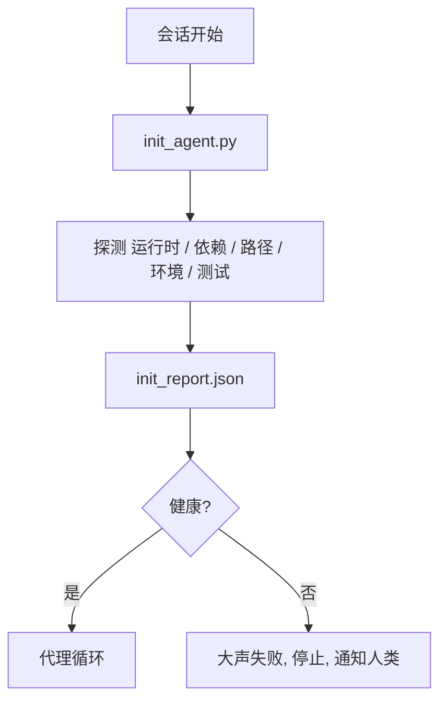

# 代理初始化脚本

> 每个冷启动的会话都要交一笔税。代理反复读取同样的文件，重试同样的探测，重新发现同样的路径。初始化脚本一次性支付这笔税，并把答案写入状态。

**类型:** 构建
**语言:** Python (标准库)
**前置知识:** 阶段 14 · 32 (最小工作台), 阶段 14 · 34 (仓库记忆)
**时间:** ~45 分钟

## 学习目标

- 识别代理在每个会话中不应重复做的工作。
- 构建一个确定性初始化脚本，探测运行时、依赖和仓库健康状况。
- 持久化探测结果，让代理直接读取而非重新运行检查。
- 当初始化失败时，做到大声失败、快速失败、只有一个地方需要查看。

## 问题

打开一个会话。代理猜测 Python 版本。猜测测试命令。五次列出仓库根目录来找入口点。尝试导入一个未安装的包。问用户配置文件在哪里。等到它真正做出一次编辑时，一万个 token 已经花在了本应是一个脚本就能完成的设置工作上。

解决方案是一个初始化脚本，在代理做任何其他事情之前运行，并写入一个 `init_report.json`，代理在启动时读取它。

## 概念



### 初始化脚本探测什么

| 探测项 | 为什么重要 |
|-------|------------|
| 运行时版本 | 错误的 Python 或 Node 版本意味着静默的版本错误 bug |
| 依赖可用性 | 稍后缺失一个包的成本是现在捕获它的十倍 |
| 测试命令 | 代理必须知道如何验证；如果命令缺失，工作台就是坏的 |
| 仓库路径 | 硬编码的路径会漂移；一次性解析并固定 |
| 环境变量 | 缺少 `OPENAI_API_KEY` 是一个故障面，而不是运行时谜团 |
| 状态 + 工作板新鲜度 | 崩溃会话的陈旧状态是一个隐患 |
| 上次已知良好提交 | 会话结束时交接 diff 的锚点 |

### 大声失败，快速失败，在一个地方失败

探测失败意味着停止并通知人类。不要"代理会自己搞定"。初始化的全部意义就是在工作台损坏时拒绝启动。

### 幂等性

连续运行两次。第二次运行除了刷新时间戳外应该什么都不做。幂等性让你可以把脚本接入 CI、钩子或前置任务斜杠命令。

### 初始化与启动规则

规则（阶段 14 · 33）描述必须满足什么条件才能行动。初始化是建立这些规则可被检查的脚本。没有初始化的规则变成"小心点"。没有规则的初始化变成精致的失败。

## 构建它

`code/main.py` 实现了 `init_agent.py`：

- 五个探测：Python 版本，通过 `importlib.util.find_spec` 列出依赖，测试命令可解析性，必需的环境变量，状态文件新鲜度。
- 每个探测返回 `(name, status, detail)`。
- 脚本写入 `init_report.json`，包含完整的探测集，如果有阻塞级别的探测失败则非零退出。

运行：

```
python3 code/main.py
```

脚本打印探测表格，写入 `init_report.json`，正常路径退出零，或非零退出并列出失败的探测。

## 生产环境中的模式

三个模式区分了有用的初始化脚本和形式主义。

**上次已知良好提交锚定。** 探测当前提交与上次成功合并时写入的 `LKG` 文件的差异。如果 diff 超过预算（默认 50 个文件），拒绝启动并要求人类确认新的基线。Cloudflare 的 AI 代码审查使用这个来限定审查代理的范围：每个审查会话都锚定在同一个上次已知良好提交上，从不跨会话累积漂移。

**带 TTL 的锁文件。** 在第一次成功探测后写入 `prereqs.lock`。后续运行信任该锁 N 小时（默认 24 小时）并跳过昂贵的探测。初始化脚本先读取锁；如果锁是新鲜的且依赖清单哈希匹配，则短路返回。这与 Docker 用于层缓存的模式相同：幂等探测 + 内容哈希 = 跳过。

**热路径中无网络、无 LLM、无意外。** 初始化探测是确定性的管道。一个调用 LLM 来分类失败或访问外部服务来检查许可证的探测不是探测，而是工作流。如果某个探测在干运行中耗时超过三秒，将其视为工作台异味，要么移出初始化，要么缓存其结果。

## 使用它

在生产中：

- **Claude Code 钩子。** `pre-task` 钩子调用初始化脚本，如果失败则拒绝启动代理。
- **GitHub Actions。** `setup-agent` 作业运行初始化脚本；代理作业依赖它。
- **Docker 入口点。** 代理容器在执行代理运行时之前运行初始化脚本；失败时日志可见。

初始化脚本是可移植的，因为它不调用任何特定框架。Bash、Make 或任务文件都可以包装它。

## 交付物

`outputs/skill-init-script.md` 访谈项目，将其设置工作分类为探测，并生成项目特定的 `init_agent.py` 以及在任何代理步骤之前运行它的 CI 工作流。

## 练习

1. 添加一个探测，比较当前提交与上次已知良好提交的差异，如果超过 50 个文件发生变化则拒绝启动。
2. 让脚本写入 `prereqs.lock` 文件，如果锁文件超过七天则拒绝启动。
3. 添加 `--fix` 标志，自动安装缺失的开发依赖，但未经批准不得修改运行时依赖。
4. 将探测从硬编码函数迁移到 YAML 注册表。论证这个权衡。
5. 为每个探测添加时间预算。运行超过三秒的探测是工作台异味。

## 关键术语

| 术语 | 人们说的 | 实际含义 |
|------|---------|---------|
| Probe | "一项检查" | 返回 `(name, status, detail)` 的确定性函数 |
| Init report | "设置输出" | 与状态文件相邻写入的 JSON，包含探测结果 |
| Idempotent | "可安全重跑" | 连续运行两次产生相同的报告（时间戳除外） |
| Fail loud | "不要吞掉" | 停止并通知人类；没有静默回退 |
| Setup tax | "启动成本" | 代理每个会话花费在重新发现显而易见之事上的 token |

## 延伸阅读

- [Anthropic, Effective harnesses for long-running agents](https://www.anthropic.com/engineering/effective-harnesses-for-long-running-agents)
- [GitHub Actions, composite actions for setup](https://docs.github.com/en/actions/sharing-automations/creating-actions/creating-a-composite-action)
- [microservices.io, GenAI dev platform: guardrails](https://microservices.io/post/architecture/2026/03/09/genai-development-platform-part-1-development-guardrails.html) — 作为初始化的 pre-commit + CI 检查
- [Augment Code, How to Build Your AGENTS.md (2026)](https://www.augmentcode.com/guides/how-to-build-agents-md) — 初始化期望
- [Codex Blog, Codex CLI Context Compaction](https://codex.danielvaughan.com/2026/03/31/codex-cli-context-compaction-architecture/) — 作为压缩感知初始化的会话启动
- 阶段 14 · 33 — 此脚本启用的规则集
- 阶段 14 · 34 — 此脚本播种的状态文件
- 阶段 14 · 38 — 初始化脚本提供输入的验证门
- 阶段 14 · 40 — 消费初始化报告中上次已知良好提交的交接