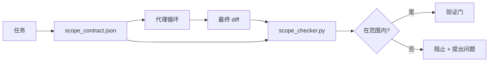

# 范围契约与任务边界

> 模型不知道工作在哪里结束。范围契约是一个按任务划分的文件，说明工作从哪里开始、在哪里结束，以及如果超出范围如何回滚。契约把"保持在范围内"从一个愿望变成一项检查。

**类型:** 构建
**语言:** Python (标准库)
**前置知识:** 阶段 14 · 32 (最小工作台), 阶段 14 · 33 (作为约束的规则)
**时间:** ~50 分钟

## 学习目标

- 编写一个范围契约，代理在任务开始时读取，验证器在任务结束时读取。
- 指定允许的文件、禁止的文件、验收标准、回滚计划和审批边界。
- 实现一个范围检查器，将 diff 与契约进行比较并标记违规。
- 让范围蔓延变得可见、自动化和可审查。

## 问题

代理会蔓延。任务是"修复登录 bug"。diff 触及了登录路由、邮件辅助函数、数据库驱动、README 和发布脚本。每一次触碰在当时都有合理的理由。但它们加在一起，与当初审查的那个变更已经不是同一个变更了。

范围蔓延是代理工作中最被低估的失败模式，因为代理会善意地叙述每一步。解决方案不是更严格的提示词。解决方案是磁盘上的一个契约，说明承诺了什么，以及一个检查，将结果与承诺进行比较。

## 概念



### 范围契约包含什么

| 字段 | 用途 |
|-------|--------|
| `task_id` | 链接到工作板上的任务 |
| `goal` | 验证者可以验证的一句话 |
| `allowed_files` | 代理可以写入的 glob 模式 |
| `forbidden_files` | 代理即使意外也不得触碰的 glob 模式 |
| `acceptance_criteria` | 证明完成的测试命令或断言行 |
| `rollback_plan` | 操作员在需要停止时可以执行的一段话 |
| `approvals_required` | 超出范围、需要明确人工签核的操作 |

没有 `forbidden_files` 的契约是不完整的。否定空间是契约的一半。

### 使用 glob，而不是原始路径

真实的仓库会移动文件。将契约固定到 glob 模式（`app/**/*.py`、`tests/test_signup*.py`），这样会话之间的重构不会使契约失效。

### 回滚是范围的一部分

列出如何回滚迫使契约作者思考可能出问题的地方。一个无法回滚的契约是不应该被批准的契约。

### 范围检查是 diff 检查

代理写入 diff。检查器读取 diff、允许的 glob、禁止的 glob 以及任何已运行的验收命令列表。每个违规都是一个带标签的发现，验证门可以拒绝它。

### 范围的两种高度：功能列表和任务契约

范围契约约束一个任务。它不约束项目。代理可以完美地遵守登录修复的契约，但在下一轮决定项目还需要一个设置页面、一个暗模式切换和路由器重写。契约从未被问及项目的哪些工作在范围内，只问任务的哪些文件在范围内。

第二个高度需要自己的原语：一个 `feature_list.json`，代理在会话开始时读取。它是项目待办列表的机器可读、有序文件。代理精确选择一个 `status` 为 `todo` 的功能，将其 `id` 写入活跃的范围契约，并被禁止在同一会话中启动第二个功能。"一次一个功能"不再是智能体可以合理化绕过的提示词中的一行，而是它从磁盘读取的值和门执行的检查。

```json
{
  "project": "knowledge-base",
  "active": "import-pdf",
  "features": [
    { "id": "import-pdf",   "status": "in_progress", "goal": "import a PDF into the library",        "done_when": "pytest tests/test_import.py && a sample PDF appears in the library view" },
    { "id": "full-text-search", "status": "todo",     "goal": "search document text and rank hits",   "done_when": "query returns ranked results with snippets" },
    { "id": "cite-answers", "status": "todo",         "goal": "answers carry source citations",        "done_when": "every answer renders at least one clickable citation" }
  ]
}
```

| 字段 | 用途 |
|------|------|
| `active` | 当前会话可以触碰的唯一功能；为空表示选择一个并设置它 |
| `features[].id` | 范围契约的 `task_id` 指向的稳定 slug |
| `features[].status` | `todo`、`in_progress`、`done`、`blocked`；同时只能有一个 `in_progress` |
| `features[].goal` | 验证者可以验证的一句话 |
| `features[].done_when` | 将 `in_progress` 翻转为 `done` 的验收行 |

两条规则使列表具有承重能力而非装饰性。首先，不变量"最多一个 `in_progress`"本身就是一个启动检查（Phase 14 · 33）：如果列表显示两个，会话拒绝启动，直到人类解决它。其次，功能列表是一个文件，而不是聊天消息，因为聊天会滚出上下文，而文件跨会话和跨智能体持久存在。交接（Phase 14 · 40）将完成功能的状态写回 `done`，以便下一个会话打开的是一个准确的看板，而不是重新推导还剩什么。

契约和列表通过最小权限组合，与下面描述的合并方式相同：任务契约的 `allowed_files` 必须位于活跃功能所触及的范围内，绝不能超出它。

## 构建它

`code/main.py` 实现：

- `scope_contract.json` 模式（JSON Schema 的子集，glob 数组）。
- 一个 diff 解析器，将触碰的文件列表加上运行的命令列表转换为 `RunSummary`。
- 一个 `scope_check`，返回 `(violations, in_scope, off_scope)` 与契约的对比。
- 两个演示运行：一个保持在范围内，一个蔓延。检查器用确切的文件和原因标记蔓延。

运行：

```
python3 code/main.py
```

输出：契约、两次运行、每次运行的判定结果，以及保存的 `scope_report.json`。

## 生产环境中的模式

一位实践者报告说，在调用代理之前使用"规格最大化"（YAML 格式的范围契约），兔子洞率在三个星期内从 52% 下降到 21%，没有改变代理。是契约起了作用，而不是模型。三个模式让这个收益持续。

**违规预算，而非二元失败。** `agent-guardrails`（Claude Code、Cursor、Windsurf、Codex 通过 MCP 使用的开源合并门）为每个任务提供 `violationBudget`：预算内的小范围越界作为警告呈现；只有当预算被超出时，合并门才拒绝。配合 `violationSeverity: "error" | "warning"`。预算是区分一个能真正上线的门和一个被团队讨厌而禁用的门的关键。

**按路径族划分的严重性不对称。** 对 `docs/**` 的越界写入通常是 `warn`；对 `scripts/**`、`migrations/**`、`config/prod/**` 的越界写入始终是 `block`。这种不对称必须存在于契约中，而不是运行时中，因为它是项目特定的且随任务变化。

**时间和网络预算与文件预算并列。** `time_budget_minutes` 字段限制挂钟时间；运行时在超过该时间后拒绝继续，除非重新批准。`network_egress` 允许列表（按主机名）防止代理悄悄访问不属于任务的外部 API。这些也是范围的维度；文件 glob 是必要的，但不是充分的。

**多契约合并语义（最小权限）。** 当两个范围契约同时适用时（例如，项目级契约加上任务特定契约），合并规则是：`allowed_files` 取**交集**（两个契约都必须允许该路径），`forbidden_files` 取**并集**（任一契约可以禁止），`time_budget_minutes` 取最严格的（最小值），`approvals_required` 累加。`network_egress` 为 `None` 表示不执行，`[]` 表示全部拒绝，`[...]` 作为允许列表；合并时，`None` 延用另一方，两个列表取交集，全部拒绝保持全部拒绝。在契约模式中说明这一点，使合并是机械化的且可审查的。

## 使用它

生产模式：

- **Claude Code 斜杠命令。** `/scope` 命令写入契约并将其固定为会话上下文。子代理在行动前读取契约。
- **GitHub PR。** 将契约作为 JSON 文件推送到 PR 正文或作为检入的工件。CI 针对合并 diff 运行范围检查器。
- **LangGraph 中断。** 范围违规触发中断；处理程序询问人类是需要扩展契约还是代理需要回退。

契约随任务一起移动。当任务关闭时，契约归档到 `outputs/scope/closed/` 下。

## 交付物

`outputs/skill-scope-contract.md` 为任务描述生成范围契约，以及一个在 CI 中针对每个代理 diff 运行的 glob 感知检查器。

## 练习

1. 添加 `network_egress` 字段，列出允许的外部主机。拒绝触碰其他主机的运行。
2. 扩展检查器，对 `docs/**` 软失败，对 `scripts/**` 硬失败。论证这种不对称。
3. 让契约使用静态规则集（无 LLM）从 `goal` 字段推导 `allowed_files`。第一个边界情况会出什么问题？
4. 添加 `time_budget_minutes`，一旦挂钟时间超过它则拒绝继续。
5. 对同一个 diff 运行两个契约。当两者都适用时，正确的合并语义是什么？

## 关键术语

| 术语 | 人们说的 | 实际含义 |
|------|---------|---------|
| Scope contract | "任务简报" | 按任务的 JSON，列出允许/禁止的文件、验收标准、回滚计划 |
| Scope creep | "它还碰了..." | 同一任务中更改了契约之外的文件 |
| Rollback plan | "我们可以回退" | 操作员用于停止的一段话 |
| Approval boundary | "需要签核" | 契约中列出的需要明确人工批准的操作 |
| Diff check | "路径审计" | 将触碰的文件与契约 glob 进行比较 |

## 延伸阅读

- [LangGraph human-in-the-loop interrupts](https://langchain-ai.github.io/langgraph/concepts/human_in_the_loop/)
- [OpenAI Agents SDK tool approval policies](https://platform.openai.com/docs/guides/agents-sdk)
- [logi-cmd/agent-guardrails — merge gates and scope validation](https://github.com/logi-cmd/agent-guardrails) — 违规预算、严重性等级
- [Dev|Journal, Preventing AI Agent Configuration Drift with Agent Contract Testing](https://earezki.com/ai-news/2026-05-05-i-built-a-tiny-ci-tool-to-keep-ai-agent-configs-from-drifting-in-my-repo/) — 无外部依赖的 `--strict` 模式
- [Agentic Coding Is Not a Trap (production logs)](https://dev.to/jtorchia/agentic-coding-is-not-a-trap-i-answered-the-viral-hn-post-with-my-own-production-logs-33d9) — 规格最大化实证：52% → 21%
- [OpenCode permission globs](https://opencode.ai/docs/agents/) — 细粒度的按权限范围控制
- [Knostic, AI Coding Agent Security: Threat Models and Protection Strategies](https://www.knostic.ai/blog/ai-coding-agent-security) — 作为最小权限一部分的范围控制
- [Augment Code, AI Spec Template](https://www.augmentcode.com/guides/ai-spec-template) — 三层边界系统（必须/询问/绝不）
- 阶段 14 · 27 — 与范围锁配合的提示注入防御
- 阶段 14 · 33 — 此契约为每个任务特化的规则集
- 阶段 14 · 38 — 检查器报告进入的验证门