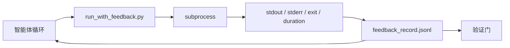

# 运行时反馈循环

> 看不到真实命令输出的智能体只能猜测。反馈运行器捕获 stdout、stderr、退出码和计时信息，形成结构化记录，供下一轮读取。然后智能体根据事实而非自己对事实的预测做出反应。

**类型：** Build
**语言：** Python（标准库）
**前置知识：** Phase 14 · 32（最小工作台），Phase 14 · 35（初始化脚本）
**时间：** ~50 分钟

## 学习目标

- 区分运行时反馈与可观测性遥测。
- 构建一个包装 shell 命令并持久化结构化记录的反馈运行器。
- 确定性截断大型输出，使循环保持在 token 预算内。
- 在缺少反馈时拒绝推进循环。

## 问题

智能体说"正在运行测试"。下一条消息说"所有测试通过"。现实是根本没有测试运行过。智能体想象了输出，或者它运行了命令但从未读取结果，或者它读取了结果但悄悄截断了失败行。

反馈运行器消除了这个差距。每个命令都通过运行器执行。每条记录都包含命令、捕获的 stdout 和 stderr、退出码、实际耗时时长以及一行智能体注释。智能体在下一轮读取记录。验证门在任务结束时读取记录。

## 概念



### 反馈记录包含哪些字段

| 字段 | 为何重要 |
|-------|----------------|
| `command` | 精确的 argv，无 shell 展开意外 |
| `stdout_tail` | 最后 N 行，确定性截断 |
| `stderr_tail` | 最后 N 行，与 stdout 分开 |
| `exit_code` | 明确无误的成功信号 |
| `duration_ms` | 暴露慢速探测和失控进程 |
| `started_at` | 用于回放的时间戳 |
| `agent_note` | 智能体编写的关于预期结果的一行说明 |

### 截断是确定性的

50 MB 的日志会摧毁循环。运行器使用 `...truncated N lines...` 标记确定性截断头部和尾部，这样相同的输出总是产生相同的记录。不采样；智能体需要看到的部分（最终错误、最终摘要）都在尾部。

### 反馈与遥测

遥测（Phase 14 · 23，OTel GenAI 约定）供人类操作员跨时间审查运行记录。反馈供本轮的下一次调用使用。它们共享字段但存在于不同的文件中，具有不同的保留策略。

### 无反馈则拒绝推进

如果运行器在捕获退出前出错，记录会携带 `exit_code: null` 和 `error: <原因>`。智能体循环必须在 `null` 退出时拒绝声称成功。没有退出码，就没有进展。

## 构建

`code/main.py` 实现：

- `run_with_feedback(command, agent_note)` 包装 `subprocess.run`，捕获 stdout/stderr/exit/duration，确定性截断，追加到 `feedback_record.jsonl`。
- 一个将 JSONL 流式加载到 Python 列表的小加载器。
- 一个运行三个命令（成功、失败、慢速）并打印每个命令最后一条记录的演示。

运行：

```
python3 code/main.py
```

输出：三条反馈记录追加到 `feedback_record.jsonl`，每个命令的最后一条内联打印。跨多次运行查看文件尾部，观察循环的累积效果。

## 生产环境中的模式

三种模式使运行器足够健壮以用于生产。

**在写入时而不是读取时进行编辑。**任何触及 stdout 或 stderr 的记录都可能泄露秘密。运行器在 JSONL 追加之前进行编辑处理：去除匹配 `^Bearer `、`password=`、`api[_-]?key=`、`AKIA[0-9A-Z]{16}`（AWS）、`xox[baprs]-`（Slack）的行。在读取时编辑是一个陷阱；磁盘上的文件才是攻击者能够触及的。每季度根据生产运行时的实际秘密格式审计编辑模式。

**轮换策略，而不是单个文件。**将 `feedback_record.jsonl` 限制为每个文件 1 MB；溢出时轮换为 `.1`、`.2`，丢弃 `.5`。智能体循环只读取当前文件，因此运行时成本是有界的。CI 工件存储获得完整的轮换集合。没有轮换，该文件会成为每次加载调用的瓶颈。

**用于重试链的父命令 ID。**每条记录都带有 `command_id`；重试时携带指向之前尝试的 `parent_command_id`。审查者的"失败尝试"列表（Phase 14 · 40）和验证门的审计都跟踪这个链。没有这个链接，重试看起来像独立的成功，审计会隐藏失败历史。

## 使用

生产模式：

- **Claude Code Bash 工具。**该工具已经捕获 stdout、stderr、exit 和 duration。本课的运行器是任何智能体产品的框架无关等效实现。
- **LangGraph 节点。**将任何 shell 节点包装在运行器中，使记录在图状态之外持久化。
- **CI 日志。**将 JSONL 导入 CI 工件存储；审查者可以重放任何命令而无需重新运行会话。

运行器是一个薄的包装器，可以适应任何框架迁移，因为它拥有记录的形状。

## 交付

`outputs/skill-feedback-runner.md` 生成一个特定于项目的 `run_with_feedback.py`，包含正确的截断预算、连接到工作台的 JSONL 写入器，以及智能体在每一轮读取的加载器。

## 练习

1. 为每条记录添加 `cwd` 字段，使从不同目录运行的相同命令可区分。
2. 添加一个 `redaction` 步骤，去除匹配 `^Bearer ` 或 `password=` 的行。在固定记录上进行测试。
3. 通过轮换到 `.1`、`.2` 文件，将总 `feedback_record.jsonl` 大小限制为 1 MB。论证轮换策略的合理性。
4. 添加 `parent_command_id`，使重试链可见：哪个命令产生了下一个命令消费的输入。
5. 将 JSONL 导入一个小型 TUI，突出显示最新的非零退出码。TUI 需要显示八个关键功能才能在审查中有用。

## 关键术语

| 术语 | 通俗说法 | 实际含义 |
|------|----------------|------------------------|
| 反馈记录 | "运行日志" | 包含命令、输出、退出码、时长的结构化 JSONL 条目 |
| 尾部截断 | "修剪日志" | 确定性头部+尾部捕获，使记录适合 token 预算 |
| 拒绝空值 | "缺少数据时阻塞" | 当 `exit_code` 为 null 时循环不得推进 |
| 智能体注释 | "预期标记" | 智能体在读取结果前编写的一行预测 |
| 遥测分离 | "两个日志文件" | 反馈供下一轮使用，遥测供操作员使用 |

## 延伸阅读

- [OpenTelemetry GenAI 语义约定](https://opentelemetry.io/docs/specs/semconv/gen-ai/)
- [Anthropic，长运行智能体的有效框架](https://www.anthropic.com/engineering/effective-harnesses-for-long-running-agents)
- [Guardrails AI x MLflow — 确定性安全、PII、质量验证器](https://guardrailsai.com/blog/guardrails-mlflow) — 作为回归测试的编辑模式
- [Aport.io，2026 年最佳 AI 智能体护栏：预操作授权对比](https://aport.io/blog/best-ai-agent-guardrails-2026-pre-action-authorization-compared/) — 前/后工具捕获
- [Andrii Furmanets，2026 年的 AI 智能体：工具、记忆、评估、护栏的实用架构](https://andriifurmanets.com/blogs/ai-agents-2026-practical-architecture-tools-memory-evals-guardrails) — 可观测性面
- Phase 14 · 23 — 遥测方面的 OTel GenAI 约定
- Phase 14 · 24 — 智能体可观测性平台（Langfuse、Phoenix、Opik）
- Phase 14 · 33 — 要求在声明完成前必须有反馈的规则
- Phase 14 · 38 — 读取 JSONL 的验证门
