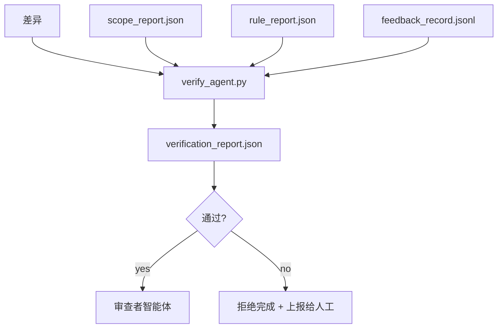

# 验证门

> 智能体不能给自己的作业打分。验证门读取范围合同、反馈日志、规则报告和差异，回答一个问题：这个任务真的完成了吗？如果验证门说不，任务就没有完成，不管聊天记录怎么说。

**类型：** Build
**语言：** Python（标准库）
**前置知识：** Phase 14 · 33（规则），Phase 14 · 36（范围），Phase 14 · 37（反馈）
**时间：** ~55 分钟

## 学习目标

- 将验证门定义为工作台工件上的确定性函数。
- 将规则报告、范围报告、反馈记录和差异合并为一个判定结果。
- 生成审查者智能体和 CI 都能读取的 `verification_report.json`。
- 在任何阻塞级失败时拒绝推进任务，无一例外。

## 问题

智能体太容易宣布成功。三种失败形态占主导：

- "看起来不错。"模型读取自己的差异并判定它是正确的。
- "测试通过了。"说得很有信心，但没有实际运行测试的记录。
- "满足了验收标准。"验收标准被宽松地解释为"任何看起来像完成的东西。"

工作台解决方案是单个验证门，它读取智能体已经产生的工件并做出判断。验证门是确定性的。验证门在版本控制中。验证门连接到 CI。智能体无法贿赂它。

## 概念



### 验证门检查什么

| 检查项 | 来源工件 | 严重级别 |
|-------|-----------------|----------|
| 所有验收命令都已运行 | `feedback_record.jsonl` | block |
| 所有验收命令都退出码为零 | `feedback_record.jsonl` | block |
| 范围检查没有禁止的写入 | `scope_report.json` | block |
| 范围检查没有超出范围的写入 | `scope_report.json` | block 或 warn |
| 所有阻塞级规则通过 | `rule_report.json` | block |
| 反馈中没有 `null` 退出码 | `feedback_record.jsonl` | block |
| 修改的文件匹配 `scope.allowed_files` | both | warn |

`warn` 发现会注释判定结果；`block` 发现会阻止 `passed: true`。

### 确定性的，而非概率性的

验证门必须对同一工件集每次产生相同的判定结果。没有 LLM 裁判。LLM 裁判属于审查者侧（Phase 14 · 39），其目标是定性评估而非状态判定。

### 一个报告，一条路径

验证门在每个任务关闭时生成一个 `verification_report.json`，写入 `outputs/verification/<task_id>.json`。CI 也消费同一路径。多个使用不同路径的验证门会分裂事实来源。

### 无一例外地拒绝

阻塞级发现不能被智能体覆盖。它们只能被人类覆盖，并记录 `override_reason` 和 `overridden_by` 用户 ID。覆盖是有签名的更改，不是智能体决策。

## 构建

`code/main.py` 实现：

- 每个输入工件的加载器，所有工件本地存根以使课程自包含。
- 一个 `verify(task_id, artifacts) -> VerdictReport` 纯函数。
- 一个显示逐项检查结果和最终通过/失败的打印器。
- 一个包含三种任务场景的演示：干净通过、范围蔓延、缺少验收。

运行：

```
python3 code/main.py
```

输出：三个判定报告，每个保存在脚本旁边。

## 生产环境中的模式

四种模式将验证门从"又一个 lint 任务"提升为"决定性边缘"。

**纵深防御，而非单个验证门。**预提交钩子 → CI 状态检查 → 预工具鉴权钩子 → 预合并验证门。每一层都是确定性的，因此一层的失败会被下一层捕获。microservices.io 2026 年 3 月的操作手册明确指出：预提交钩子不可绕过，因为与模型侧技能不同，它不依赖于智能体遵循指令。验证门位于 CI / 预合并层。

**通过确定性检查防御，仅对细微之处使用模型裁判。**Anthropic 的 2026 混合规范配对：可验证奖励（单元测试、模式检查、退出码）回答"代码是否解决了问题？"—— LLM 评分标准回答"代码是否可读、安全、符合风格？"验证门运行第一类；审查者（Phase 14 · 39）运行第二类。混合它们会破坏信号。

**有签名的覆盖日志，而非 Slack 线程。**每次覆盖在 `outputs/verification/overrides.jsonl` 中生成一行，包含：时间戳、发现代码、原因、签名用户、当前 HEAD 提交。运行时会拒绝任何缺乏签名的覆盖；审计轨迹由 git 追踪。这是覆盖策略和覆盖作秀之间的界限。

**覆盖率底线作为一等检查。**`coverage_report.json` 提供给 `coverage_floor`（默认 80%）检查。如果测量的覆盖率低于底线，或比上次合并的底线下降超过 1 个百分点，验证门失败。没有这个检查，智能体会悄悄删除失败的测试，而验证报告保持绿色。

**`--strict` 模式将警告提升为阻塞。**对于发布分支、阻止发布的 PR 或事后排查，`--strict` 使每个警告变为硬失败。该标志按分支选择加入；不是全局默认，因为事事严格会腐蚀日常工作流。

## 使用

生产模式：

- **CI 步骤。**一个 `verify_agent` 作业针对智能体的最终工件运行验证门。合并保护在没有 `passed: true` 时拒绝。
- **预交接钩子。**智能体运行时在生成交接文档前调用验证门。没有绿色判定，就没有交接。
- **手动排查。**当智能体声称成功而人类怀疑时，操作员读取报告。

验证门是工作台流程中的决定性边缘。所有其他表面都是它的上游。

## 交付

`outputs/skill-verification-gate.md` 将验证门连接到特定项目：哪些验收命令提供数据，哪些规则是阻塞级，哪些超出范围的写入被容忍，覆盖审计日志如何存储。

## 练习

1. 添加 `coverage_floor` 检查：测试命令必须产生至少 80% 的覆盖率报告。决定哪个工件携带底线。
2. 支持 `--strict` 模式，将每个 `warn` 提升为 `block`。记录严格模式是正确默认设置的场景。
3. 使验证门生成 Markdown 摘要（除 JSON 外）。论证哪些字段属于摘要。
4. 添加 `time_since_last_human_touch` 检查：在人工按键 60 秒内编辑的任何文件免于超出范围标记。
5. 在产品中的真实智能体差异上运行验证门。多少发现是真实的，多少是噪声？验证门需要在哪些方面发展？

## 关键术语

| 术语 | 通俗说法 | 实际含义 |
|------|----------------|------------------------|
| 验证门 | "阻止事情的检查" | 工作台工件上的确定性函数，产生通过/失败判定 |
| 阻塞级 | "硬失败" | 阻止 `passed: true` 并要求有签名覆盖的发现 |
| 覆盖日志 | "为什么我们放行了它" | 带有原因和用户 ID 的签名条目，由审查审计 |
| 验收命令 | "证据" | 其零退出码定义"完成"含义的 shell 命令 |
| 单一报告路径 | "事实来源" | `outputs/verification/<task_id>.json`，CI 和人类都使用 |

## 延伸阅读

- [Anthropic，长运行应用开发的框架设计](https://www.anthropic.com/engineering/harness-design-long-running-apps)
- [OpenAI Agents SDK 护栏](https://platform.openai.com/docs/guides/agents-sdk/guardrails)
- [microservices.io，GenAI 开发平台：护栏](https://microservices.io/post/architecture/2026/03/09/genai-development-platform-part-1-development-guardrails.html) — 预提交和 CI 之间的纵深防御
- [ICMD，2026 年 Agentic AI 运维操作手册](https://icmd.app/article/the-2026-playbook-for-agentic-ai-ops-guardrails-costs-and-reliability-at-scale-1776661990431) — 审批门阶梯（草稿 → 审批 → 阈值下自动执行）
- [类型检查合规：确定性护栏（arXiv 2604.01483）](https://arxiv.org/pdf/2604.01483) — Lean 4 作为确定性门控的上限
- [logi-cmd/agent-guardrails — 合并门规范](https://github.com/logi-cmd/agent-guardrails) — 范围 + 变异测试门
- [Guardrails AI x MLflow](https://guardrailsai.com/blog/guardrails-mlflow) — 作为 CI 评分器的确定性验证器
- [Akira，智能体系统的实时护栏](https://www.akira.ai/blog/real-time-guardrails-agentic-systems) — 前/后工具门
- Phase 14 · 27 — 提示注入防御（验证门的对抗配对）
- Phase 14 · 36 — 此验证门执行的范围合同
- Phase 14 · 37 — 此验证门评分的反馈日志
- Phase 14 · 39 — 验证门交接给的审查者智能体
