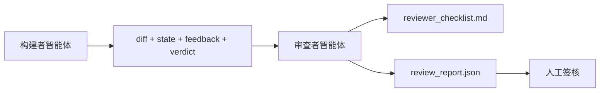

# 审查者智能体：将构建者与评分者分离

> 编写代码的智能体不能给它评分。审查者是另一个循环，拥有不同的系统提示、不同的目标，以及对构建者产生的所有内容的只读访问权限。构建者和审查者之间的差距是大多数可靠性的所在。

**类型：** Build
**语言：** Python（标准库）
**前置知识：** Phase 14 · 38（验证门）
**时间：** ~55 分钟

## 学习目标

- 说明为什么同一个智能体不能可靠地审查自己的工作。
- 构建一个消费构建者工件并生成结构化审查报告的审查者智能体循环。
- 编写一个审查者评分标准，对特定维度评分，而不是凭感觉。
- 将审查者接入工作台，使人工审查步骤从真实的工件开始。

## 问题

你让智能体修复一个 bug。它编辑了四个文件，运行了测试，并报告完成。验证门（Phase 14 · 38）确认验收已运行且范围未突破。验证门说 `passed: true`。你合并了。两天后你发现修复解决了 bug 的错误的一半。

验收是必要的，但不充分。审查者提出了验收无法提出的问题：这是否解决了正确的问题？它是否在未标记的情况下扩大了范围？它是否记录了本应受到质疑的假设？它是否将工作台留在了下一个会话可以接手的良好状态？

## 概念



### 审查者评分标准

五个维度，每个评分 0 到 2。

| 维度 | 问题 |
|-----------|----------|
| 问题匹配度 | 更改是否解决了所述任务，而不是邻近的任务？ |
| 范围纪律 | 编辑是否限于合同范围内，还是合同被有意扩大了？ |
| 假设 | 所有隐藏的假设是否都写在了可审查的地方？ |
| 验证质量 | 验收命令是否真正证明了目标，还是证明了一个较弱版本？ |
| 交接就绪度 | 下一个会话能否从当前状态干净地接手？ |

总分 10 分。低于 7 分为软失败；低于 5 分为硬失败。

### 审查者是独立的角色，不是独立的模型

你可以使用与构建者相同的模型来运行审查者。关键在于角色分离：不同的系统提示、不同的输入、对差异的写权限。姿态的改变就是信号的改变。

### 审查者不能编辑差异

审查者读取差异、状态、反馈和判定结果。它编写报告。它不修补差异。如果报告说"修复这个"，下一个构建者轮次进行修复；审查者回去审查。混合角色会破坏这个差距。

### 审查者评分标准与验证门

验证门（Phase 14 · 38）检查确定性事实：验收是否运行、规则是否通过、范围是否保持。审查者做出定性判断：这是否是正确的工作、是否文档化、交接是否可用。两者都是必需的。

## 构建

`code/main.py` 实现：

- 一个 `ReviewerInputs` 数据类，打包审查者读取的工件。
- 一个评分标准评分器，每个维度一个函数。每个函数在本课中是确定性的和存根级别的；真实实现会调用 LLM。
- 一个 `review_report.json` 写入器，包含五个分数、总分和判定结果（`pass`、`soft_fail`、`hard_fail`）。
- 两个演示场景：一个干净的更改和一个"正确的测试，错误的问题"的更改。

运行：

```
python3 code/main.py
```

输出：两个审查报告写入磁盘，以及一个维度分数的控制台表格。

## 生产环境中的模式

数据：Cloudflare 2026 年 4 月的 AI 代码审查系统在 30 天内跨 5,169 个仓库中的 48,095 个合并请求运行了 131,246 次审查运行。中位数审查完成时间为 3 分 39 秒。最多七个专业审查者（安全、性能、代码质量、文档、发布管理、合规、Engineering Codex）在审查协调器下并行运行，该协调器去重发现并判断严重性。顶级模型仅保留给协调器；专业审查者在更便宜的层级上运行。

四种模式使其在大规模下工作。

**专业池，而非一个大审查者。**一个具有 5 维度评分标准的审查者适用于 solo 仓库。一旦代码库拥有安全关键、性能关键和文档表面，拆分为具有较小提示的专业审查者。协调器进行去重；专业审查者从不运行完整的评分标准。模型层级分离自然产生：便宜的专业审查者，昂贵的协调器。

**偏差缓解作为设计要求，而非优化。**LLM 裁判显示出四种可靠的偏差（Adnan Masood，2026 年 4 月）：位置偏差（GPT-4 在 (A,B) 与 (B,A) 排序上 ~40% 不一致）、冗长度偏差（~15% 的分数膨胀偏向更长输出）、自我偏好（裁判偏好来自同一模型族的输出）、权威性（裁判过度评价对知名作者的引用）。缓解措施：评估两种排序，只计算一致的胜出；使用明确奖励简洁性的 1-4 级评分；跨模型族轮换裁判；在评分前去除作者姓名。

**校准集，而非凭感觉。**一个包含 10-20 个已知正确判定结果的历史任务集。每次提示更改后在上面运行审查者。如果与历史记录的一致性低于 80%，评分标准需要在审查者发布前修订。这是每个团队最终都会重新发现的事情；最好从一开始就建立。

**与验证门的混合规范。**验证门（Phase 14 · 38）处理确定性检查（验收是否运行、测试是否通过、范围是否保持）。审查者处理语义检查（这是否是正确的工作、假设是否文档化、交接是否可用）。Anthropic 的 2026 指南明确说明了这种分离：不要让审查者重做验证门已经证明的事情。

## 使用

生产模式：

- **Claude Code 子智能体。**构建者关闭任务后运行审查者子智能体。它在 PR 上发布带有评分标准分数的评论。
- **OpenAI Agents SDK 交接。**任务完成时构建者交接给审查者。审查者可以带着发现列表交回，或者上报给人类。
- **双模型配对。**构建者在更快更便宜的模型上运行。审查者在更强的模型上运行，上下文较小，专注于判断。

审查者是工作台在人类无法完成每项审查时增加的第二双眼睛。

## 交付

`outputs/skill-reviewer-agent.md` 生成特定于项目的审查者评分标准、连接到构建者工件的审查者智能体存根，以及与验证门的集成，使人工审查从书面报告而不是空白页开始。

## 练习

1. 添加针对你的产品领域的第六个维度。论证为什么它不能被现有的五个吸收。
2. 使用两个不同的系统提示（简洁的、冗长的）运行审查者。哪个会产生人类更可能阅读的报告？
3. 为每个维度添加 `confidence` 字段。当最低维度的置信度低于 0.6 时拒绝交付报告。
4. 构建一个校准集：10 个已知正确判定结果的历史任务关闭记录。在上面运行审查者。它在哪些地方与历史记录不一致？
5. 添加"请求更多证据"的能力：审查者可以在评分前要求构建者运行特定的测试。什么是正确的回退机制以避免无限循环？

## 关键术语

| 术语 | 通俗说法 | 实际含义 |
|------|----------------|------------------------|
| 审查者评分标准 | "检查清单" | 五维度 0-2 评分，每个维度带有书面问题 |
| 软失败 | "需要修改" | 总分低于 7；构建者需要处理发现的意见 |
| 硬失败 | "拒绝" | 总分低于 5 或任何维度为 0；暂停并上报给人类 |
| 角色分离 | "不同的提示" | 同一模型可以扮演两个角色；关键在于输入和姿态的纪律 |
| 置信度底线 | "不要交付低信号报告" | 当评分标准不确定时拒绝发出判定结果 |

## 延伸阅读

- [OpenAI Agents SDK 交接](https://platform.openai.com/docs/guides/agents-sdk/handoffs)
- [Anthropic Claude Code 子智能体](https://docs.anthropic.com/en/docs/agents-and-tools/claude-code/sub-agents)
- [Cloudflare，大规模编排 AI 代码审查](https://blog.cloudflare.com/ai-code-review/) — 7 专业审查者 + 协调器架构，131k 次运行 / 30 天
- [Agent-as-a-Judge：用智能体评估智能体（OpenReview / ICLR）](https://openreview.net/forum?id=DeVm3YUnpj) — DevAI 基准，366 个分层解决方案需求
- [Adnan Masood，基于评分标准的评估和 LLM-as-a-Judge：方法、偏差、经验验证](https://medium.com/@adnanmasood/rubric-based-evals-llm-as-a-judge-methodologies-and-empirical-validation-in-domain-context-71936b989e80) — 4 种偏差和缓解措施
- [MLflow，LLM-as-a-Judge 评估](https://mlflow.org/llm-as-a-judge) — 分离的构建者/评估者的生产工具
- [LangChain，如何用人工校正校准 LLM-as-a-Judge](https://www.langchain.com/articles/llm-as-a-judge) — 校准集工作流
- [Evidently AI，LLM-as-a-judge：完整指南](https://www.evidentlyai.com/llm-guide/llm-as-a-judge)
- [Arize，LLM as a Judge — 入门和预构建评估器](https://arize.com/llm-as-a-judge/)
- Phase 14 · 05 — Self-Refine 和 CRITIC（单个智能体自我审查基线）
- Phase 14 · 30 — 评估驱动的智能体开发（校准集生成器）
- Phase 14 · 38 — 审查者读取的验证门
- Phase 14 · 40 — 审查者报告所供给的交接包
