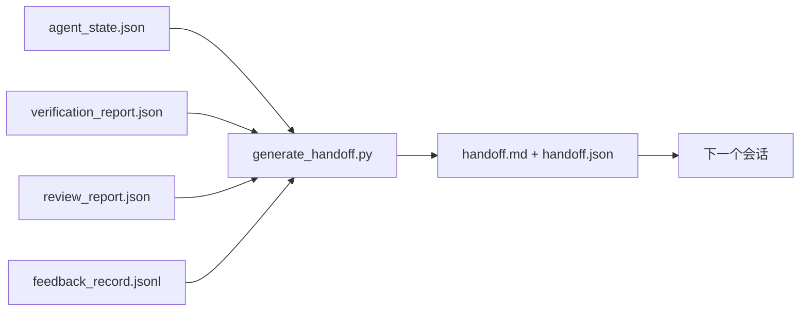

# 多会话交接

> 会话即将结束。工作尚未完成。交接包是将"智能体工作了一小时"转化为"下一个会话在第一分钟就能高效工作"的工件。要有目的地构建它，而不是事后才想到。

**类型：** Build
**语言：** Python（标准库）
**前置知识：** Phase 14 · 34（仓库记忆），Phase 14 · 38（验证），Phase 14 · 39（审查者）
**时间：** ~50 分钟

## 学习目标

- 识别每个交接包需要的七个字段。
- 从工作台工件生成交接包而无需手动编写叙述文本。
- 将大型反馈日志修剪为适合交接的摘要。
- 使下一个会话的第一个动作具有确定性。

## 问题

会话结束。智能体说"很好，我们取得了进展。"下一个会话开始。下一个智能体问"我们上次停在哪里？"第一个智能体的答案消失了。下一个智能体重新发现、重新运行相同的命令、重新向人类询问相同的问题，浪费了三十分钟来恢复上一个会话的最后三十秒状态。

糟糕的交接成本在每个会话中为任务的整个生命周期付出代价。解决方案是在会话结束时自动生成一个包：变更了什么、为什么、尝试了什么、什么失败了、还剩什么、下次首先要做什么。

## 概念



### 每个交接包携带的七个字段

| 字段 | 它回答的问题 |
|-------|---------------------|
| `summary` | 已完成工作的一段摘要 |
| `changed_files` | 差异一览 |
| `commands_run` | 实际执行了哪些命令 |
| `failed_attempts` | 尝试了什么以及为什么没有成功 |
| `open_risks` | 可能影响下一会话的风险及严重程度 |
| `next_action` | 下一个会话要采取的第一个具体步骤 |
| `verdict_pointer` | 验证和审查报告的路径 |

`next_action` 字段是承重的字段。除了 `next_action` 之外什么都有的是一个状态报告，而不是交接。

### 交接是生成的，而非编写的

手动编写的交接是会在艰难的日子被跳过的交接。生成器读取工作台工件并发出包。智能体的工作是让工作台处于生成器可以总结的状态，而不是编写总结本身。

### 两种形式：人类可读和机器可读

`handoff.md` 是人类读取的。`handoff.json` 是下一个智能体加载的。两者来自相同的源工件。如果它们出现分歧，以 JSON 为准。

### 反馈日志修剪

完整的 `feedback_record.jsonl` 可能有数百条记录。交接只携带最后 K 条以及所有非零退出的记录。如果需要，下一个会话可以加载完整日志，但包保持小巧。

### 留下干净的状态

交接描述工作。干净的状态使工作可恢复。它们不是一回事。一份完美的 `handoff.md` 如果下一个会话打开时面对的是半应用的 diff、智能体忘记的临时文件、散落的分支以及在运行之前就出错的测试，那它就毫无价值。下一个智能体随后花掉前十分钟清理上一个的遗留问题，而不是构建，而且这个成本在任务的整个生命周期中每个会话都在复合增长。

因此，会话不是在功能可用时结束。它是在工作台处于生成器可以总结且下一个会话可以信任的状态时结束。清理是它自己的阶段，在交接之前运行，它是一个检查，而不是一个习惯，因为习惯是在艰难的日子里被跳过的东西。

| 检查 | 干净的含义 | 脏会阻塞因为 |
|-------|-------------|----------------------|
| 工作树 | 每次更改都已提交或明确 stash 并附注记 | 半应用的 diff 对下一个智能体来说看起来像有意图的工作 |
| 临时工件 | 没有留下 `*.tmp`、临时目录、调试打印或注释掉的代码块 | 散乱的文件污染 diff 和下一个智能体的心智模型 |
| 测试 | 通过，或在 `open_risks` 中命名失败的红色 | 静默的红色测试是下一个会话踩入的陷阱 |
| 功能看板 | `feature_list.json` 状态反映现实（Phase 14 · 36） | 过时的看板将下一个会话引向已完成的工作 |
| 分支 | 在预期分支上，没有分离 HEAD，没有孤儿分支 | 错误的分支意味着下一个会话的第一次提交落在错误的位置 |

清理阶段会输出一个 `clean_state.json`，列出阻塞问题；空列表是交接生成器在写入包之前断言的前提条件。建立在脏树上的交接不是交接，而是转发的混乱。这两个工件配对：清理证明工作台可以安全离开，交接证明下一个会话知道从哪里开始。

`code/main.py` 实现：

- 一个加载器，将状态、判定结果、审查和反馈收集到单个 `WorkbenchSnapshot` 中。
- 一个 `generate_handoff(snapshot) -> (markdown, payload)` 函数。
- 一个过滤器，选取最后 K 条反馈记录加上所有非零退出记录。
- 一个在脚本旁边写入 `handoff.md` 和 `handoff.json` 的演示运行。

运行：

```
python3 code/main.py
```

输出：打印的交接正文，以及磁盘上的两个文件。

## 生产环境中的模式

Codex CLI、Claude Code 和 OpenCode 各自提供不同的压缩策略；结构化交接包位于三者之上。

**压缩策略各不相同；包架构不变。**Codex CLI 的 POST /v1/responses/compact 是服务器端不透明的 AES blob（OpenAI 模型的快速路径）；回退是本地的"交接摘要"作为 `_summary` 用户角色消息附加。Claude Code 在 95% 上下文占用时运行五阶段渐进压缩。OpenCode 执行基于时间戳的消息隐藏加上 5 标题 LLM 摘要。三种不同的机制，相同的需求：将能在压缩中存活的内容序列化为可移植的工件。包就是那个工件。

**新会话交接不是压缩。**压缩扩展一个会话；交接干净地关闭一个并开始下一个。Hermes Issue #20372（2026 年 4 月）的框架是正确的：当就地压缩开始降级时，智能体应该编写一个紧凑的交接，结束会话，并在新的上下文中恢复。包是使这种转换成本低廉的关键。错误是在压缩直到质量崩溃时仍然继续；解决方法是预算一个早期的、干净的交接。

**每个分支和主题一个活跃交接。**多智能体协调在过时的交接上比在差的模型输出上更容易崩溃。始终包含 `branch`、`last_known_good_commit` 和 `active | superseded | archived` 状态的 `status`。过时的交接被归档；只有活跃的驱动下一个会话。这是"作为笔记的交接"和"作为状态的交接"之间的区别。

**在 50-75% 上下文时收尾，而不是到极限。**手动编写的模式操作手册（CLAUDE.md + HANDOVER.md）报告最佳结果是在会话在 50-75% 上下文预算而不是 95% 时结束。包生成器在压缩伪影污染源状态之前干净地运行。在上下文完整时编写成本低廉；当模型已经开始丢失位置时成本高昂。

## 使用

生产模式：

- **会话结束钩子。**用户在关闭聊天时，运行时触发生成器。包进入 `outputs/handoff/<session_id>/`。
- **PR 模板。**生成器的 markdown 同时也是 PR 正文。审查者无需打开其他五个文件即可阅读。
- **跨智能体交接。**用一个产品（Claude Code）构建，用另一个（Codex）继续。包是通用语言。

包小巧、规范、生成成本低廉。成本节省随每个会话而复合增长。

## 交付

`outputs/skill-handoff-generator.md` 产生一个针对项目工件路径调优的生成器、一个在会话结束时运行的钩子，以及下一个智能体在启动时读取的 `handoff.json` 架构。

## 练习

1. 添加 `assumptions_to_validate` 字段，列出构建者记录但审查者评分未超过 1 的每个假设。
2. 对于失败的运行和通过的运行，使用不同的反馈摘要修剪方式。论证这种不对称性。
3. 包含一个"给人类的问题"列表。问题进入包与进入聊天消息的阈值是什么？
4. 使生成器幂等：运行两次产生相同的包。哪些条件需要稳定才能保持这一点？
5. 添加"下一会话先决条件"部分，列出下一个会话在行动前必须加载的工件。

## 关键术语

| 术语 | 通俗说法 | 实际含义 |
|------|----------------|------------------------|
| 交接包 | "会话摘要" | 生成的工件，携带七个字段，包括 markdown 和 JSON |
| 下一步行动 | "先做什么" | 启动下一会话的一个具体步骤 |
| 反馈修剪 | "日志摘要" | 最后 K 条记录加上所有非零退出 |
| 状态报告 | "我们做了什么" | 缺少 `next_action` 的文档；有用，但不是交接 |
| 判定结果指针 | "收据" | 验证和审查报告的路径，用于可追溯性 |

## 延伸阅读

- [Anthropic，长运行智能体的有效框架](https://www.anthropic.com/engineering/effective-harnesses-for-long-running-agents)
- [OpenAI Agents SDK 交接](https://platform.openai.com/docs/guides/agents-sdk/handoffs)
- [Codex 博客，Codex CLI 上下文压缩：架构、配置、管理长会话](https://codex.danielvaughan.com/2026/03/31/codex-cli-context-compaction-architecture/) — POST /v1/responses/compact 和本地回退
- [Justin3go，卸下沉重记忆：Codex、Claude Code、OpenCode 中的上下文压缩](https://justin3go.com/en/posts/2026/04/09-context-compaction-in-codex-claude-code-and-opencode) — 三家压缩对比
- [JD Hodges，Claude 交接提示：如何在跨会话保持上下文（2026）](https://www.jdhodges.com/blog/ai-session-handoffs-keep-context-across-conversations/) — CLAUDE.md + HANDOVER.md，50-75% 上下文预算
- [Mervin Praison，管理多智能体编码会话中的交接：不丢失连续性的新上下文](https://mer.vin/2026/04/managing-handoffs-in-multi-agent-coding-sessions-fresh-context-without-losing-continuity/) — 分布式系统框架
- [Hermes Issue #20372 — 压缩风险时自动进行新会话交接](https://github.com/NousResearch/hermes-agent/issues/20372)
- [Hermes Issue #499 — 上下文压缩质量大修](https://github.com/NousResearch/hermes-agent/issues/499) — Codex CLI 中面向交接的提示
- [Microsoft Agent Framework，压缩](https://learn.microsoft.com/en-us/agent-framework/agents/conversations/compaction)
- [OpenCode，上下文管理和压缩](https://deepwiki.com/sst/opencode/2.4-context-management-and-compaction)
- [LangChain，智能体的上下文工程](https://www.langchain.com/blog/context-engineering-for-agents)
- Phase 14 · 34 — 生成器读取的状态文件
- Phase 14 · 38 — 包指向的验证判定
- Phase 14 · 39 — 打包到包中的审查者报告
