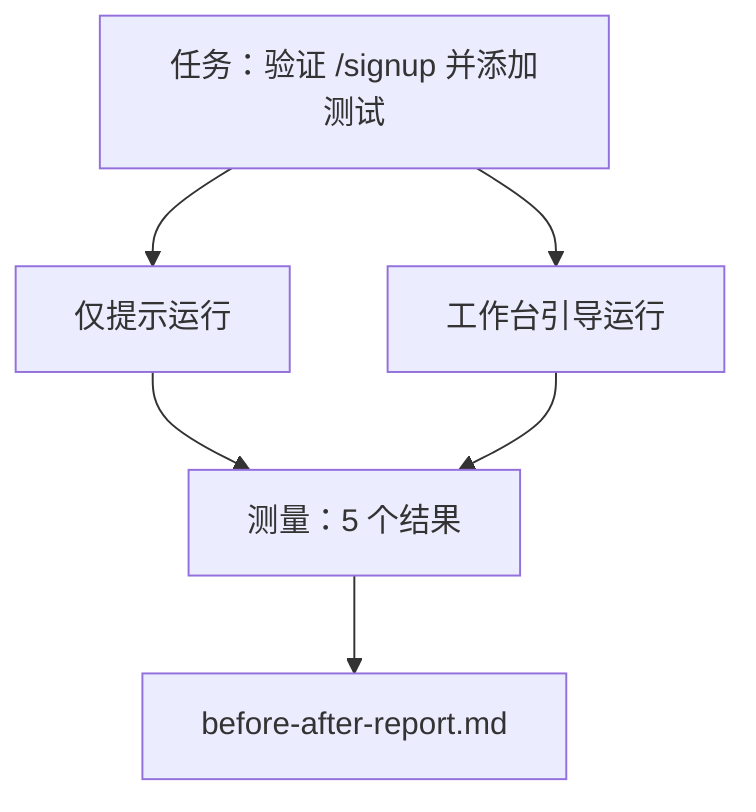

# 在真实仓库上的工作台

> 十一个课时的表面知识，如果不能在实际代码库中存活就一文不值。本课在小型示例应用上使用相同任务运行两次：仅提示 vs 工作台引导。数字说明一切。

**类型：** Build
**语言：** Python（标准库）
**前置知识：** Phase 14 · 32 到 14 · 40
**时间：** ~60 分钟

## 学习目标

- 将七个工作台表面整合到一个小型应用上。
- 对相同任务运行两次（仅提示和工作台引导）并测量五个结果。
- 阅读前后对比报告，确定哪些表面提供了最大的杠杆作用。
- 针对"但我的模型已经足够好了"的反驳，论证工作台的价值。

## 问题

在玩具任务上的演示说服不了任何人。只有当真实感任务在真实感仓库上以更少的失败、更少的回滚和下一个会话可以使用的包进入生产时，工作台的价值才能得到证明。

本课提供了那个真实感仓库，并通过两种管道运行相同的任务。结果是你可以交给怀疑者的前后对比报告。

## 概念



### 示例应用

`sample_app/` 中的最小 FastAPI 风格处理器：

- 带有 `/signup`（尚无验证）的 `app.py`。
- 带有一个快乐路径测试的 `test_app.py`。
- `README.md` 和 `scripts/release.sh` 作为禁止区域诱饵。

### 任务

> 为 `/signup` 添加输入验证：拒绝短于 8 个字符的密码，使用类型化错误信封返回 422。添加一个证明新行为的测试。

### 两条管道

仅提示：

1. 读取 README。
2. 读取 `app.py`。
3. 编辑文件。
4. 声称完成。

工作台引导：

1. 运行初始化脚本（第 35 课）。
2. 读取范围合同（第 36 课）。
3. 读取状态（第 34 课）。
4. 仅编辑允许的文件。
5. 通过反馈运行器运行验收命令（第 37 课）。
6. 运行验证门（第 38 课）。
7. 运行审查者（第 39 课）。
8. 生成交接（第 40 课）。

### 测量的五个结果

| 结果 | 为何重要 |
|---------|----------------|
| `tests_actually_run` | 大多数"测试通过"声明无法验证 |
| `acceptance_met` | 证明目标的测试必须是实际运行的测试 |
| `files_outside_scope` | 范围蔓延是主要的静默失败 |
| `handoff_quality` | 下一个会话为这个结果付出代价或从中受益 |
| `reviewer_total` | 在验证门之上的定性判断 |

## 构建

`code/main.py` 编排两条管道针对同一示例应用 fixture。两条管道都是脚本化的（没有 LLM 参与），因此测量是可重复的。脚本将比较写入 `before-after-report.md` 和 `comparison.json`。

运行：

```
python3 code/main.py
```

输出：每条管道结果的控制台表格，保存到脚本旁边的 markdown 报告，以及供需要图表化的人使用的 JSON。

## 生产环境中的模式

怀疑者的问题是"工作台到底有多大帮助？"2026 年的数字比解释更有说服力。

**同一模型从 Terminal Bench 前 30 名外到前 5 名。**LangChain 的《智能体框架剖析》（2026 年 4 月）：一个编码智能体仅通过改变框架就从前 30 名外跃升至 Terminal Bench 2.0 的第 5 名。相同的模型。不同的表面。25 个名次的差距。

**Vercel 通过删除工具从 80% 到 100%。**Vercel 报告删除其智能体 80% 的工具将成功率从 80% 提升到 100%。更小的工具表面、更锐利的范围、更少的失败方式。负面空间制胜。

**Harvey 仅通过框架优化获得 2 倍准确率。**法律智能体通过框架优化准确率翻倍以上，没有模型变更。

**88% 的企业 AI 智能体项目未能进入生产。**preprints.org 的《语言智能体的框架工程》论文（2026 年 3 月）将失败追溯到运行时而非推理：过时状态、脆弱的重试、过度膨胀的上下文、从中级错误中恢复的能力差。

**长上下文崩溃。**WebAgent 基线 40-50% 的成功率在长上下文条件下下降到 10% 以下，主要来自无限循环和目标丢失。Ralph Loop 和交接包的存在就是为了吸收这种影响。

**假阴性仍然存在。**单步事实任务、单行 lint、格式化运行，以及模型已经逐字记忆的任何内容——这些使用仅提示更快。基准测试应该诚实地列举它们，以免工作台被框架为过度设计。

结论不是"框架永远制胜"。模型确实会随时间吸收框架的技巧。结论是今天，工程负载位于七个表面上，数字证明了这一点。

## 使用

本课是你在以下情况引用的案例文件：

- 有人问为什么每个 PR 都带有 `agent-rules.md` 和范围合同。
- 一个团队想"就这个冲刺"放弃验证门。
- 一个新的智能体产品推出，你需要一个可移植的基准来测试它是否真的节省时间。

数字比解释走得更远。

## 交付

`outputs/skill-workbench-benchmark.md` 是一个可移植的评估框架，可以针对项目自己的示例应用通过两条管道运行任何智能体产品，并报告五个结果。

## 练习

1. 添加第六个结果：首次有意义的编辑时间。你如何干净地测量它？
2. 在代码库中的真实第二天任务上运行比较。工作台数字在哪里下滑？
3. 添加一个"假阴性"通过：仅提示可能更快且工作台开销是实际成本的任务。论证无论如何保留工作台。
4. 将脚本化的"智能体"替换为真实的 LLM 调用。哪些结果变得更嘈杂？
5. 编写面向非工程师的一页摘要。哪些内容能通过裁剪？

## 关键术语

| 术语 | 通俗说法 | 实际含义 |
|------|----------------|------------------------|
| 示例应用 | "玩具仓库" | 虽小但足够真实，能练习所有七个表面 |
| 管道 | "工作流" | 智能体遵循的有序表面读/写序列 |
| 前后对比报告 | "收据" | 你交给怀疑者的工件 |
| 假阴性 | "工作台过度设计" | 仅提示更快且有用诚实地列举的任务 |
| 工作台基准 | "可靠性分数" | 在你的代码库上运行比较的可移植框架 |

## 延伸阅读

- [LangChain，智能体框架剖析](https://blog.langchain.com/the-anatomy-of-an-agent-harness/) — Terminal Bench 前 30 到前 5 的收据
- [MongoDB，智能体框架：为什么 LLM 是你的智能体系统中最小的一部分](https://www.mongodb.com/company/blog/technical/agent-harness-why-llm-is-smallest-part-of-your-agent-system) — Vercel + Harvey 数字
- [preprints.org，语言智能体的框架工程](https://www.preprints.org/manuscript/202603.1756) — 88% 企业失败率，运行时根本原因
- [HN：一个下午改进 15 个 LLM 的编码能力。只有框架改变了](https://news.ycombinator.com/item?id=46988596) — 跨 15 个模型复制
- [Cloudflare，大规模编排 AI 代码审查](https://blog.cloudflare.com/ai-code-review/) — 生产中 131k 次审查运行 / 30 天
- [Anthropic，构建有效的智能体](https://www.anthropic.com/research/building-effective-agents)
- Phase 14 · 32 到 14 · 40 — 本课端到端练习的表面
- Phase 14 · 19 — SWE-bench、GAIA、AgentBench 作为本课补充的宏观基准
- Phase 14 · 30 — 评估驱动的智能体开发，同一框架可接入
