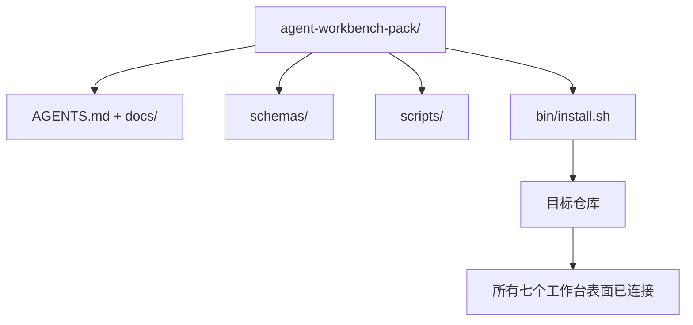

# 毕业项目：交付可复用的智能体工作台包

> 这个迷你课程系列以一个可以放入任何仓库的包作为结束。十一个课时的表面知识压缩成一个你可以 `cp -r` 的目录，第二天早上智能体就能可靠工作。这个毕业项目是本课程赖以生存的制品。

**类型：** Build
**语言：** Python（标准库）
**前置知识：** Phase 14 · 31 到 14 · 41
**时间：** ~75 分钟

## 学习目标

- 将七个工作台表面打包成一个即插即用的目录。
- 固定模式、脚本和模板，使新仓库获得一个已知良好的基线。
- 添加一个单一的安装脚本，幂等地部署包。
- 决定什么留在包内、什么留在包外，并为每个决策做出论证。

## 问题

一个存在于 Google 文档、聊天记录和三个半记不清的脚本中的工作台，是一个每季度都需要重建的工作台。解决方案是一个版本化的包：一个包含表面、模式、脚本和一个命令安装程序的仓库或目录。

你将在这节课结束时，将 `outputs/agent-workbench-pack/` 交付到磁盘上，并拥有一个将其部署到任何目标仓库的 `bin/install.sh`。

## 概念



### 包布局

```
outputs/agent-workbench-pack/
├── AGENTS.md
├── docs/
│   ├── agent-rules.md
│   ├── reliability-policy.md
│   ├── handoff-protocol.md
│   └── reviewer-rubric.md
├── schemas/
│   ├── agent_state.schema.json
│   ├── task_board.schema.json
│   └── scope_contract.schema.json
├── scripts/
│   ├── init_agent.py
│   ├── run_with_feedback.py
│   ├── verify_agent.py
│   └── generate_handoff.py
├── bin/
│   └── install.sh
└── README.md
```

### 什么保留、什么排除

保留：

- 表面模式。它们是合同。
- 上述四个脚本。它们是运行时。
- 上述四个文档。它们是规则和评分标准。

排除：

- 项目特定任务。任务属于目标仓库的面板，不在包中。
- 供应商 SDK 调用。包是框架无关的。
- 入职文档。包位于团队现有入职文档旁边，不在其内部。

### 安装程序

一个简短的 `bin/install.sh`（或 `bin/install.py`）：

1. 在没有 `--force` 的情况下拒绝安装到已有的包上。
2. 将包复制到目标仓库。
3. 如果存在 `.github/workflows/`，则连接 CI。
4. 打印后续步骤：填写面板、设置验收命令、运行初始化脚本。

### 版本管理

包携带一个 `VERSION` 文件。需要迁移的模式变更和脚本更改增加主版本号。仅文档变更增加补丁版本号。目标仓库的 `agent_state.json` 记录它初始化时使用的包版本。

## 构建

`code/main.py` 将包组装到课程旁边的 `outputs/agent-workbench-pack/` 中，使用本迷你课程系列中前面课程的模式和脚本以及你已经编写的文档进行初始化。

运行：

```
python3 code/main.py
```

脚本复制并固定表面、编写 README、打印包树，并以零退出。重新运行是幂等的。

## 生产环境中的模式

一个包只有在能够经受分叉、更新和不友好的上游时才有价值。四种模式使其工作。

**`VERSION` 是合同，不是营销。**主版本增加需要状态迁移。次版本增加需要检查器重新运行。补丁版本增加仅限文档。安装程序在每次安装时将 `.workbench-version` 写入目标仓库；如果目标的锁定与包的 `VERSION` 不一致，`lint_pack.py` 拒绝交付。这就是 `npm`、`Cargo` 和 `pyproject.toml` 能够经受 10 年变更的原因；没有任何关于智能体的东西改变了这些规则。

**跨工具分发的单一来源。**Nx 提供一条 `nx ai-setup` 命令，从单一配置部署 `AGENTS.md`、`CLAUDE.md`、`.cursor/rules/`、`.github/copilot-instructions.md` 和一个 MCP 服务器。包应该做同样的事情；安装程序发出符号链接（`ln -s AGENTS.md CLAUDE.md`），使单一事实来源分发到每个编码智能体。为了支持一个工具而分叉包是一个失败模式。

**拒绝在非平凡状态上运行的 `uninstall.sh`。**卸载包不得删除用户的 `agent_state.json`、`task_board.json` 或 `outputs/`。卸载程序删除模式、脚本、文档和 `AGENTS.md`（带有 `--keep-agents-md` 选择退出选项），如果状态文件有任何未提交的更改则拒绝继续。状态属于用户；包不拥有它。

**可作为技能发布的。SkillKit 风格的分发。**包作为 SkillKit 技能交付：`skillkit install agent-workbench-pack` 从单一来源部署到 32 个 AI 智能体。包仓库是事实来源；SkillKit 是分发渠道。供应商锁定消失；七个表面保持不变。

## 使用

包部署到三个地方：

- **作为目录放入仓库。**`cp -r outputs/agent-workbench-pack /path/to/repo`。
- **作为公开模板仓库。**分叉并定制，由 `VERSION` 控制漂移。
- **作为 SkillKit 技能。**连接到智能体产品，使单条命令即可部署。

包是配方。每次安装都是一份服务。

## 交付

`outputs/skill-workbench-pack.md` 生成一个针对项目调优的包：针对团队历史优化的规则、匹配仓库的范围 glob、以及扩展了一个领域特定条目的评分标准维度。

## 练习

1. 决定哪个可选的第五个文档值得提升到规范包中。论证你的选择。
2. 将安装程序重写为 Python 并添加 `--dry-run` 标志。比较与 bash 的人机工程学。
3. 添加一个 `bin/uninstall.sh`，安全地删除包，并在状态文件有非平凡历史时拒绝运行。什么算作非平凡？
4. 添加一个 `lint_pack.py`，当包与 `VERSION` 不一致时失败。将其连接到包自身仓库的 CI 中。
5. 编写从手工作台迁移到本包的运维手册。最小化停机时间的操作顺序是什么？

## 关键术语

| 术语 | 通俗说法 | 实际含义 |
|------|----------------|------------------------|
| 工作台包 | "入门套件" | 携带所有七个表面的版本化目录 |
| 安装程序 | "设置脚本" | 幂等部署包的 `bin/install.sh` |
| 包版本 | "VERSION" | 模式/脚本变更增加主版本，仅文档变更增加补丁 |
| 即插即用包 | "cp -r 即可运行" | 包无需按仓库定制即可在第一天工作 |
| 可分叉模板 | "GitHub 模板" | GitHub 的"使用此模板"可以克隆的公开仓库 |

## 延伸阅读

- Phase 14 · 31 到 14 · 41 — 此包捆绑的每个表面
- [SkillKit](https://github.com/rohitg00/skillkit) — 将此技能安装到 32 个 AI 智能体
- [Nx 博客，教你的 AI 智能体如何在 Monorepo 中工作](https://nx.dev/blog/nx-ai-agent-skills) — 跨六个工具的单一来源生成器
- [agents.md — 开放规范](https://agents.md/) — 包的入口必须实现的内容
- [HKUDS/OpenHarness](https://github.com/HKUDS/OpenHarness) — 包等效实现的参考
- [andrewgarst/agentic_harness](https://github.com/andrewgarst/agentic_harness) — Redis 支持的带评估套件的参考实现
- [Augment Code，好的 AGENTS.md 是模型升级](https://www.augmentcode.com/blog/how-to-write-good-agents-dot-md-files) — 包文档质量标准
- [Anthropic，长运行智能体的有效框架](https://www.anthropic.com/engineering/effective-harnesses-for-long-running-agents)
- [Anthropic，长运行应用开发的框架设计](https://www.anthropic.com/engineering/harness-design-long-running-apps)
- Phase 14 · 30 — 使用此包验证门的评估驱动智能体开发
- Phase 14 · 41 — 此包改进的前后对比基准
