# 通信协议

> 无法使用同一种语言的智能体不是团队，而是对着虚空大喊的陌生人。

**类型：** Build
**语言：** TypeScript
**前置知识：** Phase 14（智能体工程），Lesson 16.01（为什么需要多智能体）
**时间：** ~120 分钟

## 学习目标

- 实现 MCP 工具发现和调用，让智能体能够使用外部服务器暴露的工具
- 构建 A2A Agent Card 和任务端点，使一个智能体能够通过 HTTP 将工作委派给另一个智能体
- 比较 MCP（工具访问）、A2A（智能体间）、ACP（企业审计）和 ANP（去中心化信任），解释每种协议解决什么问题
- 在同一个系统中串联多种协议，智能体通过 MCP 发现工具并通过 A2A 委派任务

## 问题

你把系统拆成了多个智能体。一个研究者，一个编码者，一个评审者。它们各自擅长自己的工作。但现在你需要它们真正相互对话。

你的第一次尝试很直接：传递字符串。研究者返回一段文本，编码者以它自己的方式解析。这能工作——直到编码者误解了研究报告，或者两个智能体互相等待导致死锁，或者你需要由不同团队构建的智能体协作。突然间，"只是传递字符串"就不行了。

这就是通信协议问题。没有共享的智能体信息交换契约，多智能体系统就是脆弱的、不可审计的，并且无法扩展到超出你亲自编写的少数智能体。

AI 生态系统已经推出了四种协议，各自解决问题的不同方面：

- **MCP** 用于工具访问
- **A2A** 用于智能体间协作
- **ACP** 用于企业可审计性
- **ANP** 用于去中心化身份和信任

本课程深入探讨。你将阅读每个规范的真实线格式，构建可工作的实现，并将所有四种连接到统一系统中。

## 概念

### 协议全景

把这四种协议视为层次，各自回答不同的问题：

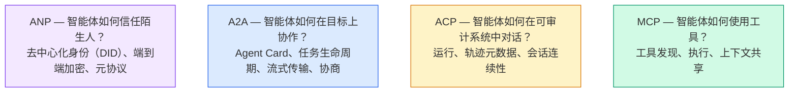

它们不是竞争对手。它们在不同层级解决不同问题。

### MCP（快速回顾）

MCP 在 Phase 13 中有详细介绍。快速回顾：MCP 标准化了 LLM 如何连接到外部工具和数据源。它是一个**客户端-服务器**协议，智能体（客户端）发现并调用服务器暴露的工具。

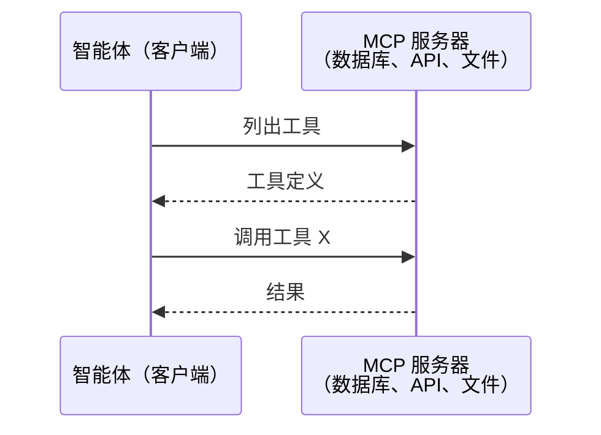

MCP 是**智能体到工具**的通信。它不帮助智能体相互对话。

### A2A（Agent2Agent 协议）

**创建者：** Google（现由 Linux 基金会管理，名称为 `lf.a2a.v1`）
**规范版本：** 1.0.0
**问题：** 自治智能体如何协作、协商和委派任务给对方？

A2A 是**点对点智能体协作**的协议。MCP 将智能体连接到工具，而 A2A 将智能体连接到其他智能体。每个智能体在一个已知 URL 上发布一个 **Agent Card**，其他智能体发现、协商并向其委派任务。

#### A2A 如何工作

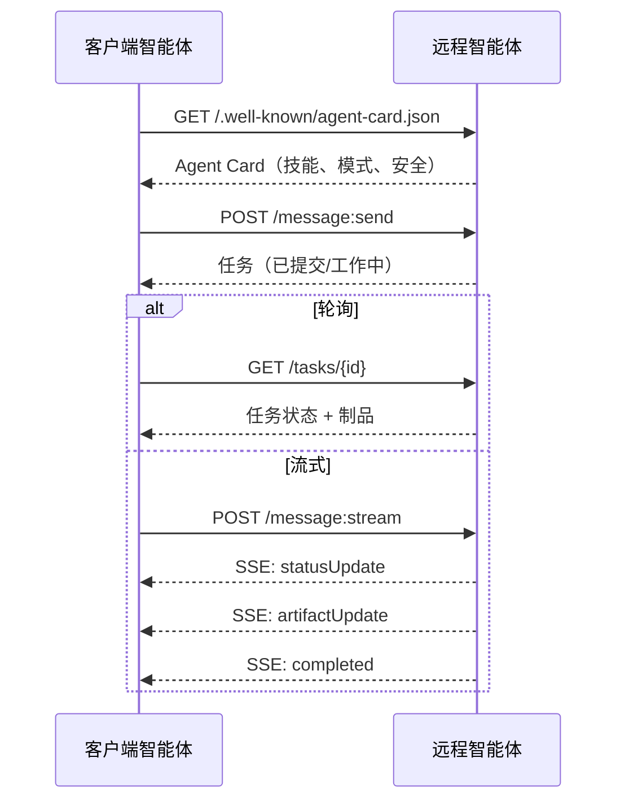

#### 真实的 Agent Card

这是 A2A Agent Card 在实际中的样子。在 `GET /.well-known/agent-card.json` 提供：

```json
{
  "name": "Research Agent",
  "description": "搜索文档并总结发现",
  "version": "1.0.0",
  "supportedInterfaces": [
    {
      "url": "https://research-agent.example.com/a2a/v1",
      "protocolBinding": "JSONRPC",
      "protocolVersion": "1.0"
    },
    {
      "url": "https://research-agent.example.com/a2a/rest",
      "protocolBinding": "HTTP+JSON",
      "protocolVersion": "1.0"
    }
  ],
  "provider": {
    "organization": "Your Company",
    "url": "https://example.com"
  },
  "capabilities": {
    "streaming": true,
    "pushNotifications": false
  },
  "defaultInputModes": ["text/plain", "application/json"],
  "defaultOutputModes": ["text/plain", "application/json"],
  "skills": [
    {
      "id": "web-research",
      "name": "Web Research",
      "description": "搜索网络并综合发现",
      "tags": ["research", "search", "summarization"],
      "examples": ["研究 React 19 的最新变化"]
    },
    {
      "id": "doc-analysis",
      "name": "文档分析",
      "description": "阅读和分析技术文档",
      "tags": ["docs", "analysis"],
      "inputModes": ["text/plain", "application/pdf"],
      "outputModes": ["application/json"]
    }
  ],
  "securitySchemes": {
    "bearer": {
      "httpAuthSecurityScheme": {
        "scheme": "Bearer",
        "bearerFormat": "JWT"
      }
    }
  },
  "security": [{ "bearer": [] }]
}
```

需要注意的关键点：
- **Skills** 是智能体可以做的事情。每个技能有 ID、标签和受支持的输入/输出 MIME 类型。客户端智能体据此决定这个远程智能体是否能处理它的请求。
- **supportedInterfaces** 列出了多个协议绑定。一个智能体可以同时说 JSON-RPC、REST 和 gRPC。
- **Security** 内置于 card 中。客户端在发出第一个请求之前就知道需要什么认证。

#### 任务生命周期

任务是 A2A 中的核心工作单元。它们经过定义好的状态：

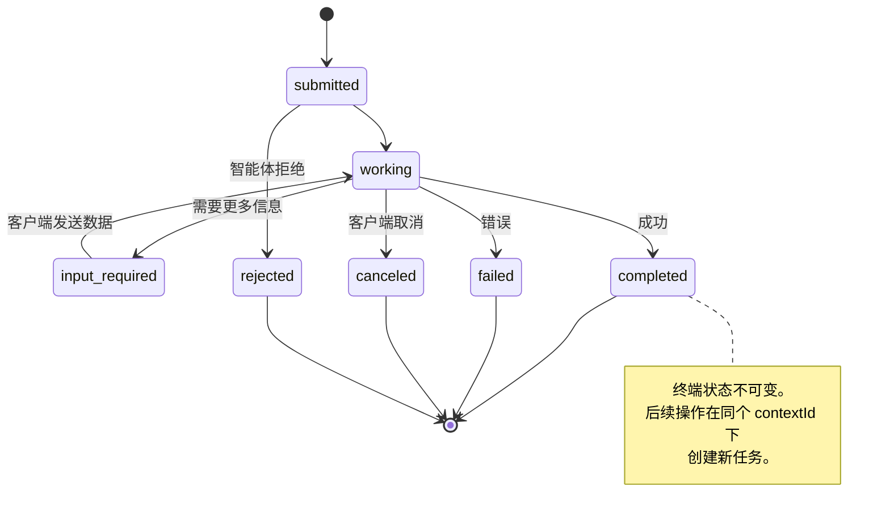

所有 8 个状态：

| 状态 | 终端？ | 含义 |
|---|---|---|
| `TASK_STATE_SUBMITTED` | 否 | 已确认，尚未处理 |
| `TASK_STATE_WORKING` | 否 | 正在处理中 |
| `TASK_STATE_INPUT_REQUIRED` | 否 | 智能体需要更多信息 |
| `TASK_STATE_AUTH_REQUIRED` | 否 | 需要认证 |
| `TASK_STATE_COMPLETED` | 是 | 成功完成 |
| `TASK_STATE_FAILED` | 是 | 出错完成 |
| `TASK_STATE_CANCELED` | 是 | 完成前取消 |
| `TASK_STATE_REJECTED` | 是 | 智能体拒绝任务 |

一旦任务到达终端状态，它就是不可变的。后续操作在同一 `contextId` 内创建新任务。

#### 线格式

A2A 使用 JSON-RPC 2.0。以下是真实消息交换的样子：

**客户端发送任务：**
```json
{
  "jsonrpc": "2.0",
  "id": 1,
  "method": "SendMessage",
  "params": {
    "message": {
      "messageId": "msg-001",
      "role": "ROLE_USER",
      "parts": [{ "text": "研究 React 19 编译器特性" }]
    },
    "configuration": {
      "acceptedOutputModes": ["text/plain", "application/json"],
      "historyLength": 10
    }
  }
}
```

**智能体用任务响应：**
```json
{
  "jsonrpc": "2.0",
  "id": 1,
  "result": {
    "task": {
      "id": "task-abc-123",
      "contextId": "ctx-xyz-789",
      "status": {
        "state": "TASK_STATE_COMPLETED",
        "timestamp": "2026-03-27T10:30:00Z"
      },
      "artifacts": [
        {
          "artifactId": "art-001",
          "name": "research-results",
          "parts": [{
            "data": {
              "findings": [
                "React 19 编译器自动记忆组件",
                "不再需要手动 useMemo/useCallback",
                "编译器在构建时运行，而非运行时"
              ]
            },
            "mediaType": "application/json"
          }]
        }
      ]
    }
  }
}
```

**通过 SSE 流式传输：**
```text
POST /message:stream HTTP/1.1
Content-Type: application/json
A2A-Version: 1.0

data: {"task":{"id":"task-123","status":{"state":"TASK_STATE_WORKING"}}}

data: {"statusUpdate":{"taskId":"task-123","status":{"state":"TASK_STATE_WORKING","message":{"role":"ROLE_AGENT","parts":[{"text":"正在搜索文档..."}]}}}}

data: {"artifactUpdate":{"taskId":"task-123","artifact":{"artifactId":"art-1","parts":[{"text":"部分发现..."}]},"append":true,"lastChunk":false}}

data: {"statusUpdate":{"taskId":"task-123","status":{"state":"TASK_STATE_COMPLETED"}}}
```

### ACP（Agent Communication Protocol）

**创建者：** IBM / BeeAI
**规范版本：** 0.2.0（OpenAPI 3.1.1）
**状态：** 正在合并到 Linux 基金会下的 A2A
**问题：** 智能体如何以完全可审计性、会话连续性和轨迹追踪进行通信？

ACP 是**企业协议**。与许多总结所说的不同，ACP **不**使用 JSON-LD。它是一个通过 OpenAPI 定义的直接的 REST/JSON API。它的特殊之处在于 **TrajectoryMetadata**：每个智能体响应都可以携带推理步骤和工具调用的详细日志。

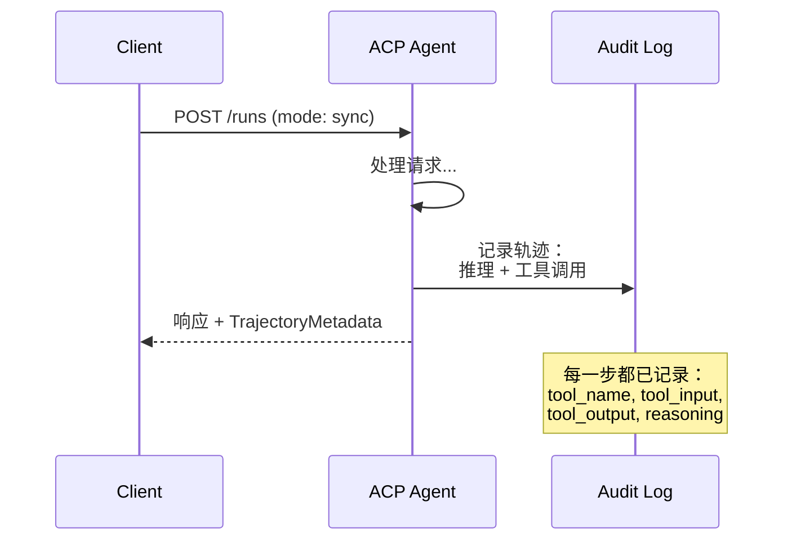

#### ACP 中的智能体发现

ACP 定义了四种发现方法：

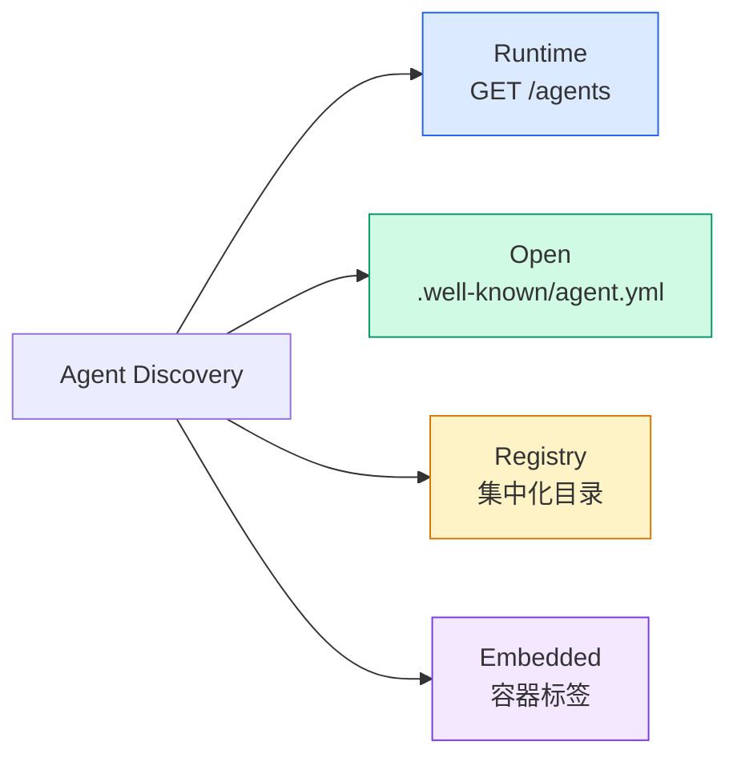

**AgentManifest** 比 A2A 的 Agent Card 更简洁：

```json
{
  "name": "summarizer",
  "description": "用来源引用总结文档",
  "input_content_types": ["text/plain", "application/pdf"],
  "output_content_types": ["text/plain", "application/json"],
  "metadata": {
    "tags": ["summarization", "RAG"],
    "framework": "BeeAI",
    "capabilities": [
      {
        "name": "文档总结",
        "description": "将长文档浓缩为关键点"
      }
    ],
    "recommended_models": ["llama3.3:70b-instruct-fp16"],
    "license": "Apache-2.0",
    "programming_language": "Python"
  }
}
```

#### 运行生命周期

ACP 使用 "Runs" 而非 "Tasks"。Run 是智能体执行，有三种模式：

| 模式 | 行为 |
|---|---|
| `sync` | 阻塞。响应包含完整结果。 |
| `async` | 立即返回 202。轮询 `GET /runs/{id}` 获取状态。 |
| `stream` | SSE 流。智能体工作时触发事件。 |

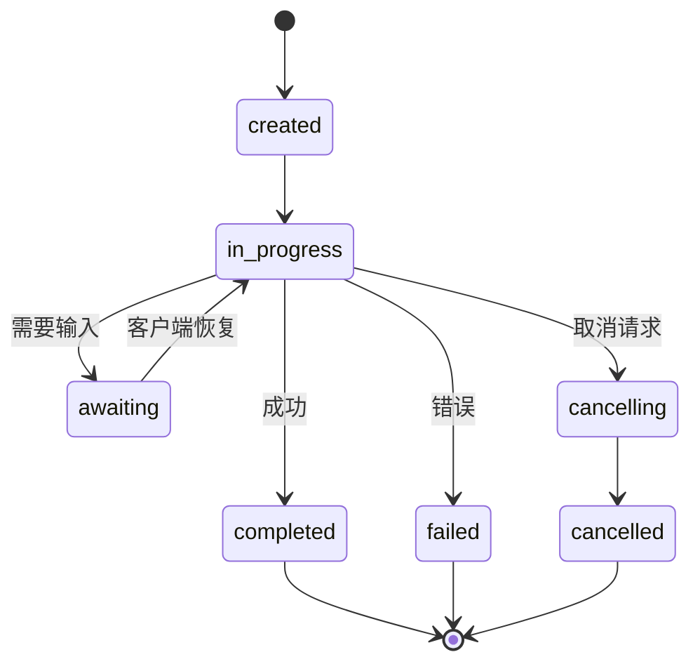

#### TrajectoryMetadata（审计追踪）

这是 ACP 的关键差异化特性。每条消息部分都可以包含元数据，精确显示智能体做了什么：

```json
{
  "role": "agent/researcher",
  "parts": [
    {
      "content_type": "text/plain",
      "content": "旧金山的天气是 72°F，晴朗。",
      "metadata": {
        "kind": "trajectory",
        "message": "我需要查询此位置的天气",
        "tool_name": "weather_api",
        "tool_input": { "location": "San Francisco, CA" },
        "tool_output": { "temperature": 72, "condition": "sunny" }
      }
    }
  ]
}
```

对于受监管行业来说，这是金矿。每个答案都带有可证明的推理链：调用了哪些工具、使用了什么输入、收到了什么输出。不是黑箱。

ACP 还支持用于来源归因的 **CitationMetadata**：

```json
{
  "kind": "citation",
  "start_index": 0,
  "end_index": 47,
  "url": "https://weather.gov/sf",
  "title": "NWS 旧金山预报"
}
```

### ANP（Agent Network Protocol）

**创建者：** 开源社区（由 GaoWei Chang 创立）
**仓库：** [github.com/agent-network-protocol/AgentNetworkProtocol](https://github.com/agent-network-protocol/AgentNetworkProtocol)
**问题：** 来自不同组织的智能体如何在没有中央权威的情况下相互信任？

ANP 是**去中心化身份协议**。它使用 W3C 去中心化标识符（DID）和端到端加密构建信任。与 A2A 通过已知端点发现智能体不同，ANP 让智能体以密码学方式证明其身份。

ANP 有三层：

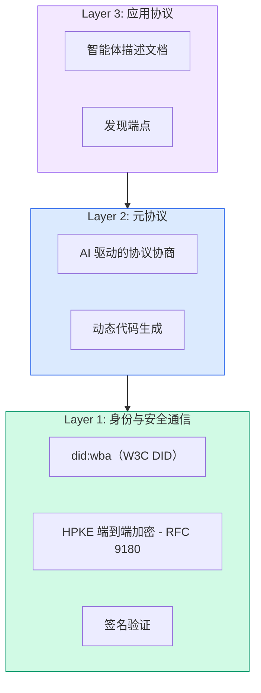

#### DID 文档（真实结构）

ANP 使用名为 `did:wba`（基于 Web 的智能体）的自定义 DID 方法。DID `did:wba:example.com:user:alice` 解析为 `https://example.com/user/alice/did.json`：

```json
{
  "@context": [
    "https://www.w3.org/ns/did/v1",
    "https://w3id.org/security/suites/jws-2020/v1",
    "https://w3id.org/security/suites/secp256k1-2019/v1"
  ],
  "id": "did:wba:example.com:user:alice",
  "verificationMethod": [
    {
      "id": "did:wba:example.com:user:alice#key-1",
      "type": "EcdsaSecp256k1VerificationKey2019",
      "controller": "did:wba:example.com:user:alice",
      "publicKeyJwk": {
        "crv": "secp256k1",
        "x": "NtngWpJUr-rlNNbs0u-Aa8e16OwSJu6UiFf0Rdo1oJ4",
        "y": "qN1jKupJlFsPFc1UkWinqljv4YE0mq_Ickwnjgasvmo",
        "kty": "EC"
      }
    },
    {
      "id": "did:wba:example.com:user:alice#key-x25519-1",
      "type": "X25519KeyAgreementKey2019",
      "controller": "did:wba:example.com:user:alice",
      "publicKeyMultibase": "z9hFgmPVfmBZwRvFEyniQDBkz9LmV7gDEqytWyGZLmDXE"
    }
  ],
  "authentication": [
    "did:wba:example.com:user:alice#key-1"
  ],
  "keyAgreement": [
    "did:wba:example.com:user:alice#key-x25519-1"
  ],
  "humanAuthorization": [
    "did:wba:example.com:user:alice#key-1"
  ],
  "service": [
    {
      "id": "did:wba:example.com:user:alice#agent-description",
      "type": "AgentDescription",
      "serviceEndpoint": "https://example.com/agents/alice/ad.json"
    }
  ]
}
```

需要注意的关键点：
- **密钥分离**是强制性的。签名密钥（secp256k1）与加密密钥（X25519）分开。
- **`humanAuthorization`** 是 ANP 独有的。这些密钥需要明确的人类批准（生物识别、密码、HSM）才能使用。高风险操作如资金转账经过此路径。
- **`keyAgreement`** 密钥用于 HPKE 端到端加密（RFC 9180）。
- **service** 部分链接到 Agent Description 文档。

#### ANP 中的信任如何工作

ANP **不**使用信任网络或背书图谱。信任是双向的，每次交互独立验证：

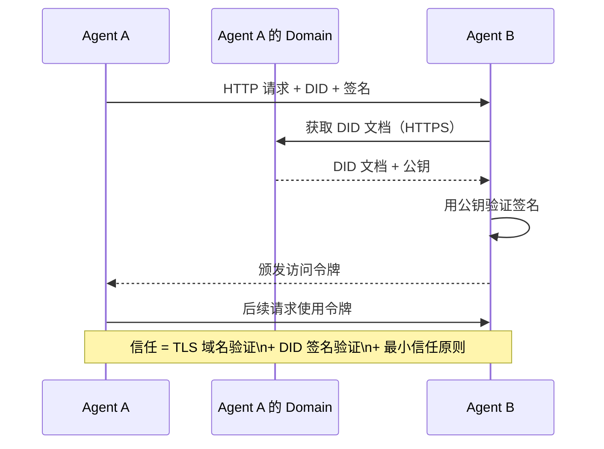

信任来自三个来源：
1. **域名级别 TLS** 验证 DID 文档主机
2. **DID 密码学签名** 验证智能体的身份
3. **最小信任原则** 仅授予最低权限

没有基于流言的信任传播或 PageRank 评分。你通过其 DID 直接验证每个智能体。

#### 元协议协商

这是 ANP 最新颖的特性。当来自不同生态系统的两个智能体相遇时，它们不需要预先约定数据格式。它们用自然语言协商：

```json
{
  "action": "protocolNegotiation",
  "sequenceId": 0,
  "candidateProtocols": "我可以使用以下方式通信：\n1. 使用酒店预订模式的 JSON-RPC\n2. 使用 OpenAPI 3.1 规范的 REST\n3. 通过 HTTP 的自然语言",
  "modificationSummary": "初始提议",
  "status": "negotiating"
}
```

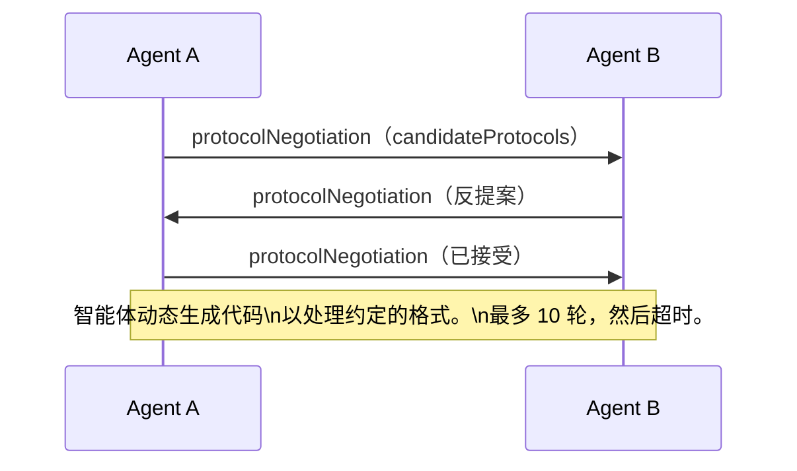

智能体来回协商（最多 10 轮），直到就格式达成一致，然后动态生成代码来处理它。状态值：`negotiating`、`rejected`、`accepted`、`timeout`。

这意味着两个从未见过面的智能体可以无需任何人预定义共享模式就找出如何通信。

### 比较（修正版）

| | MCP | A2A | ACP | ANP |
|---|---|---|---|---|
| **创建者** | Anthropic | Google / Linux Foundation | IBM / BeeAI | 社区 |
| **规范格式** | JSON-RPC | JSON-RPC / REST / gRPC | OpenAPI 3.1（REST） | JSON-RPC |
| **主要用途** | 智能体到工具 | 智能体到智能体 | 智能体到智能体 | 智能体到智能体 |
| **发现** | 工具列表 | `/.well-known/agent-card.json` | `GET /agents`、`/.well-known/agent.yml` | `/.well-known/agent-descriptions`、DID 服务端点 |
| **身份** | 隐式（本地） | 安全方案（OAuth、mTLS） | 服务器级别 | W3C DID（`did:wba`）加端到端加密 |
| **审计轨迹** | 无 | 基本（任务历史） | TrajectoryMetadata（工具调用、推理） | 未正式规定 |
| **状态机** | 无 | 9 个任务状态 | 7 个运行状态 | 无 |
| **流式传输** | 无 | SSE | SSE | 传输无关 |
| **独特特性** | 工具模式 | Agent Cards + Skills | 轨迹审计轨迹 | 元协议协商 |
| **最适合** | 工具和数据 | 动态协作 | 受监管行业 | 跨组织信任 |
| **状态** | 稳定 | 稳定（v1.0） | 正在合并到 A2A | 活跃开发中 |

### 它们如何协同工作

这些协议并非互斥。一个真实的企业系统会使用多个：

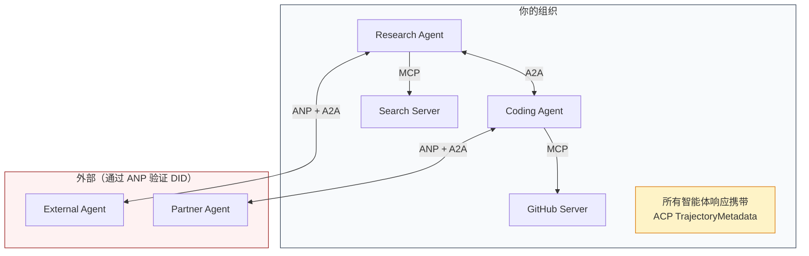

- **MCP** 将每个智能体连接到其工具
- **A2A** 处理智能体间的协作（内部和外部）
- **ACP** 将响应包装在轨迹元数据中以实现可审计性
- **ANP** 为你不控制的智能体提供身份验证

## 构建

### 第 1 步：核心消息类型

每个多智能体系统都从消息格式开始。我们定义映射到真实协议所使用的类型：

```typescript
import crypto from "node:crypto";

type MessageRole = "user" | "agent";

type MessagePart =
  | { kind: "text"; text: string }
  | { kind: "data"; data: unknown; mediaType: string }
  | { kind: "file"; name: string; url: string; mediaType: string };

type TrajectoryEntry = {
  reasoning: string;
  toolName?: string;
  toolInput?: unknown;
  toolOutput?: unknown;
  timestamp: number;
};

type AgentMessage = {
  id: string;
  role: MessageRole;
  parts: MessagePart[];
  trajectory?: TrajectoryEntry[];
  replyTo?: string;
  timestamp: number;
};

function createMessage(
  role: MessageRole,
  parts: MessagePart[],
  replyTo?: string
): AgentMessage {
  return {
    id: crypto.randomUUID(),
    role,
    parts,
    replyTo,
    timestamp: Date.now(),
  };
}

function textMessage(role: MessageRole, text: string): AgentMessage {
  return createMessage(role, [{ kind: "text", text }]);
}
```

注意：`MessagePart` 是多模态的（文本、结构化数据、文件），就像真实的 A2A 和 ACP 规范一样。`TrajectoryEntry` 捕获推理链，匹配 ACP 的 TrajectoryMetadata。

### 第 2 步：A2A Agent Card 和注册表

构建匹配真实 A2A 规范的智能体发现：

```typescript
type Skill = {
  id: string;
  name: string;
  description: string;
  tags: string[];
  inputModes: string[];
  outputModes: string[];
};

type AgentCard = {
  name: string;
  description: string;
  version: string;
  url: string;
  capabilities: {
    streaming: boolean;
    pushNotifications: boolean;
  };
  defaultInputModes: string[];
  defaultOutputModes: string[];
  skills: Skill[];
};

class AgentRegistry {
  private cards: Map<string, AgentCard> = new Map();

  register(card: AgentCard) {
    this.cards.set(card.name, card);
  }

  discoverBySkillTag(tag: string): AgentCard[] {
    return [...this.cards.values()].filter((card) =>
      card.skills.some((skill) => skill.tags.includes(tag))
    );
  }

  discoverByInputMode(mimeType: string): AgentCard[] {
    return [...this.cards.values()].filter(
      (card) =>
        card.defaultInputModes.includes(mimeType) ||
        card.skills.some((skill) => skill.inputModes.includes(mimeType))
    );
  }

  resolve(name: string): AgentCard | undefined {
    return this.cards.get(name);
  }

  listAll(): AgentCard[] {
    return [...this.cards.values()];
  }
}
```

这比简单的名称到能力映射要丰富得多。你可以按技能标签、输入 MIME 类型或名称发现智能体，就像真实的 A2A 规范所支持的那样。

### 第 3 步：A2A 任务生命周期

构建完整的任务状态机：

```typescript
type TaskState =
  | "submitted"
  | "working"
  | "input-required"
  | "auth-required"
  | "completed"
  | "failed"
  | "canceled"
  | "rejected";

const TERMINAL_STATES: TaskState[] = [
  "completed",
  "failed",
  "canceled",
  "rejected",
];

type TaskStatus = {
  state: TaskState;
  message?: AgentMessage;
  timestamp: number;
};

type Artifact = {
  id: string;
  name: string;
  parts: MessagePart[];
};

type Task = {
  id: string;
  contextId: string;
  status: TaskStatus;
  artifacts: Artifact[];
  history: AgentMessage[];
};

type TaskEvent =
  | { kind: "statusUpdate"; taskId: string; status: TaskStatus }
  | {
      kind: "artifactUpdate";
      taskId: string;
      artifact: Artifact;
      append: boolean;
      lastChunk: boolean;
    };

type TaskHandler = (
  task: Task,
  message: AgentMessage
) => AsyncGenerator<TaskEvent>;

class TaskManager {
  private tasks: Map<string, Task> = new Map();
  private handlers: Map<string, TaskHandler> = new Map();
  private listeners: Map<string, ((event: TaskEvent) => void)[]> = new Map();

  registerHandler(agentName: string, handler: TaskHandler) {
    this.handlers.set(agentName, handler);
  }

  subscribe(taskId: string, listener: (event: TaskEvent) => void) {
    const existing = this.listeners.get(taskId) ?? [];
    existing.push(listener);
    this.listeners.set(taskId, existing);
  }

  async sendMessage(
    agentName: string,
    message: AgentMessage,
    contextId?: string
  ): Promise<Task> {
    const handler = this.handlers.get(agentName);
    if (!handler) {
      const task = this.createTask(contextId);
      task.status = {
        state: "rejected",
        timestamp: Date.now(),
        message: textMessage("agent", `No handler for ${agentName}`),
      };
      return task;
    }

    const task = this.createTask(contextId);
    task.history.push(message);
    task.status = { state: "submitted", timestamp: Date.now() };

    this.processTask(task, handler, message).catch((err) => {
      task.status = {
        state: "failed",
        timestamp: Date.now(),
        message: textMessage("agent", String(err)),
      };
    });
    return task;
  }

  getTask(taskId: string): Task | undefined {
    return this.tasks.get(taskId);
  }

  cancelTask(taskId: string): boolean {
    const task = this.tasks.get(taskId);
    if (!task || TERMINAL_STATES.includes(task.status.state)) return false;
    task.status = { state: "canceled", timestamp: Date.now() };
    this.emit(taskId, {
      kind: "statusUpdate",
      taskId,
      status: task.status,
    });
    return true;
  }

  private createTask(contextId?: string): Task {
    const task: Task = {
      id: crypto.randomUUID(),
      contextId: contextId ?? crypto.randomUUID(),
      status: { state: "submitted", timestamp: Date.now() },
      artifacts: [],
      history: [],
    };
    this.tasks.set(task.id, task);
    return task;
  }

  private async processTask(
    task: Task,
    handler: TaskHandler,
    message: AgentMessage
  ) {
    task.status = { state: "working", timestamp: Date.now() };
    this.emit(task.id, {
      kind: "statusUpdate",
      taskId: task.id,
      status: task.status,
    });

    try {
      for await (const event of handler(task, message)) {
        if (TERMINAL_STATES.includes(task.status.state)) break;

        if (event.kind === "statusUpdate") {
          task.status = event.status;
        }
        if (event.kind === "artifactUpdate") {
          const existing = task.artifacts.find(
            (a) => a.id === event.artifact.id
          );
          if (existing && event.append) {
            existing.parts.push(...event.artifact.parts);
          } else {
            task.artifacts.push(event.artifact);
          }
        }
        this.emit(task.id, event);
      }
    } catch (err) {
      task.status = {
        state: "failed",
        timestamp: Date.now(),
        message: textMessage("agent", String(err)),
      };
      this.emit(task.id, {
        kind: "statusUpdate",
        taskId: task.id,
        status: task.status,
      });
    }
  }

  private emit(taskId: string, event: TaskEvent) {
    for (const listener of this.listeners.get(taskId) ?? []) {
      listener(event);
    }
  }
}
```

这实现了真实的 A2A 任务生命周期：已提交、工作中、需要输入、终端状态。处理程序是生成事件（状态更新和制品块）的异步生成器，匹配 SSE 流式传输模型。

### 第 4 步：ACP 风格审计轨迹

用轨迹跟踪包装通信：

```typescript
type AuditEntry = {
  runId: string;
  agentName: string;
  input: AgentMessage[];
  output: AgentMessage[];
  trajectory: TrajectoryEntry[];
  status: "created" | "in-progress" | "completed" | "failed" | "awaiting";
  startedAt: number;
  completedAt?: number;
  sessionId?: string;
};

class AuditableRunner {
  private log: AuditEntry[] = [];
  private handlers: Map<
    string,
    (input: AgentMessage[]) => Promise<{
      output: AgentMessage[];
      trajectory: TrajectoryEntry[];
    }>
  > = new Map();

  registerAgent(
    name: string,
    handler: (input: AgentMessage[]) => Promise<{
      output: AgentMessage[];
      trajectory: TrajectoryEntry[];
    }>
  ) {
    this.handlers.set(name, handler);
  }

  async run(
    agentName: string,
    input: AgentMessage[],
    sessionId?: string
  ): Promise<AuditEntry> {
    const entry: AuditEntry = {
      runId: crypto.randomUUID(),
      agentName,
      input: structuredClone(input),
      output: [],
      trajectory: [],
      status: "created",
      startedAt: Date.now(),
      sessionId,
    };
    this.log.push(entry);

    const handler = this.handlers.get(agentName);
    if (!handler) {
      entry.status = "failed";
      return entry;
    }

    entry.status = "in-progress";
    try {
      const result = await handler(input);
      entry.output = structuredClone(result.output);
      entry.trajectory = structuredClone(result.trajectory);
      entry.status = "completed";
      entry.completedAt = Date.now();
    } catch (err) {
      entry.status = "failed";
      entry.trajectory.push({
        reasoning: `Error: ${String(err)}`,
        timestamp: Date.now(),
      });
      entry.completedAt = Date.now();
    }
    return entry;
  }

  getFullAuditLog(): AuditEntry[] {
    return structuredClone(this.log);
  }

  getAuditLogForAgent(agentName: string): AuditEntry[] {
    return structuredClone(
      this.log.filter((e) => e.agentName === agentName)
    );
  }

  getAuditLogForSession(sessionId: string): AuditEntry[] {
    return structuredClone(
      this.log.filter((e) => e.sessionId === sessionId)
    );
  }

  getTrajectoryForRun(runId: string): TrajectoryEntry[] {
    const entry = this.log.find((e) => e.runId === runId);
    return entry ? structuredClone(entry.trajectory) : [];
  }
}
```

每个智能体执行产生完整的审计条目：输入了什么、输出了什么、以及中间的工具调用和推理步骤的完整轨迹。你可以按智能体、按会话或按单个运行查询。

### 第 5 步：ANP 风格身份验证

构建基于 DID 的身份和验证：

```typescript
type VerificationMethod = {
  id: string;
  type: string;
  controller: string;
  publicKeyDer: string;
};

type DIDDocument = {
  id: string;
  verificationMethod: VerificationMethod[];
  authentication: string[];
  keyAgreement: string[];
  humanAuthorization: string[];
  service: { id: string; type: string; serviceEndpoint: string }[];
};

type AgentIdentity = {
  did: string;
  document: DIDDocument;
  privateKey: crypto.KeyObject;
  publicKey: crypto.KeyObject;
};

class IdentityRegistry {
  private documents: Map<string, DIDDocument> = new Map();

  publish(doc: DIDDocument) {
    this.documents.set(doc.id, doc);
  }

  resolve(did: string): DIDDocument | undefined {
    return this.documents.get(did);
  }

  verify(did: string, signature: string, payload: string): boolean {
    const doc = this.documents.get(did);
    if (!doc) return false;

    const authKeyIds = doc.authentication;
    const authKeys = doc.verificationMethod.filter((vm) =>
      authKeyIds.includes(vm.id)
    );

    for (const key of authKeys) {
      const publicKey = crypto.createPublicKey({
        key: Buffer.from(key.publicKeyDer, "base64"),
        format: "der",
        type: "spki",
      });
      const isValid = crypto.verify(
        null,
        Buffer.from(payload),
        publicKey,
        Buffer.from(signature, "hex")
      );
      if (isValid) return true;
    }
    return false;
  }

  requiresHumanAuth(did: string, operationKeyId: string): boolean {
    const doc = this.documents.get(did);
    if (!doc) return false;
    return doc.humanAuthorization.includes(operationKeyId);
  }
}

function createIdentity(domain: string, agentName: string): AgentIdentity {
  const did = `did:wba:${domain}:agent:${agentName}`;
  const { publicKey, privateKey } = crypto.generateKeyPairSync("ed25519");

  const publicKeyDer = publicKey
    .export({ format: "der", type: "spki" })
    .toString("base64");

  const keyId = `${did}#key-1`;
  const encKeyId = `${did}#key-x25519-1`;

  const document: DIDDocument = {
    id: did,
    verificationMethod: [
      {
        id: keyId,
        type: "Ed25519VerificationKey2020",
        controller: did,
        publicKeyDer,
      },
      {
        id: encKeyId,
        type: "X25519KeyAgreementKey2019",
        controller: did,
        publicKeyDer,
      },
    ],
    authentication: [keyId],
    keyAgreement: [encKeyId],
    humanAuthorization: [],
    service: [
      {
        id: `${did}#agent-description`,
        type: "AgentDescription",
        serviceEndpoint: `https://${domain}/agents/${agentName}/ad.json`,
      },
    ],
  };

  return { did, document, privateKey, publicKey };
}

function signPayload(identity: AgentIdentity, payload: string): string {
  return crypto
    .sign(null, Buffer.from(payload), identity.privateKey)
    .toString("hex");
}
```

这反映了真实的 ANP 身份模型：智能体具有 DID 文档，包含独立的认证、密钥协议和人类授权密钥。`IdentityRegistry` 模拟 DID 解析（在生产中这将是对智能体域名的 HTTP 获取）。

### 第 6 步：协议网关

将所有四种协议连接到统一系统中：

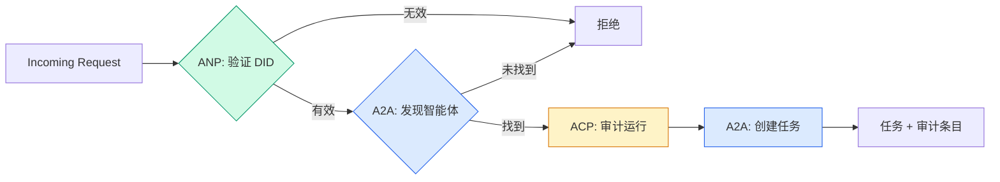

```typescript
class ProtocolGateway {
  private registry: AgentRegistry;
  private taskManager: TaskManager;
  private auditRunner: AuditableRunner;
  private identityRegistry: IdentityRegistry;

  constructor(
    registry: AgentRegistry,
    taskManager: TaskManager,
    auditRunner: AuditableRunner,
    identityRegistry: IdentityRegistry
  ) {
    this.registry = registry;
    this.taskManager = taskManager;
    this.auditRunner = auditRunner;
    this.identityRegistry = identityRegistry;
  }

  async delegateTask(
    fromDid: string,
    signature: string,
    targetAgent: string,
    message: AgentMessage,
    sessionId?: string
  ): Promise<{ task: Task; audit: AuditEntry } | { error: string }> {
    if (!this.identityRegistry.verify(fromDid, signature, message.id)) {
      return { error: "Identity verification failed" };
    }

    const card = this.registry.resolve(targetAgent);
    if (!card) {
      return { error: `Agent ${targetAgent} not found in registry` };
    }

    const audit = await this.auditRunner.run(
      targetAgent,
      [message],
      sessionId
    );
    const task = await this.taskManager.sendMessage(targetAgent, message);

    return { task, audit };
  }

  discoverAndDelegate(
    fromDid: string,
    signature: string,
    skillTag: string,
    message: AgentMessage
  ): Promise<{ task: Task; audit: AuditEntry } | { error: string }> {
    const candidates = this.registry.discoverBySkillTag(skillTag);
    if (candidates.length === 0) {
      return Promise.resolve({
        error: `No agents found with skill tag: ${skillTag}`,
      });
    }
    return this.delegateTask(
      fromDid,
      signature,
      candidates[0].name,
      message
    );
  }
}
```

网关在一次调用中做四件事：
1. **ANP**：通过 DID 签名验证调用者的身份
2. **A2A**：发现目标智能体并检查能力
3. **ACP**：将执行包装在含有轨迹的审计追踪中
4. **A2A**：创建具有完整生命周期跟踪的任务

### 第 7 步：全部串联

```typescript
async function protocolDemo() {
  const registry = new AgentRegistry();
  registry.register({
    name: "researcher",
    description: "搜索并总结发现",
    version: "1.0.0",
    url: "https://researcher.local/a2a/v1",
    capabilities: { streaming: true, pushNotifications: false },
    defaultInputModes: ["text/plain"],
    defaultOutputModes: ["text/plain", "application/json"],
    skills: [
      {
        id: "web-research",
        name: "Web Research",
        description: "搜索网络",
        tags: ["research", "search", "summarization"],
        inputModes: ["text/plain"],
        outputModes: ["application/json"],
      },
    ],
  });
  registry.register({
    name: "coder",
    description: "根据规范编写代码",
    version: "1.0.0",
    url: "https://coder.local/a2a/v1",
    capabilities: { streaming: false, pushNotifications: false },
    defaultInputModes: ["text/plain", "application/json"],
    defaultOutputModes: ["text/plain"],
    skills: [
      {
        id: "code-gen",
        name: "Code Generation",
        description: "生成代码",
        tags: ["coding", "generation"],
        inputModes: ["text/plain", "application/json"],
        outputModes: ["text/plain"],
      },
    ],
  });

  const taskManager = new TaskManager();
  const auditRunner = new AuditableRunner();

  const researchTrajectory: TrajectoryEntry[] = [];

  taskManager.registerHandler(
    "researcher",
    async function* (task, message) {
      yield {
        kind: "statusUpdate" as const,
        taskId: task.id,
        status: { state: "working" as const, timestamp: Date.now() },
      };

      researchTrajectory.push({
        reasoning: "Searching for React 19 documentation",
        toolName: "web_search",
        toolInput: { query: "React 19 compiler features" },
        toolOutput: {
          results: ["react.dev/blog/react-19", "github.com/react/react"],
        },
        timestamp: Date.now(),
      });

      researchTrajectory.push({
        reasoning: "Extracting key findings from search results",
        toolName: "doc_analysis",
        toolInput: { url: "react.dev/blog/react-19" },
        toolOutput: {
          summary:
            "React 19 compiler auto-memoizes, no manual useMemo needed",
        },
        timestamp: Date.now(),
      });

      yield {
        kind: "artifactUpdate" as const,
        taskId: task.id,
        artifact: {
          id: crypto.randomUUID(),
          name: "research-results",
          parts: [
            {
              kind: "data" as const,
              data: {
                findings: [
                  "React 19 compiler auto-memoizes components",
                  "No more manual useMemo/useCallback needed",
                  "Compiler runs at build time, not runtime",
                ],
                sources: ["react.dev/blog/react-19"],
              },
              mediaType: "application/json",
            },
          ],
        },
        append: false,
        lastChunk: true,
      };

      yield {
        kind: "statusUpdate" as const,
        taskId: task.id,
        status: { state: "completed" as const, timestamp: Date.now() },
      };
    }
  );

  auditRunner.registerAgent("researcher", async () => ({
    output: [
      textMessage("agent", "React 19 compiler auto-memoizes components"),
    ],
    trajectory: researchTrajectory,
  }));

  const identityRegistry = new IdentityRegistry();

  const coderIdentity = createIdentity("coder.local", "coder");
  const researcherIdentity = createIdentity("researcher.local", "researcher");

  identityRegistry.publish(coderIdentity.document);
  identityRegistry.publish(researcherIdentity.document);

  const gateway = new ProtocolGateway(
    registry,
    taskManager,
    auditRunner,
    identityRegistry
  );

  console.log("=== Protocol Demo ===\n");

  console.log("1. Agent Discovery (A2A)");
  const researchAgents = registry.discoverBySkillTag("research");
  console.log(
    "   Found ${researchAgents.length} agent(s):",
    researchAgents.map((a) => a.name)
  );

  console.log("\n2. Identity Verification (ANP)");
  const message = textMessage("user", "Research React 19 compiler features");
  const signature = signPayload(coderIdentity, message.id);
  const verified = identityRegistry.verify(
    coderIdentity.did,
    signature,
    message.id
  );
  console.log("   Coder DID: ${coderIdentity.did}");
  console.log("   Signature verified: ${verified}");

  console.log("\n3. Task Delegation (A2A + ACP + ANP)");
  const result = await gateway.delegateTask(
    coderIdentity.did,
    signature,
    "researcher",
    message,
    "session-001"
  );

  if ("error" in result) {
    console.log("   Error: ${result.error}");
    return;
  }

  console.log("   Task ID: ${result.task.id}");
  console.log("   Task state: ${result.task.status.state}");
  console.log("   Artifacts: ${result.task.artifacts.length}");

  console.log("\n4. Audit Trail (ACP)");
  console.log("   Run ID: ${result.audit.runId}");
  console.log("   Status: ${result.audit.status}");
  console.log("   Trajectory steps: ${result.audit.trajectory.length}");
  for (const step of result.audit.trajectory) {
    console.log("     - ${step.reasoning}");
    if (step.toolName) {
      console.log("       Tool: ${step.toolName}");
    }
  }

  console.log("\n5. Full Audit Log");
  const fullLog = auditRunner.getFullAuditLog();
  console.log("   Total runs: ${fullLog.length}");
  for (const entry of fullLog) {
    const duration = entry.completedAt
      ? "${entry.completedAt - entry.startedAt}ms"
      : "in-progress";
    console.log("   ${entry.agentName}: ${entry.status} (${duration})");
  }
}

protocolDemo().catch((err) => {
  console.error("Protocol demo failed:", err);
  process.exitCode = 1;
});
```

## 什么会出错

协议解决了快乐路径。以下是生产中会出问题的地方：

**模式漂移。** 智能体 A 发布了一个宣传 `application/json` 输出的 Agent Card。但 JSON schema 在版本间变化了。智能体 B 解析旧格式并得到垃圾数据。修复：对你的技能和输出模式进行版本控制。A2A 规范支持 Agent Card 上的 `version` 正是为此。

**状态机违规。** 一个智能体处理函数生成了 `completed` 事件，然后试图生成更多制品。任务是不可变的。你的代码静默丢弃更新或抛出异常。修复：在生成前检查终端状态。上面的 `TaskManager` 通过在终端状态后 `break` 来强制执行这一点。

**信任解析失败。** 智能体 A 试图验证智能体 B 的 DID，但智能体 B 的域名宕机了。DID 文档无法获取。你是故障开放（接受未验证的智能体）还是故障关闭（拒绝所有）？ANP 建议使用最小信任原则进行故障关闭。

**轨迹膨胀。** ACP 轨迹日志功能强大但昂贵。一个每次运行进行 200 次工具调用的复杂智能体会产生巨大的审计条目。修复：以可配置的详细程度级别记录轨迹。记录合规所需的工具名称和 IO，对非受监管工作负载跳过推理步骤。

**发现惊群效应。** 50 个智能体同时在启动时查询 `GET /agents`。修复：使用 TTL 缓存 Agent Card，错开发现间隔，或使用推送式注册而非轮询。

## 使用

### 真实实现

**A2A** 是最成熟的。Google 的[官方规范](https://github.com/google/A2A)在 Linux 基金会下开源。提供 Python 和 TypeScript 的 SDK。如果你的智能体需要动态发现和协作，从这里开始。

**ACP** 正在合并到 A2A。IBM 的 [BeeAI 项目](https://github.com/i-am-bee/acp)创建了 ACP 作为 REST 优先的替代方案，但轨迹元数据概念正被吸收到 A2A 生态系统中。即使你使用 A2A 作为传输层，也使用 ACP 模式（轨迹日志、运行生命周期）。

**ANP** 是最实验性的。[社区仓库](https://github.com/agent-network-protocol/AgentNetworkProtocol)有一个 Python SDK（AgentConnect）。元协议协商概念是真正新颖的。值得关注跨组织智能体部署。

**MCP** 已在 Phase 13 中介绍过。如果你希望智能体使用工具，MCP 是标准。

### 选择正确的协议

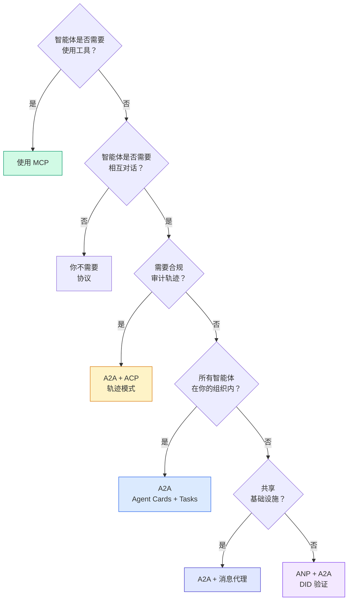

## 交付

本课程产出：
- `code/main.ts`——所有四种协议模式的完整实现
- `outputs/prompt-protocol-selector.md`——帮助为你的系统选择协议的 prompt

## 练习

1. **多跳任务委派。** 扩展 `TaskManager`，使智能体处理函数可以将子任务委派给其他智能体。研究者接收一个任务，将「搜索」和「总结」子任务委派给两个专家智能体，等待两者完成，然后将结果合并到自己的制品中。

2. **流式审计轨迹。** 修改 `AuditableRunner` 以支持流式模式。不等待完整结果，而是在添加轨迹条目时实时生成 `AuditEntry` 更新。使用生成审计快照的异步生成器。

3. **DID 轮换。** 为 `IdentityRegistry` 添加密钥轮换。智能体应能发布带有更新密钥的新 DID 文档，同时保留 `previousDid` 引用。验证者应在宽限期内接受当前和先前密钥的签名。

4. **协议协商。** 实现 ANP 的元协议概念。两个智能体交换带有候选格式的 `protocolNegotiation` 消息（例如，「我可以说 JSON-RPC」与「我更喜欢 REST」）。最多 3 轮后，它们就格式达成一致或超时。约定的格式决定了它们使用哪个 `TaskManager` 或 `AuditableRunner`。

5. **限速发现。** 添加一个 `RateLimitedRegistry` 包装器，缓存 Agent Card 查找并带有可配置的 TTL，并限制每个智能体每秒的发现查询次数。模拟 100 个智能体在启动时相互发现的惊群效应，并测量差异。

## 关键术语

| 术语 | 通俗说法 | 实际含义 |
|---|---|---|
| MCP | "AI 工具的协议" | 智能体发现和使用工具的客户端-服务器协议。智能体到工具，而非智能体到智能体。 |
| A2A | "Google 的智能体协议" | Linux 基金会下的点对点智能体协作协议。通过 Agent Card 发现，9 状态任务生命周期，通过 SSE 流式传输。支持 JSON-RPC、REST 和 gRPC 绑定。 |
| ACP | "企业智能体消息" | IBM/BeeAI 的 REST API，用于带有 TrajectoryMetadata 的智能体运行：每个响应携带完整的推理链和工具调用。正在合并到 A2A。 |
| ANP | "去中心化智能体身份" | 使用 `did:wba`（DID）实现密码学身份、HPKE 端到端加密，以及 AI 驱动的元协议协商的社区协议，适用于从未谋面的智能体。 |
| Agent Card | "智能体的名片" | `/.well-known/agent-card.json` 处的 JSON 文档，描述技能、支持的 MIME 类型、安全方案和协议绑定。 |
| DID | "去中心化 ID" | W3C 标准，用于在智能体自己的域名上托管密码学可验证的身份。ANP 使用 `did:wba` 方法。 |
| TrajectoryMetadata | "审计收据" | ACP 用于将推理步骤、工具调用及其输入/输出附加到每个智能体响应的机制。 |
| 元协议 | "智能体协商如何对话" | ANP 的方法，智能体使用自然语言动态约定数据格式，然后生成代码来处理它们。 |
| Task | "工作单元" | A2A 的有状态对象，跟踪工作从提交到完成。一旦到达终端状态即不可变。 |

## 延伸阅读

- [Google A2A specification](https://github.com/google/A2A)——官方规范和 SDK（v1.0.0，Linux 基金会）
- [IBM/BeeAI ACP specification](https://github.com/i-am-bee/acp)——用于智能体运行和轨迹元数据的 OpenAPI 3.1 规范
- [Agent Network Protocol](https://github.com/agent-network-protocol/AgentNetworkProtocol)——基于 DID 的身份、端到端加密、元协议协商
- [Model Context Protocol docs](https://modelcontextprotocol.io/)——Anthropic 的 MCP 规范（在 Phase 13 中介绍）
- [W3C Decentralized Identifiers](https://www.w3.org/TR/did-core/)——支撑 ANP 的身份标准
- [RFC 9180 (HPKE)](https://www.rfc-editor.org/rfc/rfc9180)——ANP 用于端到端加密的加密方案
- [FIPA Agent Communication Language](http://www.fipa.org/specs/fipa00061/SC00061G.html)——现代智能体协议的学术先驱
