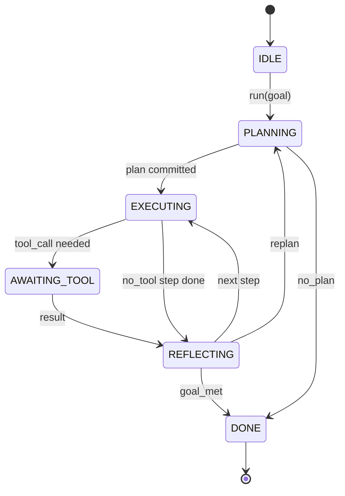

# 智能体框架循环契约

> 框架就是智能体。模型是一个协处理器。这节课固化了一个循环契约，你可以将任何模型接入其中。

**类型:** Build
**语言:** Python
**前置要求:** Phase 13 课程 01-07、Phase 14 课程 01
**时间:** ~90 分钟

## 学习目标
- 将智能体框架循环描述为一个确定性状态机，具有显式转换。
- 实现十个生命周期钩子主题，操作者可以将策略、遥测和护栏接入其中。
- 定义两个拉取点，循环在此处将控制权交还给调用者，并在收到新输入时恢复。
- 强制执行每会话预算（轮次、工具调用、墙上时钟时间），并在超出时不泄露部分状态。
- 发出十一种事件类型的类型化流，以便下游 UI 和追踪器可以订阅，而无需直接检查循环。

## 框架

一个可以无人值守运行 40 轮的编码智能体并不是一个聊天循环。它是一个状态机，操作者可以拦截其节点，并且可以审计其边。一旦你将契约写下来，交换模型、工具或策略就不再是重构。它变成了一个注册调用。

这节课构建了这个契约。我们命名了六个状态、十个钩子主题、两个拉取点、十一种事件类型和一个预算信封。框架中的其他一切（工具注册中心、JSON-RPC 传输、调度器、规划器）都接入这个形态。

## 状态

循环有六个状态。五个是活跃的。一个是终止态。



`IDLE` 是唯一合法的入口点。`DONE` 是唯一合法的出口。`AWAITING_TOOL` 是唯一产生拉取点的状态。其他所有转换都是内部的。

该状态机是确定性的。给定相同的事件日志，框架会重新进入相同的状态。这个属性让你可以在不重新调用模型的情况下回放会话进行调试。

## 钩子主题

钩子是操作者接入循环的接口。框架触发十个主题。每个主题接受任意数量的订阅者。订阅者按注册顺序触发。订阅者可以修改负载、提出以中止本轮，或返回一个哨兵值以跳过下一步。

```text
before_plan         after_plan
before_tool_call    after_tool_call
before_step         after_step
on_error
on_pause
on_budget_exceeded
on_complete
```

这个形态反映了 Claude Code、Cursor 和 OpenCode 在 2025 年中都收敛到的模式。这些名称是功能性的，而非品牌化的。阻止 `rm -rf` 的钩子位于 `before_tool_call`。发送 OpenTelemetry span 的钩子位于 `after_step`。在暂停会话上恢复的钩子位于 `on_pause`。

## 拉取点

循环交出控制权两次。第一次是在 `AWAITING_TOOL`，当它没有工具结果就无法推进时。第二次是在 `on_pause`，当预算耗尽或钩子明确请求人工审查时。

拉取点不是异常。它是一个返回。调用者检查框架状态，获取框架请求的任何内容，并调用 `resume(payload)`。框架从它停止的地方继续执行。这与 Python 生成器具有相同的形态。拉取点上的传输由你选择。在 TUI 中是按键。通过 MCP 是 `tools/call`。通过队列是作业轮询。

## 事件流

循环在契约中的特定点将事件追加到一个类型化流。该流是仅追加的，订阅者可以从任何偏移量重放。实现的十一种事件类型是：

- `session.start` — 在调用 `run(goal)` 时发出一次
- `plan.draft` — 在规划器返回草稿计划时发出
- `plan.commit` — 在草稿被提交为活跃计划后发出
- `step.start` — 在每个执行步骤开始时发出
- `step.end` — 在每个执行步骤结束时发出
- `tool.call` — 当需要工具的步骤将控制权交给调用者时发出
- `tool.result` — 在带有工具结果的恢复时发出
- `tool.error` — 在带有错误的恢复或钩子中止调用时发出
- `budget.warn` — 当达到预算限制时发出
- `session.pause` — 当循环在暂停（预算或钩子）时交出时发出
- `session.complete` — 当循环到达 `DONE` 时发出一次

事件不重复钩子负载。钩子是命令式的（修改、中止）。事件是观察性的（记录、发送）。将它们视为正交的。

## 预算信封

一个会话带有三个限制。轮次计数、工具调用计数、墙上时钟秒数。每轮回合次数加一。每个工具调用增加工具调用计数。每次状态转换时检查墙上时钟时间。当达到任何限制时，循环触发 `on_budget_exceeded`，发出 `budget.warn`，然后在下一个拉取点以预算超出的原因转换到 `IDLE`。

预算不是终止开关。它是一个让步。调用者决定是延长预算并继续，还是关闭会话。

## 如何阅读代码

`HarnessLoop` 是主类。它持有状态、触发钩子、发出事件。`Budget` 跟踪限制。`Event` 是流上的类型化信封。`HookRegistry` 是调度表。`_transition` 是唯一改变状态的函数，因此状态机不变量集中在一个地方。

从头到尾阅读 `main.py`。然后阅读 `code/tests/test_loop.py`。测试固定了每次转换和每个钩子的触发顺序。

## 延伸阅读

在生产环境中构建框架最困难的部分不是状态机。而是使契约可执行。契约必须经受住规划器的热重载。它必须经受住返回格式错误的 JSON 的工具。它必须经受住在一段 40 轮会话进行到三分之二时在 `before_tool_call` 中引发异常的钩子。这节课中的测试练习了这些故障模式。运行它们。破坏它们。添加用例。

下一节课添加工具注册中心。之后是 JSON-RPC 传输。之后是调度器。到第二十四节课，这个文件中的循环将针对真实工具运行真实计划，并强制执行真实预算。
