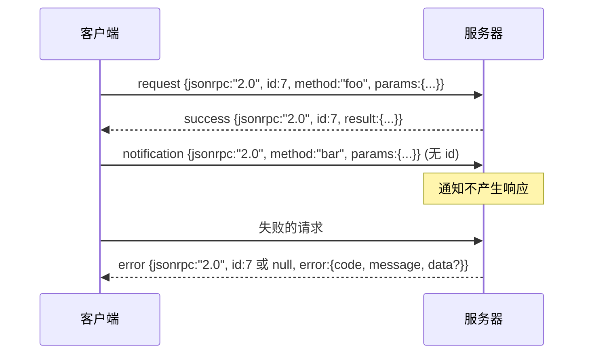

# JSON-RPC 2.0 基于换行符分隔的 Stdio

> 模型客户端和工具服务器之间的传输是 JSON-RPC over stdio。手工实现一次能教会你每个框架层在支付什么代价。

**类型:** Build
**语言:** Python
**前置要求:** Phase 13 课程 01-07、Phase 14 课程 01
**时间:** ~90 分钟

## 学习目标
- 使用基于换行符分隔的 JSON 在 stdin 和 stdout 上实现 JSON-RPC 2.0。
- 映射五个标准错误码（-32700、-32600、-32601、-32602、-32603）并以正确的语义展示它们。
- 区分请求、响应、通知和批处理，而不发明新的信封键。
- 处理每行中的一个解析错误，而不污染流的其余部分。
- 使用 io.BytesIO 构建一个自终止的演示，以便课程无需产生子进程即可运行。

## 为什么 JSON-RPC 仍然是通用语言

2026 年的编码智能体在单个会话中可能与大约十二个工具服务器通信。每个服务器是一个单独的进程或远程端点。自 2013 年以来，传输格式一直没有变过。JSON-RPC 2.0 是一个两页的规范。它能存活下来是因为替代方案（gRPC、每次调用的 HTTP、自定义二进制）都强加了 JSON-RPC 没有的权衡：它们选择了流式或批处理或传输耦合。JSON-RPC 在 stdio、sockets、websockets 和 HTTP 上是对称的，并且如果双方都遵守规范，一个客户端可以驱动它从未见过的服务器。

这节课构建了 stdio 变体。换行符分隔的 JSON。每个请求是一行。每个响应是一行。传输边界是 `\n`。

## 线缆形态

存在四种信封形态。两种由客户端使用。两种由服务器使用。



通知没有 `id`。服务器不得对其响应。如果服务器对通知返回响应，客户端无法将其附加到调用点。这一条规则保持了框架计数的简单性。

批处理是一个 JSON 数组的请求或通知。服务器回复一个响应数组，顺序任意，每个非通知条目一个。如果批处理中的每个条目都是通知，服务器不返回任何内容。

## 五个错误码

```text
-32700  Parse error        JSON 无法解析
-32600  Invalid Request    信封形态错误
-32601  Method not found
-32602  Invalid params
-32603  Internal error
```

-32000 到 -32099 之间的码保留给服务器定义的错误。其他所有都是应用定义的。这节课只使用这五个。如果你的处理程序引发异常，传输会将其包装为 -32603，并在 `data.exception` 中包含异常类名。

解析错误有一个特殊规则。响应中的 `id` 是 `null`，因为请求从未解析到足以提取 id。

## 换行符框架和 BytesIO 演示

传输每次读取一行。一行是包括 `\n` 在内的字节。如果一行无法解析，传输写入一个带有 `id: null` 的 -32700 响应并继续。流不会被污染。下一行被重新解析。

对于这节课，我们将一对 `io.BytesIO` 包装为 stdin 和 stdout。服务器读取请求直到 EOF，为每个请求写入响应，然后返回。客户端读回响应。没有进程生成。没有超时。传输行为与真实的子进程管道相同，因为 Python 的 `io` 接口呈现相同的 `.readline()` 和 `.write()` 契约。

## 方法分发

传输不知道哪些方法存在。它交给一个可调用的 `handler(method, params)`，由框架提供。处理程序返回一个结果或引发异常。三个异常类映射到特定代码。

```text
MethodNotFound -> -32601
InvalidParams  -> -32602
其他所有       -> -32603，在 data 中包含异常名
```

传输永远不会看到工具注册中心。注册中心位于处理程序后面。这就是我们想要的层次结构。传输说 JSON-RPC。注册中心说工具形态。调度器（第二十三课）将它们缝合在一起。

## 错误时的流行为

```text
客户端写入              服务器读取            服务器写入
---------------          -----------              -------------
{...有效请求...}        解析成功                {...响应, id 匹配...}
{...损坏的 JSON...      解析失败                {id:null, error: -32700}
{...有效请求...}        解析成功                {...响应, id 匹配...}
{...缺少 method...}     无效信封                {id:X, error: -32600}
```

损坏的 JSON 行不会停止循环。缺少 `method` 字段不会停止循环。处理程序异常不会停止循环。传输持续读取直到 EOF。

## 通知和非对称流

通知是即发即弃的。框架使用通知进行进度事件、取消信号和日志行。通知是长时间运行的工具无需为每个更新进行往返即可流式传输状态更新的方式。

这节课实现了一个出站通知辅助函数 `write_notification`。服务器在请求进行中使用它来发出进度。演示展示了这个模式：一个请求进来，处理程序发出两个进度通知，然后写入最终响应。

## 如何阅读代码

`code/main.py` 定义了 `StdioTransport`、解析辅助函数（`parse_request`）、三个写入辅助函数（`write_response`、`write_error`、`write_notification`）以及分发循环 `serve`。错误码常量存在于模块作用域。

`code/tests/test_transport.py` 涵盖了五个错误码、通知（不写入响应）、批处理（数组输入，数组输出，通知被跳过）、损坏的 JSON（解析错误然后继续）以及处理程序在调用期间写入通知的非对称流。

## 延伸阅读

这个传输对于后续课程来说已经足够了。生产传输添加了三样东西。一个在转发中存活的关联 ID 字段（你的 `id` 已经是这样了，但在网格中你还需要一个外部跟踪 ID）。一个取消信道（像 `$/cancelRequest` 这样的通知，带有进行中调用的 id）。以及一个内容类型协商握手，以便同一个 socket 可以同时说 JSON-RPC 和 Streamable HTTP。这些都不改变线缆。它们添加元数据。
