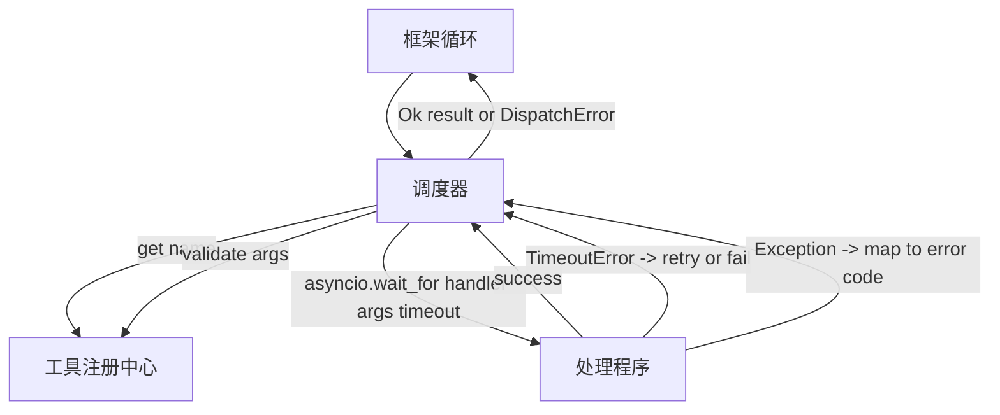

# 函数调用调度器

> 调度器是框架为模式做出的每个承诺付出代价的地方。超时、重试、去重、错误映射。全在一个接缝上。

**类型:** Build
**语言:** Python
**前置要求:** Phase 13 课程 01-07、Phase 14 课程 01
**时间:** ~90 分钟

## 学习目标
- 将工具处理程序包装在每次调用的超时中，返回类型化错误而不是挂起循环。
- 应用带抖动的指数退避重试和最大尝试次数。
- 基于幂等键对重试进行去重，以便与慢速原始请求竞争的重试不会运行两次。
- 将处理程序异常和传输故障映射到框架循环已经理解的单一错误信封上。
- 用并发限制约束并行调度，以便 40 个工具调用的扇出不会耗尽事件循环。

## 调度器的位置

位于框架循环（第二十课）和工具注册中心（第二十一课）之间。传输（第二十二课）为循环提供输入。循环将工具调用交给调度器。调度器调用注册中心，运行处理程序，并返回结果或 JSON-RPC 形状的错误信封。



调度器是唯一知道定时器、重试和幂等性的层。循环不知道。注册中心不知道。处理程序不知道。这种隔离就是重点。

## 超时

每个工具都有一个默认超时。注册中心记录携带 `timeout_ms`。当框架传入时，调度器从每次调用覆盖中覆盖它。我们使用 `asyncio.wait_for`。超时时，处理程序任务被取消，调度器返回 `DispatchError(kind="timeout")`。

对于非幂等工具，超时默认不是可重试错误。一个超时的 `db.write` 可能已经提交，也可能没有。重试会复制写入。调度器遵循注册中心记录中的 `idempotent` 标志。幂等工具重试。非幂等工具不重试。

## 带指数退避的重试

重试策略最多三次尝试。退避是指数级的，带抖动。

```text
尝试 1  -> 延迟 0
尝试 2  -> 延迟 0.1s * (1 + random[0..0.5])
尝试 3  -> 延迟 0.4s * (1 + random[0..0.5])
```

只有 `timeout` 和 `transient` 错误会重试。`schema` 错误、`not_found` 或 `internal` 错误不会重试。模式错误是确定性的。重试不会改变结果并且会浪费预算。

重试循环遵循框架的预算。如果调用者的预算剩余零个工具调用，调度器在第一次尝试时快速失败并返回 `kind="budget_exceeded"`。

## 幂等键去重

一个在原始请求仍在进行中时触发的重试是一个真正的生产 bug。第一次调用在四点九秒处挂起（刚好在超时之下）。重试在五秒时触发。现在两个请求竞相访问同一个后端。如果工具是 `payments.charge`，你就扣了两次款。

调度器接受一个可选的 `idempotency_key`。如果在调用到达时同一个键正在进行中，调度器等待进行中的 future 并返回其结果。缓存会在完成后保留键六十秒，以吸收延迟的重试。

键是调用者的责任。框架从规划器派生它：`f"{step_id}:{tool_name}:{hash(args)}"`。调度器不会发明键，因为仅从参数派生键会使两个语义不同的调用看起来相同。

## 错误信封

一个失败的调度返回一个单一的形态。

```text
DispatchError
  kind        : "timeout" | "transient" | "schema" | "not_found" | "internal" | "budget_exceeded"
  message     : str
  attempts    : int
  jsonrpc_code: int   (-32601, -32602, -32603 之一)
```

框架循环将 `kind` 映射到下一个状态。`schema` 和 `not_found` 进入 `on_error` 并触发重新规划。`timeout` 和 `transient` 进入 `on_error`，根据尝试次数可能重新规划也可能不重新规划。`budget_exceeded` 触发 `on_budget_exceeded`。

## 扇出时的并发限制

`gather(*calls)` 同时运行所有协程。对于 40 个工具调用，那就是 40 个开放 socket 或 40 个子进程管道。大多数后端不喜欢来自一个客户端的 40 个并行连接。

调度器在 `gather` 外面包装了一个信号量。默认并发限制是八个。每个调用在调度前获取信号量，完成后释放。调用者看到 `gather` 形状的输出，但实际的调度是有界的。

## 如何阅读代码

`code/main.py` 定义了 `Dispatcher`、`DispatchError` 和 `TransientError`。调度器在构造时接受一个注册中心。异步的 `dispatch(name, args, ...)` 是唯一入口点。每次尝试的超时在 `_run_with_retries` 内部使用 `asyncio.wait_for` 内联应用。`gather_bounded(calls)` 在并发限制下运行多个调度。

`code/tests/test_dispatcher.py` 涵盖了超时触发、瞬态错误重试、模式错误不重试、幂等去重（具有相同键的两个并发调用合并为一次处理程序调用）以及并发限制（信号量在行动）。

测试使用 `asyncio.sleep(0)` 和基于确定性 `Counter` 的处理程序，因此它们在毫秒内完成，不依赖于墙上时钟计时。

## 延伸阅读

生产调度器添加的两个扩展。首先，每个转换的结构化日志记录（循环的事件流已经给了你这个，但调度器也应该发出 `dispatch.attempt` 和 `dispatch.retry` 事件）。其次，断路器：在一个窗口内发生 N 次失败后，工具进入冷却期，在此期间调度立即返回 `kind="circuit_open"` 而不是尝试处理程序。两者都可以在此调度器之上添加，而无需更改契约。

第二十四课将调度器与一个规划-执行智能体粘合起来，这样你就能看到所有四个部分在运动中的样子。
