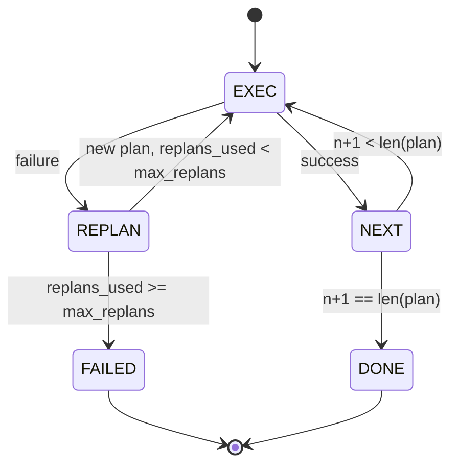

# 规划-执行控制流

> 一个无法在失败中存活的计划是一个脚本。一个可以重新规划的脚本是一个智能体。先构建重新规划器。

**类型:** Build
**语言:** Python
**前置要求:** Phase 13 课程 01-07、Phase 14 课程 01
**时间:** ~90 分钟

## 学习目标
- 将计划表示为一个有序的类型化步骤列表，以便执行器可以推理进度和结果。
- 顺序执行步骤，并将受控的失败交还给规划器。
- 从当前游标处重新规划，并在上下文中包含先前的错误，以便下一个计划是知情的。
- 在每个修订版上发出计划差异，以便下游跟踪器或 UI 可以显示计划变化的原因。
- 强制执行两个预算：一个硬步骤上限和一个硬重新规划上限。

## 规划和执行，而非思维链

思维链智能体发出 token 并让循环猜测工具调用在哪里结束。规划-执行智能体首先发出结构化计划，然后确定性地执行每个步骤。计划是框架可以内省的数据。执行是框架通过调度器运行该数据的过程。

两个部分。一个产生计划的规划器。一个运行计划的执行器。有趣的工作发生在执行器遇到失败时。三个选项：

```text
1. 中止         (返回失败，展示错误)
2. 跳过          (标记步骤失败，继续执行其余步骤)
3. 重新规划      (将错误交给规划器，从游标处获取新计划)
```

重新规划是将脚本变成智能体的那个选项。

## Step 形态

```text
Step
  id              : int           (在计划修订版内单调递增)
  tool_name       : str
  args            : dict
  expected_outcome: str           (规划器陈述的成功条件)
  result          : Any | None
  error           : str | None
```

`expected_outcome` 是规划器在步骤旁边发出的一句话。它不是由执行器强制执行的。它用于两件事：重新规划器在修订计划时读取它；事件流发出它以便跟踪器可以显示"这个步骤本应做 X。"

## 规划器形态

```python
def planner(goal: str, history: list[Step], last_error: str | None) -> list[Step]:
    ...
```

一个纯函数。`goal` 是用户目标。`history` 是已经执行的步骤（包含结果和错误）。`last_error` 在第一次调用时为 None，在每次后续调用时是最新失败消息。规划器从游标开始返回下一个计划。

规划器不知道执行器。它不知道重试。它不知道超时。它产生一个计划。仅此而已。

## 执行器

执行器是一个小的状态机。每个步骤通过调度器运行。结果有三种可能：成功、可重新规划的失败、致命失败。可重新规划的失败交还给规划器。致命失败（预算超支、达到重新规划上限）返回 `FAILED` 会话结果。



## 修订时的计划差异

当规划器在失败后返回新计划时，执行器发出一个 `plan.diff` 事件，包含三个字段。

```text
removed: 旧计划中存在而新计划中不存在的步骤 id 列表
added  : 新计划中存在而旧计划中不存在的步骤 id 列表
revised: tool_name 或 args 发生变化的步骤 id 列表
```

跟踪器或 UI 可以将其渲染为已移除步骤的删除线和已添加步骤的高亮。重点不是差异格式。重点是修订是一个可见的事件，而不是一个静默的重写。

## 两个预算，都是硬性的

`max_steps` 限制整个会话中的总步骤执行次数，包括重新规划。默认是十二。一个线性的五步计划，重新规划两次并每次添加三个步骤，总计会达到十六次执行，超过预算。执行器会拒绝重新规划并返回 FAILED。

`max_replans` 限制规划器在第一个计划之后被调用的次数。默认是五。这是更重要的限制。一个连续五次返回相同破碎计划的规划器否则会循环直到步骤预算捕获它。限制重新规划使失败更快，原因更清晰。

## 这节课中的确定性规划器

我们在这节课中不调用模型。这节课提供了一个基于 `last_error` 选择计划的确定性规划器。

```text
last_error is None    -> 发出一个四步计划
last_error matches X  -> 发出一个绕开 X 的三步计划
last_error matches Y  -> 发出一个优雅放弃的两步计划
否则                  -> 返回 [] (表示没有可重新规划的内容)
```

这足以测试执行器在每个转换路径上的行为：成功、重新规划一次、重新规划两次、重新规划耗尽和步骤预算耗尽。

## 结果形态

```text
SessionResult
  status      : "completed" | "failed"
  reason      : str     ("goal_met" | "step_budget" | "replan_budget" | "no_plan")
  history     : list[Step]
  revisions   : list[PlanDiff]
  events      : list[Event]
```

第二十课的框架循环可以直接读取这个。第二十三课的调度器是执行每个步骤的内容。第二十一课的注册中心验证每个步骤的参数。第二十二课的传输会通过 JSON-RPC 将整个流程暴露给模型客户端。

## 如何阅读代码

`code/main.py` 定义了 `PlanExecuteAgent`、`Step`、`PlanDiff`、`SessionResult` 和确定性规划器。执行器是一个单一的 `run(goal)` 方法，返回 `SessionResult`。计划差异通过比较步骤 id 和 `(tool_name, args)` 元组来计算。

`code/tests/test_agent.py` 涵盖了线性成功、重新规划一次的中途失败、返回 `failed:replan_budget` 的重新规划耗尽、步骤预算耗尽以及计划差异事件格式。

## 延伸阅读

将其接入真实模型后你会想要的两个扩展。首先，部分计划缓存：当一个计划的前三步中的三步成功然后失败时，你不想重新运行前三步。执行器已经保留了历史；规划器只需要读取它。其次，并行分支：当前的执行器是严格的顺序执行。一个发出独立分支（`gather_step` 而不是 `next_step`）的规划器可以通过调度器同时运行两个工具调用。

两者都增加了真正的复杂性。两者在线性执行器确定下来后都更容易添加。这就是这节课所做的。
