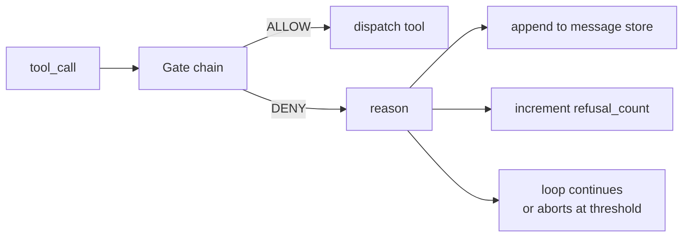
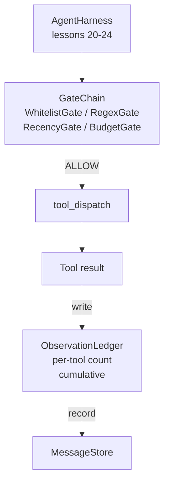

# 顶点课程 25：验证门控和观察预算

> 没有验证层的智能体框架就是一件穿大衣的愿望。这节课构建了确定性的门控链，它决定工具调用是否被允许触发，智能体允许看到其输出的多少，以及循环何时必须停止，因为智能体已经读得太多了。该链由小的命名门控加上一个跟踪模型已被展示的每个 token 的观察账本组成。

**类型:** Build
**语言:** Python（stdlib）
**前置要求:** Phase 19 · 20-24（Track A1：智能体循环、工具注册中心、消息存储、提示构建器、模型路由器）、Phase 14 · 33（作为可执行约束的指令）、Phase 14 · 36（范围契约）、Phase 14 · 38（验证门控）
**时间:** ~90 分钟

## 学习目标

- 构建一个带有确定性 `evaluate(call)` 方法的 `VerificationGate` 协议。
- 将预算、新近度、白名单和正则表达式门控组合成一个带短路语义的链。
- 通过 `ObservationLedger` 按工具和轮次键记录每个观察。
- 当累积观察预算将被超过时拒绝工具调用。
- 呈现一个结构化的 `GateDecision` 记录，下游可观测性可以摄取。

## 问题

当智能体框架让模型自由调用工具时，在真实使用的第一个小时内就会出现三类 bug。

第一类是无界观察。在 200K 行仓库上的一次 grep 将五十万个 token 的输出倾倒进下一轮。模型每一千字节看到一个匹配，其余上下文被浪费。token 账单很大，而智能体现在在任务上更差了，而不是更好了。

第二类是过时的新近度。一个长时间运行的任务累积了五十个工具调用。模型重读第三轮的第一个 read_file，仿佛它是实时状态。在第四十七轮上做的编辑永远不会出现，因为提示构建器首先序列化了最早的观察。

第三类是权限蔓延。一个研究任务以调用 `web_search` 开始，然后不知怎么地最终运行了 `shell`，因为模型发明了一个工具名而框架默认允许了。等到有人阅读跟踪时，一个垃圾文件正坐在 /tmp 中，一个 curl 已经针对一个私有 API 运行了。

验证门控是框架中说不的组件。它不是模型。它不是评判者。它是 `(call, history, ledger)` 的一个确定性函数，返回 ALLOW 或 DENY 并带有原因。原因被记录。模型被告知。循环继续或中止。

## 概念



门控是任何具有 `evaluate(call, ctx) -> GateDecision` 方法的东西。链是一个有序列表。评估在第一个拒绝时短路。顺序很重要：廉价的结构性门控在昂贵的 token 计数门控之前运行。

这节课提供了四个门控：

- `WhitelistGate`。允许的工具名称是一个显式集合。之外的任何内容都被拒绝。这是最便宜的门控，首先运行。
- `RegexGate`。工具参数与正则表达式匹配。用于拒绝带有 `rm -rf` 的 shell 调用，或指向内部 IP 的 HTTP 调用。纯粹基于调用负载。
- `RecencyGate`。模型只能看到来自最后 N 轮的观察。更早的观察被屏蔽。门控拒绝其结果会扩展已经过时的观察窗口的工具调用。
- `BudgetGate`。模型在会话中读取的累积 token 有一个上限。当账本显示达到上限时，每个进一步的工具调用都被拒绝。

观察账本是簿记。每个成功的工具调用写入一行：工具名称、轮次、发出的 token、累积值。账本回答两个问题：模型总共看到了多少，以及它看到了工具 X 多少。预算门控读取第一个。每个工具的预算门控（你将作为练习编写）读取第二个。

## 架构



框架询问链。链要么点头要么拒绝。如果点头，工具运行，账本滴答，结果被追加到消息存储。如果拒绝，模型收到拒绝作为系统消息，循环决定重试或中止。

## 你将构建什么

实现是一个单一的 `main.py` 加测试。

1. `Observation` 和 `ToolCall` 数据类定义了线缆形态。
2. `ObservationLedger` 记录 `(turn, tool, tokens)` 行并回答 `cumulative()` 和 `per_tool(name)`。
3. `GateDecision` 携带 `(allow, reason, gate_name)`。
4. `VerificationGate` 是协议。每个门控实现 `evaluate(call, ctx)`。
5. `GateChain` 包装一个有序列表。它调用每个门控，返回第一个拒绝，或者在每个门控都通过时返回 allow。
6. 演示运行一个微小的合成智能体循环。三轮。第三轮触发预算门控，循环报告一个干净的拒绝，带有非零的拒绝计数。

token 计数器故意是一个愚蠢的 `len(text) // 4` 启发式方法。这节课的重点是门控管道，而不是分词器。在生产环境中接入真正的分词器。

## 为什么链的顺序很重要

拒绝比允许更便宜。`WhitelistGate` 在 O(1) 哈希查找中运行。`RegexGate` 在 O(pattern * argv) 中运行。`RecencyGate` 读取消息存储的一个小切片。`BudgetGate` 读取整个账本。你按成本升序排列它们，以便被拒绝的调用在进行昂贵工作之前短路。

你也按影响范围排列它们。白名单是最强的声明：这个工具不在契约中。正则表达式门控其次：这个参数不在契约中。新近度在其后：框架仍然关心，但调用在结构上是合法的。预算在最后是因为，按定义，它只在其他所有都通过时才触发。

## 这与 Track A 的其余部分如何组合

之前的课程给了你循环、工具注册中心、消息存储、提示构建器和模型路由器。这节课添加了模型和工具之间的层。第二十六课提供了沙箱，一旦门控链说 ALLOW，调度器就会将工具调用交给它。第二十七课提供了评估框架，将拒绝计数记录为质量信号。第二十八课将门控决策接入 OpenTelemetry spans。第二十九课将整个东西缝合成一个工作的编码智能体。

## 运行它

```bash
cd phases/19-capstone-projects/25-verification-gates-observation-budget
python3 code/main.py
python3 -m pytest code/tests/ -v
```

演示打印每轮跟踪，包括每个门控决策，并以零退出。测试涵盖了账本、每个门控的隔离测试、链短路以及合成循环的端到端测试。
