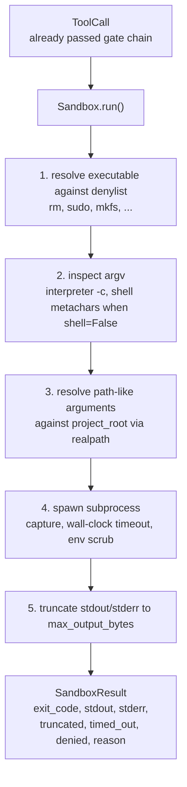
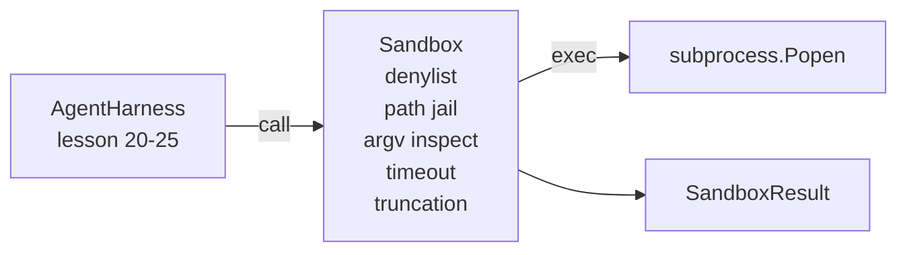

# 顶点课程 26：带拒绝列表和路径监禁的沙箱运行器

> 验证门控决定工具调用是否应该运行。沙箱决定当它运行时会发生什么。这节课提供了一个子进程运行器，拒绝危险的可执行文件、拒绝危险的 argv 形态、将每个文件路径监禁到项目根目录、截断超大的输出并在墙上时钟超时时杀死失控的进程。它是位于模型和操作系统之间的两层中的第二层。

**类型:** Build
**语言:** Python（stdlib）
**前置要求:** Phase 19 · 25（验证门控和观察预算）、Phase 14 · 33（作为可执行约束的指令）、Phase 14 · 38（验证门控）
**时间:** ~90 分钟

## 学习目标

- 构建一个包装 `subprocess.run` 的 `Sandbox` 类，带超时、捕获和截断。
- 按名称针对拒绝列表和按结构针对 argv 检查器拒绝命令。
- 拒绝任何解析到声明项目根目录之外的路径参数。
- 当 shell 模式关闭时拒绝 shell 元字符。
- 返回一个结构化的 `SandboxResult`，下游可观测性和评估框架可以摄取。

## 问题

一个可以执行 shell 命令的编码智能体可以在单个轮次中安装后门、外泄密钥、破坏开发者笔记本电脑以及积累云端账单。最便宜的防御是不给它 shell。第二便宜的防御是一个对精确模式列表说不的沙箱。

三类故障在智能体跟踪中反复出现。

第一类是危险的可执行文件。处于压力下修复路径问题的模型会尝试 `sudo`、`chmod -R 777`、`rm -rf`、`mkfs`、`dd`。这些都不属于智能体运行。拒绝列表按名称和别名捕获它们。

第二类是 argv 技巧。一个被告知没有 shell 的模型会通过解释器管道攻击：`python3 -c "import os; os.system('rm -rf /')"`、`bash -c '...'`、`node -e '...'`、`perl -e '...'`。沙箱需要知道任何带有 `-c` 类标志运行的解释器只是带有额外步骤的 shell 调用。

第三类是路径逃逸。模型被告知读取 `./src/main.py` 却读取了 `../../etc/passwd`。沙箱通过 `os.path.realpath` 解析每个路径参数并断言前缀来监禁每个路径参数。

沙箱在操作系统意义上不是一个安全边界。一个具有代码执行能力的坚定攻击者仍然可以突破。沙箱是一个开发时间护栏：它使常见的故障模式变得响亮，并阻止智能体因纯粹的无能而造成损害。

## 概念



沙箱有四个拒绝轴：名称、argv、路径、结构。每个轴是调用的一个纯函数，还没有子进程。子进程只在每个轴都通过后才生成。

`SandboxResult` 退出码是传统方式：0 成功，非零失败，加上三个哨兵码：拒绝（-100）、超时（-101）和截断（退出码是真实的，带一个标志集）。下游课程读取这个结构化结果，而不是解析 stderr。

## 架构



拒绝列表是一个可执行文件基名的冻结集合。别名（`/bin/rm`、`/usr/bin/rm`）都解析到同一个基名。argv 检查器知道解释器形态：任何 argv[0] 是解释器且任何后续参数以 `-c` 或 `-e` 开头的 argv 都被拒绝。shell 元字符（`;`、`|`、`&`、`>`、`<`、反引号、`$()`）在调用未显式请求 shell 时导致拒绝。

路径监禁是最微妙的部分。沙箱在构造时接受一个 `project_root`。任何看起来像路径的参数（包含 `/` 或匹配现有文件）都通过 `os.path.realpath` 规范化，然后对照项目根的 realpath 检查。如果解析的目标不在根之下，拒绝。符号链接逃逸尝试（项目根中指向外部的符号链接）通过检查 realpath 而不是字面路径来阻止。

## 你将构建什么

实现是 `main.py` 加上一个测试目录。

1. `SandboxResult` 数据类：exit_code、stdout、stderr、truncated、timed_out、denied、reason、duration_ms。
2. `SandboxConfig` 数据类：project_root、max_output_bytes、timeout_seconds、denylist、interpreter_block。
3. `Sandbox` 类：`run(argv, *, shell=False, cwd=None)` 返回 `SandboxResult`。
4. 内部拒绝辅助函数：`_check_executable_denylist`、`_check_argv_interpreter`、`_check_shell_metachars`、`_check_path_jail`。
5. 带清晰的 `truncated` 标志和捕获流中标记行的输出截断。
6. 底部的演示：一系列合法和对抗性调用。每个都显示其结果。

沙箱默认使用 `subprocess.run` 且 `shell=False` 和 `capture_output=True`。墙上时钟超时使用 `timeout` 参数；在 `TimeoutExpired` 时，沙箱杀死进程组并合成一个 SandboxResult。

## 为什么这不是真正的沙箱

课程沙箱不使用命名空间、cgroups、seccomp、gVisor、Firecracker 或任何内核级隔离。子进程能做的任何事情，沙箱都能做。保护是结构性的：智能体被拒绝最常见的危险调用，响亮的拒绝进入可观测性而不是静默运行。

对于生产智能体，你在其上分层：在非特权 Docker 容器内运行，在 microVM 内运行，放弃能力，以只读方式挂载项目根并以读写方式挂载临时目录，设置内存和 CPU 的 ulimit，将环境擦洗到已知安全的允许列表。第二十九课做了其中的一些。操作系统隔离超出了这节课的范围。

## 运行它

```bash
cd phases/19-capstone-projects/26-sandbox-runner-denylist
python3 code/main.py
python3 -m pytest code/tests/ -v
```

演示创建一个临时目录，将一个干净文件放入其中，然后运行一系列调用。合法调用成功。被拒绝的调用返回带 `denied=True` 和原因的 SandboxResult。超时返回 `timed_out=True`。截断设置 `truncated=True`。演示打印结果的 JSON 表格并以零退出。

## 这与 Track A 的其余部分如何组合

第二十五课产生了门控链。第二十六课是在门控说 ALLOW 之后运行的执行器。第二十七课的评估框架将沙箱结果与每个任务的预期退出码进行比较。第二十八课在每个 `Sandbox.run` 调用周围发出一个 `gen_ai.tool.execution` span。第二十九课的端到端演示将真实的编码智能体通过两层连接起来。
