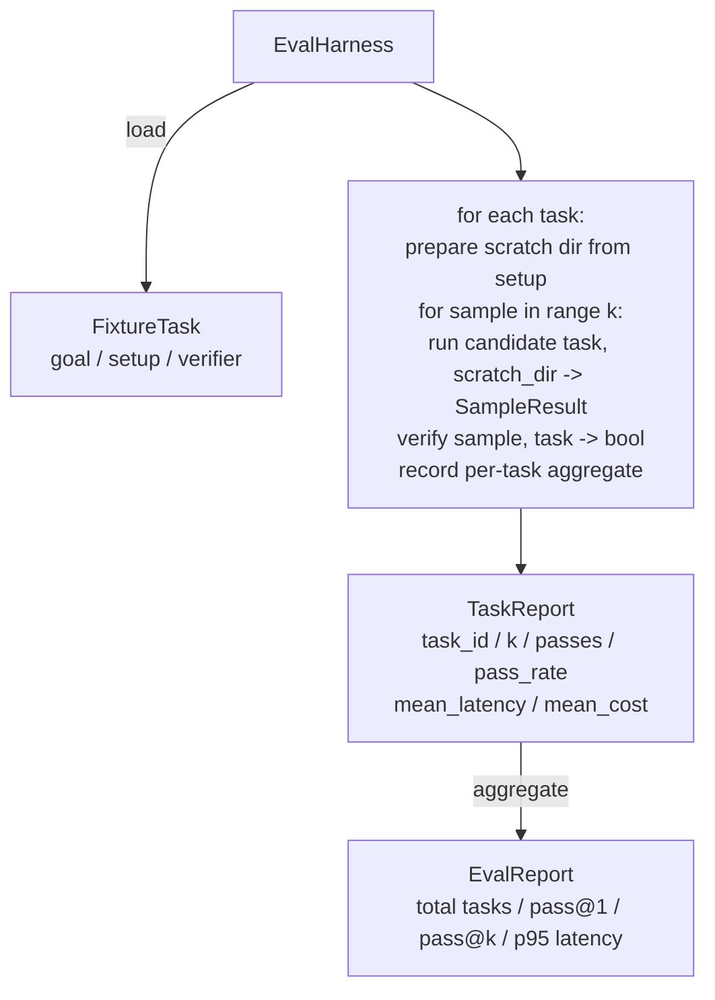

# 顶点课程 27：带固定任务的评估框架

> 编码智能体只取决于你用来衡量它的任务集。这节课构建了一个评估框架，它接受一个固定任务文件夹，通过候选智能体运行每个任务，通过确定性验证器评分通过或失败，并将结果聚合成 pass@1、pass@k、平均延迟和平均成本。框架是让你能够区分回归和重构的真相来源。

**类型:** Build
**语言:** Python（stdlib）
**前置要求:** Phase 19 · 25（验证门控）、Phase 19 · 26（沙箱运行器）、Phase 14 · 30（评估驱动的智能体开发）、Phase 14 · 19（SWE-bench 和 GAIA 基准）
**时间:** ~90 分钟

## 学习目标

- 将固定任务定义为目标、设置和验证器的三元组。
- 对每个任务的多个样本运行进行评分，并计算 pass@1 和 pass@k。
- 将延迟和成本聚合成平均值和第 95 百分位数指标。
- 将确定性验证器（文件差异、退出码、正则表达式匹配）接入可重用函数。
- 发出结构化 JSON 报告，回归跟踪脚本可以摄取。

## 问题

三种故障模式困扰着没有评估框架构建的智能体基准。

第一种是未经验证的通过。智能体说它修复了 bug，人类瞥了一眼差异，套件被标记为绿色，三周后回归测试浮现出同样的 bug。智能体推理得看似合理却没有实际修复任何东西。

第二种是未检测到的回归。对提示模板的更改使智能体在响亮的任务上好了 4%，在安静的任务上差了 14%。没有黄金集和每个任务的分数，回归进入了主分支，只有当客户投诉时才浮出水面。

第三种是每个任务的漂移。评估在周一运行时有 100 个任务，在周五时只有 95 个，因为有人重命名了五个固定任务。通过率看起来像是 5% 的提升。其实不是。

框架是将这些失败变成事实的程序。它每次都运行每个固定任务，以可重现的顺序，针对返回真或假的确定性检查的验证器。

## 概念

```mermaid
flowchart LR
  F1[fixtures/task_001/<br/>task.json + expected/] --> Harness
  F2[fixtures/task_002/<br/>...] --> Harness
  Harness[Harness<br/>for each task:<br/>setup / run agent k samples /<br/>verify each sample /<br/>record latency, cost]
  Harness --> Report[EvalReport<br/>pass@1 / pass@k<br/>mean ms / p95 ms<br/>mean cost]
```

一个 `FixtureTask` 是一个小的 JSON 文件加上一个可选的 `expected/` 目录。JSON 声明一个 `id`、一个 `goal`（提供给智能体的提示）、一个 `setup` 块（要放入临时目录的文件）和一个 `verifier` 块。验证器块命名框架的验证器注册中心中的一个函数并提供其参数。

三种验证器形态覆盖了大多数有用的任务。

第一种是 `file_equals`。在智能体运行后，将一个命名文件与预期内容进行比较。这捕获了"以这种精确方式修复这个 bug"的任务。

第二种是 `regex_match`。命名文件的内容与正则表达式匹配。这捕获了"函数必须存在并返回 X"的任务，其中有许多可接受的解决方案。

第三种是 `shell_exit_zero`。框架运行一个 shell 命令（通过第二十六课的沙箱），并且只有当命令退出码为零时任务才通过。这捕获了"测试必须通过"的任务。

框架运行每个任务 `k` 次。Pass@k 是 `1 - (1 - p)^k`，其中 p 是经验通过率；框架也报告原始计数，以便你可以发现方差。延迟是每个样本的墙上时钟时间。成本是智能体自我报告的（token 计数、美元或两者兼有）；框架跨样本求和并呈现每个任务和聚合数字。

```figure
pass-at-k
```

## 架构



候选者是一个可调用的：`Callable[[FixtureTask, str], SampleResult]`。框架通过 `tempfile.mkdtemp()` 创建临时目录并将其路径作为普通字符串传递。框架不关心候选者如何工作。候选者可以是一个确定性的补丁应用器（对于框架自测很有用）、一个真实的 LLM 智能体、一个模糊测试器。契约是 SampleResult。

## 你将构建什么

`main.py` 提供：

1. `FixtureTask` 数据类。
2. `SampleResult` 数据类：success_self_reported、latency_ms、cost_units、edits。
3. `TaskReport`、`EvalReport` 数据类，带有 `to_dict()`。
4. `VerifierRegistry` 将验证器名称映射到函数。内置验证器：file_equals、regex_match、shell_exit_zero。
5. `EvalHarness` 类。针对候选者运行一个任务目录。返回 EvalReport。
6. 在 `tasks/` 中捆绑的五个固定任务：
   - `fizzbuzz` 中的差一错误
   - `factorial` 中缺少返回
   - 错误消息中的拼写错误
   - 空函数体
   - 链表遍历中的差一错误
7. 一个确定性的参考候选者（`apply_known_fixes`），框架用它来演示 1.0 的干净 pass@1。
8. 演示打印 EvalReport JSON 并以零退出。

固定任务作为 JSON 文件捆绑在 `tasks/` 中，加上配对的源文件在 `tasks/<id>/buggy/` 和 `tasks/<id>/expected/` 中。框架将 buggy 复制到临时目录，交给候选者，并对照 expected 进行验证。

## 为什么用 pass@k 而不仅仅是 pass@1

真实的 LLM 智能体是随机的。0.6 的 pass@1 看起来像是失败。0.95 的 pass@5 说智能体大多数时候得到正确答案，但在早期样本上选择错误。修复方法是采样和排序，而不总是更多训练。Pass@k 使这一点可见。

Pass@k 与 pass@1 一起报告，因为 pass@k 掩盖了一个真正的失败：如果模型在二十次尝试中只得到一次正确答案，你没有一个有用的智能体。框架显示两者。

## 如何阅读代码

`code/main.py` 提供：

1. `FixtureTask` 数据类。
2. `SampleResult` 数据类。
3. `TaskReport`、`EvalReport` 数据类。
4. `VerifierRegistry` 映射验证器名称到函数。
5. `EvalHarness` 类。
6. 五个捆绑的固定任务。
7. 演示打印 EvalReport JSON 并以零退出。

## 运行它

```bash
cd phases/19-capstone-projects/27-eval-harness-fixture-tasks
python3 code/main.py
python3 -m pytest code/tests/ -v
```

演示以 JSON 格式打印 EvalReport，包括 pass@1、pass@5、平均延迟和每个任务的细分。退出码为零。测试涵盖验证器函数、pass@k 数学、固定任务加载以及针对捆绑参考候选者的端到端框架。
