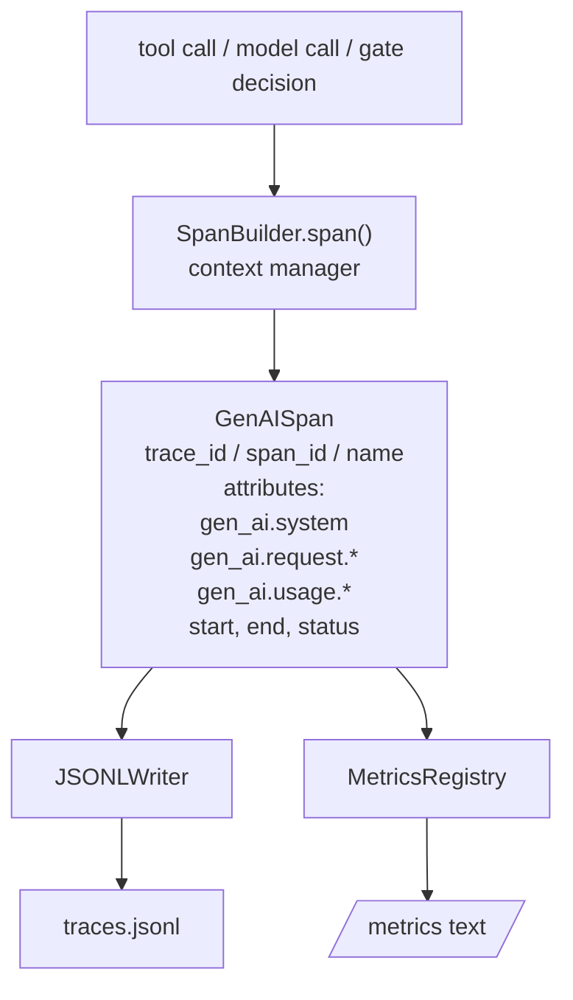
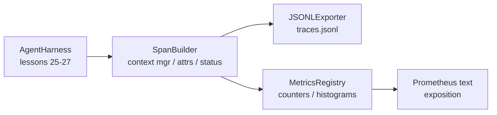

# 顶点课程 28：使用 OTel GenAI Spans 和 Prometheus 指标的可观测性

> 没有可观测性的智能体框架是一个花钱的黑箱。这节课手工构建了一个 span 构建器，发出符合 OpenTelemetry GenAI 语义约定的记录，每行一个 span 写入 JSON-Lines 文件，并以 Prometheus 文本格式暴露计数器和直方图。整个东西是 stdlib Python，离线运行。

**类型:** Build
**语言:** Python（stdlib）
**前置要求:** Phase 19 · 25（验证门控）、Phase 19 · 26（沙箱）、Phase 19 · 27（评估框架）、Phase 13 · 20（OpenTelemetry GenAI）、Phase 14 · 23（OTel GenAI 约定）
**时间:** ~90 分钟

## 学习目标

- 构建一个按照 OpenTelemetry GenAI 语义约定定形的 span 数据类。
- 实现一个 JSONL 导出器，每行写入一个自包含的 span。
- 构建带标签的计数器和直方图，以及 Prometheus 文本格式的暴露。
- 将任何可调用包装在 span 上下文管理器中，记录持续时间、状态和异常。
- 验证发出的 span 通过 `json.loads` 往返并匹配规范形态。

## 问题

生产中的编码智能体每轮产生三类工件：模型调用、工具执行和验证门控决策。没有结构化遥测，这些都没有用。

第一种故障模式是缺失的跟踪。周二出了点问题，但唯一的记录是一个 500 行的聊天日志。没有记录哪个工具运行了、花了多长时间、提示中用了多少 token、或者门控是否拒绝了什么。智能体作者不得不猜测。

第二种故障模式是不可解析的跟踪。框架写了 spans 但使用了自己的临时字段名。Grafana、Honeycomb、Jaeger 或本地 CLI 中的任何东西都无法读取它们。团队栈中存在的任何工具都被浪费了，因为 spans 是非标准的。

第三种故障模式是未聚合的指标。你可以在跟踪中看到一个缓慢的工具调用，但无法回答"过去一小时内 read_file 调用的 p95 延迟是多少？"因为没有指标，只有跟踪。

OpenTelemetry GenAI 语义约定正是为此而存在的。它们定义了一小组标准属性，LLM 框架中的 span 发射器共享这些属性。如果你的框架写入这些属性，每个 OTel 兼容的后端都可以读取它们。

## 概念



框架中的每个操作产生一个 span。一个 span 有一个跟踪 id（整个智能体调用）、一个 span id（这一个操作）、一个名称（例如 `gen_ai.chat`、`gen_ai.tool.execution`）、遵循 GenAI 约定的属性、开始和结束时间以及一个状态。

GenAI 约定标准化了这些属性键：`gen_ai.system`（哪个提供商，例如 `anthropic`、`openai`）、`gen_ai.request.model`（模型 id）、`gen_ai.request.max_tokens`、`gen_ai.usage.input_tokens`、`gen_ai.usage.output_tokens`、`gen_ai.response.model`、`gen_ai.response.id`、`gen_ai.operation.name`，加上工具特定的键 `gen_ai.tool.name` 和 `gen_ai.tool.call.id`。

导出器写入 JSONL。每行一个 JSON 对象。这是下游工具可以流式传输、grep 和导入的最简单可能的格式。一个真正的 OTel 导出器会说 OTLP gRPC；课程的 JSONL 导出器是离线等价物，在每个工作站上以零退出。

指标与跟踪并存。每个工具调用递增一个计数器：`tools_called_total{tool="read_file"}`。一个直方图记录观察到的延迟：`tool_latency_ms{tool="read_file"}`。两者都序列化为 Prometheus 文本暴露格式，这是拉取指标的事实标准。

```figure
trace-spans
```

## 架构



span 构建器是一个带 `span(name, attrs)` 方法的小类，返回一个上下文管理器。上下文管理器在进入时记录开始时间，在退出时记录结束时间，如果引发了异常则附加异常，并将最终化的 span 推送到导出器。

指标注册中心是两个字典。计数器是 `{(name, frozen_labels): int}`。直方图在列表中保留原始样本，并在暴露时序列化为 Prometheus 直方图桶。

## 你将构建什么

`main.py` 提供：

1. `GenAISpan` 数据类：trace_id、span_id、parent_span_id、name、attributes、start_unix_nano、end_unix_nano、status、status_message、events。
2. `SpanBuilder` 类，带 `span(name, attrs, parent=None)` 上下文管理器。
3. `JSONLExporter` 类，带 `export(span)` 追加一行。
4. `Counter` 和 `Histogram` 类加上 `MetricsRegistry`。
5. `prometheus_exposition(registry)` 产生文本格式输出。
6. `wrap_tool_call(name)` 装饰器，发出 span 并更新指标。
7. 演示：合成一个完整的智能体调用（工具 spans 周围的 gen_ai.chat span），写入 traces.jsonl，打印 Prometheus 暴露，以零退出。

span id 和 trace id 是 16 字节十六进制字符串，从 `os.urandom` 生成。这匹配 OTel 的 W3C 跟踪上下文。导出器从不抛出；IO 错误被展示但框架继续运行。

直方图有一个固定的桶集（OTel 延迟毫秒默认值：5、10、25、50、100、250、500、1000、2500、5000、10000、+Inf）。样本存储为列表；暴露按需计算每个桶的计数。

## 运行它

```bash
cd phases/19-capstone-projects/28-observability-otel-traces
python3 code/main.py
python3 -m pytest code/tests/ -v
```

演示在课程的运行目录中发出一个 `traces.jsonl`（最后清理），然后打印三个 span 的示例，然后打印计数器和直方图的 Prometheus 暴露。测试验证 spans 往返序列化、规范的 GenAI 属性存在、计数器正确递增以及直方图暴露包含预期的桶计数。
