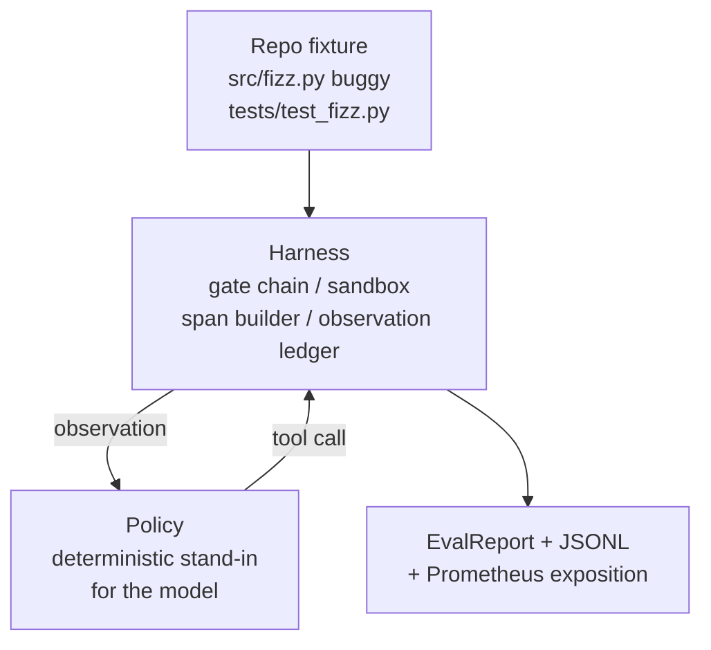
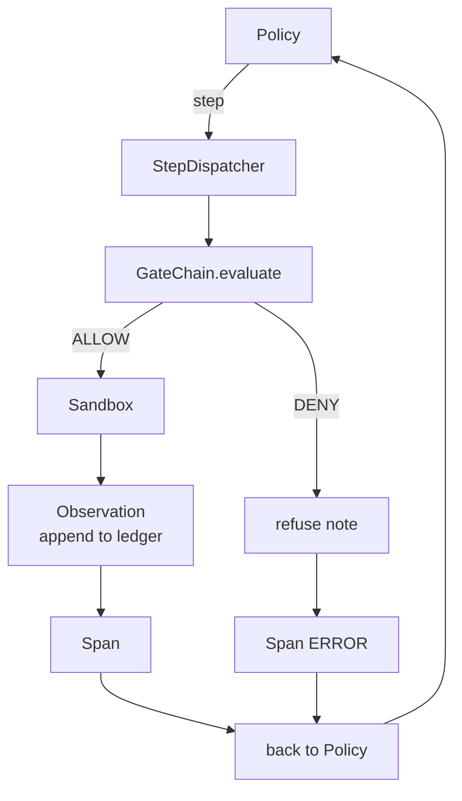

# 顶点课程 29：框架上的端到端编码智能体

> Track A 的回报。这节课将门控链、沙箱、评估框架和 OTel spans 缝合到一个工作的编码智能体中，修复一个多文件 Python 项目中的真实（小的、固定规模的）bug。智能体是一个确定性策略，而不是 LLM；这种替换使课程可重现，并表明框架一直是有趣的部分。契约是相同的：一个真正的模型在策略接口处接入。

**类型:** Build
**语言:** Python（stdlib）
**前置要求:** Phase 19 · 25（验证门控）、Phase 19 · 26（沙箱）、Phase 19 · 27（评估框架）、Phase 19 · 28（可观测性）、Phase 14 · 38（验证门控）、Phase 14 · 41（真实仓库的工作台）、Phase 14 · 42（智能体工作台顶点）
**时间:** ~90 分钟

## 学习目标

- 将门控链、沙箱、评估框架和 span 构建器组合成一个单一的智能体循环。
- 实现一个使用 read_file、run_tests 和 write_file 来修复固定 bug 的确定性策略。
- 在端到端运行中强制执行全局步骤预算加上观察 token 预算。
- 为完整运行发出完整的 OTel GenAI 跟踪和 Prometheus 指标。
- 验证智能体在少于 12 步内解决固定任务，且合法工具上没有门控触发。

## 问题

大多数智能体演示是独立运行的：沙箱单独、评估框架单独、span 发射器单独。它们看起来不错。组合它们，接缝就显现了。

门控链说 ALLOW 但沙箱以链未预料到的原因拒绝。评估框架记录通过但 OTel spans 说门控拒绝了智能体声称使用的工具。Prometheus 计数器在应该递增一次时递增了两次。观察预算被超出但智能体继续运行，因为预算在链中跟踪而沙箱不知道。

这节课是整个 track 的集成测试。智能体必须按顺序做四件事：读取项目、运行测试、从测试失败中识别 bug、写入修复、重新运行测试、然后停止。每个操作经过门控链。每个工具执行经过沙箱。每个步骤包装在一个 span 中。评估框架在最后对整个事情评分。

## 概念



智能体的策略是一个状态机。五个状态。

`SURVEY`：智能体读取项目列表。下一个状态是 RUN_TESTS。

`RUN_TESTS`：智能体运行测试命令。如果测试通过，状态机以成功停止。否则下一个状态是 INSPECT。

`INSPECT`：智能体读取失败的源文件。下一个状态是 FIX。

`FIX`：智能体写入修正后的文件。下一个状态是 VERIFY。

`VERIFY`：智能体再次运行测试命令。如果测试通过，停止成功。否则停止失败。

每个状态对应一个工具调用。每个工具调用通过门控链。如果一个工具调用被拒绝，智能体在跟踪中报告拒绝并停止。

固定 bug 是 `fizz.py` 中的一个差一错误。确定性策略通过正则表达式从测试失败消息中检测 bug 并发出修正后的文件。用 LLM 替换策略不会改变框架契约。

## 架构



这节课是自包含的。每个先前课程的原语在 `main.py` 中以最小规模重新实现（门控、沙箱、账本、span），因此课程可以在不导入同级模块的情况下运行。名称与课程 25-28 完全相同，因此概念映射是明确的。

## 你将构建什么

`main.py` 提供：

1. 最小的框架原语，以与课程 25-28 相同的名称复制：`GateChain`、`Sandbox`、`ObservationLedger`、`SpanBuilder`、`MetricsRegistry`。
2. `CodingAgentPolicy` 类：带五个状态的状态机。
3. `Repo` 辅助函数：准备一个包含捆绑的 buggy 固定任务的临时目录。
4. `AgentRun` 类：驱动策略，通过框架调度，返回 `AgentRunReport`。
5. 一个捆绑的固定任务（`fixture_repo/`），包含 src/fizz.py、tests/test_fizz.py 和一个用于评估框架的 expected/ 树。
6. 演示：端到端运行策略，打印逐步跟踪，断言通过，打印指标。

## 演示断言什么

端到端演示在退出时断言五件事，测试套件以编程方式重新断言它们。

1. 策略在少于 12 步内解决了固定任务。
2. 观察预算从未被超出。
3. 合法工具上没有门控拒绝触发。
4. 每个步骤在 traces.jsonl 中都有对应的 span。
5. Prometheus 暴露包含一个 `tools_called_total{tool="read_file"}` 条目和一个 `tool_latency_ms` 直方图。

## 如何阅读代码

捆绑的固定任务与第二十七课的任务结构相同：一个 buggy 文件和一个测试文件。测试失败消息包含足够的信息供确定性策略识别修复。真正的 LLM 会做同样的工作，更慢且具有更广泛的召回，但不会改变框架的期望。

## 运行它

```bash
cd phases/19-capstone-projects/29-end-to-end-coding-task-demo
python3 code/main.py
python3 -m pytest code/tests/ -v
```

演示打印逐步跟踪、最终评估报告和 Prometheus 暴露。退出码为零。测试涵盖策略状态转换、合成工具调用上的门控拒绝、捆绑固定任务上的端到端运行以及步骤预算不变量。
