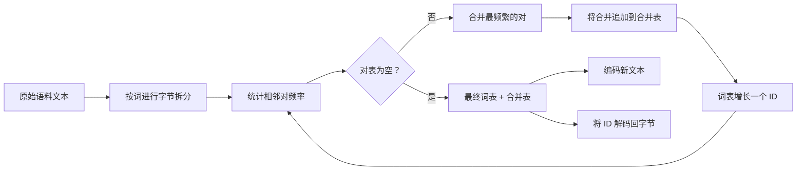
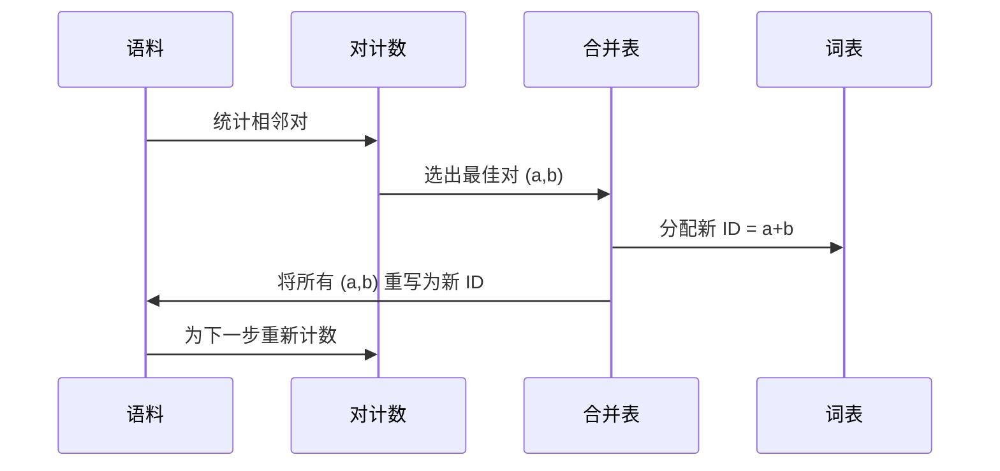

# 从头构建 BPE 分词器

> 字节进，ID 出，ID 再变回同样的字节。构建每个现代文本模型仍然起步于的分词器。

**类型：** 构建
**语言：** Python
**前置知识：** 第 04 阶段课程，第 07 阶段 Transformer 课程
**时间：** ~90 分钟

## 学习目标
- 通过反复合并最频繁的相邻符号对，从原始文本语料库训练一个字节对编码（BPE）词表。
- 实现一个确定性的合并表，并将其应用于新文本，生成子词 ID 流。
- 对任意 UTF-8 输入进行 ID 往返转换，且不丢失信息。
- 保留并保护特殊标记（`<|endoftext|>`、`<|pad|>`），使其在训练和解码中不受影响。
- 论证为什么字节级字母表是通用分词器的正确基础。

## 框架

语言模型从不直接看到文本。它看到的是整数。从字符串到整数列表再到字符串的映射就是分词器。如果这一层出了问题，训练过程中的每条损失曲线衡量的都是错误的东西。

通用文本模型中最主流的子词分词器家族是字节对编码。其思想很简单。从一个已知的字母表开始。找出训练语料中出现最频繁的相邻符号对。将其合并为一个新符号。重复直到词表达到目标大小。编码新文本时按相同顺序复用相同的合并列表。

我们将构建字节级变体。字母表是 256 个原始字节，而不是 Unicode 码点。这个选择让分词器能够处理任何 UTF-8 输入，而无需回退到未知标记。

## 流水线

训练端和推理端共享合并表。这种共享就是契约。如果在推理时改变了合并顺序，你解码出的将是不同的 ID 流。

## 字节字母表

前 256 个 ID 保留给原始字节 0x00 到 0xFF。这保证了在任何合并发生之前，每个输入字符串都能用词表表示。在字节块之后，我们为特殊标记保留一小段范围。训练循环永远不会将这些 ID 作为合并目标提出，因为我们完全将它们排除在预分词流之外。

预分词器在训练看到语料之前，先按空白和标点边界拆分语料。没有这个拆分，BPE 合并步骤会愉快地学习跨越词边界的合并，词表会被常见的完整短语填满。有了拆分，合并保持在词内部，结果更具泛化性。

## 训练循环

每个训练步骤，循环做三件事。它遍历语料中的每个词，统计当前符号的每个相邻对出现的频率（按词本身的频率加权）。它选出计数最高的对。它将每个出现的该对重写为一个新的单一符号，其 ID 是词表中的下一个空闲位置。然后记录这次合并。

每一步的成本与语料大小（表示为符号序列列表）成线性关系。对于一百万个词和一万个 ID 的目标词表，循环在几秒内完成，因为随着合并的进行，符号序列会缩短。

## 编码新文本

推理不会调用合并计数器。它按学习时的相同顺序应用合并表。对于一个新词，编码器从字节拆分开始。它扫描当前序列，寻找排名最低的合并（最早适用的合并）。执行该合并。再次扫描。当表中没有合并适用于当前序列时，循环结束。

按排名排序的特性使编码具有确定性，并在相同输入上与训练行为一致。先学习的合并位于表顶，优先应用。如果两个合并可能应用于同一位置，排名较低的胜出。

## 特殊标记

特殊标记是字节流永远无法产生的 ID。我们手动保留它们。本课程两个就够了。

- `<|endoftext|>` 在预训练期间分隔文档。它告诉模型"新文档从这里开始，不要让前一个文档的上下文泄漏进来。"
- `<|pad|>` 填充短序列，使批次成为矩形张量。损失掩码在训练期间隐藏它。

编码器接受一个标志，允许在输入中使用特殊标记。关闭标志时，字符串 `<|endoftext|>` 和 `<|pad|>` 会被分词为拼写它们的字节。打开标志时，这些字面字符串被映射到其保留 ID，不受任何合并影响。

## 往返保证

编码后解码必须精确返回输入字节。解码器按顺序连接每个 ID 的字节展开。由于每个 ID 要么是原始字节，要么是两个先前已知 ID 的拼接，递归展开总是终止于原始字节。解码然后返回这些字节拼写的 UTF-8 字符串。

本课程的测试套件在一个未见过的句子、一个包含 Unicode 表情符号的句子以及一个包含字面 `<|endoftext|>` 标记的句子上检查这一属性。

## 本课程不做什么

它不构建最大生产分词器风格的正则表达式驱动的预分词器。这里的预分词器是一个简单的空白和标点拆分。它足以在小型训练语料上产生合理的合并，并且与课程链中其余部分的契约保持一致。下一课将分词器视为黑盒，在其上构建滑动窗口数据集。

它不并行化对计数器。在 Python 中对几千个词的语料进行循环在远不到一秒内完成。对于更大的语料，明显的做法是按词并行计数然后归约。

## 如何阅读代码

`main.py` 定义了四个对象。`BPETokenizer` 持有词表、合并表和特殊标记表。`train` 是训练循环。`encode` 是推理路径。`decode` 是字节拼接。底部的演示在内置语料上训练一个小型分词器，编码一个保留句子，将 ID 解码回来，并打印两者。`code/tests/test_bpe.py` 中的测试固定了往返属性、特殊标记保留和合并顺序。

运行演示。然后将演示中的目标词表大小从 300 改为 600，观察保留句子的编码长度如何下降。那条曲线就是 BPE 压缩曲线。