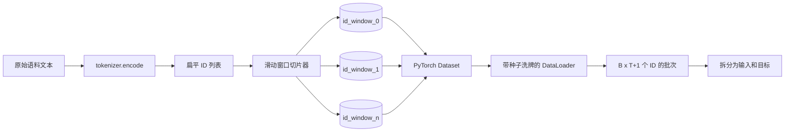
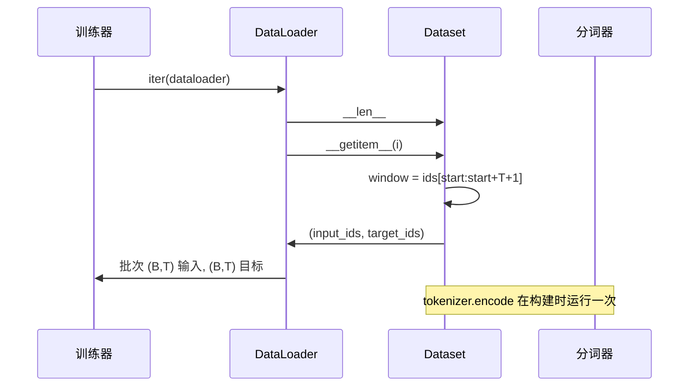

# 带滑动窗口的分词数据集

> 预训练运行是从标记 ID 到梯度的函数。本课程构建了将 ID 送入的传送带。

**类型：** 构建
**语言：** Python
**前置知识：** 第 04 阶段课程，第 07 阶段 Transformer 课程，本阶段第 30 课
**时间：** ~90 分钟

## 学习目标
- 通过一次性调用分词器，将原始语料转换为标记 ID 流。
- 使用可配置的重叠步长将 ID 流切分为固定长度的窗口。
- 构建一个 PyTorch Dataset，为下一个标记预测返回输入和目标张量。
- 将数据集包装在 DataLoader 中，使用每个 epoch 播种的确定性洗牌。
- 论证步长、冗余度和有效数据集大小之间的权衡。

## 框架

预训练运行每次读取一批标记 ID 并更新模型。每个批次的形状由训练契约固定。对于因果语言模型，批次包含 `(B, T)` 输入 ID 和 `(B, T)` 目标 ID，其中目标是输入左移一位。数据管道的工作是按需、以确定性和可重现的方式，从可能数 GB 的原始文本语料中产生该契约。

本课程构建这个管道。上一课的分词器将文本转换为一个长的扁平 ID 列表。滑动窗口将该列表切分为训练样本。自定义 Dataset 将样本暴露为张量。DataLoader 对它们进行批处理并使用已知种子进行洗牌。

## 形状契约

因果 LM 消费形状为 `(B, T)` 的 ID，其中 `B` 是批次大小，`T` 是上下文长度。位置 `t` 的目标是位置 `t+1` 的输入。这意味着每个训练样本覆盖 `T+1` 个原始 ID。窗口步长控制连续样本之间的重叠量。

切片器永远不会超出语料边界。如果最后一个窗口没有足够的 ID 来填满 `T+1` 个位置，切片器会丢弃它。用 `<|pad|>` 填充尾部也是一个有效的选择，但它会使损失掩码复杂化。本课程中我们选择丢弃。

## 为什么用滑动窗口

预训练语料是一个长的 ID 流。如果模型只看到非重叠窗口，每个训练样本都会教给它相同的 `T` 个边界。调整步长可以移动这些边界，使模型看到更多样化的下一个标记预测任务。

步长为 `T` 产生非重叠窗口。步长为 `T // 2` 产生 50% 的重叠，并使有效数据集大小翻倍。步长为 `1` 产生最大重叠，数据集增大 `T` 倍。代价是每个 epoch 的计算量更大。好处是边界多样性更高。大多数预训练运行使用等于上下文长度的步长，因为语料已经远大于模型在一个 epoch 内能完成的量，所以边界多样性的论证较弱。

## Dataset 类

PyTorch Dataset 有两个必需的方法。`__len__` 返回样本数量。`__getitem__` 返回一个样本作为一对张量。我们的 Dataset 存储编码后的 ID 流和步长。索引到它时动态计算窗口起始位置，因此无论步长产生多少样本，内存成本都只有一份 ID 流。

移位操作发生在 `__getitem__` 内部。Dataset 返回 `(input, target)`，其中 `input = window[:-1]`，`target = window[1:]`。两者都是 PyTorch 长整型张量。训练循环将它们视为真实值。

## 确定性洗牌

使用 `shuffle=True` 的 DataLoader 从 PyTorch 随机生成器读取。通过传入一个显式的 `torch.Generator`（每个 epoch 播种），我们可以在每次重新启动运行时获得相同的洗牌顺序。当你想比较仅在一个超参数上不同的两次运行时，这个属性很重要。没有种子，两次运行看到的数据顺序不同，损失曲线会因与变更无关的原因而发散。

本课程的种子契约很简单。`epoch_seed = base_seed + epoch_index`。基础种子在构造时传入。epoch 索引由训练器在每个 epoch 开始时递增。使用相同基础种子重新运行，每个 epoch 总是看到相同的顺序。

## 批次采样器

PyTorch 中的默认采样器均匀随机选择索引，不重复。这正是预训练所需要的。对于小数据集的微调，契约相同。DataLoader 通过调用 `__getitem__` `B` 次并堆叠结果来组装批次。由于每个样本长度相同（按构造），不需要填充逻辑。

本课程保持 `num_workers=0` 以保持简单。在生产运行中，工作进程会并行化 `__getitem__` 调用。对于我们的管道，这基本上是无操作的，因为工作只是对内存中张量的切片，但相同的 Dataset API 可以干净地支持工作进程。

## 计数样本

对于长度为 `N` 的 ID 流、上下文长度 `T` 和步长 `S`，样本数为 `max(0, 1 + (N - (T + 1)) // S)`。本课程将该计算作为 Dataset 上的静态方法暴露，以便训练器无需迭代即可计算每个 epoch 的总步数。

## 本课程不做什么

它不从磁盘流式读取。语料完全在内存中编码，并作为一个单一张量保存。对于几百万个 ID 的语料，这远低于一百兆字节，是本课程的正确形态。磁盘流式读取是一个独立的问题，可以通过替换存储来接入，同时保持 Dataset 契约。

它不处理多个文档。语料被视为一个连续的 ID 流。当语料由多个文档构建时，下一个文档的边界通过插入 `<|endoftext|>` ID 来编码。模型学习在边界周围进行预测。

## 如何阅读代码

`main.py` 定义了两个类和一个辅助函数。`SlidingWindowDataset` 是 PyTorch Dataset。`make_dataloader` 返回一个配置好的 DataLoader，带有种子生成器。`_encode_corpus_to_ids` 是一次性的分词器调用。底部的演示在进程内构建一个小型分词器，编码内置语料，构建数据集和数据加载器，打印一个批次，并断言形状契约。`code/tests/test_dataset.py` 中的测试固定了窗口计数公式、移位属性、确定性洗牌和步长权衡。

运行演示。然后将上下文长度从 16 改为 32，观察每个 epoch 的样本数如何下降。这个数字就是你的每 epoch 步数预算。