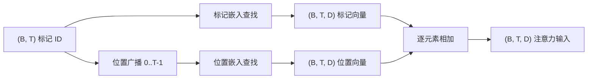
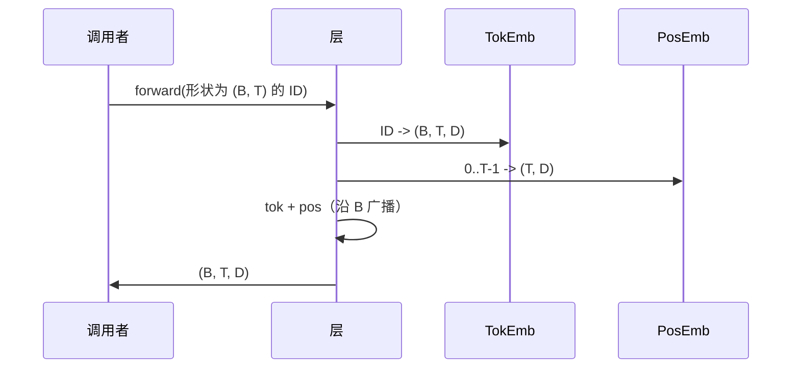

# 标记嵌入与位置嵌入

> ID 是整数。模型想要向量。两个查找表位于它们之间，位置表的选择决定了模型能学到什么。

**类型：** 构建
**语言：** Python
**前置知识：** 第 04 阶段课程，第 07 阶段 Transformer 课程，本阶段第 30 和 31 课
**时间：** ~90 分钟

## 学习目标
- 构建一个标记嵌入查找表，将词表 ID 映射为稠密向量。
- 构建一个按位置索引的可学习位置嵌入查找表。
- 构建一个按位置索引的固定正弦位置嵌入，无参数。
- 将标记嵌入和位置嵌入组合为 Transformer 块的单一输入。
- 对比可学习嵌入和正弦嵌入在长度泛化和参数量上的差异。

## 框架

模型与标记 ID 的第一次接触是在标记嵌入矩阵中按行查找。该矩阵每词表 ID 一行，每模型维度一列。查找返回一个向量，模型的其余部分将其视为该 ID 的含义。反向传播更新前向传播中使用过的行。随着训练，这些行的几何结构学会在方向中编码相似性。

标记 ID 本身没有顺序。模型需要第二个信号来告诉它位置一不同于位置十七。该信号的两种主流选择是可学习位置嵌入（第二个查找表，每位置一行）和固定正弦位置嵌入（无参数的数学公式）。选择有后果。可学习表是一个参数，受限于模型训练时的最大上下文长度。正弦表理论上无参数，公式可扩展到任意位置，但本课程的 `SinusoidalPositionalEmbedding` 在 `max_context_length` 处预计算固定表，其 `forward` 在超出该边界时会报错；因此两个模块都在这里强制了最大上下文长度。即使表足够大可以索引，模型在超出训练长度时仍可能表现不佳。

本课程构建两者，并将它们与标记嵌入组合为下一课注意力块的单一输入。

## 形状契约

嵌入阶段的输入是形状为 `(B, T)` 的标记 ID 批次。输出是形状为 `(B, T, D)` 的张量，其中 `D` 是模型维度。每个批次元素具有相同的上下文长度 `T`。每个位置具有相同的向量维度 `D`。



组合方式是相加，而非拼接。相加使 `D` 在整个网络中保持不变，并让模型在每个特征上自行决定标记含义和位置在每一层中谁占主导。

## 标记嵌入矩阵

标记嵌入是一个形状为 `(V, D)` 的参数张量，其中 `V` 是词表大小。PyTorch 将其暴露为 `nn.Embedding(V, D)`。初始化时，条目从一个小高斯分布中抽取，传统上均值为零，标准差约为 `0.02`（对于 Transformer 规模的模型）。确切的初始化方法不如它在各次运行间保持一致重要。

前向传播是一个单一的索引操作。PyTorch 通过收集行将 `(B, T)` int64 ID 映射为 `(B, T, D)` 浮点数。反向传播仅将梯度累积到前向传播中触及的行。在某个步骤中从未出现在批次中的两行接收零梯度。

一个微妙的细节。标记嵌入和模型末尾的输出投影经常共享权重（权重绑定）。当这种情况发生时，每次反向传播都会通过输出侧触及嵌入的每一行。本课程将两者暴露为独立的模块，但在完整模型中，同一个矩阵可以扮演两个角色。

## 可学习位置嵌入

可学习位置嵌入是第二个形状为 `(max_context_length, D)` 的 `nn.Embedding`。查找键是位置 ID `0, 1, 2, ..., T-1`。前向传播将该位置向量沿批次维度广播。

可学习表的缺点在于，如果模型只训练到位置 `T-1`，则无法查询位置 `T`。该行不存在。使用此方案的生产级仅解码器模型将最大上下文长度烘焙到架构中，并拒绝处理更长的输入。

## 正弦位置嵌入

正弦位置嵌入是从位置到向量的函数。位置 `p` 和特征 `i` 产生：

```python
angle = p / (10000 ** (2 * (i // 2) / D))
emb[p, 2k]     = sin(angle)
emb[p, 2k + 1] = cos(angle)
```

该函数没有参数。每个位置都有一个唯一的向量。波长沿特征维度几何变化，因此低维度编码粗略位置，高维度编码精细位置。

选择 `sin` 和 `cos` 共同带来的特性是，位置 `p + k` 处的向量是位置 `p` 处向量的线性函数。这为注意力层学习相对位置偏移提供了一条简单的路径。模型不需要额外的参数来表达"往回看五个标记"。

本课程在构造时一次性计算完整的正弦表，在前向传播时索引到其中。

## 组合

输入管道按顺序做三件事。读取标记 ID。查找标记向量。加上位置向量。返回和。



求和步骤中的广播将 `(T, D)` 位置张量沿批次维度复制。PyTorch 自动处理，因为 unsqueeze 后位置张量的形状为 `(1, T, D)`。

## 对比分析

本课程在相同输入上运行两种变体，并打印两个诊断指标。

第一个是参数量。可学习变体在标记嵌入之上增加了 `max_context_length * D` 个参数。正弦变体增加零个。

第二个是相邻位置嵌入之间的余弦相似度。正弦变体具有平滑且可预测的衰减，因为函数是连续的。可学习变体在初始化时具有接近随机的相似度，因为行是独立抽取的。训练后，可学习变体通常会发展出类似的平滑结构，但它必须从数据中发现这种结构。

## 本课程不做什么

它不构建旋转位置编码（RoPE）或 AliBi。这些是现代生产 Transformer 中的主流选择。它们都遵循与这里嵌入相同的形状契约（对形状为 `(B, T, D)` 的向量应用位置相关变换），但它们在注意力投影步骤而非输入步骤应用。下一课构建注意力块，其中一个可选扩展是在那里的查询-键投影中融入旋转编码。

它不训练嵌入。训练需要损失，损失需要模型输出，模型输出需要注意力和 LM 头。那是下一课和再下一课的内容。

## 如何阅读代码

`main.py` 定义了三个模块。`TokenEmbedding` 包装了 `nn.Embedding(V, D)`。`LearnedPositionalEmbedding` 包装了 `nn.Embedding(L, D)`。`SinusoidalPositionalEmbedding` 预计算表并将其暴露为缓冲区。`EmbeddingComposer` 将标记嵌入和位置嵌入绑定在一起。底部的演示打印形状、参数量和相邻位置相似度诊断。`code/tests/test_embeddings.py` 中的测试固定了形状、广播行为、参数量和正弦公式。

运行演示。然后将模型维度 `D` 从 64 改为 32，观察正弦波长频带如何变化。