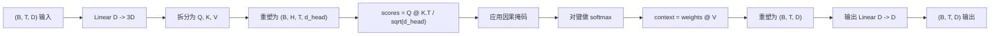
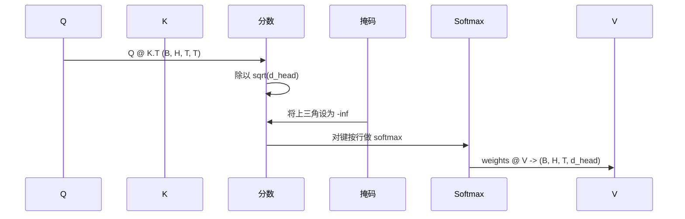

# 多头自注意力

> 一个线性投影，三个视图，H 个并行头，一个掩码。模型实际使用的注意力块。

**类型：** 构建
**语言：** Python
**前置知识：** 第 04 阶段课程，第 07 阶段 Transformer 课程，本阶段第 30 至 32 课
**时间：** ~90 分钟

## 学习目标
- 实现一个批量化查询/键/值投影，作为单个线性层拆分为 H 个头。
- 使用正确的归一化和数据类型处理计算缩放点积注意力。
- 应用因果掩码，防止位置关注未来位置。
- 检查固定输入下每个头的注意力权重，并推理每个头关注什么。
- 在玩具任务上训练一个小型注意力块，观察损失随头专业化而下降。

## 框架

注意力是一个函数，让标记的表示从同一序列中的其他标记拉取信息。自注意力意味着查询、键和值都来自同一输入。多头意味着投影被拆分为 H 个并行的注意力问题，其输出被拼接并投影回去。

高效的实现模式是一个线性层，从 `D` 投影到 `3 * D`，然后切片为三个视图，再重塑为 H 个大小为 `D // H` 的头。矩阵乘法、softmax 和加权求和作为批量化张量操作执行，因此头在加速器上并行运行。

本课程构建该块。它还添加了因果掩码，使相同的代码可以用作仅解码器语言模型中的注意力层。下一课将该块堆叠为完整的 Transformer，再下一课训练它。

## 形状契约

输入是 `(B, T, D)`。输出是 `(B, T, D)`。掩码是 `(T, T)` 或可广播到该形状。块内部，中间张量的形状为 `(B, H, T, d_head)`，其中 `d_head = D // H`。约束条件是 `D % H == 0`。

两个线性层（QKV 投影和输出投影）是块中唯一的参数。掩码、softmax、矩阵乘法和重塑都是无参数的。

## QKV 拆分

朴素实现有三个独立的线性层，分别用于 Q、K 和 V。高效实现有一个输出 `3 * D` 个特征的单一层，然后拆分结果。两者在数学上等价，因为三个独立的 `(D, D)` 权重矩阵乘法恰好等于一个由它们堆叠而成的 `(3D, D)` 权重矩阵乘法。

高效版本更快，因为加速器启动一次矩阵乘法而不是三次。它也更容易初始化，因为三个子矩阵位于同一个参数张量中，可以一起初始化。

## 头重塑

拆分后，Q、K、V 各自为 `(B, T, D)`。要将其转化为 H 个并行的注意力问题，我们重塑为 `(B, T, H, d_head)` 并转置为 `(B, H, T, d_head)`。头维度现在位于批次维度旁边，因此 PyTorch 将每个头的注意力视为跨 `B * H` 个独立实例的批量化操作。

`d_head` 维度保持在最后，因此分数矩阵乘法 `Q @ K.transpose(-2, -1)` 收缩它。结果是 `(B, H, T, T)` 的每头注意力分数。

## 缩放

分数在 softmax 之前除以 `sqrt(d_head)`。没有这个缩放，点积会随着 `d_head` 增长而增长，将 softmax 推入一个条目拥有几乎所有质量而其他条目趋近于零的区间。该区间中的梯度极小，学习停滞。除以 `sqrt(d_head)` 使分数的方差在不同头大小下大致保持恒定。

## 因果掩码

仅解码器语言模型在预测下一个标记时只能基于过去进行条件化。掩码强制执行这一点。具体来说，在 softmax 之前，`(T, T)` 分数矩阵中对角线以上的每个条目被替换为负无穷。softmax 后这些位置获得零权重。

我们在构造时将掩码注册为缓冲区，使其与模型位于同一设备上，且不属于梯度图的一部分。掩码覆盖块将看到的最大上下文长度。在前向传播时，我们切取左上角的 `(T, T)` 部分。

## 输出投影

在每头上下文向量 `(B, H, T, d_head)` 之后，我们转置回 `(B, T, H, d_head)`，重塑为 `(B, T, D)`，并应用最终的 `(D, D)` 线性投影。输出投影让模型混合各个头。没有它，H 个头只能通过后续层重新组合，块将被人为约束。

## 注意力权重检查

本课程在前向传播上暴露了一个 `return_weights=True` 标志。设置后，块返回形状为 `(B, H, T, T)` 的每头注意力权重以及输出。演示在短输入上打印一个头的注意力权重热图，以便你看到因果三角结构和每个位置的关注焦点。

在训练好的模型中，不同的头学习不同的模式。有些头关注紧邻的前一个标记。有些头关注序列的开头。有些头几乎均匀地分布注意力。检查钩子是这种可解释性工作的入口点。

## 训练演示

`main.py` 底部的演示将注意力块连接到一个微型 LM 头，并在重复任务上训练整个系统。输入的每一行是一个在上下文中重复的单一随机 ID。目标是输入移位一位，因此模型必须学习下一个标记与前一个标记相同。损失是交叉熵。使用 H=4、D=32、T=12 和 64 的词表，损失从随机水平（约 `log(64) ~ 4.16`）下降到远低于 `1.0`，在 CPU 上经过三个 epoch。

演示的目的不是训练一个有用的模型。目的是确认梯度流过块的每个部分，并且头在一个答案显而易见的问题上学到了东西。

## 本课程不做什么

它不添加前馈块。真实模型中的 Transformer 层是注意力后接一个带残差连接和层归一化的两层 MLP。下一课添加这些。

它不实现旋转或 AliBi 位置编码。两者都在同一块的 QKV 投影步骤应用，但它们是独立的教学单元。这里构建的块通过在矩阵乘法前变换 Q 和 K，与两者兼容。

它不实现推理用的 KV 缓存。跨前向传播缓存键和值是使自回归解码快速的优化。它改变了 K 和 V 张量的形状契约，但不改变 Q。它属于推理课程。

## 如何阅读代码

`main.py` 定义了 `MultiHeadSelfAttention`。该类持有两个线性层和一个注册的掩码缓冲区。前向传播执行投影、重塑、分数计算、掩码、softmax、加权、重塑和再次投影。底部的演示构建了一个小型模型，将注意力与标记和位置嵌入以及 LM 头包装在一起，在复制任务上训练三个 epoch，并打印损失曲线和每头注意力热图。`code/tests/test_attention.py` 中的测试固定了形状契约、因果性属性、softmax 属性、头拆分属性和梯度流动。

运行演示。然后将 `n_heads` 从 4 增加到 8（保持 `d_model=32`，因此 `d_head=4`），观察热图如何变化。