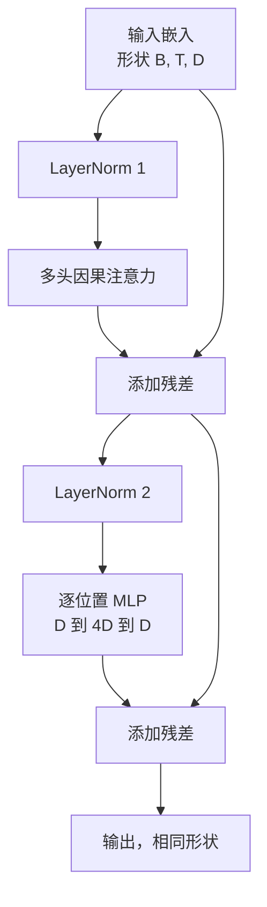
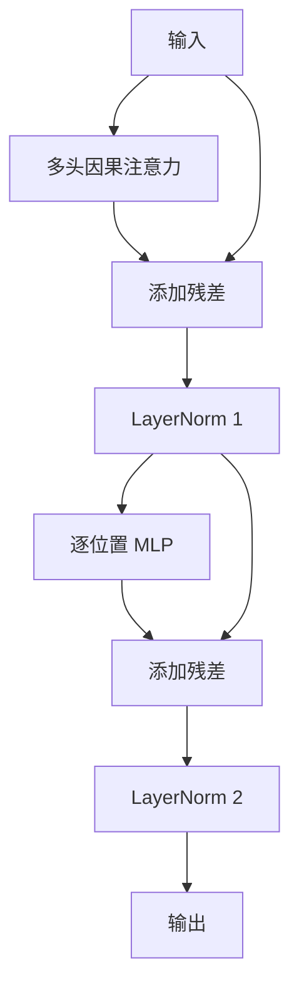

# 从头构建 Transformer 块

> 一个块是每个现代解码器 LLM 的基本单元。层归一化、多头注意力、残差、MLP、残差。Pre-LN 变体无需预热即可稳定训练。Post-LN 变体是原始论文发布时的版本。本课程并排构建两者，并展示在常见学习率下哪个能在 12 层堆叠中存活。

**类型：** 构建
**语言：** Python
**前置知识：** 第 19 阶段第 30 至 33 课（分词器、嵌入、注意力数学、批量化数据加载器）
**时间：** ~90 分钟

## 学习目标

- 在 PyTorch 中从四个活动部件构建 Transformer 块：LayerNorm、多头因果注意力、残差连接、逐位置 MLP。
- 以两种配置（pre-LN 和 post-LN）放置 LayerNorm，并解释为什么一种无需预热即可稳定训练。
- 在多头注意力内部实现因果掩码，使标记 `i` 无法看到标记 `j > i`。
- 追踪两种变体在 12 层堆叠上的梯度流，并无需空谈地读取结果。
- 在下一课组装 1.24 亿参数 GPT 时，将该块作为即插即用单元复用。

## 问题

Transformer 是一个重复的块。一次把块做错，重复十二次，你就会发布一个在第一个 epoch 就发散、或者需要预热技巧才能撑过余下训练的模型。你在本课中会看到的两种失败模式并不罕见。它们在学习者第一次天真地堆叠块时就会出现。一个是注意力层关注未来。另一个是 LayerNorm 被放在无法在深度下驯服残差信号的位置。

一旦你看到它，修复方法是机械的。该块恰好有两条残差路径和两个归一化位置。正确选择位置后，堆叠的其余部分就只是簿记工作。

## 概念

每个仅解码器 Transformer 块都是一个函数，接受形状为 `(batch, sequence, embedding)` 的张量，并返回相同形状的张量。内部，两个子层完成工作。



这是 pre-LN 变体。LayerNorm 位于残差分支内部，子层之前。残差连接将未归一化的信号向前传递。

Post-LN 变体将 LayerNorm 移到残差相加之后。



形状相同。训练行为不同。使用 post-LN，通过残差路径反向传播的梯度必须经过 LayerNorm。在深度十二和学习率 `3e-4` 下，该梯度收缩得足够快，需要预热调度。Pre-LN 使残差路径保持未归一化，因此梯度干净地传播到嵌入层。Pre-LN 是 GPT-2 及之后版本默认使用的配置，原因就在于此。

### 因果多头注意力

注意力子层将输入投影为三种方式：查询、键、值张量。每个从 `(B, T, D)` 重塑为 `(B, H, T, D/H)`，其中 `H` 是头数。缩放点积注意力计算每个头的 `softmax(Q K^T / sqrt(d_k))`，将上三角掩码为负无穷，通过 softmax 应用掩码，然后乘以 `V`。头被拼接回单个 `(B, T, D)` 张量并再次投影。掩码是使模型具有因果性的唯一部件。忘记掩码，你训练的就是一个作弊的模型。

### MLP

逐位置 MLP 对每个标记独立应用相同的两层网络。隐藏宽度是嵌入宽度的四倍，激活函数是 GELU，第二个线性层后跟一个 dropout。MLP 内部没有标记之间的通信。所有标记混合都在注意力中发生。

### 残差连接做两件事

它们使梯度路径在深度上保持加性，从而使梯度范数在十二层中保持规模。它们还让每个块学习对运行表示的加性更新，而不是完全替换。这两种效果就是块能够扩展的原因。

## 构建它

`code/main.py` 实现了：

- `class LayerNorm`，带有可学习的缩放和偏移、有偏 epsilon，应用于每个标记向量。
- `class MultiHeadAttention`，带有 `num_heads`、`head_dim = d_model // num_heads`、融合 QKV 投影、注册的因果掩码、注意力和残差 dropout。
- `class FeedForward`，带有两个线性层、GELU 激活、dropout。
- `class TransformerBlock`，带有一个 `pre_ln` 标志，用于在两种变体之间切换。
- 一个演示，构建一个 6 层 pre-LN 堆叠和一个 6 层 post-LN 堆叠，使用相同的输入，并打印 (a) 输出形状，(b) 一次反向传播后嵌入处的梯度范数。

运行它：

```bash
python3 code/main.py
```

输出：两个堆叠的形状检查，梯度范数并排显示。在相同学习率下，pre-LN 堆叠的嵌入梯度比 post-LN 堆叠大一个数量级，这是 pre-LN 无需预热即可训练的经验信号。

## 技术栈

- `torch` 用于张量数学、自动求导和 `nn.Module` 管道。
- 没有 `transformers`，没有预训练权重。该块从原语实现。

## 生产中的常见模式

三种模式将教科书中的块变成可以发布的东西。

**融合 QKV 投影。** 三个独立的线性层需要三次内核启动和三次矩阵乘法。一个宽度为 `3 * d_model` 的线性层在一次启动中完成相同的工作，然后沿最后一个轴拆分输出。融合路径在每个加速器上都更快，并且与 GPT-2、LLaMA 和 Mistral 的参考实现一致。

**注册的因果掩码缓冲区。** 掩码仅取决于最大上下文长度。在构造时使用 `register_buffer` 分配一次，每次前向传播切片活动窗口，并跳过每次调用的分配。忘记这一点会使掩码在长上下文时成为分配器热点。

**在两个地方使用 dropout，而不是三个。** Dropout 属于注意力 softmax 之后（注意力 dropout）和 MLP 的第二个线性层之后（残差 dropout）。在残差本身上做 dropout 会破坏让梯度在深度上流动的加性恒等关系。一些早期实现在这方面犯了错误，并为此付出了训练脆弱的代价。

## 使用它

- 本课中的块无需修改即可直接插入第 35 课的 GPT 组装中。
- Pre-LN 变体是每个现代开源权重 LLM 使用的。Post-LN 变体是原始 2017 年注意力论文使用的。了解两者足以阅读你将遇到的任何解码器架构。
- 将 GELU 换成 SiLU，你就得到了 LLaMA 家族的激活函数。将 LayerNorm 换成 RMSNorm，你就得到了 LLaMA 家族的归一化。相同的骨架。

## 练习

1. 为块中的每个线性层添加一个 `bias=False` 标志。现代开源权重 LLM 的线性层不带偏置。测量在 12 层 768 维模型中你节省了多少参数。
2. 将 `nn.LayerNorm` 替换为手写的 RMSNorm，并验证输出形状不变。
3. 添加一个标志，将第一个头的注意力权重作为 `(B, T, T)` 张量返回。绘制上三角以确认 softmax 后它为零。
4. 构建一个健全性检查，将 `(2, 16, 384)` 张量（`H=6`）通过两种变体，并断言当权重相同初始化且 dropout 设为零时，前向输出不同（例如 `not torch.allclose`）。

## 关键术语

| 术语 | 人们说的 | 实际含义 |
|------|---------|---------|
| Pre-LN | "前归一化" | LayerNorm 在残差分支内部，每个子层之前；残差携带未归一化的信号 |
| Post-LN | "后归一化" | LayerNorm 在残差相加之后；2017 年论文发布时的版本，需要预热 |
| 因果掩码 | "三角掩码" | 注意力 logits 的上三角设为负无穷，使标记 i 无法读取 j > i 的标记 |
| 融合 QKV | "组合投影" | 一个宽度为 3D 的线性层，而不是三个宽度为 D 的线性层；一次内核，一次矩阵乘法 |
| 残差流 | "跳跃连接" | 从上到下流过每个块的未归一化张量；每个块向它添加内容 |

## 延伸阅读

- 第 07 阶段第 02 课（从头构建自注意力）了解该块底层的注意力数学。
- 第 07 阶段第 05 课（完整 Transformer）了解相同骨架的编码器-解码器版本。
- 第 10 阶段第 04 课（预训练迷你 GPT）了解该块插入的训练过程。
- 第 19 阶段第 35 课（本轨道）将十二个这样的块堆叠成一个 GPT 模型。