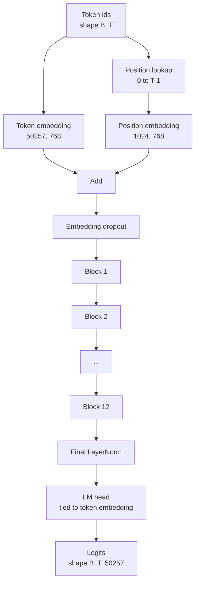
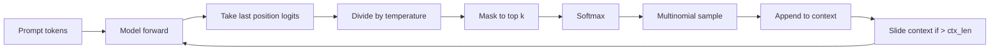

# GPT 模型组装

> 十二个块堆叠、一个 token 嵌入、一个学习位置嵌入、一个最终 LayerNorm 和一个绑定的语言模型头。这就是整个 1.24 亿参数 GPT 模型。这节课将这些部件组装成一个工作类，计数参数以确认模型匹配参考的 124M 形状，并使用多项式采样、温度和 top-k 生成文本。

**类型:** Build
**语言:** Python
**前置要求:** Phase 19 第 30 到 34 课
**时间:** ~90 分钟

## 学习目标

- 将第 34 课的 transformer 块组装成完整的 GPT 模型：token 嵌入、位置嵌入、N 个块、最终 LayerNorm、语言模型头。
- 复现 1.24 亿参数配置：词汇表 50257、上下文 1024、嵌入 768、十二个头、十二层。
- 将语言模型头权重绑定到 token 嵌入，并解释为什么在此规模下节省约 3800 万参数。
- 使用多项式采样、温度缩放和 top-k 截断从提示生成文本，使用滑动窗口保持上下文长度。
- 测量参数数量和前向传播成本，与 124M 目标对比。

## 问题

Transformer 块本身不做任何事情。你需要将 token ID 转换为向量、混合位置信息、通过堆叠运行它们，并投影回词汇表 logits。忘记这四步中的任何一步，模型要么无法前向传播，要么在位置信息中漂移，要么无法发声。

模型的形状也很重要。参考 GPT-2 small 正好是上述配置下的 1.24 亿参数。这些数字不是魔法。词汇表 50257 乘以嵌入 768 是 token 表。位置 1024 乘以 768 是位置表。十二个块，每个约 700 万参数，共 8400 万。最终头通过权重绑定重用 token 表。将各部分加起来，你正好得到 1.24 亿。构建一个参数数量与参考不匹配的模型是你搞错了某些东西的标志。

## 概念



Token ID 变成 token 向量。位置 ID 变成位置向量。两者相加并通过堆叠发送。最终 LayerNorm 是块外部的一个部件，在每个现代变体中存在。LM 头重用 token 嵌入矩阵，这就是权重绑定的含义。

### 权重绑定

Token 嵌入形状为 `(vocab, d_model)`。语言模型头需要从 `d_model` 投影回 `vocab`。这些是彼此的转置。绑定两者意味着字面上相同的参数张量，使用两次。在词汇表 50257 和 d_model 768 时，矩阵是 3800 万参数。不绑定时，你要付两次费用。绑定时，你付一次，并且因为嵌入和头一起更新，你还得到一个稍微更清晰的梯度信号。

### 位置嵌入是学习的，不是正弦的

GPT-2 提供了一个学习位置嵌入。位置表是一个形状为 `(1024, 768)` 的参数张量。模型在每个前向传播时查找位置 0 到 T-1 并将查找结果添加到 token 嵌入。这是位置方案中最简单的（RoPE、ALiBi、T5 相对偏置是替代方案），并且是 124M 参考使用的方案。

### 生成：温度、top-k、多项式

生成是自回归的。在每一步，模型在每个位置返回词汇表上的 logits。你只取最后一个位置，除以温度，可选地将除 top k logits 外的所有 logits 掩码为负无穷，softmax 得到概率，并从结果分布中采样一个 token。



三个旋钮，三种不同的行为。接近零的温度坍缩为贪心。温度一匹配模型的自然分布。Top-k 一是贪心的。Top-k 四十过滤长尾。组合很重要；下一节训练课使用生成作为定性评估信号。

## 构建它

`code/main.py` 实现了：

- `class GPTConfig` 数据类，带 124M 默认值：`vocab_size=50257`、`context_length=1024`、`d_model=768`、`num_heads=12`、`num_layers=12`、`mlp_expansion=4`、`dropout=0.1`、`use_bias=True`、`weight_tying=True`。
- `class GPTModel` 带有 token 嵌入、位置嵌入、嵌入 dropout、十二个 `TransformerBlock`、最终 LayerNorm 和当标志设置时绑定到 token 嵌入的 `lm_head`。
- 一个 `count_parameters` 辅助函数，返回唯一参数计数（以便权重绑定在计数中被尊重）。
- 一个 `generate` 函数，执行温度、top-k、多项式和滑动窗口上下文。
- 一个演示，构建模型，打印参数数量与参考 124M 的对比，并从固定提示生成一个短序列以显示管道端到端。

运行它：

```bash
python3 code/main.py
```

输出：与 124M 参考并排的参数数量、从随机提示生成的 token ID 以及当绑定开启时 LM 头和 token 嵌入共享存储的确认。

为了保持演示快速，脚本还端到端运行一个微配置（`d_model=64`、`num_layers=2`）并内联打印生成的 token 序列。124M 配置被构建但只训练其参数计数和一次前向传播。

## 技术栈

- `torch` 用于张量数学、自动求导和模块管道。
- `code/main.py` 在第 34 课本地重新实现相同的块模式。

## 生产中的模式

三个模式区分了运行的模型和可以交付的模型。

**将残差投影初始化得小。** 注意力的输出投影和 MLP 的第二个线性层都直接馈入残差相加。用与每个其他线性层相同的标准差初始化这些会导致残差流随深度增长，并将最终 LayerNorm 推入过热状态。对那两个投影将标准差缩放为 `1 / sqrt(2 * num_layers)`；残差流在十二层中保持在一个合理范围内。

**缓存位置 ID 张量，不重新计算。** `torch.arange(T)` 每次前向传播分配新内存。在 `__init__` 中为最大上下文分配一次，每次调用切片前 T 个条目，跳过分配器的往返。

**在参数级别绑定权重，不只是在复制时。** 设置 `lm_head.weight = token_embedding.weight` 共享张量；复制不会。优化器需要更新一个参数，自动求导图需要一个累积。如果你复制，头会漂离嵌入，权重绑定对你没有好处。

## 使用它

- 这节课中的模型类与下一节课训练的模型形状相同。
- 将学习位置嵌入替换为 RoPE，可以在不触及块或头的情况下获得 LLaMA 家族。
- 将 GELU 替换为 SiLU，LayerNorm 替换为 RMSNorm，获得 LLaMA 家族其余的变化。
- 生成函数适用于任何 logits 源，不仅是这个模型。你可以在第 37 课中从预训练的 GPT-2 文件拉取 logits，并重用相同的生成循环。

## 练习

1. 将 LM 头从 token 嵌入解绑并重新计数参数。验证差值为 50257 乘以 768 = 3800 万。
2. 将学习位置嵌入替换为在构造时计算的正弦表。确认模型仍然前向传播，参数数量减少 786,432。
3. 添加一个 `greedy=True` 标志到生成中，跳过采样并选择 argmax。确认序列在运行间是确定性的。
4. 添加一个 `repetition_penalty` 旋钮，在 softmax 之前将提示或生成历史中的任何 token 的 logit 除以一个常数。在固定提示上显示，高于一的值减少输出中的重复计数。
5. 在 `top_k` 旁边添加 `top_p`（核）采样。两行检查保留的 token 的概率和超过 `top_p`。

## 关键术语

| 术语 | 人们说的 | 实际含义 |
|------|---------|---------|
| 权重绑定 | "绑定的嵌入" | LM 头和 token 嵌入共享相同的参数张量；节省词汇表乘以 d_model 参数，匹配 GPT-2 参考 |
| 位置嵌入 | "学习的位置" | 形状为（上下文长度、d_model）的单独表，添加到 token 向量；端到端学习 |
| 滑动窗口上下文 | "上下文上限" | 当提示加上生成 token 超过上下文长度时，丢弃最旧的 token 以使活动窗口适合 |
| Top-k 采样 | "K 截断" | 保留具有最高值的 K 个 logits，将剩余的掩码为负无穷，对剩余部分进行 softmax |
| 温度 | "采样温度" | 在 softmax 之前将 logits 除以 T；T 小于 1 使分布变尖，T 等于 1 保持自然分布，T 大于 1 使分布变平 |

## 延伸阅读

- Phase 19 第 34 课，了解该模型堆叠的块。
- Phase 19 第 36 课，了解用交叉熵损失驱动该模型的训练循环。
- Phase 19 第 37 课，了解将预训练的 GPT-2 权重加载到此精确架构中。
- Phase 7 第 07 课（GPT 因果语言建模），了解下一个 token 预测的数学。
- Phase 10 第 04 课（预训练迷你 GPT），了解相同架构上的原始训练过程。
