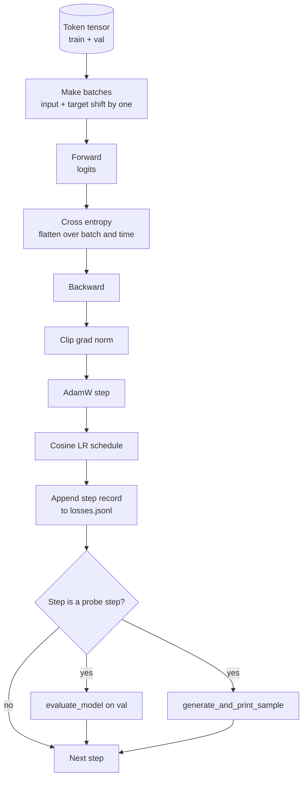

# 训练循环和评估

> 不测量的循环是撒谎的循环。这节课构建了驱动 GPT 模型的训练循环：带权重衰减分割的 AdamW、预热加余弦学习率调度、一个 `calc_loss_batch` 辅助函数、在留出数据上的 `evaluate_model` 传递、每 K 步的 `generate_and_print_sample` 定性探测，以及一个可以之后绘制的 JSONL 损失日志。相同的骨架训练你将构建的每个解码器 LLM。

**类型:** Build
**语言:** Python
**前置要求:** Phase 19 第 30 到 35 课
**时间:** ~90 分钟

## 学习目标

- 构建一个训练循环，使用正确的输入和目标对齐为下一个 token 预测计算交叉熵损失。
- 配置 AdamW，权重衰减应用于权重张量而不应用于 LayerNorm 或偏置张量。
- 实现一个带有线性预热和余弦衰减的学习率调度，并读取随时间变化的 LR。
- 使用 `evaluate_model` 在留出分割上评估，使评估损失在运行间可比。
- 每 K 步使用 `generate_and_print_sample` 生成定性样本，以在损失曲线之前捕获发散。
- 将每步损失持久化到 JSONL，以便你可以重新加载、绘制并将训练日志作为交付物交付。

## 问题

一个打印损失但不做其他事情的训练脚本以三种方式失败。它无法告诉你损失是否以正确的原因下降（模型可能过拟合训练集且从未学习）。它无法告诉你发散是否开始（损失可能在一步中飙升然后恢复，或一步然后崩溃）。它无法告诉你模型学到了什么（损失是一个标量；生成的样本是一个段落）。除非循环测量，否则所有三种失败都隐藏着。

这节课中的循环以三种方式测量。每个训练批次的损失每步。留出批次上的损失每 K 步。从固定提示生成的延续每 K 步。训练日志落在 JSONL 中，因此工件是循环的证词。

## 概念



两个非明显的部分是损失对齐和 AdamW 衰减分割。

### 损失对齐

模型在每个位置预测下一个 token。如果输入批次是 tokens `[t0, t1, t2, t3]`，目标批次必须是 `[t1, t2, t3, t4]`。交叉熵在扁平形状 `(batch * seq, vocab)` 上针对扁平目标 `(batch * seq,)` 计算。忘记移位，你训练模型预测自身，这收敛到零损失但学习到无用的东西。

### AdamW 衰减分割

权重衰减正则化权重张量，但不正则化归一化缩放或偏置。将衰减放在 LayerNorm 缩放上会慢慢将缩放驱动到零并破坏归一化。将衰减放在偏置上在数学上是无害的，但浪费周期。标准分割是：矩阵形状的张量（线性权重、嵌入表）获得衰减，任何看起来像缩放或偏移的东西不获得衰减。

### 预热加余弦调度

预热在几百步内将学习率从零提升到目标，以便优化器状态有时间填充。余弦衰减在剩余步数中将学习率降回零，以便最终阶段以小步长微调权重。这种组合是开源权重 LLM 训练中最常见的调度，因为它消除了前一千步和后一千步中的大部分脆弱时刻。

### 留出评估

`evaluate_model` 从验证分割运行固定数量的批次，累积损失，除以批次计数，然后返回。无梯度。无 dropout。数字在相同种子和相同分割下在运行间是可重现的。报告留出损失与训练损失的并排对比是你发现过拟合的方式。

### 作为早期信号的定性采样

一个训练损失下降得很漂亮但生成的样本都是相同 token 的模型是坏的。一个损失曲线看起来很平坦但生成的样本变得连贯可读的模型是正在学习的。定性探测比阅读完整曲线运行得更快，并捕获标量遗漏的模式。

## 构建它

`code/main.py` 实现了：

- `make_batches(token_ids, batch_size, context_length)` 将长 token 张量切片为输入和目标对。
- `calc_loss_batch(model, inputs, targets)` 前向传播、扁平化并返回标量交叉熵。
- `evaluate_model(model, val_loader, max_batches)` 以无梯度方式迭代固定数量的验证批次并返回平均损失。
- `generate_and_print_sample(model, prompt, max_new_tokens)` 在固定提示上运行第 35 课的生成函数并打印结果。
- `build_param_groups(model, weight_decay)` 产生两组 AdamW 参数列表。
- `cosine_with_warmup(step, warmup_steps, total_steps, max_lr, min_lr)` 返回给定步骤的 LR。
- `train(...)` 运行循环，持久化 `outputs/losses.jsonl`，并每 `eval_every` 步打印评估损失和样本。
- 一个演示，在合成数据上训练一个微型模型经过少量步骤，写入 JSONL 日志，并在探测点打印评估损失和样本。演示在 CPU 上远低于一分钟完成。

运行它：

```bash
python3 code/main.py
```

输出：每步损失行、每探测步的评估损失、每探测步的生成样本以及最终的 `outputs/losses.jsonl`，你可以用 `json.loads` 每行加载。

## 技术栈

- `torch` 用于自动求导、优化器和模块。
- `main.py` 本地重新实现了第 35 课的 `GPTModel` 和支持模块。

## 生产中的模式

三个模式将教科书循环变成可以整夜运行的东西。

**梯度范数裁剪是不可协商的。** 一个坏批次（异常数据、LR 尖峰、数值边缘情况）产生巨大的梯度，抹去数小时的训练。`backward` 之后和 `step` 之前的 `torch.nn.utils.clip_grad_norm_(params, max_norm=1.0)` 使优化器保持在安全范围内。裁剪值是一个自由参数；一是默认值，在大多数设置中存活。

**可恢复的 JSONL 日志，不是 pickle 化状态。** 每步损失记录作为 `{"step": int, "train_loss": float, "lr": float}` 行的 JSONL 是持久的：任何崩溃留下可读的工件，你可以 grep，你可以用三十行 Python 绘制，你可以通过读取最后一步恢复训练。Pickle 化状态将你绑定到产生文件的精确模块布局，这在重构中是脆弱的。

**从固定切片中抽取的评估批次。** 验证 token 在脚本启动时被切片为批次，而不是运行时。可重现性取决于评估批次在运行间是相同的；否则比较两次运行之间的评估损失会像测量模型一样多地测量批次洗牌。

## 使用它

- 这节课中的循环是训练 124M 模型在真实数据上的相同骨架。将合成 token 张量换成 `datasets` 风格的加载器，循环运行不变。
- JSONL 日志是将训练运行变成证据的交付物。下一课使用一个来比较新训练的检查点与预训练的检查点。
- 定性样本探测是标量损失无法替代的全面检查。

## 练习

1. 添加 `weight_decay_groups()` 单元测试，确认缩放和偏置参数落在无衰减组中，线性和嵌入权重落在衰减组中。
2. 将合成随机 token 替换为来自小文本文件的字节，以便演示训练一些可读的内容。验证生成的样本使用文件中存在的字符。
3. 添加一个 `min_lr` 下限为 `max_lr` 的百分之十到余弦调度并重新绘制。
4. 每 `eval_every` 步保存一个检查点，除了 JSONL 日志之外。添加一个 `resume_from` 标志，重新加载模型状态和优化器状态。
5. 在损失旁边记录每步吞吐量（每秒 token 数），并确认它保持在一个稳定范围内。

## 关键术语

| 术语 | 人们说的 | 实际含义 |
|------|---------|---------|
| 损失对齐 | "移位一位" | 位置 0..T-1 的输入 token，位置 1..T 的目标 token；交叉熵在扁平形状上计算 |
| 衰减分割 | "两组" | AdamW 接收矩阵形状张量带权重衰减，缩放或偏置张量不带 |
| 预热 | "提升" | 学习率在固定步数内从零上升到目标，以便优化器状态可以填充 |
| 评估批次 | "留出批次" | 验证 token 张量的固定切片，在脚本启动时切片一次，每个探测相同使用 |
| 定性探测 | "样本打印" | 每 K 步从固定提示打印的简短生成，捕获损失单独隐藏的故障模式 |

## 延伸阅读

- Phase 19 第 35 课，了解循环驱动的模型。
- Phase 19 第 37 课，了解将预训练权重加载到相同模型中。
- Phase 10 第 04 课（预训练迷你 GPT），了解在真实数据上的过程。
- Phase 10 第 10 课（评估），了解超出交叉熵损失的更广泛评估面。
