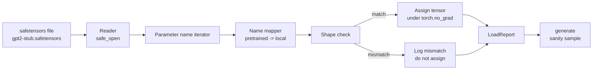

# 加载预训练权重

> 从零训练一个 1.24 亿参数模型是一个预算决策；加载已发布的检查点是一个星期二。这节课将预训练的 GPT-2 风格权重从 safetensors 文件加载到第 35 课的精确架构中，逐条走过参数名称映射，并生成一个延续以证明加载成功。无网络、无第三方加载器、无不透明的魔法。

**类型:** Build
**语言:** Python
**前置要求:** Phase 19 第 30 到 36 课
**时间:** ~90 分钟

## 学习目标

- 使用 `safetensors` Python 库读取 safetensors 文件并检查张量名称和形状。
- 将每个预训练参数名称映射到第 35 课 GPT 模型内部的参数。
- 处理已发布 GPT-2 权重与本 track 中模型之间不同的两种命名约定：`wte/wpe/h.N.attn.c_attn/c_proj` 和 `mlp.c_fc/c_proj` 对比本地命名的 `tok_embed/pos_embed/blocks.N.attn.qkv/out_proj` 和 `mlp.fc1/fc2`。
- 在任何权重赋值发生之前，以清晰的错误检测并拒绝形状不匹配。
- 使用加载的权重生成一个短延续，并确认 token 来自加载的分布，而不是随机初始化的分布。

## 问题

已发布的权重不是为你的架构打包的。它们携带原始实现使用的名称。预训练文件有 `transformer.h.0.attn.c_attn.weight` 形状 `(2304, 768)`；你的模型期望 `blocks.0.attn.qkv.weight` 形状 `(2304, 768)`（这是相同矩阵的不同布局约定）或者你的模型使用 `nn.Linear`，它以转置形式存储矩阵。相同的参数以三种微妙不同的身份（名称、形状、字节布局）出现，加载器必须协调所有三者。

盲目复制的加载器将正确的张量放在错误的位置，你得到一个生成无意义内容的模型。形状不同时不复制但什么都不记录的加载器让你猜测哪个张量未能落地。这节课中的加载器是显式的：每个赋值被记录，每个形状被检查，并且一个 `LoadReport` 总结命中、未命中和形状不匹配，以便你可以读取发生了什么。

## 概念



名称映射器只是一个从字符串到字符串的函数。形状检查是一个 if。赋值发生在 `torch.no_grad()` 内部，以便自动求导不跟踪加载。报告持有每个名称的结果。

### GPT-2 命名约定

已发布的 GPT-2 权重存在于这样的名称下：

| 预训练名称 | 形状 | 含义 |
|-----------------|-------|---------|
| `wte.weight` | (50257, 768) | Token 嵌入 |
| `wpe.weight` | (1024, 768) | 位置嵌入 |
| `h.N.ln_1.weight` | (768,) | 块 N 的 LayerNorm 1 缩放 |
| `h.N.ln_1.bias` | (768,) | 块 N 的 LayerNorm 1 偏移 |
| `h.N.attn.c_attn.weight` | (768, 2304) | 融合 QKV 线性权重 |
| `h.N.attn.c_attn.bias` | (2304,) | 融合 QKV 线性偏置 |
| `h.N.attn.c_proj.weight` | (768, 768) | 注意力输出投影 |
| `h.N.attn.c_proj.bias` | (768,) | 注意力输出投影偏置 |
| `h.N.ln_2.weight` | (768,) | LayerNorm 2 缩放 |
| `h.N.ln_2.bias` | (768,) | LayerNorm 2 偏移 |
| `h.N.mlp.c_fc.weight` | (768, 3072) | MLP fc1 权重 |
| `h.N.mlp.c_fc.bias` | (3072,) | MLP fc1 偏置 |
| `h.N.mlp.c_proj.weight` | (3072, 768) | MLP fc2 权重 |
| `h.N.mlp.c_proj.bias` | (768,) | MLP fc2 偏置 |
| `ln_f.weight` | (768,) | 最终 LayerNorm 缩放 |
| `ln_f.bias` | (768,) | 最终 LayerNorm 偏移 |

两个意外要计划。`c_attn`、`c_proj`、`c_fc` 线性层存储的矩阵相对于 `nn.Linear.weight` 期望的是转置的。加载器在赋值期间转置。LM 头根本不在文件中；模型依赖与 `wte` 的权重绑定，因此头通过别名一旦 `wte` 落地就设置。

### 本地命名约定

本 track 中的模型使用描述性名称：

| 本地名称 | 含义 |
|------------|---------|
| `tok_embed.weight` | Token 嵌入 |
| `pos_embed.weight` | 位置嵌入 |
| `blocks.N.ln1.scale` | 块 N 的 LayerNorm 1 缩放 |
| `blocks.N.ln1.shift` | LayerNorm 1 偏移 |
| `blocks.N.attn.qkv.weight` | 融合 QKV |
| `blocks.N.attn.qkv.bias` | 融合 QKV 偏置 |
| `blocks.N.attn.out_proj.weight` | 注意力输出投影 |
| `blocks.N.attn.out_proj.bias` | 输出投影偏置 |
| `blocks.N.ln2.scale` | LayerNorm 2 缩放 |
| `blocks.N.ln2.shift` | LayerNorm 2 偏移 |
| `blocks.N.mlp.fc1.weight` | MLP fc1 |
| `blocks.N.mlp.fc1.bias` | MLP fc1 偏置 |
| `blocks.N.mlp.fc2.weight` | MLP fc2 |
| `blocks.N.mlp.fc2.bias` | MLP fc2 偏置 |
| `final_ln.scale` | 最终 LayerNorm 缩放 |
| `final_ln.shift` | 最终 LayerNorm 偏移 |

映射是一个固定函数。这节课将其作为加载器迭代的字典提供。

### Stub 夹具

真实的 GPT-2 权重大小为 0.5 GB。演示不下载它们；它在第一次运行时生成一个小的 safetensors 夹具，具有精确的 GPT-2 命名约定和适合 12 块模型、d_model 192 而不是 768 的形状。夹具具有正确的结构来练习加载器中的每个代码路径。将夹具换成真实文件，加载器无需修改即可工作。

## 构建它

`code/main.py` 实现了：

- 第 35 课 `GPTModel` 的一个小副本，使这节课自包含。
- `make_pretrained_to_local(num_layers)` 展开每层条目。
- `load_safetensors(model, path)` 迭代名称，映射它们，检查形状，转置 conv1d 风格的权重，并在 `torch.no_grad()` 下赋值。返回一个 `LoadReport`。
- `make_stub_safetensors(path, cfg)` 生成一个具有精确预训练命名约定的夹具文件。
- 一个演示，在第一次运行时创建 `outputs/gpt2-stub.safetensors`，构建一个新鲜模型，从随机初始化捕获一次生成延续，加载 stub，捕获另一个延续，打印两者，并验证两者不同（加载实际改变了模型）。

运行它：

```bash
python3 code/main.py
```

输出：夹具路径、按名称的加载日志、`LoadReport` 摘要、加载前的延续、加载后的延续以及一个故意注入夹具的形状不匹配（以便失败路径被练习）。

## 技术栈

- `safetensors` 用于磁盘格式和流式读取器。
- `torch` 用于模型和赋值数学。
- 无 `transformers`、无 `huggingface_hub`、无网络调用。

## 生产中的模式

三个模式使加载器在你未创建的权重中存活。

**在任何赋值之前始终验证文件。** 打开文件，列出每个张量名称及其 dtype 和形状，运行带有形状检查的完整映射，仅在成功时开始赋值。半加载的模型是静默故障机器。

**记录每个赋值，带有源名称和目标名称。** 当看起来不对劲时，日志告诉你哪个张量落在了哪里；替代方案是读取十六进制转储。这节课中的 `LoadReport` 数据类跟踪 `loaded`、`missing`、`unexpected` 和 `shape_mismatch` 列表，并在最后打印摘要。

**LM 头是权重绑定别名，不是单独的副本。** 在加载 `tok_embed` 后设置 `model.lm_head.weight = model.tok_embed.weight` 是规范模式。将嵌入矩阵复制到新的 `lm_head.weight` 参数中会破坏绑定并静默加倍你的参数数量。

## 使用它

- 加载器适用于任何使用预训练命名约定的 safetensors 文件。真实的 GPT-2 文件（small / medium / large / xl）无需代码更改即可工作；只有模型配置不同。
- 相同的模式在更新名称映射后扩展到 LLaMA、Mistral、Qwen 权重。形状检查和报告保持相同。
- 加载后的安全性成是一个快速的关卡：如果加载后样本看起来像加载前样本，加载没有改变模型，这意味着映射静默错过了每个张量。

## 练习

1. 向加载器添加一个 `dtype` 参数，在赋值期间将每个张量转换为目标 dtype（`bfloat16`、`float16`、`float32`）。确认 `float32` 模型可以降转换为 `bfloat16` 并仍然生成。
2. 添加一个 `expected_layers` 参数，如果检查点的 `h.N` 索引与模型的 `num_layers` 不匹配，则拒绝加载。
3. 将加载器插入第 35 课的生成函数，并产生两个并排样本：一个来自随机初始化，一个来自加载的夹具。
4. 添加一个导出路径：使用预训练命名约定将当前模型状态写入新的 safetensors 文件。往返加载器并确认报告有零个形状不匹配。
5. 扩展 `NAME_MAP` 以处理 LLaMA 命名约定（无偏置、RMSNorm、融合 qkv 布局）并重新在你生成的 stub LLaMA 夹具上运行加载器。

## 关键术语

| 术语 | 人们说的 | 实际含义 |
|------|---------|---------|
| 名称映射 | "键重映射" | 从预训练张量名称到本地参数名称的函数；通常是一个字面字典，每层索引一个条目，通过循环展开 |
| 形状不匹配 | "坏形状" | 预训练张量在映射名称下存在但其维度与本地参数不同；加载器拒绝赋值并记录这对 |
| 加载时转置 | "Conv1d 布局" | 已发布 GPT-2 以 nn.Linear 期望的转置形式存储注意力和 MLP 投影；加载器在赋值期间转置 |
| 权重绑定别名 | "共享 LM 头" | 设置 model.lm_head.weight = model.tok_embed.weight 使头和嵌入共享存储；头不在文件中就是因为这个 |
| 加载报告 | "覆盖摘要" | 一个小的数据类，跟踪 loaded、missing、unexpected 和 shape_mismatch 列表；打印它是你判断加载是否成功的方式 |

## 延伸阅读

- Phase 19 第 35 课，了解接收权重的架构。
- Phase 19 第 36 课，了解产生相同形状检查点的训练循环。
- Phase 10 第 11 课（量化），了解内存紧张时如何处理加载的权重。
- Phase 10 第 13 课（构建完整 LLM 管道），了解加载和推理的完整生命周期。
