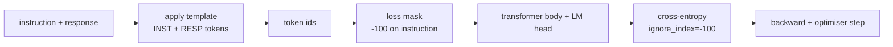

# 顶点课程 39：通过监督微调进行指令微调

> 预训练基础模型可以延续序列但无法遵循指令。监督微调是修复此问题的最小改动：向模型馈送指令和期望响应的配对示例，并训练主体预测响应 token。诀窍是你只希望损失计算响应，而不是指令。这节课构建了一个 Alpaca 风格的 SFT 循环，带有一个自定义整理函数，使用 `ignore_index=-100` 掩码指令 token，在 200 个指令-响应对上训练，并使用精确匹配在留出分割上评估。

**类型:** Build
**语言:** Python (torch, numpy)
**前置要求:** Phase 19 第 30-37 课（NLP LLM track：分词器、嵌入表、注意力块、transformer 主体、预训练循环、检查点、生成、困惑度）
**时间:** ~90 分钟

## 学习目标

- 将配对的指令-响应数据格式化为带有显式边界 token 的单个因果序列。
- 构建一个掩码指令 token 的整理函数，使交叉熵只计算响应 token。
- 在 SFT 目标下训练一个小型 transformer 主体，观察评估指标移动。
- 实现尊重响应起始边界的贪心和温度采样生成。
- 在生成的补全上计算留出精确匹配。

## 问题

在下一个 token 预测上训练的基础模型不知道指令是什么。向它展示字符串 `"法国的首都是什么？"` 它会继续问题或发明一个新句子。模型有语言但没有格式契约。

SFT 契约是一个字符串模板。每个训练示例变成一个具有三个区域的单个序列：

```text
<INST> 法国的首都是什么？ <RESP> 法国的首都是巴黎。
```

边界 token 是在训练时保留的特殊 token。模型学习 `<RESP>` 之后的一切都是响应，响应是被评分的部分。基础模型的下一个 token 目标仍然适用；只是在每个示例都有这个形状的语料库上训练。

但有一个陷阱。如果你将整个序列馈送到普通的交叉熵损失，你也在训练模型预测指令 token。指令是给定的。你希望那些位置上的梯度为零。修复方法是掩码。

## 概念



`ignore_index` 是 `torch.nn.functional.cross_entropy` 的一个特性。任何等于 `ignore_index` 的目标位置贡献零损失和零梯度。PyTorch 中的约定是 `-100`。整理函数为每个示例构建两个张量：`input_ids`（完整序列）和 `labels`（`input_ids` 的副本，指令位置被 `-100` 覆盖）。

模型在前向传播期间看到整个序列；注意力可以关注指令。损失只计算响应 token。这正是你想要的：以指令为条件，预测响应。

## 数据

`main.py` 中确定性生成两百个指令-响应对。它们覆盖六种任务类型：

- 事实性单次问题（X 的首都）
- 算术
- 列表提取
- 一句话摘要
- 代码（打印、排序）
- 定义

每个任务有一个模板化指令和一个确定性响应。这故意很简单。精确匹配是脆弱的，这节课使用正确答案是特定字符串的夹具。真实的 SFT 数据集需要模糊指标；原理是相同的。

分割为 160 训练，40 测试。测试集覆盖所有六种任务类型，因此可以报告按类别的精确匹配。

## 分词和填充

分词器是字节级的，带有三个保留的特殊标记：

- `INST_ID = 256`：标记指令区域开始。
- `RESP_ID = 257`：标记指令和响应之间的边界。
- `PAD_ID = 258`：用于变长批次的填充。

序列是 `[INST] inst_bytes [RESP] resp_bytes [PAD]*`。整理函数：

1. 对每个示例进行分词。
2. 将每个示例填充到批次中最长序列的长度。
3. 构建 `labels` = `input_ids` 移位一位（因果 LM 目标），其中：
   - 指令区域替换为 `-100`。
   - 填充区域替换为 `-100`。
   - `RESP_ID` 边界位置本身替换为 `-100`（你不训练模型预测边界 token；它预测后面的内容）。

## 训练

循环是标准的 PyTorch SFT 循环。Adam，学习率约 3e-4 到 1e-3，在这个夹具上十到二十个 epoch，无调度器。模型足够小（隐藏 96，2 块，最大长度 64），在 CPU 上两分钟内训练到收敛。

每五个 epoch，循环在留出集上运行一次小评估并打印精确匹配。观察精确匹配从第一轮的 0.0 上升到第十五轮左右的 0.85 是这节课的回报：你可以看到模型同时学习格式和答案。

## 生成

在评估时，模型获得指令前缀 `[INST] inst_bytes [RESP]` 并生成 token，直到：

- 序列达到 `max_len`，或
- 模型发出特殊停止启发式：两个连续的句子结束字节（`.`、`!`、`?`）。

这节课提供贪心解码加上一个可选温度采样器。精确匹配使用贪心，因为温度会使指标成为随机变量。真实系统通常采样，然后模糊判断；那个管道是第 41 课。

## 精确匹配评估

精确匹配是最严格的文本指标。预测的响应字符串被规范化（小写、去除空白、折叠双空格）并与参考响应比较，同样规范化。每个示例的指标为 1 或 0。聚合值是平均值。

真实的 SFT 管道用 token 级 F1（第 41 课）和一个评判模型补充精确匹配。精确匹配仍然有用，因为它是不含糊的；如果它说 0.7，正好百分之七十的测试指令逐字符产生了黄金响应。

## 你将构建什么

实现是一个 `main.py` 加测试。

1. `InstructionTokenizer`：字节级编码器，带保留特殊标记。编码指令前缀或完整对。
2. `make_dataset`：在六种任务类型上以固定种子生成 200 对。
3. `SFTDataset`：每个示例返回 `(input_ids, labels)`，已经准备好掩码。
4. `sft_collate`：动态填充，构建批次张量，在指令和填充位置设置 `-100`。
5. `TinyGPT`：transformer 主体加上绑定或未绑定的 LM 头。
6. `train_sft`：SFT 循环，带每 epoch 评估钩子。
7. `generate`：从前缀的因果解码，贪心或采样，带停止启发式。
8. `exact_match`：规范化的字符串比较，返回 `[0, 1]` 范围内的浮点数。
9. `run_demo`：构建数据，训练二十个 epoch，评估，打印每个类别的细分，成功时以零退出。

## 为什么掩码重要

没有掩码，损失将指令 token 作为目标。模型学习预测指令。这是一个不同的目标，以两种方式产生更差的模型。首先，模型容量浪费在重构用户总是提供的输入上。其次，响应损失在梯度总和中的占比更小，因为大多数批次中指令 token 数量超过响应 token；优化器在你关心的部分上的有效学习率低于你的意图。掩码不是点缀；它是目标。

## 扩展目标

- 添加学习率预热后跟余弦衰减。SFT 对 LR 比预训练更敏感。
- 添加每 token 损失记录并绘制训练中的损失曲线。注意早期 epoch 由模板 token（`<RESP>`、公共前缀）主导，后期 epoch 由实际答案 token 主导。
- 将评估扩展到 BLEU-1 或 chrF。精确匹配低估了产生具有相同答案的释义的模型。
- 添加带多轮格式的聊天模板，并在包含后续问题的夹具上训练。

实现给你格式契约、掩码和循环。从基础模型到指令跟随者的目标变化是一个整理函数。
