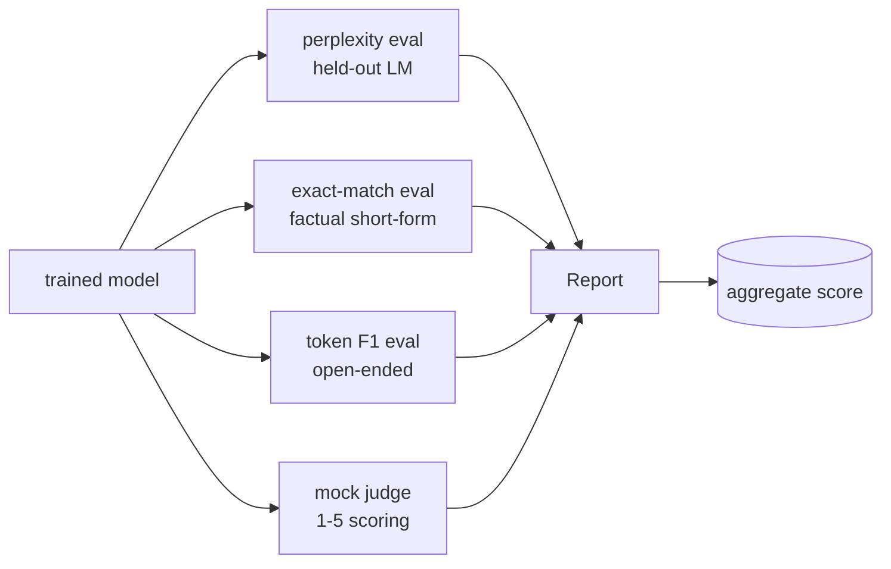

# 顶点课程 41：完整评估管道

> 训练是你可以用损失曲线监控的部分。评估是你必须设计的部分。这节课构建了一个统一的评估管道，接收任何训练好的语言模型，在其上运行四种异构评估，将结果聚合成一个每任务报告，并提供本地模拟 LLM-as-judge，使循环无需网络即可运行。这四种评估涵盖了每个发布模型需要的维度：语言建模（困惑度）、短格式正确性（精确匹配）、开放格式相似性（token F1）和定性评分（评判者）。

**类型:** Build
**语言:** Python (torch, numpy)
**前置要求:** Phase 19 第 30-37 课（NLP LLM track：分词器、嵌入表、注意力块、transformer 主体、预训练循环、检查点、生成、困惑度）
**时间:** ~90 分钟

## 学习目标

- 在小型 transformer 上使用掩码 token 核算计算留出困惑度。
- 在短格式事实性提示上运行精确匹配评估。
- 计算预测和参考字符串之间的 token 级 F1，带规范化。
- 构建一个本地模拟 LLM-as-judge，在 1-5 尺度上评分模型输出。
- 将四种评估聚合成一个带每任务细分的加权报告。

## 问题

单一指标永远无法描述语言模型。困惑度说明模型拟合语言分布的程度，但未说明它是否回答问题。精确匹配说明模型是否产生黄金字符串，但惩罚正确的释义。Token F1 宽恕释义，但被与错误内容的词汇重叠愚弄。LLM-as-judge 捕获定性维度，但昂贵且随机。

你实际想要的管道具有所有四种。每个评估覆盖其他评估遗漏的维度。每个在不同形状的留出数据子集上运行，专为该指标定制。最终报告并排显示每任务数字和一个聚合值，使审查者一眼就能看到模型正在做的取舍。

这节课端到端构建该管道，在一个文件中。

## 概念

每个评估是一个从 `(model, dataset) -> EvalResult` 的函数。结果携带指标值、用于检查的每示例细节以及用于聚合的名称。管道用一个配置将它们组合起来，该配置说明运行哪些评估以及如何加权。

## 困惑度，正确计数

困惑度是 `exp(mean negative log-likelihood per token)`。实现有两个陷阱：

- 平均值必须在实际 token 位置上计算，而不是在批次 * 序列上。填充 token 必须从分母中排除，否则困惑度会看起来比实际好。
- 模型预测下一个 token，因此位置 `i` 的 logits 预测位置 `i+1` 的 token。这里的一一对应错误是静默的：损失仍然训练，但指标变得无意义。

评估计算每批次 `-log p(token)` 在非填充位置上的和，以及每批次 token 计数，然后在最后除以。这在数值上比平均每批次困惑度更安全（后者低估了短序列），并且匹配教科书定义。

## 精确匹配，带规范化

框架在比较前规范化预测和参考：

- 小写。
- 去除周围空白。
- 将内部空白运行折叠为单个空格。
- 如果两侧仅差标点，丢弃尾部终端标点（`.`、`!`、`?`）。

规范化使精确匹配在实践中可用。说 `"Paris"` 的模型是正确的；说 `"Paris."` 的也是正确的；说 `"  paris  "` 的也是正确的。指标仍然要求规范化后答案是相同的字符串。

## Token F1，正确的方式

Token F1 是在 token 包上计算的精确率和召回率的调和平均。步骤：

1. 规范化预测和参考（与精确匹配相同规则）。
2. 将每个分割成 token 列表（空白分词）。
3. 计数多重集交集。
4. 精确率 = `intersection_count / len(pred_tokens)`。召回率 = `intersection_count / len(ref_tokens)`。F1 = 调和平均。

如果预测和参考都为空，F1 是 1（空匹配）。如果只有一个是空的，F1 是 0。这个模式匹配 SQuAD 评估参考，并在释义中产生稳定的数字。

## 本地模拟 LLM-as-Judge

真实的评判者是 API 后面的前沿模型。对于这节课，评判者必须离线运行。模拟评判者是一个确定性评分器，接受指令、模型的预测和参考，并返回 `{1, 2, 3, 4, 5}` 中的一个分数加上一行理由。评分规则是显式的：

- 5：如果规范化预测等于规范化参考。
- 4：如果预测和参考之间的 token F1 至少为 0.8。
- 3：如果 token F1 在 `[0.5, 0.8)` 中。
- 2：如果 token F1 在 `[0.2, 0.5)` 中。
- 1：否则。

这不是一个真正的评判者，但它有正确的接口。稍后通过更改一个函数换成真实模型。管道不关心。

## 聚合

聚合值是规范化评估分数的加权平均。每个评估报告其自己的 `[0, 1]` 范围内的数字：

- 困惑度：规范化为 `1 / (1 + log(perplexity))`。困惑度 1 映射到 1，无穷大映射到 0。
- 精确匹配：已经在 `[0, 1]` 中。
- Token F1：已经在 `[0, 1]` 中。
- 评判者：除以 5。

权重是可配置的。默认混合是 0.2 困惑度、0.3 精确匹配、0.3 token F1、0.2 评判者。权重的选择是一个产品决策；这节课暴露旋钮以便你可以实验。

## 架构

`EvalSuite` 是一个薄编排器。每个单独的评估是一个自由函数，接受 `(model, tokenizer, dataset, config)` 并返回 `EvalResult`。`Aggregator` 收集结果并产生最终报告。演示打印表格并写入下游 CI 可以摄取的 JSON 副本。

## 你将构建什么

实现是一个 `main.py` 加测试。

1. `TinyGPT`：与第 38-40 课相同的解码器专用架构，包含在内使课程独立。
2. `InstructionTokenizer`：带 INST / RESP / PAD 特殊标记的字节分词器。
3. 四个夹具：LM 语料库、EM 集、F1 集和评判者集。每个二十个示例，确定性。
4. `perplexity_eval`：返回 `EvalResult`，包含困惑度值和每 token 损失直方图。
5. `exact_match_eval`：返回平均 EM 和每示例记录。
6. `token_f1_eval`：返回平均 token F1 和每示例记录。
7. `mock_judge` 和 `judge_eval`：每示例分数和理由，跨集的平均分数。
8. `Aggregator.normalise`：每评估规范化规则。
9. `Aggregator.aggregate`：加权平均值和组装的报告。
10. `run_demo`：短暂训练一个微型模型，运行所有四种评估，打印报告表格并写入 JSON，成功时以零退出。

## 阅读报告

报告有三层。顶部是聚合分数。下面是四个每评估数字。在这些下面是用于诊断的每示例细分。失败的 CI 运行通常想要聚合值，但跟踪回归的审查者想要每示例细分，以查看模型在哪些输入上出错。

JSON 转储使用稳定键，以便 CI 仪表板可以绘制跨版本的趋势线。漂亮的表格是为在训练运行后盯着终端的程序员准备的。

## 扩展目标

- 添加校准评估：模型的 softmax 概率是否匹配其准确性？按置信度对预测进行分桶，并报告每个桶的经验准确性。
- 添加鲁棒性评估：用扰动（拼写错误、释义、干扰项）标记每个示例，并报告每个扰动的指标下降。
- 用 HTTP 调用后的真实模型替换模拟评判者。函数签名不变。
- 添加每任务权重学习：不是固定权重，将权重拟合到模型的偏好顺序。

实现给你四种评估、聚合器和报告。真实的评估管道在顶层添加更多维度；模式保持不变：每个评估一个函数，一个聚合器，一个报告。
