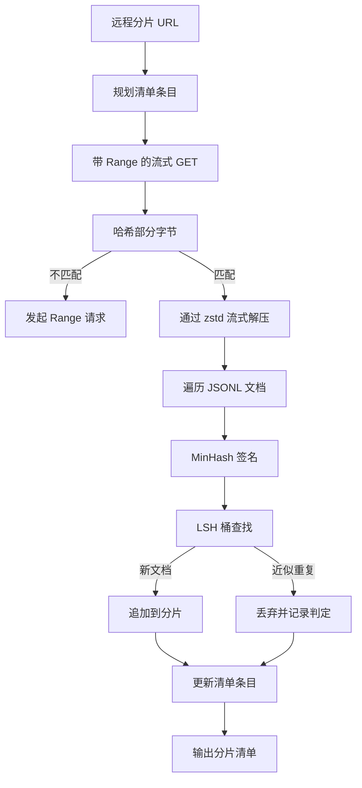

# 大型语料库下载器

> 训练语言模型的工作远在第一次前向传播之前就开始了。语料库必须落地到磁盘，经过解压缩、去重，并且可寻址，同时还要在网络在 4% 处崩溃之前就把恢复方案设计好。本课程构建一个流式下载器，它拉取压缩的分片，使用 Zstandard 即时解压缩，通过 MinHash 加局部敏感哈希对近似重复文档进行指纹识别，并写入一个流水线其余部分可以信赖的分片清单。

**类型:** 构建
**语言:** Python
**前置知识:** 第 19 阶段第 30-37 课
**时间:** ~90 分钟

## 学习目标

- 使用 `urllib` 流式拉取远程分片，并用 `zstandard` 解压缩，无需将整个文件缓冲到内存中。
- 通过发起 HTTP `Range` 请求，基于已验证的字节偏移量恢复部分下载。
- 为每个文档构建 MinHash 签名，并通过 LSH 进行分桶，使近似重复文档发生碰撞。
- 输出包含内容哈希、字节大小、文档数量和去重判定结果的分片清单。

## 问题

第一次在 200 GB 的语料库上训练时，网络在 41% 处崩溃，脚本抛出一个 `urllib` 异常退出。第二次在 78% 处崩溃。到了 99% 时，你已经把循环重写了三遍。从第一分钟起就必须设计的两个失败场景是部分下载恢复和重复文档移除。两者都有成熟的解决方案；但两者都经常被跳过，因为流水线最初只是一行 `requests.get` 调用，后来才变得复杂起来。

恢复是一个 HTTP 问题。服务器必须支持 `Range`，客户端必须根据磁盘上的记录跟踪已验证的偏移量，并且已验证的偏移量必须在进程死亡后仍然存在。如果偏移量和文件哪怕相差一个字节，恢复的下载就会写入垃圾数据，导致语料库损坏，而这种损坏只有在分词时才会显现。

去重是一个签名问题。精确哈希去重会漏掉近似重复：同一篇维基百科文章带有三个不同的样板页脚，同一个代码文件带有不同的许可证头，同一篇博客文章的每个链接都带有跟踪参数。MinHash 加 LSH 以次线性成本捕获这些情况。代价是每个文档一个签名，每个签名一次桶查找。

## 概念



### 使用 `urllib` 流式处理

标准库的 `urllib.request.urlopen` 返回一个类文件对象。将其包装在 `zstandard.ZstdDecompressor().stream_reader` 中，字节流就从网络经过解压缩器进入文档迭代器，而无需在内存中实例化压缩的分片或解压缩后的分片。唯一的内存开销是行缓冲区、当前文档的 MinHash 签名和 LSH 索引。

### 使用 `Range` 恢复

下载器为每个分片写入两个文件：分片本身和一个 `.partial.json` 检查点。检查点记录 `verified_bytes`、`expected_size`、`sha256_prefix`（基于前 `verified_bytes` 个字节计算）以及源 URL。启动时，下载器读取检查点，重新计算磁盘上字节的 `sha256_prefix`，并且仅在重新计算的哈希匹配时才恢复。如果哈希错误，则丢弃部分文件并从字节零重新开始下载。静默损坏是不可能的，因为已验证的字节是被检查过的，而不是假设的。

### MinHash 加 LSH

MinHash 在固定空间中估计两个集合的 Jaccard 相似度。对于文档，集合是其文本的 shingle（重叠的 n-gram）。签名是 `k` 个最小哈希值，每个值对应一个独立的哈希函数。Jaccard 相似度为 `s` 的两个文档在签名的任何一个分量上一致的概率为 `s`。

然后 LSH 将 `k` 个分量分成 `b` 个波段，每个波段有 `r` 行，其中 `k = b * r`。两个文档在至少一个波段中碰撞的概率为 `1 - (1 - s^r)^b`，这在您调整 `(b, r)` 所针对的 `s` 值附近形成一个尖锐的阈值。典型语料库去重的阈值为 `s = 0.8`，LSH 研究文献通过 `k = 128`、`b = 32`、`r = 4` 达到此阈值。

### 分片清单作为契约

下载器唯一的持久输出是清单。清单为每个分片保存 URL、解压缩后的字节数、文档数量、去重后的唯一文档数量以及最终分片文件的 sha256。下游分词读取的是清单，而不是目录列表。如果某个分片缺失或其 sha256 错误，清单会告诉下一阶段拒绝启动。清单是"数据已下载"和"数据已下载且可验证"之间的决定性边界。

## 构建

`code/main.py` 实现了：

- `ShardPlanner` - 读取分片 URL 列表并生成规划的清单条目。
- `StreamingDownloader` - 打开带有可选 `Range` 的 `urllib` 流，写入临时文件，在每个数据块后更新 `.partial.json` 检查点，并在恢复时验证 sha256 前缀。
- `ZstdDocIterator` - 将类文件流包装在 `zstandard.ZstdDecompressor` 中，按行逐个产出文档。
- `MinHasher` - 使用固定的哈希种子族为字符串生成 `k` 分量签名。
- `LSHIndex` - 按波段对签名进行分桶并报告碰撞。
- `Dedup` - 结合哈希器和索引，将每个文档标记为 `keep` 或 `near_duplicate`，并附上匹配的分片 ID。
- `ManifestWriter` - 收集每个分片的统计信息并写入 `manifest.json`。

文件底部的演示在磁盘上构建一个小型合成语料库，使用 `zstandard` 压缩，通过 `file://` URL 下载，去重，并打印清单。

运行：

```bash
python3 code/main.py
```

脚本以零退出并打印清单摘要。

## 生产模式

有四种模式可将本课程扩展到真实语料库。

**先写检查点再写数据。** `.partial.json` 必须在字节追加到分片之前进行 `fsync`。否则断电会颠倒顺序：分片字节在磁盘上，检查点却没有它们，下一次恢复会认为已验证的字节比实际少，重复的后缀字节会损坏文件。先写检查点，再写数据。这与预写式日志是同样的纪律。

**分片 LSH 索引。** 在 200 GB 规模下，整个语料库的单个 LSH 索引无法放入 RAM。按第一个波段的哈希对 LSH 索引进行分区，将分区存储在磁盘上，并且只查询新签名会落入的那个分区。代价是每个文档多一次磁盘读取；好处是 LSH 索引不再是硬性的内存上限。

**墓碑标记，而非删除。** 被丢弃的重复文档在清单中记录为 `near_duplicate`，并附上与之碰撞的文档的分片 ID。删除它们会丢失重复文档与其保留者之间的链接。墓碑标记保留了审计线索，并允许下游阶段改变对阈值的决定。

**清单中的每个分片 sha256，加上清单本身的 sha256。** 清单本身获得一个内容哈希。下游阶段在信任每个分片条目之前先验证清单哈希。没有这个，清单就是静默的攻击面：能够编辑单个文件的攻击者可以破坏整个流水线。

## 使用

生产模式：

- **每次 CI 运行都恢复。** CI 运行器是临时的。下载器必须假设每次运行都是全新的磁盘，并从缓存或远程恢复。`--cache-dir` 是一等标志。
- **在分词之前去重。** 分词成本高昂。对同一文档运行两次，成本翻倍，损失曲线却相同。去重位于分词的上游，而不是下游。
- **清单作为合并门禁。** 训练运行从固定的提交中读取清单 sha256。新的数据集版本需要新的清单提交。代码和数据之间的链接是 git，而不是传说。

## 交付

在真实项目中，`outputs/skill-corpus-downloader.md` 会描述哪些 URL 为下载器提供数据、检查点目录如何布局、去重使用什么 shingle 宽度和 `(k, b, r)` 三元组，以及清单在版本控制中的位置。本课程交付的是引擎。

## 练习

1. 添加一个 `--shingle-width` 标志，并测量在宽度为 3、5、9 时去重判定的变化。论证所选默认值的合理性。
2. 通过嗅探魔数，在 zstd 旁边添加 gzip 支持。下载器不应要求调用者指定编解码器。
3. 添加一个 `--resume-only` 模式，如果未找到检查点，则拒绝启动新的下载。在 CI 中很有用，可以防止一次运行意外地重新拉取 200 GB。
4. 将 LSH 索引迁移到 shelf 或 sqlite 文件，并与内存版本对比测量吞吐量。
5. 在启动时添加清单 sha256 检查。如果磁盘上的清单与 `manifest.lock` 中的清单哈希不一致，下载器应安全地失败关闭。

## 关键术语

| 术语 | 人们说的 | 实际含义 |
|------|----------|----------|
| 分片 | "一个文件" | 语料库的一个自包含切片，拥有自己的 sha256，用作恢复和去重的单元 |
| MinHash 签名 | "指纹" | 一个集合的 `k` 分量素描，每个分量是集合上某个独立哈希的最小值 |
| LSH 波段 | "桶" | 一组 `r` 个签名分量，用作碰撞检测的单个桶键 |
| 已验证字节 | "恢复偏移量" | 磁盘上其 sha256 前缀与检查点匹配的字节；唯一安全的恢复偏移量 |
| 清单 | "索引" | 下载器产生的唯一持久记录，包括内容哈希 |

## 延伸阅读

- [RFC 7233](https://datatracker.ietf.org/doc/html/rfc7233) - HTTP Range 请求，恢复协议
- [Zstandard 格式规范](https://datatracker.ietf.org/doc/html/rfc8478) - 使流式解压缩安全的帧格式
- [MinHash](https://en.wikipedia.org/wiki/MinHash) - 本课程使用的签名族
- [局部敏感哈希](https://en.wikipedia.org/wiki/Locality-sensitive_hashing) - 去重阈值背后的分带方案
- 第 19 阶段 · 43 - 下载器所供给的 HDF5 分词语料库
- 第 19 阶段 · 44 - 在语料库上训练的余弦调度
- 第 19 阶段 · 45 - 消耗该调度的 AMP 循环