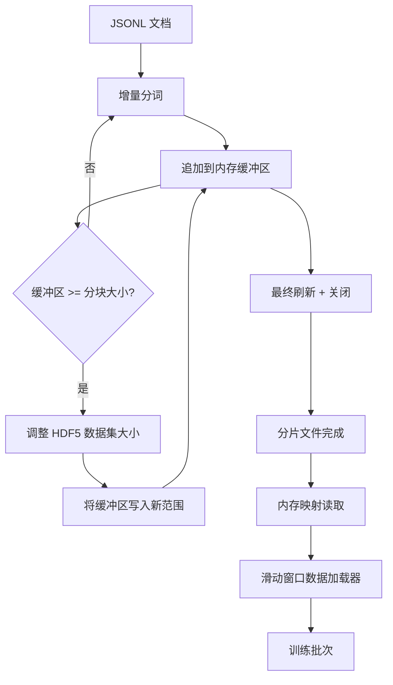

# HDF5 分词语料库

> 下载好的语料库必须以训练器能够以线速流式读取的布局落地。磁盘上的 JSONL 在 16 个数据加载工作进程面前不堪一击。HDF5 配合可调整大小、分块的整数数据集则能胜任。本课程构建流式分词，将结果写入可调整大小的 HDF5 数据集，跨多个文件进行分片写入，在训练时进行内存映射读取，以及一个生成固定长度序列并带有正确打包规则的滑动窗口数据加载器。

**类型:** 构建
**语言:** Python
**前置知识:** 第 19 阶段第 30-37 课
**时间:** ~90 分钟

## 学习目标

- 将文档流式写入可调整大小的 HDF5 整数数据集，并采用确定性的分块策略。
- 将写入操作分片到多个 HDF5 文件中，使故障范围受限并支持并行处理。
- 通过 HDF5 基于页缓存的分块布局读取 token，使数据加载器仅在批处理时复制到批缓冲区。
- 实现一个滑动窗口数据加载器，生成固定长度的训练序列，并带有明确的打包规则。

## 问题

现代语言模型训练运行每秒读取数十万个样本，跨越数十个工作进程。磁盘上的 JSONL 在第一次冷缓存缺页时就崩溃了：JSON 解析器很慢，文档边界不可寻址，要定位到"样本 4,217,884"需要扫描整个文件。即使是压缩效果良好的 Parquet 也不适合，因为训练器不需要列式数据；它需要的是具有 O(1) 随机访问能力的扁平 token 流。

HDF5 之所以合适，是因为它提供分块、可调整大小、仅包含整数的数据集，其分块在读取时对页缓存友好。训练器请求 `tokens[3,200,000 : 3,200,8192]` 的一个切片，HDF5 将请求的超切片从页缓存复制到新分配的 NumPy 数组中。代价是每个工作进程一个打开的文件句柄和一个分块大小的页缓存占用，与解码 JSONL 的成本相比微不足道。

构建问题在于让写入端保持诚实。可调整大小的数据集很容易被误用：一次写入一个文档会导致 HDF5 文件碎片化到无法使用的程度。一次调整大小写入所有文档，进程死亡则会丢失整个分片。正确的纪律是先缓冲再扩展，缓冲区大小与分块大小匹配，并通过分片写入将工作负载分散到多个文件中，这样一次崩溃最多丢失一个分片。

## 概念



### 正确使用可调整大小的 HDF5

token 数据集以 `maxshape=(None,)` 和固定的 `chunks=(chunk_size,)` 创建。写入过程通过将 token 缓冲到长度为 `chunk_size` 的 NumPy 数组中进行。当缓冲区填满时，数据集正好按 `chunk_size` 调整大小，并将缓冲区写入新的范围。在分片结束时，剩余缓冲区被写入最终的局部范围。每次写入都是连续的且与分块对齐，最后一次除外，读取器被告知根据分片 HDF5 属性中记录的 `token_count` 进行截断。

### 分片写入

单个 HDF5 文件是单点故障。流水线并行写入分片：来自第 19 阶段第 42 课的每个输入分片产生一个 HDF5 输出分片。一个 `shards.json` 索引为每个分片记录文件路径、token 数量、文档数量和 token 的 sha256。训练器读取 `shards.json` 来计算全局偏移量并验证语料库。

### 内存映射读取

在训练时，每个工作进程以 `swmr=True` 模式打开其份额的 HDF5 文件，并请求 `tokens[start:stop]`。HDF5 的分块布局使得一旦分块变热，这就是一次基于页缓存的读取。工作进程从不实例化整个文件：切片被复制到数据加载器的批缓冲区中，然后在批处理时由数据加载器复制到固定内存的训练张量中。热路径在每个分块转换处有一次系统调用；其余都是 RAM 访问。

### 滑动窗口数据加载器

数据加载器是唯一知道训练序列长度的阶段。它在全局 token 流中随机选择一个起始索引，读取 `window_size + 1` 个 token，并返回 `(input, target) = (tokens[:-1], tokens[1:])`。文档边界不被强制执行：一个窗口可能跨越两个文档，它们之间有一个显式的 `boundary_token_id`，这样模型就能学会使用分隔符。这是标准的打包规则；也是初学者会忘记的规则，最终导致语料库中 8% 是训练边界 token，92% 是自然文本。

## 构建

`code/main.py` 实现了：

- `Tokenizer` - 一个字节级的确定性分词器，足以用于演示。接口是 `encode(text) -> list[int]` 和 `vocab_size`。
- `HDF5ShardWriter` - 打开一个可调整大小的整数数据集，将 token 缓冲到分块大小，以固定大小的步长调整大小并写入，在关闭时将 `token_count` 和 `sha256` 记录为 HDF5 属性。
- `ShardedTokenizationPipeline` - 遍历输入文档，将其路由到写入器，并输出 `shards.json` 索引。
- `MmapTokenStore` - 打开分片文件进行内存映射读取，计算全局偏移量，暴露一个单一的 `get_slice(start, stop)` API。
- `SlidingWindowDataloader` - 从全局流中随机选择窗口，并产出 `(input_ids, target_ids)` NumPy 数组。

文件底部的演示构建一个微小的内存语料库，分词到两个分片中，通过内存映射打开它们，运行数据加载器 10 个批次，并打印每个批次的形状和校验和。

运行：

```bash
python3 code/main.py
```

脚本以零退出并打印批次校验和。

## 生产模式

有四种模式可将本课程扩展到真实的训练运行。

**分块大小等于典型读取大小。** 训练器每个样本读取 `window_size + 1` 个 token。将 HDF5 分块设置为 `window_size` 的倍数，读取操作将与页缓存对齐。不匹配的分块会使吞吐量减半，因为每个样本会触及两个分块。

**token 数量放在属性中，而不是数据集中。** 数据集的尾部切片可能部分未满，因为分块大小不能整除文档边界。将真实的 `token_count` 存储为数据集上的 HDF5 属性，并让读取器在该值处截断。没有这个，读取器会越界进入零填充的 token，模型就会学会预测零。

**分片 sha256 加并行验证。** 每个分片有自己的 token 字节 sha256。训练器可以在训练开始前并行验证所有分片。错误的 sha256 会提前失败运行，而不是在 16 小时后的第三个 epoch 才暴露。

**两侧都使用 `swmr=True`，写入器使用 `libver="latest"`。** 单写入器多读取器模式要求写入器以 `libver="latest"` 打开，预先创建所有数据集，然后设置 `file.swmr_mode = True`。之后，写入器必须在每次调整大小后调用 `dataset.flush()`，以便读取器工作进程（以 `swmr=True` 打开）看到一致的数据。跳过 `libver="latest"` 或在结构更改后启用 SWMR 是"文件被锁定"失败的常见原因。

## 使用

生产模式：

- **每个源分片一个 HDF5。** 下载器（第 42 课）每个 URL 输出一个分片；分词（本课程）每个源分片输出一个 HDF5。1:1 的映射使得恢复和部分故障恢复变得简单。
- **边界 token ID。** 边界 token 是分词器词汇表的一部分，也是数据加载器注入的唯一 token。如果模型应该忽略边界 token，训练损失会将其屏蔽；否则模型会学会将其用作序列分隔符。
- **`shards.json` 作为真相来源。** 添加新分片意味着写入 HDF5，计算其 sha256，并追加一个条目。训练器在启动时读取该文件一次，之后不再触碰目录列表。

## 交付

在真实项目中，`outputs/skill-hdf5-tokenized-corpus.md` 会描述哪个分词器为流水线提供数据、什么分块大小与训练器的窗口匹配、`shards.json` 在版本控制中的位置，以及数据加载器工作进程如何跨文件分片。本课程交付的是引擎。

## 练习

1. 为 HDF5 写入器添加一个 `--compression gzip` 标志，并在演示语料库上测量吞吐量成本。论证所选默认值的合理性。
2. 为滑动窗口数据加载器添加确定性种子，并验证两次使用相同种子的运行产生相同的批次。
3. 添加一个 `--validate` 模式，读取每个分片，重新计算其 token 的 sha256，并与 `shards.json` 进行比较。CI 应在训练开始前运行此模式。
4. 比较分块大小等于、等于一半和等于两倍窗口大小时的数据加载器吞吐量。报告页缓存效应。
5. 添加一个 `--max-document-tokens` 标志，在写入时截断非常长的文档。论证此权衡与在读取时做决定的优劣。

## 关键术语

| 术语 | 人们说的 | 实际含义 |
|------|----------|----------|
| 可调整大小数据集 | "仅追加" | 一个 `maxshape=(None,)` 的 HDF5 数据集，通过以分块大小为步长的 `resize` 调用增长 |
| 分块布局 | "HDF5 的存储方式" | 固定大小的磁盘页面，内核可以对其进行内存映射，数据加载器可以连续读取 |
| `swmr` 模式 | "边写边读" | 单写入器多读取器模式，允许数据加载器工作进程安全地共享文件 |
| 分片索引 | "shards.json" | 所有 token 分片的持久索引，包含偏移量和内容哈希 |
| 滑动窗口 | "训练样本" | 全局 token 流的一个固定长度切片，训练器将其与移位一位的目标配对 |

## 延伸阅读

- [HDF5 分块文档](https://docs.hdfgroup.org/hdf5/v1_14/) - 本课程使用的分块、可调整大小数据集布局
- [h5py 用户指南](https://docs.h5py.org/en/stable/) - HDF5 的 Python 绑定
- [NumPy 内存映射](https://numpy.org/doc/stable/reference/generated/numpy.memmap.html) - HDF5 通过 h5py 暴露的读取端原语
- 第 19 阶段 · 42 - 本课程对其输出进行分词的下载器
- 第 19 阶段 · 44 - 消费此数据加载器的余弦调度
- 第 19 阶段 · 45 - 包装训练步骤的 AMP 循环