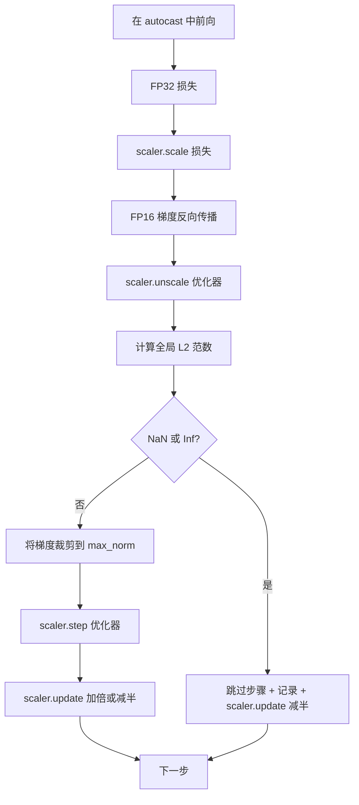

# 梯度裁剪与混合精度

> 前一课中的优化器和调度假设梯度是合理的。但通常并非如此。单个糟糕的批次可能使梯度范数飙升三个数量级。混合精度训练通过引入 FP16 溢出（在损失一侧）放大了这一问题。本课程构建生产训练不可或缺的两条安全带：针对配置的全局 L2 范数的梯度裁剪，以及一个带有 autocast 和 GradScaler 的混合精度循环，它能检测 NaN 和 Inf，干净地跳过步骤，并记录缩放因子用于事后分析。

**类型:** 构建
**语言:** Python
**前置知识:** 第 19 阶段第 30-37 课
**时间:** ~90 分钟

## 学习目标

- 计算所有参数梯度的全局 L2 范数，并在超过配置阈值时原地裁剪。
- 将训练步骤包装在 autocast 和 GradScaler 中，使 FP16 前向和反向传播能够承受溢出。
- 检测损失或梯度中的 NaN 和 Inf，跳过优化器步骤，并记录跳过事件。
- 每步报告 GradScaler 的缩放因子，使长时间的跳过序列立即可见。

## 问题

昨天还运行正常的训练运行在第 8,217 步产生了垂直上升的损失曲线。罪魁祸首是一个梯度范数为 4,200 的批次，是之前峰值的二十倍。没有裁剪，优化器应用的步骤会重置模型在过去一小时中完成的所有学习。使用全局 L2 裁剪（范数 1.0），同一个批次贡献了一个单位范数的更新；损失保持在趋势线上；运行得以存活。

混合精度训练通过在前向传播和大部分反向传播中使用 FP16 计算，将吞吐量提升 2-3 倍。代价是 FP16 的指数范围很窄。在 FP16 中溢出的典型梯度会计算为 Inf，通过后续层传播为 NaN，在下一个优化器步骤中将所有权重设置为 NaN。PyTorch 的 GradScaler 通过在反向传播前将损失乘以一个大的缩放因子，并在优化器步骤前将梯度除以相同的因子来解决这个问题。如果在取消缩放时任何梯度是 Inf 或 NaN，缩放器会跳过该步骤并将缩放因子减半；如果之前的 N 步是干净的，缩放器会将因子加倍。在训练过程中，缩放因子会找到 FP16 范围允许的最高值。

构建问题在于正确地将两者连接起来。在取消缩放之前裁剪，阈值作用于缩放后的梯度；在取消缩放之后裁剪，GradScaler 上的操作顺序就很重要。正确的顺序是：`scaler.scale(loss).backward()`，然后 `scaler.unscale_(optimizer)`，然后 `clip_grad_norm_`，然后 `scaler.step(optimizer)`，然后 `scaler.update()`。任何其他顺序都会产生一个静默损坏的循环。

## 概念



### 全局 L2 范数

全局 L2 范数是拼接后的梯度向量的欧几里得范数，而不是每个参数的范数。PyTorch 将其实现为 `torch.nn.utils.clip_grad_norm_(parameters, max_norm)`。该函数返回裁剪前的范数，以便本课程可以记录自然值和裁剪值，这对于"我们在每一步都在裁剪"的诊断是必要的。

### autocast 和 GradScaler

`torch.amp.autocast(device_type)` 是上下文管理器，选择性地以 FP16 运行符合条件的操作（大多数矩阵乘法类操作）。`torch.amp.GradScaler(device_type)` 是辅助工具，在反向传播前缩放损失，并在优化器步骤前反向缩放梯度。两者是协同设计的；只使用其中一个而不用另一个是测试应该捕获的配置错误。

本课程使用 CPU autocast，因为这是在 CI 中运行的；同样的模式通过将 `device_type="cpu"` 改为 `device_type="cuda"` 即可直接迁移到 CUDA。CPU 上的 GradScaler 是一个桩（CPU autocast 默认已经以 BF16 运行，不需要损失缩放），但本课程包含了调用点，以便接线方式与 GPU 循环完全相同。

### NaN 和 Inf 检测

检测在两个地方进行。首先，损失本身在反向传播前用 `torch.isfinite` 检查；Inf 或 NaN 损失不会产生有用的梯度，会在进入优化器之前被跳过。其次，在 `scaler.unscale_(optimizer)` 之后，本课程用 `has_non_finite_grad(...)` 扫描未缩放的梯度，并将任何 Inf 或 NaN 视为跳过。这两个检查共同覆盖了前向传播和反向传播的失败模式。

### 缩放因子诊断

缩放因子是 GradScaler 的内部状态。每步本课程读取 `scaler.get_scale()` 并将其与学习率和梯度范数一起记录。健康的运行显示缩放因子以 2 的幂次上升，直到在 `2^17` 或 `2^18` 附近饱和。行为异常的运行显示因子在高值和低值之间振荡，这是模型梯度有时在范围内有时不在的信号。不记录日志，这个诊断就是不可见的。

## 构建

`code/main.py` 实现了：

- `clip_global_l2_norm` - 一个围绕 `torch.nn.utils.clip_grad_norm_` 的包装器，返回裁剪前和裁剪后的范数。
- `has_non_finite_grad` - 一个扫描梯度中 NaN 和 Inf 的辅助函数。
- `AmpTrainState` - 将模型、`AdamW` 优化器、GradScaler 和 autocast 设备包装在一起。暴露一个 `step(inputs, targets)` 方法，运行完整的裁剪、缩放和 NaN 跳过流水线。
- `StepLog` 和 `SkipLog` - 结构化的每步记录。
- 一个演示，训练一个小型 `nn.Linear` 模型 20 步，在第 5 步向梯度注入一个 Inf 以测试跳过路径，并打印结果日志。

运行：

```bash
python3 code/main.py
```

脚本以零退出并打印每步日志，每行标记为 `STEP` 或 `SKIP`；至少有一行是 `SKIP`。

## 生产模式

有四种模式可将循环提升为生产级训练步骤。

**跳过计数器作为告警，而非日志行。** 每次训练运行跳过少量步骤是健康的。每个 epoch 数百次跳过是硬告警：模型处于 FP16 无法维持的状态，循环正在静默失败。本课程跟踪一个 1,000 步的滚动跳过率，在生产中会在超过 5% 时发出告警。

**裁剪阈值存在于配置中。** `max_norm = 1.0` 是语言模型训练的现代默认值。先在小模型上扫描它；较大的阈值让模型从真正困难的批次中恢复；较小的阈值以更嘈杂的损失曲线为代价约束最坏情况。该阈值应与第 44 课的调度放在同一个 YAML 或 JSON 配置中。

**范数日志与调度一起写入 CSV。** CSV 列是 `step, lr, grad_l2_pre_clip, grad_l2_post_clip, loss, skipped, skip_reason, scaler_scale`。打开文件的审阅者可以在同一行中看到调度、梯度情况、缩放因子和跳过结果（及其原因）。将列分散到多个文件中会导致分析错位。

**`scaler.update()` 每步都运行，即使跳过时也是如此。** 在干净的步骤上，缩放器读取其无 Inf 计数器，递增它，并可能加倍因子。在跳过的步骤上，缩放器将因子减半并重置计数器。在跳过路径上忘记 `update()` 是产生"缩放因子从未改变"的 bug。

## 使用

生产模式：

- **Autocast 设备与优化器设备匹配。** GPU 训练使用 `torch.amp.autocast(device_type="cuda")`；CPU 使用 `torch.amp.autocast(device_type="cpu")`。混合设备会产生静默的类型错误，表现为损失曲线看起来不错但模型没有在学习。
- **反向传播前检查损失。** `torch.isfinite(loss).all()` 是一个张量归约操作；成本可以忽略不计，而 NaN 损失上的节省是整个训练步骤。始终运行它。
- **`zero_grad` 中使用 `set_to_none=True`。** 将梯度设置为 `None` 而不是零，这允许优化器跳过不受影响的参数组的计算。这个设置是免费的吞吐量改进，也略微减少了 bug 面。

## 交付

在真实项目中，`outputs/skill-clip-amp.md` 会描述训练步骤使用什么裁剪阈值和 autocast 设备、每步 CSV 在版本控制中的位置，以及生产中的跳过率告警阈值是多少。本课程交付的是引擎。

## 练习

1. 将合成的 Inf 注入替换为真实的损失尖峰（将一个批次的目标乘以 1e8），并验证跳过路径被触发。
2. 添加一个 `--bf16` 模式，将 autocast 切换到 BF16 而不是 FP16。BF16 的指数范围比 FP16 更宽，很少需要损失缩放；验证在同一个演示上跳过率降至零。
3. 添加一个单元测试，验证梯度裁剪包装器在未发生裁剪时正确返回裁剪前和裁剪后的范数。
4. 添加一个滚动窗口跳过率计算和一个 CLI 标志，如果该率在连续 100 步内超过配置阈值，则使运行失败。
5. 将循环接入写入规范 CSV（`step, lr, grad_l2_pre_clip, grad_l2_post_clip, loss, skipped, skip_reason, scaler_scale`），并通过在每行后刷新来确认文件能在 Ctrl-C 后幸存。

## 关键术语

| 术语 | 人们说的 | 实际含义 |
|------|----------|----------|
| 全局 L2 范数 | "裁剪目标" | 所有可训练参数的拼接梯度向量的欧几里得范数 |
| autocast | "混合精度" | 在 `with` 块内选择性地以 FP16（或 BF16）执行符合条件的操作 |
| GradScaler | "损失缩放器" | 在反向传播前乘以损失、在优化器步骤前反向缩放梯度的辅助工具 |
| 跳过 | "坏步骤" | 因梯度或损失非有限而被拒绝的优化器步骤；缩放器将因子减半 |
| 缩放因子 | "缩放器状态" | GradScaler 的当前乘数；在干净段后加倍，每次跳过时减半 |

## 延伸阅读

- [Micikevicius 等人, 混合精度训练 (arXiv 1710.03740)](https://arxiv.org/abs/1710.03740) - 原始损失缩放提案
- [Pascanu, Mikolov, Bengio, 论训练循环神经网络的困难 (arXiv 1211.5063)](https://arxiv.org/abs/1211.5063) - 梯度裁剪的参考论文
- [PyTorch torch.amp.GradScaler](https://docs.pytorch.org/docs/stable/amp.html) - 本课程包装的缩放器 API
- [PyTorch torch.nn.utils.clip_grad_norm_](https://docs.pytorch.org/docs/stable/generated/torch.nn.utils.clip_grad_norm_.html) - 本课程使用的裁剪原语
- 第 19 阶段 · 42 - 为循环提供语料库的下载器
- 第 19 阶段 · 43 - 循环消费的数据加载器
- 第 19 阶段 · 44 - 本循环与之组合的调度