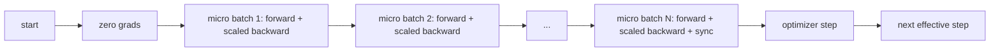
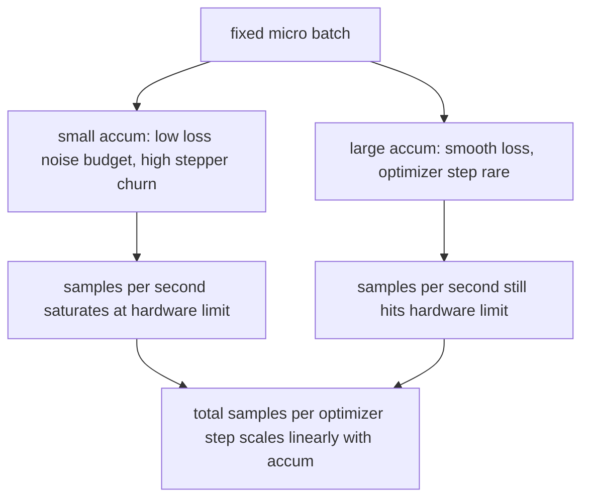

# 梯度累积

> 以你负担不起的有效批次大小训练，一次一个微批次。缩放损失，保持优化器步进，让梯度累积起来。

**类型:** Build
**语言:** Python
**前置知识:** 第19阶段第42至45课
**时间:** ~90分钟

## 学习目标

- 推导有效批次恒等式：`effective_batch = micro_batch * accum_steps`。
- 实现每个微批次的损失缩放，使累积梯度与单次全批次反向传播匹配。
- 跳过优化器同步，直到最后一个微批次（最后一步同步模式）。
- 绘制吞吐量对有效批次的曲线，并解释收益递减现象。

## 问题

你想以有效批次大小512进行训练，因为损失曲线更平滑，优化器步进在该规模下更有意义。你桌上的加速器在耗尽内存前只能容纳32个样本。加倍批次大小不可行。将模型减半也不可行。该领域在2017年采用并沿用至今的技巧是运行16次反向传播，让梯度在参数缓冲区中累积，只在计数达到目标时才步进优化器。

风险在于损失不再是较大批次下的那个数值。简单求和16个迷你批次的交叉熵，结果是单个完整批次损失的16倍。如果不缩放，梯度方向正确但幅度错误，优化器步进会过大16倍。修复方法是一次除法。这个修复也容易被遗忘。

## 概念



约定很简单：

- 每个微批次的损失在调用 `backward()` 之前除以 `accum_steps`。PyTorch 默认将梯度求和到 `param.grad` 中；除法将累加和推回到正确的尺度。
- 优化器步进在每个有效批次触发一次，在最后一个微批次的反向传播之后。在累积过程中步进会扭曲后续运行依赖的每个参数。
- 优化器的状态（动量缓冲区、Adam 矩）每个有效步进一次，而不是每个微批次一次。指数移动平均否则会看到错误的频率并烧穿调度。
- 在单设备上这只是簿记。在多 rank 集群上，相同的模式将非最终微批次包裹在 `no_sync` 上下文中，跳过梯度全规约；最后一个微批次在一次传递中规约完整的累积梯度，而不是支付 N 次网络开销。

### 代码中的等价性证明

```python
loss = criterion(model(x_full), y_full)
loss.backward()
opt.step()
```

等价于

```python
for x, y in chunks(x_full, y_full, n):
    scaled = criterion(model(x), y) / n
    scaled.backward()
opt.step()
```

除了浮点求和顺序外完全一致。循环结束时累积的梯度缓冲区与单次全批次反向传播产生的张量相同。本课代码在 `equivalence_check` 中断言最大绝对差小于 1e-4。

### 开销在哪里

每个微批次花费一次前向和一次反向传播。通过累积，你用时间换取内存。`outputs/accum-curve.json` 中的吞吐量曲线展示了在固定微批次大小下有效批次增长时发生的情况：



没有免费的午餐。将 `accum_steps` 加倍会使每个优化器步进的墙上时间加倍。变化的是梯度估计的方差：在相同的墙上预算下，你做了更少的优化器步进，但每一步都在更多样本上平均。文献将大批次和小批次视为不同的优化问题；本课关注的是机械原理，而非统计特性。

## 构建

`code/main.py` 是可运行的工件。它做三件事。

### 第1步：等价性检查

`equivalence_check()` 使用相同的种子构建同一网络的两个副本。一个在单次前向传播中看到一个16样本批次。另一个看到四个4样本块，损失除以四。该函数在优化器步进前比较梯度缓冲区，并在步进后比较参数。断言是 `max_abs_diff < 1e-4`。

### 第2步：最后一步同步模式

`train_one_optimizer_step` 遍历微批次。对于除最后一个外的每个微批次，它进入 `no_sync_context(model)`。在单进程上，该上下文是无操作；在 DDP 上，这是跳过梯度全规约的地方。簿记方式相同。一个 `sync_counter` 记录我们离开 no_sync 作用域的次数；对于 N 个微批次，计数是每个有效步进一次，而不是 N 次。

### 第3步：吞吐量曲线

`sweep_effective_batches` 使用固定的微批次大小和一系列累积步数运行相同的模型。对于每个设置，它记录：

- `samples_per_sec`：总样本数除以墙上时间
- `median_step_ms`：每个有效步进的第50百分位
- `sync_calls`：执行的集合点次数
- `avg_loss`：扫描中所有优化器步进的平均损失

输出写入 `outputs/accum-curve.json`，可从 notebook 中重复使用。

运行：

```bash
python3 code/main.py
```

脚本打印等价性差异，然后是扫描表，最后是 JSON 路径。退出码为零。

## 使用

在生产训练中，梯度累积隐藏在一个旋钮后面。PyTorch 的模式是 `accumulation_steps = effective_batch // (micro_batch * world_size)`。这里不允许使用的框架包装了相同的循环，但步骤相同：缩放损失，跳过非最终微批次的同步，累积，步进一次。

现实中的三种模式：

- 微批次大小选择为饱和设备内存。任何更小的都会浪费加速器周期。任何更大的都会崩溃。
- 有效批次根据学习率调度选择。大的有效批次需要缩放的学习率和预热；这是自2017年以来讨论的线性缩放规则。
- 累积计数是两者之间的桥梁，也是你可以在运行时自由调整而无需重写数据加载器的唯一旋钮。

## 交付

`outputs/skill-gradient-accumulation.md` 记录了配方，以便同行可以将其放入新仓库：损失除以 `accum_steps`，跳过非最终微批次的优化器同步，每个有效批次步进优化器一次，将吞吐量对有效批次的曲线输出为 JSON 以便可视化权衡。

## 练习

1. 使用 `--num-steps 100` 重新运行扫描，并绘制每秒样本数对有效批次的曲线。曲线在哪里变平？
2. 添加一个错误缩放变体（不除法），并显示第1步时与参考的参数差异。
3. 将 SGD 替换为 AdamW，并确认优化器状态每个有效步进一次，而不是每个微批次一次。
4. 引入真正的 `DistributedDataParallel` 包装器，并将 `no_sync_context` 路由到其方法。确认 sync_calls 每个有效批次减少 N-1 次。
5. 修改等价性检查以比较两种不同的微拆分（2x8 对比 4x4），并解释你需要放宽的任何容差。

## 关键术语

| 术语 | 人们说的 | 实际含义 |
|------|----------|----------|
| 微批次 | 你前向传播的批次 | 单次前向传播中适合内存的数据切片 |
| 累积步数 | 每次步进的反向传播次数 | 在一次优化器步进前求和的 backward 次数 |
| 有效批次 | 批次 | 微批次乘以累积步数乘以数据并行世界大小 |
| 损失缩放 | 除以 N | 每个微批次的除法，使求和梯度与完整批次匹配 |
| 最后一步同步 | 跳过其余 | 仅在窗口中的最后一次反向传播上运行梯度集合 |

## 延伸阅读

- PyTorch 关于 `DistributedDataParallel.no_sync` 的文档，了解最后一步同步技巧的生产版本。
- Goyal 等人，2017 年，关于大批次训练的线性缩放，这是关心有效批次的规范原因。
- PyTorch 问题跟踪器上关于梯度累积与混合精度反缩放的交互。
- 第19阶段第42至45课涵盖了本课假设的模型、数据加载器、优化器和训练器脚手架。
- 第19阶段第47课涵盖了检查点和恢复，以便长时间的累积运行能够承受墙上时钟上限。