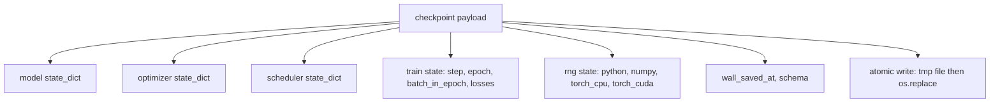
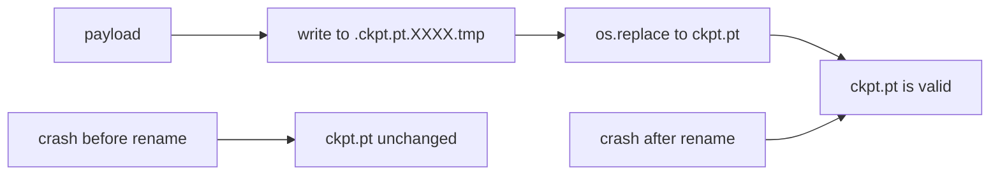
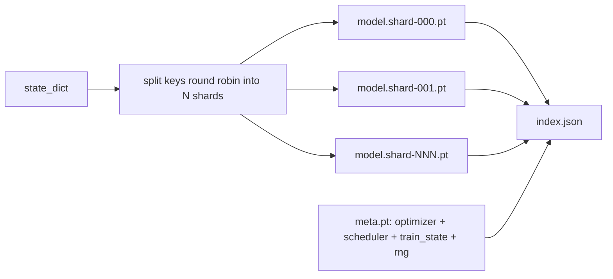

# 检查点保存与恢复

> 训练中断会终止运行；检查点让它们继续。原子性地保存模型、优化器、调度器、损失历史、步进计数器和 RNG 状态，使得在任何时刻发生中断都能在磁盘上留下一个有效文件。

**类型:** Build
**语言:** Python
**前置知识:** 第19阶段第42至45课
**时间:** ~90分钟

## 学习目标

- 将完整的训练状态捕获到单个负载中，可重新加载到新进程中。
- 实现原子保存：先写入临时文件再重命名，使崩溃永远不会留下半写文件。
- 恢复 Python、NumPy 和 PyTorch 的 RNG 状态，使恢复后的损失与未中断的基线匹配。
- 为不再适合单个文件的模型构建分片检查点布局，包含哈希验证的分片和 JSON 索引。

## 问题

你设置了一个18小时的训练任务。墙上时钟上限是4小时。集群在第11小时重启，因为某个比你级别高的人批准了内核升级。没有检查点，你从头开始。没有恢复，你也失去了前11小时学习到的优化器状态，所以即使模型权重幸存，AdamW 矩也消失了，下一步会朝着训练轨迹已经越过的方向猛冲。

正确的工件是一个包含继续所需一切的文件：模型参数、优化器状态、调度器状态、用于绘图的损失历史、当前步进、周期和批次内计数，以及每个随机性来源的 RNG 状态。没有 RNG 状态，恢复后的损失曲线是一条不同的曲线。相同的模型，相同的数据，不同的洗牌，不同的 dropout 掩码，仪表盘上不同的数字。

原子保存是约定的另一半。直接写入最终文件名意味着写入中途崩溃会留下损坏的文件；恢复读取的是垃圾数据。在同一目录中写入临时文件然后重命名，意味着写入中途崩溃会保留之前完好的文件。在 POSIX 文件系统上，重命名是原子的。

## 概念



### 五个状态桶

| 桶 | 为什么重要 |
|----|------------|
| 模型 | 权重和缓冲区；模型是什么。 |
| 优化器 | 动量和自适应矩；没有它们，下一步就是一个不同的优化问题。 |
| 调度器 | 学习率在其曲线上的位置；余弦调度尤其在意。 |
| 训练计数器 | 步进、周期、批次内计数，以及绘制仪表盘的损失历史。 |
| RNG 状态 | dropout、数据洗牌和模型内任何采样的确定性。 |

### 原子保存



两条规则。第一，临时文件与目标文件位于同一目录，以便重命名保持在同一个文件系统内；跨设备重命名不是原子的。第二，临时名称每次尝试都唯一，这样两个写入者不会互相覆盖。

### 分片检查点

当模型变大时，单文件负载变得加载太慢、检查太大、网络共享中途卡顿时太痛苦。解决方法是将参数状态拆分为分片，并编写一个将它们联系在一起的索引。



索引记录分片数量、每个分片的 sha256 以及元文件的 sha256。加载器在任何哈希不匹配时大声失败。分片可以放在不同的物理磁盘上；元文件很小，首先读取。

### 恢复在周期中间继续

恢复到下一个周期开始会浪费几分钟到一天的时间。解决方法是 `(epoch, batch_in_epoch)` 加上 RNG 状态。加载后，训练循环将随机数生成器快进到当前周期中已消耗的批次之后，并从 `batch_in_epoch` 继续。本课代码正是这样做的；断言是恢复后的损失轨迹与未中断的基线在 1e-4 以内匹配。

## 构建

`code/main.py` 提供四个原语和一个演示驱动程序。

### 第1步：捕获和恢复 RNG 状态

`capture_rng_state` 返回一个字典，包含 Python 的 `random.getstate`、NumPy 的 `np.random.get_state` 以及 PyTorch CPU 和 CUDA RNG 字节。`restore_rng_state` 逆转该过程。CPU 张量是一个 uint8 字节缓冲区，PyTorch 的 RNG 知道如何消费它。

### 第2步：原子保存

`atomic_save` 将负载写入目标目录中的临时文件，然后 `os.replace` 将其交换到最终名称。`atomic_write_json` 对分片索引执行相同操作。

### 第3步：完整检查点往返

`save_checkpoint` 将模型、优化器、调度器、训练状态和 RNG 打包到一个字典中。`load_checkpoint` 逆转该过程并返回一个 `TrainState`。schema 字段是升级钩子：未来的格式更改会提升版本字符串，加载器进行分发。

### 第4步：分片变体

`save_sharded_checkpoint` 将参数键轮询分配到 N 个分片中，使用各自的原子保存写入每个分片，写入包含优化器、调度器和训练状态的元文件，并写入包含分片 sha256 的 JSON 索引。`load_sharded_checkpoint` 在合并前验证每个分片。

### 第5步：恢复演示

`run_resume_demo` 训练一个小模型 `total_steps` 步，在 `interrupt_at` 处保存检查点，然后继续。第二个进程恢复检查点并运行剩余步骤。该函数返回中断点后两条损失轨迹之间的最大绝对差。RNG 恢复后，差值为零或浮点噪声。

运行：

```bash
python3 code/main.py
```

单文件和分片演示都断言最大差小于 1e-4。摘要写入 `outputs/resume-demo.json`。

## 使用

生产训练栈将检查点作为训练器的一部分提供。形状相同：模型 + 优化器 + 调度器 + 计数器 + RNG，原子写入，按步进命名以便轻松找到最新的。分片布局支持大模型加载和并行读取；index.json 是实现这一点的关键。

三条要强制执行的模式：

- **Schema 是负载中的一个字符串。** 迁移基于它分支。没有它，你无法在不破坏旧运行的情况下演化格式。
- **对每个分片进行 Sha256 校验。** 静默截断的下载是最糟糕的错误类型；加载器要么快速失败，要么晚失败。
- **保持检查点节奏诚实。** 每 N 步和每墙上时钟分钟保存一次，以较短者为准。否则，导致崩溃的长步会浪费一整段工作。

## 交付

`outputs/skill-checkpoint-save-resume.md` 是任何新训练脚本的配方：负载形状、原子写入、RNG 捕获、分片索引。将技能放入仓库，在定期保存点连接 `save_checkpoint`，在启动时连接 `load_checkpoint`，运行就能承受中断。

## 练习

1. 将轮询分片替换为按参数组分片（以 `.weight` 结尾的层对比 `.bias`）。每种布局何时更优？
2. 扩展保存循环以保留最后 K 个检查点并修剪更旧的。当磁盘很小时，合适的 K 是多少？
3. 添加一个 `--ckpt-every-seconds` 标志，按墙上时钟间隔触发保存，而不仅仅是步进计数。
4. 添加一个校验和验证路径，在启动时运行，扫描目录中的每个检查点，并报告哪些已损坏。
5. 实现一个 `migrate_v1_to_v2` 函数，向负载添加新字段并提升 schema 字符串。使加载器容忍两个版本。

## 关键术语

| 术语 | 人们说的 | 实际含义 |
|------|----------|----------|
| 原子保存 | "写入并祈祷" | 在同一目录中写入临时文件，然后 os.replace 到目标名称 |
| 状态字典 | "权重" | 模型参数和缓冲区，按参数名称键控 |
| 分片检查点 | "大模型文件" | 多个文件，每个分片一个，加上一个元文件和一个包含 sha256 的 JSON 索引 |
| RNG 状态 | "随机种子" | 为 python random、numpy、torch CPU、torch CUDA 捕获的状态；不仅仅是种子 |
| 周期中恢复 | "重启" | 快进 RNG 并从同一周期中的下一个批次继续 |

## 延伸阅读

- POSIX `rename` 语义，了解 `os.replace` 依赖的原子性保证。
- PyTorch 关于 `torch.save` 和 `torch.load` 的文档，包括用于跨设备恢复的 `map_location`。
- 第19阶段第46课涵盖了本课检查点负载在其上幸存的梯度累积。
- 第19阶段第48课涵盖了本方案适应的分布式包装器及其状态字典格式。
- Linux 内核 `fsync` 文档，了解原子重命名背后的持久性保证。