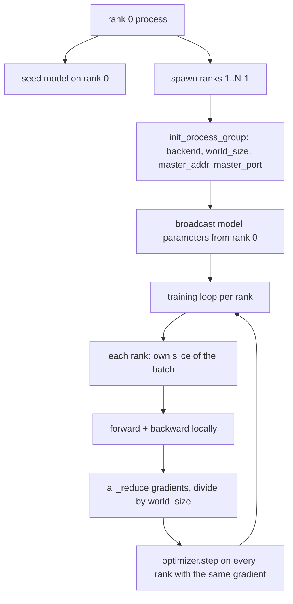
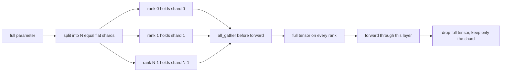

# 分布式数据并行与 FSDP 从零实现

> 多 rank 训练是两个集合操作和一条规则。启动时广播参数，反向传播后平均梯度，绝不让 rank 对它们所处的步进产生分歧。

**类型:** Build
**语言:** Python
**前置知识:** 第19阶段第42至45课
**时间:** ~90分钟

## 学习目标

- 使用 `gloo` 后端在 N 个 rank 上启动进程组，无需特殊硬件。
- 实现一个最小 DDP 包装器，在构造时广播参数，在反向传播后全规约梯度。
- 证明每个 rank 梯度的全规约与拼接输入上的单进程梯度匹配。
- 勾勒 FSDP 参数分片：每个 rank 持有一个切片，完整张量在前向传播时收集，之后丢弃。

## 问题

模型适合一个设备。数据集不适合。优化预算说你想每墙上时钟秒看到 N 倍的样本。第一个杠杆是数据并行：每个 rank 在批次的不同切片上运行相同的模型，然后在优化器步进前平均梯度。第二个杠杆是 FSDP：模型也不适合一个设备，所以每个 rank 持有每个参数的一小部分，在前向传播过程中逐层重建完整张量。

痛苦在于簿记。如果参数在 rank 间漂移，运行会静默损坏。如果你平均梯度但不平均损失，仪表盘会撒谎。如果集合后端无法就拓扑达成一致，运行会永远挂起。解决方法是亲手编写一次集合操作，永远不要信任你无法复现的包装器。

本课在 CPU 上运行。不假设 CUDA。`gloo` 后端随每个 PyTorch 构建一起提供，并接受 `torch.multiprocessing` 工作进程；相同的代码在切换到多 GPU 节点上的 `nccl` 时无需改变结构。

## 概念



### 两个重要的集合操作

| 集合操作 | 作用 | 时机 |
|----------|------|------|
| `broadcast` | 将一个张量从一个 rank 复制到所有其他 rank | 参数初始化、调度器状态、任何一对多同步 |
| `all_reduce` | 跨所有 rank 求和（或平均、或取最大值）一个张量，每个 rank 都得到结果 | 反向传播后的梯度平均 |
| `all_gather` | 每个 rank 贡献一个张量，每个 rank 得到拼接结果 | logits 收集、FSDP 参数解分片 |

DDP 的约定是构造时 `broadcast` 和反向传播后 `all_reduce`。FSDP 草图在每个层的前向传播前增加了 `all_gather`。

### 梯度平均与单进程梯度匹配

在 N 个 rank 上使用 B 个样本的批次训练的模型，必须产生与在 N*B 个样本上训练的单个进程相同的梯度。关键在于，对每个 rank 的梯度求和并除以 N 得到平均损失梯度，这正是使用均值缩减的交叉熵在完整批次上产生的。本课代码在手动全规约梯度和参考单进程梯度之间断言 `max-abs-diff < 1e-3`。

### FSDP 草图



内存优势是精确的：每个 rank 的参数内存降至 1/N。代价是 gather，每次前向传播都要支付。生产 FSDP 将 gather 与前一层计算重叠，因此墙上时钟成本远小于朴素计算预测的值。本课对每个参数执行往返，并断言重建结果与原始结果比特级相等。

### CPU 和 gloo 后端

CUDA 是生产目标，但相同的代码路径在 CPU 上存在。`gloo` 是 CPU 集合后端。它在 GPU 上比 `nccl` 慢几个数量级，但 API 表面完全相同。本课的进程组使用 `backend="gloo"` 初始化，rank 使用 `torch.multiprocessing` 而不是 `torchrun` 生成；两者最终都调用相同的 `torch.distributed` 函数。在多 GPU 节点上，唯一的变化是 `backend="nccl"`、设备张量和使用 `torchrun` 启动。

## 构建

`code/main.py` 是可运行的工件。

### 第1步：启动进程组

```python
os.environ["MASTER_ADDR"] = "127.0.0.1"
os.environ["MASTER_PORT"] = str(port)
dist.init_process_group(backend="gloo", rank=rank, world_size=world_size)
```

`MASTER_ADDR` 和 `MASTER_PORT` 是汇合点：每个 rank 拨号同一主机上的同一端口。本课通过绑定然后关闭的技巧选择一个空闲端口，以避免多个运行共享一台机器时发生冲突。

### 第2步：构造时广播

`MinimalDDP.__init__` 遍历每个参数和缓冲区，并调用 `dist.broadcast(tensor, src=0)`。Rank 0 的值成为规范初始化。没有这一步，每个 rank 使用自己的种子初始化，rank 从第一步就开始发散。

### 第3步：反向传播后全规约梯度

```python
def all_reduce_grads_(module, world_size):
    for p in module.parameters():
        if p.grad is None:
            p.grad = torch.zeros_like(p.data)
        dist.all_reduce(p.grad.data, op=dist.ReduceOp.SUM)
        p.grad.data.div_(world_size)
```

每个 rank 最终得到相同的平均梯度。优化器步进现在在每个 rank 上都是相同输入的函数，这就是参数在整个运行中保持同步的原因。

### 第4步：证明等价性

`manual_all_reduce_matches_single_process` 在 rank 0 上构建相同的模型，并比较全规约后的梯度与单个进程在拼接输入上计算的梯度。最大绝对差约为 1e-8。

### 第5步：FSDP 往返

`fsdp_round_trip_sketch` 展平每个参数，填充到 `world_size` 的倍数，切片，全收集，并去填充。每个 rank 的重建结果等于原始值。这是解分片步骤；逆操作（前向传播后重新分片）是从收集的张量中切取一片。

运行：

```bash
python3 code/main.py
```

默认世界大小为 2。两个 CPU 进程生成，通过 `gloo` 相互通信，并以零退出。输出 `outputs/ddp-demo.json` 捕获每个 rank 的参数和、全规约后的梯度范数、FSDP 往返结果以及手动与参考梯度差异。

## 使用

生产训练栈调用相同的原语。PyTorch 的 `DistributedDataParallel` 增加了：将全规约与反向传播重叠的后向梯度钩子、将多个小梯度合并为一个集合操作的桶式全规约，以及第46课使用的 `no_sync` 上下文。

PyTorch 的 FSDP 增加了：每层的扁平参数视图，使每个 rank 持有一个连续缓冲区；下一层解分片与当前层计算的重叠；以及可选的 CPU 卸载。

形状保持不变：启动时广播，反向传播后规约，参数不再适合时进行分片。

## 交付

`outputs/skill-distributed-fsdp-ddp.md` 包含新训练脚本的配方：使用 `gloo`（CPU）和 `nccl`（GPU）启动进程组，将模型包裹在 DDP 外壳中（构造时广播，反向传播后规约），可选地使用 FSDP 草图中的 all_gather 模式对参数进行分片。

## 练习

1. 使用 `--world-size 4` 运行，并确认整个运行中参数分散度保持在 1e-3 以下。
2. 将手动平均替换为 `dist.all_reduce(op=dist.ReduceOp.AVG)` 并计时差异。
3. 向 DDP 包装器添加后向钩子，使全规约与反向传播的其余部分重叠；测量墙上时钟改进。
4. 实现 FSDP 重新分片步骤：前向传播后，将完整张量替换回本地分片。确认每个 rank 的内存下降。
5. 在 CUDA 机器上将后端切换到 `nccl`。注意哪些环境变量变化，哪些保持不变。

## 关键术语

| 术语 | 人们说的 | 实际含义 |
|------|----------|----------|
| 后端 | "gloo 或 nccl" | 实现集合操作的库；gloo 是 CPU，nccl 是 GPU |
| 世界大小 | "总 rank 数" | 组中的进程数；组是集合操作的单位 |
| Rank | "工作进程 ID" | 组内的进程标识符，从零开始索引 |
| 全规约 | "求和梯度" | 跨所有 rank 求和张量，每个 rank 最终得到相同结果 |
| 解分片 | "收集参数" | 通过 all_gather 从每个 rank 的切片重建完整张量 |

## 延伸阅读

- PyTorch `torch.distributed` 文档，了解本课依赖的集合语义。
- `gloo` 库的集合列表，形状与 CUDA 支持的 `nccl` 原语相同。
- 第19阶段第46课，了解将 DDP 全规约包裹在 `no_sync` 中的梯度累积模式。
- 第19阶段第47课，了解在 DDP 和 FSDP 运行中幸存的检查点布局。
- PyTorch FSDP 文档，了解此处勾勒的参数分片的生产实现。