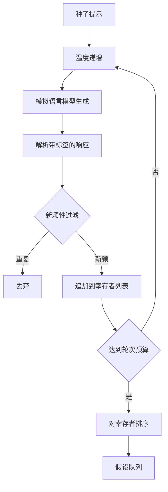

# 假设生成器

> 一个研究智能体，如果对同一个问题问两次，就是在浪费 token。关键在于让每次生成都落在新的地方。

**类型:** 构建
**语言:** Python
**前置条件:** 第 19 阶段 Track A 课程 20-29
**时间:** ~90 分钟

## 学习目标
- 从种子提示驱动采样器，并将其输出转化为类型化的假设记录。
- 在每次传递中提高采样器温度，使下一次生成比上一次更偏离。
- 使用小型嵌入模型和余弦距离阈值过滤近似重复项。
- 通过结合新颖性、特异性和可测试性的评分函数对幸存者进行排序。
- 保持每一步的确定性，使相同的种子始终产生相同的队列。

## 为什么要先生成，再过滤

一个规划器如果只让一个模型生成一次，就只能得到一个假设。对于示例来说这没问题。但对于研究循环来说，这种形态是错误的。循环需要一个有深度的排序队列，这样当第一个假设失败时，执行器可以立即使用下一个，而无需再支付一次完整的采样开销。

两个想法结合起来产生这个队列。第一个是温度递增：每次通过采样器时温度提高一档，鼓励后续生成更自由地探索。第二个是新颖性过滤：每次生成后，生成器测量与之前所有幸存者的嵌入距离，并拒绝任何在聚类内部的候选。

本课程附带一个模拟语言模型，它对固定提示返回脚本化的 token 序列。这个模拟足以演练完整路径：输入种子提示、应用温度递增、解析候选、运行新颖性过滤、输出排序队列。

## 假设的数据结构

```text
Hypothesis
  id             : int           (单次运行内单调递增)
  text           : str           (主张)
  variables      : list[str]     (不同条件之间变化的内容)
  metric         : str           (执行器将要测量的指标)
  baseline_ref   : str | None    (比较所引用的论文或运行)
  draft_pass     : int           (产生此假设的采样器轮次)
  temperature    : float         (生成时的采样器温度设置)
  novelty_score  : float         (与之前幸存者的距离，0..1)
  rank_score     : float         (用于排序的加权和)
```

`variables` 和 `metric` 不是自由文本。解析器从带标签的响应中提取它们。第 52 课的执行器在构建实验配置时直接读取这些字段。

`baseline_ref` 是可选的，但推荐使用。第 53 课的评估器需要一个基线来进行比较。如果假设省略了基线，评估器会回退到同一指标上的上一次运行。

## 架构



这个循环很直接。有趣的部分在于每个框都有严格的契约。

## 温度递增

从 `t_min` 开始，到 `t_max` 结束，步长为 `(t_max - t_min) / (n_passes - 1)`。每次传递以当前温度调用采样器，产生 `n_passes` 个来自 `GeneratorConfig.schedule()` 的均匀分布值。模拟模型通过根据 `(prompt, temp_bucket)` 在一小组脚本化响应之间切换来响应温度。这些桶是开区间，因此温度的微小变化会选择不同的桶并产生不同的生成结果。在生产环境中，采样器将是一个真实模型，并传入 `temperature=t`。

默认调度是六次传递，从 `0.2` 到 `1.2`。六次足以填满队列，而无需为那些会被新颖性过滤器拒绝的样本付费。低于 `0.2` 时，模型会重复种子提示。高于 `1.2` 时，响应往往会偏离主题并导致解析失败。

## 新颖性过滤

每次生成被解析后，生成器对文本进行嵌入，并与每个已接受的假设进行比较。嵌入是一个小型哈希词袋，归一化为单位长度。两个单位向量之间的余弦距离是 `1 - dot(a, b)`。如果某个生成与任何先前幸存者的最小距离高于 `novelty_threshold`，则通过。默认值为 `0.25`。

哈希嵌入并不复杂。它是确定性的，零依赖，并且足以捕获明显的重复情况：两个共享大部分名词的生成。生产部署可以替换为一个小型句子模型。接口保持不变。

## 排名分数

```text
rank_score = w_novelty * novelty_score
           + w_specificity * specificity_score
           + w_testability * testability_score
```

三个子分数。`novelty_score` 是与之前幸存者的最小嵌入距离。`specificity_score` 是假设中具体变量的数量除以目标数量。`testability_score` 在假设同时指定了指标和基线时为 1，只有指标时为 0.5，两者都没有时为 0。

默认权重为 `0.4`、`0.3`、`0.3`。权重存在于生成器配置中，因此后续课程可以在不分支代码的情况下调整它们。

## 模拟语言模型

```python
class MockLLM:
    def sample(self, prompt: str, temperature: float, seed: int) -> str:
        ...
```

采样器在给定 `(prompt, temperature, seed)` 三元组时是确定性的。模拟维护一个以 `(prompt_signature, temperature_bucket)` 为键的脚本化响应表。如果表中没有某个键的条目，采样器返回一个会导致解析失败的备用响应。备用路径由其中一个测试覆盖。

种子被混入响应中，因此相同的 `(prompt, temperature)` 对使用不同种子会产生不同的生成结果。在测试中，我们固定种子以保持结果可重现。在实际部署中，种子来自系统时钟或计数器。

## 输出队列

输出是一个按 `rank_score` 降序排列的 `Hypothesis` 记录列表。第 52 课的执行器弹出队首，运行实验，第 53 课的评估器写回判定。如果判定说假设是错误的，执行器弹出下一个。

队列是有限的。当队列为空时，编排器可以扩大种子提示并重新运行生成器，或者停止并报告预算已耗尽。

## 如何阅读代码

`code/main.py` 定义了 `Hypothesis`、`MockLLM`、`HypothesisGenerator` 和一个确定性演示。生成器暴露一个 `run(seed_prompt)` 方法，返回一个排序队列；传递次数从 `GeneratorConfig.n_passes` 读取，而不是作为参数传入。嵌入是一个哈希词袋。新颖性过滤是一个函数。排名分数是一个函数。不依赖 `numpy`；嵌入数学是纯标准库，因此课程保持可移植性。

`code/tests/test_generator.py` 覆盖了线性路径、重复拒绝路径、解析失败路径、温度递增边界和排名顺序。

## 在整个项目中的位置

第 50 课产生队列。第 51 课取出队首并运行文献搜索来确认或反驳它。第 52 课取出同一个队首并运行实际实验。第 53 课读取两个输出并写出判定。这四课组合成一个没有人类参与的研究循环；人类可以在任何边界介入。