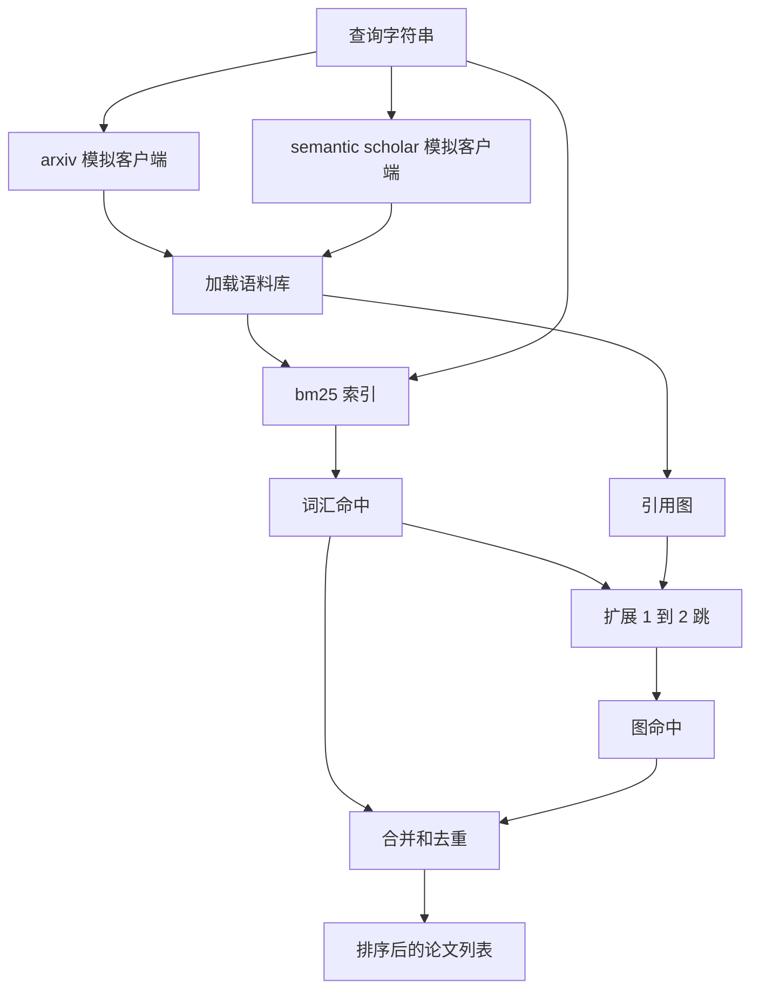

# 文献检索

> 提出一个假设很容易。知道是否已经有人证明过它才是费钱的部分。构建检索层，在执行器启动沙箱之前回答这个问题。

**类型:** 构建
**语言:** Python
**前置条件:** 第 19 阶段 Track A 课程 20-29
**时间:** ~90 分钟

## 学习目标
- 建模一个小型论文记录，包含循环下游将读取的字段。
- 仅使用标准库数据结构在摘要上构建 BM25 索引。
- 遍历引用图，找出词汇搜索遗漏的论文。
- 通过稳定的论文 ID 对词汇和图搜索两轮的结果进行去重。
- 将两个模拟外部 API 封装在单个客户端后面，使上游调用点在真实端点落地时保持不变。

## 为什么需要两轮检索

对摘要进行关键词搜索会返回与查询共享词汇的论文。这覆盖了大部分表面。但它遗漏了两种情况。第一种是基础性论文使用了不同的词汇；例如，搜索"稀疏注意力"可能会错过一篇题为"transformer 路由中的块选择"的论文。第二种是相关论文是引用已知锚点的后续工作；找到锚点并向前遍历比暴力搜索整个摘要池更高效。

本课程构建了两种检索方式。对摘要的 BM25 搜索捕获词汇匹配。引用图遍历将种子集向前和向后扩展一到两跳。两者的并集按论文 ID 去重，并通过一个小的组合分数排序。

## 论文的数据结构

```text
Paper
  id          : str           (稳定标识符，模拟语料库中为 "p001")
  title       : str
  abstract    : str
  year        : int
  authors     : list[str]
  references  : list[str]     (本文引用的论文 ID)
  citations   : list[str]     (引用本文的论文 ID)
  source      : str           (由哪个模拟 API 提供，"arxiv" 或 "s2")
```

`references` 和 `citations` 字段构成了有向引用图。两个模拟 API 返回重叠但不完全相同的字段，因此语料库加载器在 `id` 上合并它们。

## 架构



检索客户端拥有两轮搜索和合并操作。调用者传入一个查询，得到一个排序列表，其中每个条目都带有每篇论文的分数字段（`bm25_score`、`graph_distance`、`recency_score`、`final_score`），用于解释排序。

## 从零实现 BM25

实现是标准的 Okapi BM25，默认参数 `k1=1.5`、`b=0.75`。索引是两个字典：`term -> doc_frequency` 和 `term -> list of (doc_id, term_count)`。文档长度是摘要的 token 数量。平均文档长度在索引构建时计算一次。对查询进行评分是对查询词项的 `idf * tf_norm` 求和，其中 `tf_norm` 是标准的 BM25 长度归一化词频。

分词器先 `lower` 再按非字母数字字符分割。不进行词干提取。生产系统可以替换为一个小型词干提取器。接口保持不变。

```text
idf(t)      = log((N - df + 0.5) / (df + 0.5) + 1.0)
tf_norm(t)  = (f * (k1 + 1)) / (f + k1 * (1 - b + b * dl / avgdl))
score(d, q) = sum over t in q of idf(t) * tf_norm(t)
```

## 引用图遍历

图从语料库构建一次。前向边从一篇论文指向其参考文献。后向边从一篇论文指向引用它的论文。遍历是广度优先搜索，以排名靠前的 BM25 命中为种子，限制在两跳以内。

两跳是一个刻意的上限。一跳太浅；智能体通常需要直接祖先或后代。三跳在连通图上会使结果规模爆炸，并且容易偏离主题。本课程将跳数限制暴露为一个配置旋钮，以便下游循环可以收紧它。

## 去重和排序

两轮搜索返回重叠的集合。合并以论文 ID 为键。对于每篇论文，最终分数是一个加权混合。

```text
final_score = w_bm25 * bm25_score_norm
            + w_graph * graph_score
            + w_recency * recency_score
```

`bm25_score_norm` 是 BM25 分数除以合并集中的最大 BM25 分数（因此该字段在 0 到 1 之间）。`graph_score` 对于直接词汇命中为 1，一跳为 `0.6`，两跳为 `0.3`，否则为 0。`recency_score` 是从语料库最小年份的 0 到最大年份的 1 的线性斜坡。

默认权重为 `0.5`、`0.3`、`0.2`。权重是可配置的；一个过时的话题可能会降低时效性权重，而一个快速变化的话题则会提高它。

## 模拟语料库

语料库包含一百篇论文，由 `build_corpus()` 生成。每篇论文都有手写的标题和摘要，涉及五个主题之一：注意力稀疏性、检索增强、低秩适配器、数据集蒸馏和评估框架。引用和被引关系被设计成每个主题形成一个连通的子图，并带有少量跨主题的边。

两个模拟 API 客户端（`ArxivMockClient`、`SemanticScholarMockClient`）从同一个语料库读取，但暴露不同的字段。Arxiv 返回标题、摘要、年份、作者。Semantic Scholar 额外返回参考文献和被引。检索客户端在 ID 上合并；跨客户端的字段不一致处理推迟到后续课程。

## 第 52 和 53 课读取什么

第 52 课的执行器读取 `paper.id`、`paper.title` 和摘要的前三句作为实验的上下文。第 53 课的评估器读取 `paper.year` 和 `paper.references` 以将基线归因到特定论文。

检索客户端返回一个 `RetrievalResult`，包含排序列表和每次查询的指标：命中数、平均分数、最高分数、总耗时。执行器记录这些指标，以便下游的可观测性模块可以绘制随时间变化的质量趋势。

## 如何阅读代码

`code/main.py` 定义了 `Paper`、`ArxivMockClient`、`SemanticScholarMockClient`、`BM25Index`、`CitationGraph`、`RetrievalClient` 和一个确定性演示。模拟客户端和语料库在同一个文件中，以便课程保持可移植性。BM25 实现是一个类，六十行代码。图遍历是一个方法。

`code/tests/test_retrieval.py` 覆盖了词汇路径、图路径、合并、去重和空查询。

## 在整个项目中的位置

第 50 课产生一个假设。第 51 课搜索文献以查看该假设是否已经解决。第 52 课在假设未解决时运行实验。第 53 课读取检索结果和实验指标以写出判定。检索客户端是四个阶段中最便宜的，并且在编排器中首先运行。