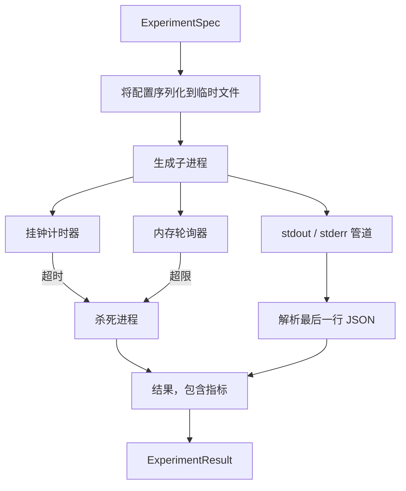

# 实验执行器

> 循环的诚实程度取决于它的测量手段。构建一个执行器，它接收规格说明，在沙箱子进程中执行，并输出评估器可以信任的 JSON 指标数据块。

**类型:** 构建
**语言:** Python
**前置条件:** 第 19 阶段 Track A 课程 20-29
**时间:** ~90 分钟

## 学习目标
- 将实验编码为类型化的规格说明，执行器可以将其序列化到子进程。
- 启动一个带有硬性挂钟超时和软性内存上限的子进程，并将两者都作为终止条件暴露出来。
- 将标准输出、标准错误和结构化指标数据块捕获到单个结果记录中。
- 构建一个消融表，在固定的基础规格说明上一次扫描一个配置旋钮。
- 在给定种子的情况下保持每个结果的确定性，使评估器在不同运行中看到相同的数字。

## 为什么使用子进程

研究循环运行不受信任的代码。假设来自采样器，实验脚本来自同一条路径；将两者视为安全的进程内代码是在请求一次可能拖垮编排器的崩溃。子进程是语言提供的最简单的隔离方式：一个独立的进程，一个独立的地址空间，父端有一个信号处理句柄。

这里的执行器没有实现完整的沙箱化。没有 cgroup，没有 seccomp 过滤器，没有命名空间重映射。它所拥有的是一个挂钟超时、一个用于内存增长轮询的循环，以及一个在任一限制被触发时终止进程的杀死路径。这是每个更复杂的沙箱所扩展的运行时契约。本课程将契约保持得足够小，可以一口气读完。

## ExperimentSpec 的数据结构

```text
ExperimentSpec
  spec_id        : str            (稳定 ID, "exp_001")
  hypothesis_id  : int            (链接回第 50 课的队列)
  script_path    : str            (要运行的 Python 脚本路径)
  config         : dict           (作为单个 JSON 参数传递给脚本)
  seed           : int            (实验的确定性种子)
  wall_timeout_s : float          (硬性超时，超时则杀死)
  memory_cap_mb  : int            (软性上限，轮询检查；超限则杀死)
  metric_keys    : list[str]      (评估器将读取的字段)
```

脚本存在于磁盘上；执行器将配置写入一个临时文件路径，脚本读取该文件。脚本预期在标准输出上打印一行 JSON，其键是 `metric_keys` 的超集。标准输出上的任何其他内容都会被捕获，但被指标解析器忽略。

## 架构



执行器是一个类，有一个主方法。轮询器是一个小线程，每隔一个轮询间隔唤醒一次，并在可用时从 proc 文件系统读取子进程的 `psutil` 等价物，在平台不支持时回退为空操作。

## 为什么使用软性内存上限

硬性内存上限需要 `resource.setrlimit`，并且只在 POSIX 上有效。本课程提供了一种可移植的方法：从平台轮询常驻集大小，如果超过上限则杀死子进程。上限是软性的，因为轮询器有一个非零的间隔；进程可能在两次轮询之间飙升到上限以上然后又回落。执行器记录观察到的最大 RSS，以便评估器可以看到运行离限制有多近。

在缺乏进程检查支持的系统中，轮询器记录一次性警告并禁用自身。挂钟超时仍然有效。本课程的测试覆盖了两种路径。

## 捕获标准输出和标准错误

执行器在完成后读取两个管道。标准输出逐行扫描；最后一行能解析为包含所有必需 `metric_keys` 的 JSON 的行被视为指标数据块。较早的 JSON 行保留在结果中作为 `intermediate_metrics`；评估器可以使用它们来绘制学习曲线。

标准错误被逐字捕获到结果中。执行器永远不会在非零退出码上抛出异常；相反，它将退出码记录在结果中。任何非零退出都被标记为 `"crash"`，即使脚本打印了指标，因此评估器默认将部分运行视为失败。

## 消融表

```python
def ablate(base: ExperimentSpec, knob: str, values: list[Any]) -> list[ExperimentSpec]:
    ...
```

给定一个基础规格说明和一个旋钮名称，辅助函数返回每个值的规格说明，其中 `config[knob]` 被覆盖。每个规格说明获得一个派生的 `spec_id`（`f"{base.spec_id}_{knob}_{value}"`）。执行器附带一个 `AblationRunner`，按顺序运行它们并返回一个以旋钮值为键的 `AblationTable`。

为什么一次只扫描一个旋钮。全因子扫描会指数级膨胀，并产生评估器无法解释的结果。一次一个旋钮产生一个清晰的轴，评估器可以绘制图表。本课程仅通过重复的单旋钮消融来支持多旋钮扫描，由调用者组合。

## 确定性

每个规格说明都带有一个种子。执行器通过配置字典将种子转发给脚本（`config["__seed"] = spec.seed`）。`code/experiments/` 中的模拟实验脚本遵循种子，并在不同运行中产生相同的指标。第 53 课的评估器依赖于此；没有确定性，"回归"可能只是不同的随机初始化。

## 模拟实验脚本

本课程附带一个实验脚本：`code/experiments/sparsity_experiment.py`。它是一个真实的脚本，读取其配置文件，使用 numpy 随机过程模拟一个小型训练运行，并打印一个 JSON 指标数据块。该脚本遵循一个 `sleep_s` 旋钮用于测试超时，以及一个 `allocate_mb` 旋钮用于测试内存轮询器。

模拟并没有真正训练任何东西。它是一个数值计算，模仿训练循环的形状：一条损失曲线、一个最终困惑度、一个运行时间。本课程的重点是执行器，而不是模拟。真实的实验脚本会导入一个模型。

## 结果的数据结构

```text
ExperimentResult
  spec_id              : str
  hypothesis_id        : int
  exit_code            : int
  terminal             : "ok" | "timeout" | "oom" | "crash"
  wall_time_s          : float
  peak_rss_mb          : float | None
  metrics              : dict
  intermediate_metrics : list[dict]
  stdout_tail          : str
  stderr_tail          : str
```

评估器首先读取 `metrics` 和 `terminal`。如果 `terminal` 不是 `"ok"`，则实验计为失败运行，评估器的判定是自动的。否则，指标通过显著性检验。

## 如何阅读代码

`code/main.py` 定义了 `ExperimentSpec`、`ExperimentResult`、`ExperimentRunner`、`AblationRunner` 和一个确定性演示。子进程管理是一个类。内存轮询器是一个小线程。消融辅助函数是一个函数。

`code/experiments/sparsity_experiment.py` 是测试中使用的模拟实验。它从 argv 读取其配置文件路径，并在完成后写入一行 JSON 指标。

`code/tests/test_runner.py` 覆盖了成功路径、超时路径、崩溃路径、消融表和跨两次运行的确定性检查。

## 在整个项目中的位置

第 50 课生成假设。第 51 课过滤掉文献已经解决的内容。第 52 课为剩余的内容运行实验。第 53 课读取结果，运行显著性检验，并写出编排器针对假设 ID 存储的判定。