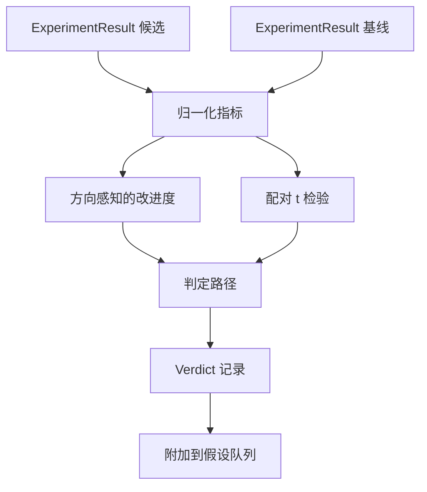

# 结果评估器

> 执行器产生了数字。评估器决定这些数字是改进、回归还是噪声。构建判定路径，将指标转化为一行结论。

**类型:** 构建
**语言:** Python
**前置条件:** 第 19 阶段 Track A 课程 20-29
**时间:** ~90 分钟

## 学习目标
- 使用方向感知的改进度和固定阈值，将候选运行与基线进行比较。
- 从零实现基于每种子指标的配对 t 检验，并读取得到的 p 值。
- 对对数尺度的指标进行归一化，使下游报告可以将其与线性指标混合。
- 输出每个假设的判定，编排器可以将其附加到第 50 课的队列中。
- 保持每一步的纯粹性，使相同的输入始终产生相同的判定。

## 为什么使用配对检验

执行器输出的单个数字并不能说明变化是否真实。相同的配置使用不同的种子会得到不同的困惑度。变化可能是噪声。正确的比较方式是配对：相同的种子、相同的数据，分别用候选配置和基线配置各运行一次。每个种子产生一个差值。这些差值的均值就是效应量。这些差值的标准误差就是噪声基底。

本课程从零实现该检验。没有 `scipy.stats`。数学量小到可以一屏读完。

```text
diffs    = [a_i - b_i for i in seeds]
mean     = sum(diffs) / n
variance = sum((d - mean) ** 2 for d in diffs) / (n - 1)
t_stat   = mean / sqrt(variance / n)
df       = n - 1
p_value  = two_sided_p(t_stat, df)
```

双尾 p 值使用正则化的不完全 beta 函数。本课程附带一个使用 Lentz 连分数的小型实现。总共是六十行标准库数学。

## 方向感知的改进度

有些指标在上升时表示改进（准确率、吞吐量）。其他指标在下降时表示改进（损失、困惑度、运行时间）。评估器在每个指标上携带一个 `direction` 字段。

```text
if direction == "higher_is_better":
    improvement = (candidate - baseline) / abs(baseline)
elif direction == "lower_is_better":
    improvement = (baseline - candidate) / abs(baseline)
```

改进度是有符号的。对于"越高越好"的指标，负的改进度意味着候选更差。判定路径同时读取符号和幅度。

一个平坦的阈值（`improvement_threshold=0.02`，百分之二）决定变化是否足够大以至于值得关注。低于该阈值时，无论 p 值如何，判定都是"噪声"；循环对用户无法测量的变化不感兴趣。

## 架构



评估器运行三个独立的计算，并在判定路径中合并它们。每个计算都是一个没有共享状态的纯函数。

## 对数归一化

困惑度在损失上是指数级的。损失下降 0.1 对应困惑度的大幅下降。直接比较两个配置的困惑度是可以的，但将其与线性指标混合到单个报告中需要归一化。

本课程对任何 `scale` 字段为 `"log"` 的指标进行归一化，方法是在计算改进度之前取自然对数。然后阈值在对数空间中应用。困惑度从 32 降到 28 在"越低越好"的指标上是 `log(28) - log(32) = -0.133`，远高于百分之二的阈值。

```text
if scale == "log":
    a = log(candidate)
    b = log(baseline)
else:
    a = candidate
    b = baseline
```

`scale="linear"`（默认值）的指标跳过变换。同一个代码路径处理两种情况。

## 基于种子的配对检验

第 52 课的执行器每次运行输出一个最终指标数据块。对于配对检验，评估器需要候选配置下每个种子的一个数据块和基线配置下每个种子的一个数据块。编排器在两种配置下跨一组种子运行相同的实验，并将两个 `ExperimentResult` 记录列表交给评估器。

评估器按种子配对（种子位于 `result.metrics["seed"]` 中）并遍历请求的指标。如果两个列表中的种子不匹配，评估器抛出 `PairingError`。编排器应重新运行。

## Verdict 的数据结构

```text
Verdict
  hypothesis_id          : int
  metric                 : str
  direction              : "higher_is_better" | "lower_is_better"
  scale                  : "linear" | "log"
  candidate_mean         : float
  baseline_mean          : float
  improvement            : float       (有符号，分数形式；见方向规则)
  p_value                : float | None  (n < 2 时为 None)
  significance_threshold : float
  improvement_threshold  : float
  verdict                : "improved" | "regressed" | "noise" | "failed"
  rationale              : str
```

判定路径是一个小型决策表：

```text
1. 如果任何候选结果的 terminal != "ok": 判定 = "failed"
2. 否则如果 |improvement| < improvement_threshold:  判定 = "noise"
3. 否则如果 p_value 为 None 或 p_value > significance: 判定 = "noise"
4. 否则如果 improvement > 0:                          判定 = "improved"
5. 否则:                                              判定 = "regressed"
```

`rationale` 是一行人类可读的句子，编排器可以将其记录在假设 ID 旁边。

## 如何阅读代码

`code/main.py` 定义了 `MetricSpec`、`Verdict`、`Evaluator`、t 统计量和不完全 beta 辅助函数，以及一个确定性演示。t 检验使用纯标准库数学实现；numpy 仅用于读取指标列表和计算均值与方差。

`code/tests/test_evaluator.py` 覆盖了改进路径、回归路径、噪声路径（小改进）、噪声路径（低 n）、失败终端路径、对数归一化路径、针对已知参考值的 t 检验以及配对错误。

## 在整个项目中的位置

第 50 课产生了假设队列。第 51 课过滤掉了文献已经解决的内容。第 52 课在候选和基线配置下跨种子运行实验。第 53 课读取这些运行并写出判定。编排器将四者拼接在一起：

```text
for hypothesis in queue:
    literature = retrieval.search(hypothesis.text)
    if literature_settles(hypothesis, literature):
        attach(hypothesis, verdict="settled")
        continue
    candidates = runner.run_all(specs_for(hypothesis))
    baselines  = runner.run_all(baseline_specs_for(hypothesis))
    metric_spec = MetricSpec("perplexity", direction=LOWER, scale=LOG)
    verdict = evaluator.evaluate(hypothesis.id, metric_spec, candidates, baselines)
    attach(hypothesis, verdict)
```

这个编排器不在本课程中；这四课通过各自定义的数据类组合在一起，无需任何额外的胶水代码。