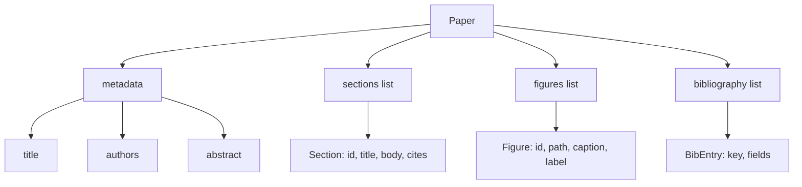
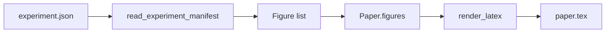
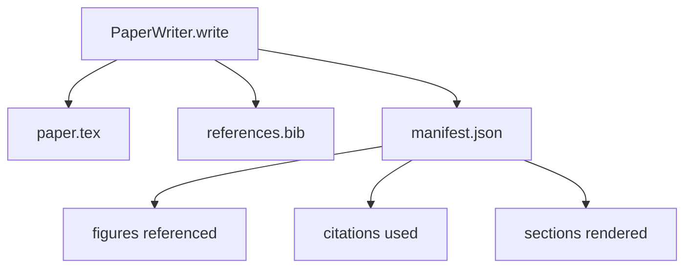

# 论文撰写器

> LaTeX 骨架是研究者与排版工具之间的契约。如果契约被打破，文档就无法编译，而且失败是响亮的。先构建骨架，再填充内容。

**类型：** 构建
**语言：** Python
**前置要求：** 第 19 阶段第 50-53 课
**时间：** ~90 分钟

## 学习目标

- 将研究论文视为具有已知章节图的结构化产物，而非自由格式的文档。
- 生成一个 LaTeX 骨架，在撰写任何正文之前声明其摘要、章节、图表插槽和参考文献键。
- 通过确定性插槽机制，将实验输出（路径和标题）中的图表注入骨架。
- 接入一个模拟的正文生成器，根据结构化大纲填充每个章节，使测试框架无需模型即可测试。
- 输出单个 `paper.tex` 文件、一个 `references.bib` 文件以及一个清单，列出所有引用的图表和使用的参考文献。

## 为什么先构建骨架

从正文开始的草稿会积累结构性债务。引言部分写出了本应放在相关工作中的三段内容。图表在被定义之前就被引用了。参考文献最终为同一篇论文包含三个键。等到作者注意到时，重写的成本已经高于写作的成本。

骨架扭转了这一点。结构被提前声明为数据。章节是具有名称和顺序的插槽。图表是具有 ID 和标题的插槽。参考文献键在顶部声明，并指向对应的条目。正文被逐个生成到这些插槽中。测试框架可以在任何正文撰写之前验证：每个图表都有插槽，每个引用都有条目，每个章节都出现在目录中。

这与早期课程应用于计划、工具调用和追踪的纪律相同。结构就是契约。

## 论文的形状

每个字段都是纯 Python 数据。渲染器是一个从 `Paper` 到 LaTeX 字符串的纯函数。测试框架可以在渲染之前内省论文：统计章节数、列出缺失的图表文件、检查每个 `\cite{key}` 是否有匹配的 `BibEntry`。

## 渲染契约

渲染器保证三个属性。第一，骨架中的每个图表插槽都会输出一个 `\begin{figure}` 块，并带有 `fig:<id>` 形式的稳定标签。第二，每个章节都会输出一个 `\section{}`，并带有 `sec:<id>` 形式的稳定标签，以便交叉引用正常工作。第三，参考文献会输出一个 `\bibliography` 块，其 `references.bib` 恰好包含论文上声明的条目，不多不少。

违反其中任何一条都是渲染错误，而非警告。骨架就是契约；静默丢弃图表的渲染就是契约破坏。

## 从实验注入图表

本跟踪线中的早期课程将实验输出生成为 JSON 清单。每个清单携带一个产物列表，包含路径和简短标题。论文撰写器读取该清单并生成 `Figure` 记录。

注入是确定性的。图表 ID 由实验名称加上单调递增计数器派生而来。标题来自清单。路径被规范化为相对于论文输出目录的路径，这样即使实验输出位于磁盘上的其他位置，LaTeX 也能编译。

## 模拟的正文生成器

本课不调用模型。`MockProseGenerator` 读取大纲形状并确定性地生成正文。大纲形状是每个章节的一个短字符串。生成器将该字符串扩展为两个短段落，并融入章节标题。生成的正文在轮廓声明的位置恰好引用图表和参考文献。

这足以测试撰写器的每个行为。真实实现会将生成器替换为模型调用。其周围的测试框架不变。这就是将正文生成器声明为可调用对象的价值所在：测试使用确定性的替代品，生产环境使用模型驱动的替代品，管道的其余部分完全相同。

## 清单输出

撰写器向输出目录输出三个文件。

清单是下游评估器或批评循环读取的内容。它不解析 LaTeX；它读取清单。下一课，即批评循环，将此清单作为输入并生成反馈列表。这就是为什么清单是契约的一部分，而 LaTeX 不是。

## 验证门

撰写器在写入任何文件之前运行四个门。

1. 每个图表 ID 在论文内是唯一的。
2. 每个章节的 `cites` 字段引用的参考文献键已在论文上声明。
3. 摘要非空。
4. 标题非空。

失败的门会引发 `PaperValidationError`，并附带精确原因。测试框架将原因作为失败模式呈现。没有部分写入：要么三个文件全部输出，要么一个都不输出。

## 如何阅读代码

`code/main.py` 定义了 `Paper`、`Section`、`Figure`、`BibEntry`、`PaperValidationError`、`MockProseGenerator`、`PaperWriter` 以及 `render_latex` 函数。`write` 方法接受一个输出目录并输出 `paper.tex`、`references.bib` 和 `manifest.json`。`read_experiment_manifest` 辅助函数将实验清单列表转换为 `Figure` 记录。

`code/tests/test_paper_writer.py` 涵盖：无章节的骨架渲染、包含两个章节和两个图表的完整渲染、缺失引用门、重复图表 ID 门、清单内容以及 LaTeX 字符串契约（每个章节输出 `\section{}`，每个图表输出 `\begin{figure}`）。

## 进一步探索

真实实现会需要的两个扩展。第一，多格式渲染：相同的 `Paper` 形状可以编译为博客文章的 Markdown 和预览的 HTML。渲染器成为 `Paper` 上的一个策略。第二，引用丰富化：给定本地 DOI 缓存，撰写器从引用键获取 BibTeX 条目。两者都增加价值，两者都可以在不触及骨架契约的情况下添加。

骨架就是赌注。章节、图表和引用作为数据声明，正文生成到插槽中，清单与 LaTeX 一起输出。其他所有改进都在此之上组合。