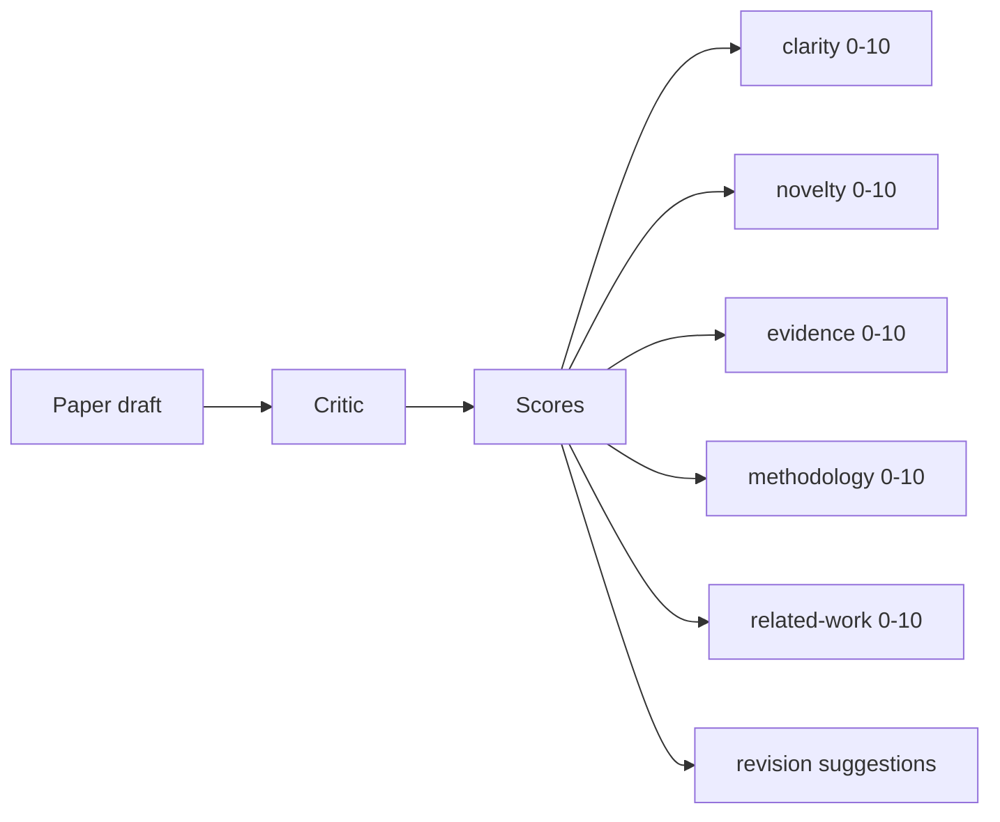
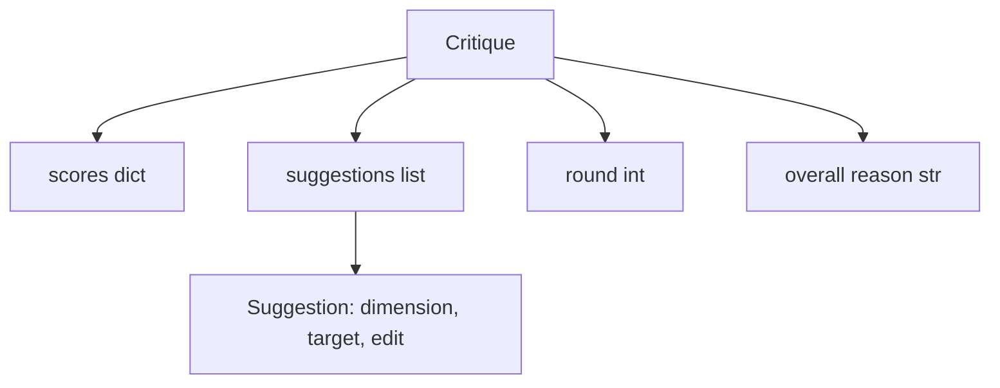
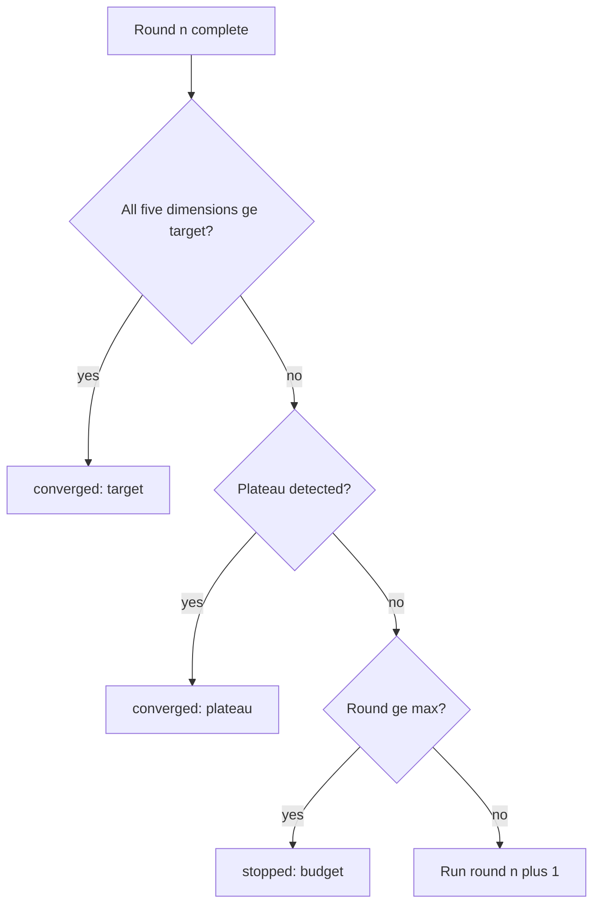
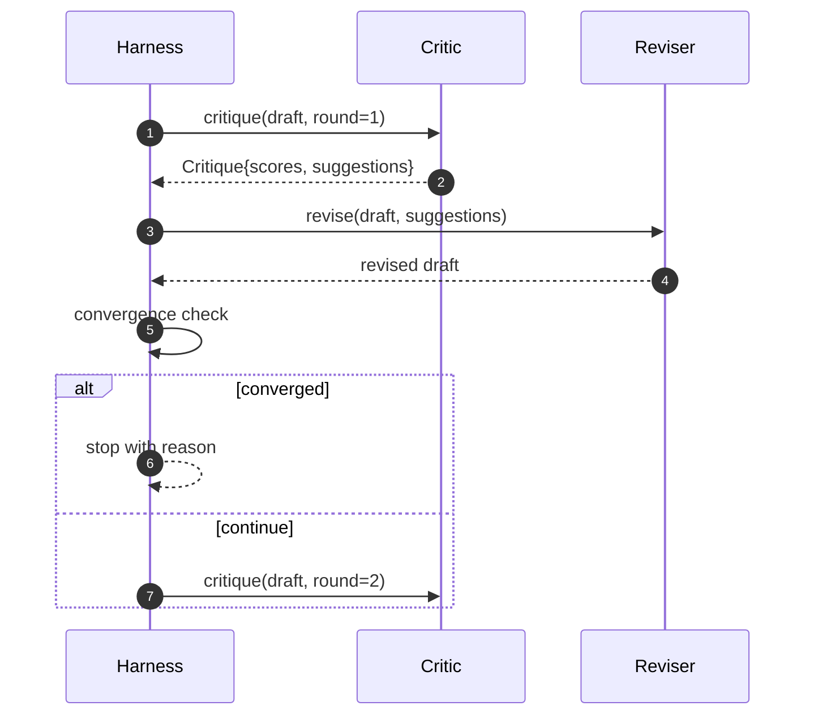

# 批评循环

> 一个第一次就返回"看起来不错"的批评者是坏的。一个总是返回"需要改进"的批评者也是坏的。有趣的批评者是那个能够收敛的，而你必须设计这种收敛。

**类型：** 构建
**语言：** Python
**前置要求：** 第 19 阶段第 50-53 课
**时间：** ~90 分钟

## 学习目标

- 在五个固定维度上对论文草稿进行评分：清晰度、新颖性、证据、方法论、相关工作。
- 将每轮批评作为结构化的修订差异（而非自由格式的重写）来应用。
- 通过比较各轮的分数来检测收敛；在达到平台期、目标达成或预算耗尽时停止。
- 使用最大迭代次数上限来限制轮次，使不收敛的批评者不会永远运行。
- 输出每轮追踪，以便仪表盘或下一阶段可以渲染分数轨迹。

## 为什么是五个固定维度

自由格式的批评者是一个返回一段建议的模型。下一轮的修订将这段建议视为环境上下文。重写是否解决了批评意见是无法验证的，因为批评意见从未具有结构。

五个维度为测试框架提供了契约。



分数是一个向量。测试框架在各轮之间监控每个维度。一个提高清晰度但降低证据的修订是证据上的回归，收敛检查会看到这一点。仅靠模型的批评者无法提供这种保证。

## 批评的形状



每个建议都携带它改进的维度、它针对的章节，以及修订者可以应用的 `edit` 指令。修订者也是一个可调用对象。本课附带一个确定性的修订者，它将编辑指令解释为追加到章节的操作。模型驱动的修订者会将同一字段解释为提示。契约不变。

## 收敛规则，按顺序

批评循环在三个条件中的任何一个触发时终止。



目标是最严格的情况：五个维度（清晰度、新颖性、证据、方法论、相关工作）中的每一个都必须达到 `>= target_score`（默认 `8.0`），循环才返回成功。高均值但有一个弱维度是不够的。平台期检测将当前轮的均值与上一轮的均值进行比较。如果连续两轮的改进低于 `plateau_epsilon`（默认 `0.1`），循环以 `plateau` 退出。预算是对轮次的硬性上限（默认 `5`），以 `budget` 退出。

顺序很重要。目标优先于平台期，平台期优先于预算。如果第三轮在同样会触发平台期的同一迭代中达到了目标，结果是 `target`，而不是 `plateau`。

## 为什么平台期检测需要两轮

一轮的平台期是噪声。即使是在固定草稿上，真正的批评者每次迭代也会返回略有不同的分数，因为确定性评分仍然取决于哪些建议被应用以及以什么顺序应用。要求连续两轮平台期可以过滤掉这种噪声。如果测试框架报告了平台期，说明草稿确实已经停止改进。

## 本课中的确定性批评者

本课不调用模型。附带的批评者是一个可调用对象，它基于三个信号对草稿进行评分：平均章节正文长度（清晰度）、图表数量和引用数量（证据），以及论文元数据上的 `originality_tag` 字段（新颖性）。修订者知道如何推动每个分数上升。

```text
clarity      当平均章节正文长度增加时增长
novelty      当 originality_tag 设置为 "high" 时增长
evidence     当章节的 figure_refs 非空时增长
methodology  当存在标题为 "Method" 且包含正文的章节时增长
related-work 当存在标题为 "Related Work" 且包含正文的章节时增长
```

修订者将每个建议解释为有针对性的追加。第一轮之后，测试框架可以观察到分数上升。测试利用这一属性来断言循环缩小了差距。

## 完整循环契约



测试框架拥有轮次计数器、追踪和收敛检查。批评者拥有分数。修订者拥有差异。三者互不触及对方的状态。

## 追踪输出

每轮输出一个追踪事件，包含轮次编号、分数向量、建议数量和收敛判定。完整的追踪与最终草稿一起返回。下游仪表盘可以渲染每轮分数图表。下一课，即迭代调度器，读取追踪以决定分支是否值得保留。

## 保护免受不良批评者影响的预算

一个产生从未改进分数的建议的批评者会将循环锁定在最大迭代上限。追踪使这一点可见：五轮，分数持平，判定为 `budget`。用户将其解读为批评者错误，而非草稿错误。相反，只呈现最终草稿会隐藏诊断。追踪优先的设计使其浮出水面。

## 如何阅读代码

`code/main.py` 定义了 `Critique`、`Suggestion`、`Critic` 协议、`Reviser` 协议、`CriticLoop` 以及一个 `make_deterministic_critic_pair` 工厂函数，返回确定性批评者和匹配的修订者。包含一个最小的 `Paper` 形状，使本课可以独立运行。

`code/tests/test_critic_loop.py` 涵盖：第一轮后的单调改进、在调整过的草稿上的目标收敛、两轮持平后的平台期检测、当没有建议改进时的预算耗尽、修订者对建议的应用以及追踪形状。

## 进一步探索

真实实现会需要的两个扩展。第一，维度权重：为研讨会撰写的论文将新颖性权重设得高于方法论；期刊则相反。收敛检查变为加权均值。第二，配对批评者：一个批评者评分，第二个批评者在修订者看到建议之前对其进行裁决。两者都增加价值，两者都在相同的 `Critique` 形状上组合。

赌注是分数向量。一旦批评具有了结构，其他所有改进（收敛规则、仪表盘、配对批评者）都可以在不改变循环的情况下加入。