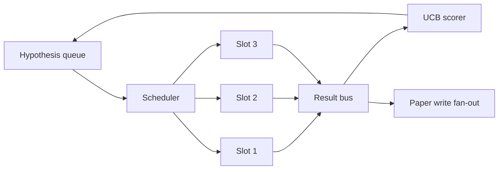
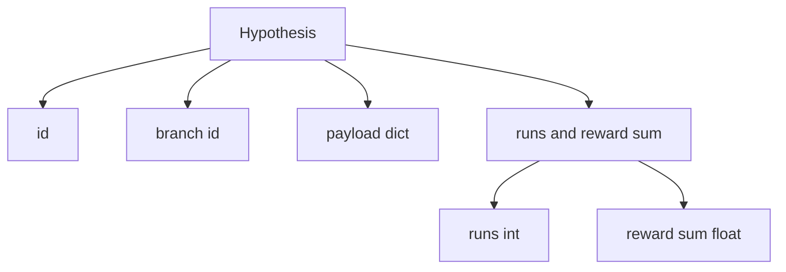
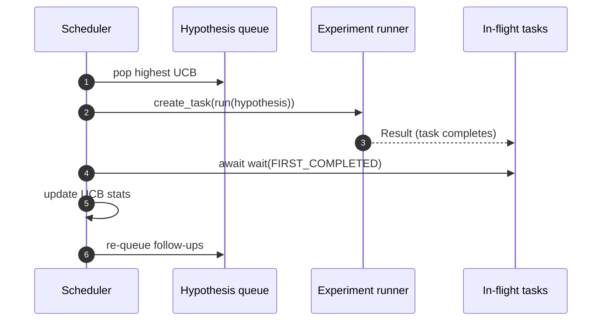

# 迭代调度器

> 没有调度器的研究循环是一个自欺欺人的队列。调度器是循环决定停止探索什么的地方，而这个决定就是整个游戏的关键。

**类型：** 构建
**语言：** Python
**前置要求：** 第 19 阶段第 50-53 课
**时间：** ~90 分钟

## 学习目标

- 将研究工作流建模为一个假设队列，该队列馈送并行实验插槽，其结果再反馈回来。
- 使用 asyncio 并发运行多个实验，使调度器可以保持所有插槽忙碌。
- 使用 UCB 对每个假设分支进行评分，使调度器可以在不放弃探索的情况下修剪低产出分支。
- 将完成的结果分发到论文撰写阶段和重新入队阶段，使高产分支可以产生后续假设。
- 输出每次迭代的追踪，包含分支分数、插槽占用率和修剪决策。

## 为什么需要调度器，而不是工作列表

扁平的工作列表按提交顺序运行任务。当每个任务独立时，这没问题。但研究不是独立的：实验三的发现会改变实验四和实验五的优先级。一个读取结果反馈并重新排序队列的调度器，每单位计算能完成更多有用的工作。

有趣的设计选择是评分规则。贪婪评分器总是选择当前领先者，从不探索。均匀评分器从不利用。UCB（上置信界）是中间路径：利用领先者，同时为尝试较少的分支保留容量。

## 系统形状



队列持有假设。当插槽空闲时，调度器选择 UCB 最高的假设。每个插槽异步运行一个实验。完成的实验将其结果分发到总线上。总线更新源分支的 UCB 统计数据，并在分支的产出超过阈值时分发到论文撰写阶段。

## 假设的形状



`branch` 是 UCB 统计的关键。多个假设可能共享一个分支（分支是研究方向；假设是该方向内的一次试验）。`runs` 是该分支已完成实验的数量，`reward_sum` 是累积奖励。UCB 读取两者。

## UCB 评分

本课使用的 UCB 公式是经典的 UCB1。

```text
ucb(branch) = mean_reward(branch) + c * sqrt( ln(total_runs) / runs(branch) )
```

`total_runs` 是所有分支上完成的实验总数。`c` 是探索权重；本课默认为 `sqrt(2)`。运行次数为零的分支获得 `+inf`，因此未尝试的分支总是被优先调度。高平均奖励的分支保持高分，直到其他分支赶上；运行多次但奖励不多的分支会被尝试较少的替代方案超越。

修剪门与选择器是分开的。当分支的平均奖励在至少 `prune_after_runs` 次试验（默认 `3`）后低于绝对下限（默认 `0.2`）时，修剪将其从未来调度中移除。这使队列保持有界。

## 使用 asyncio 的并行插槽

调度器使用 `asyncio.create_task` 驱动实验。每个任务运行实验执行器（一个 `async def` 可调用对象），返回一个 `Result`。主循环使用 `asyncio.wait(..., return_when=asyncio.FIRST_COMPLETED)` 等待正在运行的任务集，并在每次完成时触发评分更新。



三个插槽并发运行。主循环从不阻塞在单个实验上。调度器在插槽一空闲就立即启动新任务，直到队列为空且没有任务在运行。

## 分发：论文触发

当分支的平均奖励超过 `paper_threshold`（默认 `0.7`）且该分支尚未产生论文时，调度器将一个 `paper.trigger` 事件分发到输出列表。下游，第 54 课的论文撰写器会拾取这个事件。在本课中，触发被捕获为一个列表，以便测试可以断言它。

## 分发：后续假设

当高产结果到达时，调度器可以调用用户提供的 `expander` 来在同一分支上生成一个或多个后续假设。扩展器是一个从 `Result` 到 `list[Hypothesis]` 的纯函数。本课附带一个确定性扩展器，对于任何奖励超过论文阈值的结果，它产生两个后续假设。

## 预算

两个预算保护调度器免受失控循环的影响。

```text
max_experiments    : 所有分支上运行的实验总数
max_seconds        : 挂钟时间上限（asyncio 时间）
```

当任一预算触发时，调度器停止调度新任务，等待正在运行的任务完成，并返回最终追踪。追踪包含一个 `stop_reason`。

## 追踪和最终报告

每个调度决策（选择、分发、结果、修剪、分发）输出一个事件。最终报告汇总每个分支的统计信息、总运行次数、总挂钟时间以及触发的论文事件。下一课，即端到端演示，读取此报告以驱动论文撰写器。

## 如何阅读代码

`code/main.py` 定义了 `Hypothesis`、`Result`、`BranchStats`、`IterationScheduler` 以及一个 `make_deterministic_runner` 工厂函数，返回一个具有可预测奖励的 asyncio 实验执行器。执行器休眠固定的 `delay_ms`（默认 `5ms`），使并发性可观察。

`code/tests/test_scheduler.py` 涵盖：UCB 优先选择未尝试的分支、并行插槽占用率、阈值跨越时的论文触发、低产出试验后的分支修剪、后续假设的分发以及预算退出（实验计数和挂钟时间）。

## 进一步探索

真实实现会需要的三个扩展。第一，跨会话的持久 UCB 统计：当前统计信息存在于内存中；真实调度器会对其设置检查点，以便重启时保留已花费的探索预算。第二，多目标评分：不是标量奖励，每个结果输出一个向量，UCB 变为帕累托风格的选择器。第三，上下文赌博机：选择器根据假设特征（长度、复杂度）进行条件判断，使相似的假设共享探索。

调度器是研究超越工作列表的地方。一旦 UCB 被接入且插槽并行运行，其他所有改进都在此之上组合。