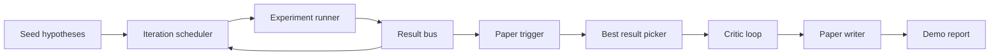
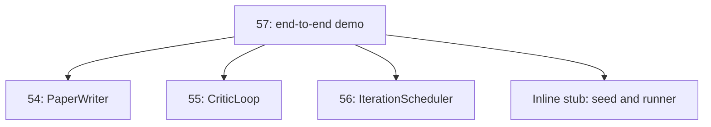
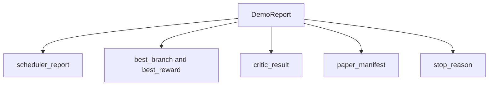

# 端到端研究演示

> 演示是你之前编写的每个契约必须组合的地方。如果其中任何一个泄漏，演示就是抓住它的那一课。

**类型：** 构建
**语言：** Python
**前置要求：** 第 19 阶段第 50-53 课
**时间：** ~90 分钟

## 学习目标

- 将自动研究循环端到端地连接起来：假设种子、实验执行器、调度器、批评循环、论文撰写器。
- 通过纯 Python 导入（而非框架）组合来自 Track D 前四课的原始组件。
- 运行循环至自我终止的结束，并输出一个单一的演示报告，列出每个阶段的输出。
- 保持演示的确定性，以便测试套件可以断言最终形状。
- 在任何阶段的契约破裂时呈现清晰的失败模式，使下一阶段不会以损坏的输入运行。

## 这里组合了什么



五个阶段。种子是一个包含三个假设的列表。调度器使用三个并行插槽在它们之间运行六个实验。总线报告一个或多个论文触发。选择器选择单个最佳结果。批评循环基于该结果构建的草稿进行迭代。论文撰写器输出最终的 LaTeX、BibTeX 和清单。

## 为什么是导入，而不是复制

每篇早期课程都附带一个 `main.py`，包含公共数据类和函数。演示通过调整 `sys.path` 指向每个课程的父目录来导入它们。这不是框架接线；它与早期课程中的测试文件已经使用的导入方式相同。



内联存根代替第 50 至 53 课：一个小的种子假设生成器和一个同步奖励函数。用户可以通过调整两个导入，将内联存根替换为这些课程的真实原始组件。

## 确定性保证

演示是构造性确定的。实验执行器使用 seeded numpy。批评循环的修订者按固定顺序遍历固定维度。论文撰写器的正文生成器是第 54 课的模拟版本。调度器的 UCB 选择器按迭代顺序打破平局，而非随机选择。

给定相同的种子，演示输出相同的报告。测试通过运行演示两次并比较清单来断言这一属性。

## 演示报告形状



每个字段直接来自上游阶段。演示不转换任何输出；它组合它们。这就是演示所要测试的。

## 失败模式处理

每个阶段要么成功，要么引发类型化错误。

```text
Scheduler ........ returns SchedulerReport with stop_reason
                   in {queue_empty, max_experiments, deadline}
Best-result pick . raises NoTriggerError if no paper trigger fired
Critic loop ...... returns LoopResult with status converged or stopped
Paper writer ..... raises PaperValidationError on contract break
```

任何阶段的失败都会以类型化异常短路演示。测试固定了这一契约：`test_no_triggers_raises_typed_error` 和 `test_best_picker_raises_when_no_triggers` 断言选择器在没有分支触发论文时引发 `NoTriggerError` / `BestResultError`，并且撰写器永远不会被调用。

## 最佳结果选择器

调度器按分支输出论文触发。选择器在所有触发中选择平均奖励最高的分支。平局按分支 ID 字母顺序打破，使演示保持确定性。选择器是一个小的纯函数；测试在固定的调度器报告上固定它。

## 连接批评循环

第 55 课的批评循环操作于 `MiniPaper`。演示通过使用分支 ID 填充摘要、播种两个章节（引言和结果）以及根据分支的平均奖励设置 `originality_tag`（如果 `>= 0.8` 则为 high，如果 `>= 0.6` 则为 medium，否则为 low），从所选分支构建一个 `MiniPaper`。

然后修订者迭代草稿直至收敛。输出进入论文撰写器。

## 连接论文撰写器

第 54 课的论文撰写器操作于完整的 `Paper` 形状，包含图表和参考文献。演示通过 `mini_to_full_paper` 升级收敛的 `MiniPaper`，为所选分支附加一个图表，并构建一个小的合成参考文献，该参考文献由批评者建议的引用键的并集组成。演示添加的每个引用也被添加到参考文献列表中，因此验证通过。

## 如何阅读代码

`code/main.py` 定义了 `BestResultError`、`NoTriggerError`、`DemoReport`、`pick_best_branch`、`build_mini_paper`、`mini_to_full_paper` 和 `run_demo`。顶部的导入调整 `sys.path` 一次，并从它们的课程中拉取 `PaperWriter`、`CriticLoop` 和 `IterationScheduler`。

`code/tests/test_e2e.py` 涵盖：演示端到端运行并输出包含所有五个字段的报告、两次运行之间的确定性、当没有分支跨越阈值时的 NoTriggerError、当撰写器的契约破裂时的 PaperValidationError、论文清单包含所选分支的图表，以及调度器的停止原因是指望值之一。

## 进一步探索

一旦演示通过，值得接线的三个扩展。第一，持久状态：每个阶段的结果写入一个小型 JSON 存储，以便重启时可以恢复而无需重新运行廉价阶段。第二，仪表盘：来自调度器和批评循环的追踪事件渲染为单一时间线。第三，真实模型调用：将模拟的正文生成器和确定性批评者替换为模型驱动的版本；接线不变。

演示的工作是证明组合就是架构。五课，四个导入，一个报告。下次你添加一个阶段时，接线恰好增加一行。