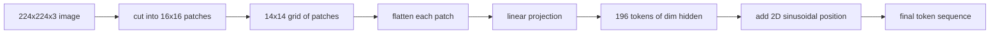

# 视觉编码器补丁

> 读取像素的视觉模型需要一个像素的分词器。补丁嵌入就是那个分词器。将图像切割成方格网格，展平每个方格，通过一个线性层进行投影，然后添加一个二维位置信号，使 transformer 知道每个方格在原始图像中的位置。

**类型：** 构建
**语言：** Python
**前置条件：** 第 19 阶段课程 30-37（Track B 基础）
**时长：** ~90 分钟

## 学习目标

- 将图像分词为固定长度的补丁嵌入序列。
- 实现基于 `Conv2d` 的补丁投影，其数学等价于展开后线性变换。
- 构建确定性二维正弦位置嵌入，使 token 顺序编码空间位置。
- 在合成测试数据上验证补丁数量、嵌入形状以及 `Conv2d`/展开的等价性。

## 问题所在

transformer 消费一个向量序列。图像是一个 3 通道的网格。将每个像素作为一个 token 读取会使序列长度爆炸：一张 224x224 的 RGB 图像是 150,528 个 token，12 层的 transformer 在注意力计算上无法承受。将图像作为一个巨大的扁平向量读取会丢弃局部性，而注意力层无法从中恢复。编码器前端的工作是将像素网格压缩成几百个 token，每个 token 概括一个方形区域。

补丁嵌入通过一个线性投影来解决这个问题。一张 224x224 的图像切割成 16x16 的补丁后产生一个 14x14 的 196 个补丁的网格。每个补丁从 `(3, 16, 16) = 768` 个像素值展平为一个向量，然后一个线性层将其映射到模型的隐藏维度。transformer 看到 196 个维度为 `hidden`（通常为 768）的 token 加上一个 CLS token。这就是网络其余部分可以处理的序列。

## 核心概念



### 为什么用补丁而不是像素

注意力的计算量与序列长度呈二次关系。196 个 token 的序列每头每层需要 `196 * 196 = 38,416` 个注意力分数；150,528 个 token 的序列需要 `150,528 * 150,528 = 226 亿`。补丁带来了 590,000 倍的注意力计算量缩减，而单个 16x16 区域携带了足够的高级视觉任务信号。代价是单个补丁内部细粒度空间细节的丢失，这就是为什么下游多模态堆栈在需要精细定位时通常会运行第二个高分辨率分支。

### 为什么一个线性投影就够了

每个补丁被视为一个独立向量。投影学习一个基：边缘检测器、颜色滤波器、简单纹理。单个线性层很小（ViT-Base 为 `768 * 768 = 589,824` 个参数）且训练快速。更深的卷积主干存在（"混合" ViT），但扁平线性投影是标准做法，大多数现代开源权重编码器都使用这种精确形状。

### `Conv2d` 技巧

一个 `Conv2d(in_channels=3, out_channels=hidden, kernel_size=patch_size, stride=patch_size)` 无填充的结果与展开后线性变换在数值上完全相同，因为每个输出位置将补丁像素与一个滤波器做点积。卷积就是补丁投影，大多数生产代码库以这种方式发布，因为 GPU 上更快且少一次 reshape。

### 位置嵌入

token 在投影后不携带顺序信息。二维正弦嵌入给每个 token 一个固定信号，编码其 `(行, 列)` 位置。嵌入维度的一半用多个频率的 sin/cos 编码行位置；另一半编码列位置。该编码是确定性的，因此可以在不重新训练的情况下切换分辨率，并且可以干净地插值到训练时从未见过的网格。

| 组件 | 形状 | 参数量 |
|------|------|--------|
| 补丁投影 (`Conv2d`) | `(hidden, 3, patch, patch)` | `3 * P * P * hidden + hidden` |
| 位置嵌入（固定） | `(num_patches, hidden)` | 0（计算得出，非学习参数） |
| CLS token（学习） | `(1, hidden)` | `hidden` |

对于 224 分辨率下的 ViT-Base/16：投影中有 590,592 个参数，CLS token 中有 768 个，正弦位置为零。下一课（59）在此前端之上堆叠一个 12 层的 transformer。

### 等价性作为健全性检查

补丁步骤有两种写法：`Conv2d` 投影和显式的展开后线性变换。它们在相同权重下必须产生相同输出。如果不一致，则展开的数学有误，编码器的其余部分就建在沙子上了。本课的测试验证了这种等价性。

## 构建它

`code/main.py` 实现了：

- `PatchEmbed`，一个用 `Conv2d` 进行补丁投影的 `nn.Module`。
- `sinusoidal_2d(grid_h, grid_w, dim)`，一个无状态函数，构建二维位置表。
- `VisionFrontEnd`，将补丁嵌入、CLS 前置和位置加法组合为一次前向传播。
- 一个 `synthesize_image(seed)` 辅助函数，从 `numpy.random` 构建确定性 224x224x3 测试数据。
- 一个演示，将一张测试图像通过前端并打印输出形状、CLS token 范数和位置嵌入的一行。

运行：

```bash
python3 code/main.py
```

输出：224x224 的测试数据被分词为形状 `(1, 197, 768)` 的序列。第一个 token 是 CLS；接下来 196 个是补丁 token。位置嵌入范数在一行内是均匀的，这是正弦编码的标志。

## 使用它

相同的补丁前端出现在每个现代视觉-语言模型中：CLIP ViT-L/14、SigLIP、DINOv2、Qwen-VL 系列和 InternVL 堆栈都从 `Conv2d` 补丁投影加位置信号开始。不同系列之间的差异在下游（CLS vs 无 CLS 池化、寄存器 token、不同补丁大小 14 vs 16、通过插值位置实现的动态分辨率）。本课的前端是所有这些模型所依赖的基底。

## 测试

`code/test_main.py` 覆盖了：

- 补丁数量匹配 `(image_size / patch_size) ** 2`
- 输出形状匹配 `(batch, num_patches + 1, hidden)`
- `Conv2d` 投影在小测试数据上等于手动展开后线性变换
- 正弦位置表在多次调用间是确定性的
- CLS token 在批次维度上广播无泄漏

运行：

```bash
python3 -m unittest code/test_main.py
```

## 练习

1. 将正弦位置替换为学习的 `nn.Parameter`，并在一个小的合成分类任务上比较第一轮的损失。学习位置在固定分辨率下更优；正弦位置在训练后改变分辨率时更优。

2. 将 `Conv2d` 替换为显式的 `nn.Unfold` 加 `nn.Linear`，并断言输出在浮点容差内匹配。相同的数学，两种写法。

3. 添加对非方形补丁大小的支持（例如 32x16 用于宽幅输入），并验证位置表能处理非方形网格。

4. 在批次大小 1、8、64 下分析补丁步骤。补丁投影很少是瓶颈；下游的注意力层占主导。

5. 将前端作为冻结特征提取器在一个 4 类合成形状数据集（圆形、方形、三角形、星形）上训练。CLS token 输出应该可以线性分离。

## 关键术语

| 术语 | 含义 |
|------|------|
| 补丁 (Patch) | 图像的方形子区域，通常为 14x14 或 16x16 |
| 补丁嵌入 (Patch embedding) | 将一个展平的补丁线性投影到隐藏维度 |
| 序列长度 (Sequence length) | 补丁分词后的 token 数量，通常加上 CLS |
| 正弦位置 (Sinusoidal position) | 编码二维网格坐标的固定 sin/cos 信号 |
| CLS token | 前置到序列中的学习向量，作为池化头 |

## 延伸阅读

- An Image is Worth 16x16 Words (ViT, 2021) 了解原始的补丁嵌入框架。
- Attention Is All You Need (2017) 了解此处适配到二维的正弦位置公式。
- DINOv2 论文了解寄存器 token，这是你可以作为练习 6 添加的扩展。
